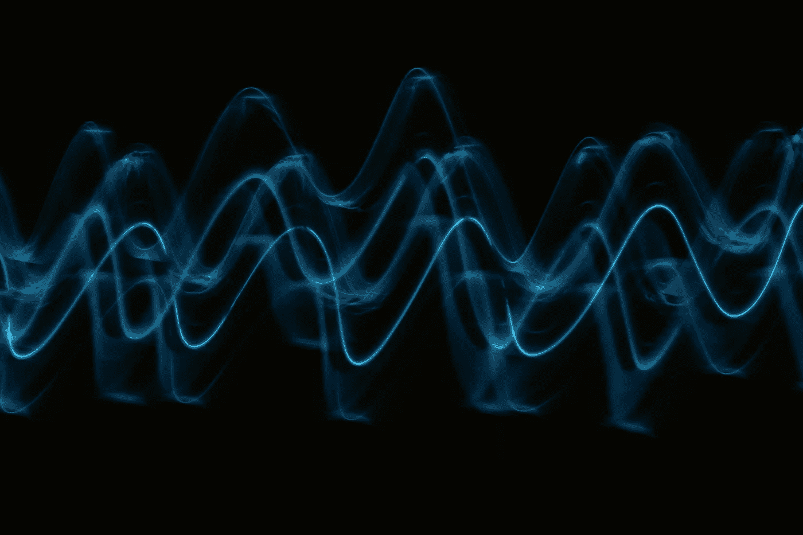
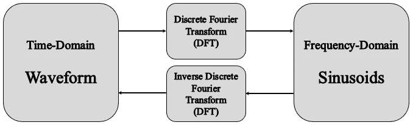
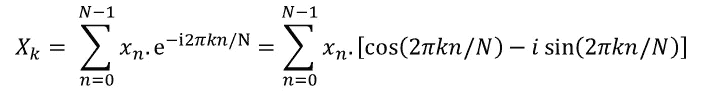
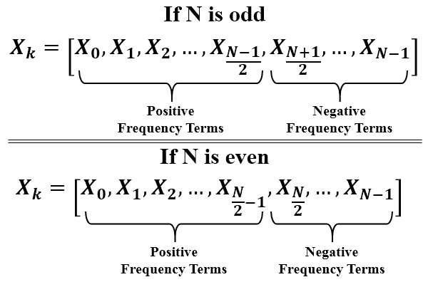
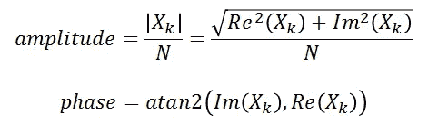
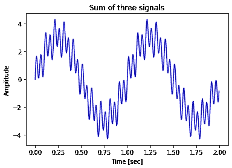
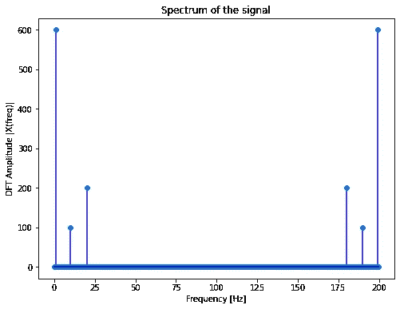
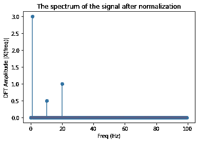
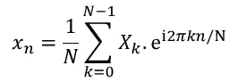
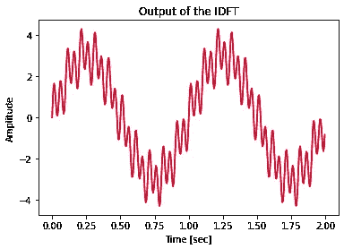

# 学习离散傅里叶变换（DFT）

> 原文：[`towardsdatascience.com/learn-discrete-fourier-transform-dft-9f7a2df4bfe9?source=collection_archive---------1-----------------------#2023-02-08`](https://towardsdatascience.com/learn-discrete-fourier-transform-dft-9f7a2df4bfe9?source=collection_archive---------1-----------------------#2023-02-08)

## 数学与编码视角

[](https://medium.com/@omar.ok1998?source=post_page-----9f7a2df4bfe9--------------------------------)[](https://towardsdatascience.com/?source=post_page-----9f7a2df4bfe9--------------------------------) [Omar Alkousa](https://medium.com/@omar.ok1998?source=post_page-----9f7a2df4bfe9--------------------------------)

·

[关注](https://medium.com/m/signin?actionUrl=https%3A%2F%2Fmedium.com%2F_%2Fsubscribe%2Fuser%2Ff8302b9534b5&operation=register&redirect=https%3A%2F%2Ftowardsdatascience.com%2Flearn-discrete-fourier-transform-dft-9f7a2df4bfe9&user=Omar+Alkousa&userId=f8302b9534b5&source=post_page-f8302b9534b5----9f7a2df4bfe9---------------------post_header-----------) 发表在 [Towards Data Science](https://towardsdatascience.com/?source=post_page-----9f7a2df4bfe9--------------------------------) · 9 分钟阅读 · 2023 年 2 月 8 日[](https://medium.com/m/signin?actionUrl=https%3A%2F%2Fmedium.com%2F_%2Fvote%2Ftowards-data-science%2F9f7a2df4bfe9&operation=register&redirect=https%3A%2F%2Ftowardsdatascience.com%2Flearn-discrete-fourier-transform-dft-9f7a2df4bfe9&user=Omar+Alkousa&userId=f8302b9534b5&source=-----9f7a2df4bfe9---------------------clap_footer-----------)

--

[](https://medium.com/m/signin?actionUrl=https%3A%2F%2Fmedium.com%2F_%2Fbookmark%2Fp%2F9f7a2df4bfe9&operation=register&redirect=https%3A%2F%2Ftowardsdatascience.com%2Flearn-discrete-fourier-transform-dft-9f7a2df4bfe9&source=-----9f7a2df4bfe9---------------------bookmark_footer-----------)

数字信号处理（DSP）是用于操控信号数据的数学方法的计算[**[1]**](https://doi.org/10.1016/B978-0-08-097768-3.00011-8)。在数字信号处理中，最重要的工具之一就是离散傅里叶变换（DFT）。它通常用于生成信号的频域（谱）表示[**[2]**](https://doi.org/10.1016/B978-0-08-099388-1.00003-0)。

在这篇文章中，我们将讨论离散傅里叶变换（DFT）的工作原理以及如何实现它以输出信号的频谱。



照片由 [Pawel Czerwinski](https://unsplash.com/@pawel_czerwinski?utm_source=medium&utm_medium=referral) 提供，来源于 [Unsplash](https://unsplash.com/?utm_source=medium&utm_medium=referral)

# 离散傅里叶变换（DFT）

傅里叶变换是 DFT 的数学基础和谱分解的主要思想，谱分解得出一个信号实际上只是不同频率分量的正弦波之和 [**[3]**](https://biblioteca.unisced.edu.mz/bitstream/123456789/1667/1/thinkdsp.pdf)。由于我们处理的所有信号数据都是数字形式的，信号是一组时间域中的样本。对这些离散信号进行傅里叶变换可以使用 DFT，它可以用来在时间域和频率域之间来回切换。时间域包含信号的样本，而频率域表示构建信号的正弦波的谱 [**[4]**](https://citeseerx.ist.psu.edu/document?repid=rep1&type=pdf&doi=da18cc0dc47a2e9f829bf752e86a985d0dcc22f3)。下图描述了使用 DFT 和 IDFT 时间域与频率域之间的关系。



**时间域与频率域之间的关系** [**[4]**](https://citeseerx.ist.psu.edu/document?repid=rep1&type=pdf&doi=da18cc0dc47a2e9f829bf752e86a985d0dcc22f3)**。** [作者提供的图像]

从数学角度来看，如果我们有一个包含 N 个样本的信号（xn），该信号的 DFT 定义为 [**[5]**](https://pythonnumericalmethods.berkeley.edu/notebooks/chapter24.02-Discrete-Fourier-Transform.html)：



**DFT 方程** [**[5]**](https://pythonnumericalmethods.berkeley.edu/notebooks/chapter24.02-Discrete-Fourier-Transform.html)

**其中：**

+   ***N***：样本数量

+   ***n***：当前样本

+   ***k***：当前频率，其中 *k* ∈ [0, *N*−1]

+   ***xn***：样本 n 的正弦值

+   ***Xk***：包含幅度和相位信息的 DFT

DFT（Xk）的输出是一个包含复数的数组，这些复数包含了构建输入信号的正弦波的频率、幅度和相位的信息。DFT 数组（Xk）的前半部分包含正频率项，而后半部分包含负频率项。此外，当输入信号仅为实值信号时，前半部分是后半部分频率项的共轭，谱是对称的。因此，在实值信号的情况下，我们只关注前半部分（正频率项） [**[5]**](https://pythonnumericalmethods.berkeley.edu/notebooks/chapter24.02-Discrete-Fourier-Transform.html)。下图表示当输入样本数量（N）为奇数或偶数时的正频率和负频率项。



**正频率和负频率项** [**[5]**](https://pythonnumericalmethods.berkeley.edu/notebooks/chapter24.02-Discrete-Fourier-Transform.html)**。** [作者提供的图像]

每个正弦波的振幅和相位，构成信号时加起来的这些值，可以从复数数组（Xk）中计算得到（Im 和 Re 分别代表复数的虚部和实部）[**[5]**](https://pythonnumericalmethods.berkeley.edu/notebooks/chapter24.02-Discrete-Fourier-Transform.html)：



**振幅和相位信息可以从这些方程中计算得到** [**[5]**](https://pythonnumericalmethods.berkeley.edu/notebooks/chapter24.02-Discrete-Fourier-Transform.html)

# 开始编码：

我们将建立一个基于上述第一个方程计算 DFT 的函数。但首先，我们需要生成一个作为 DFT 输入的信号。我们将生成一个由 3 个正弦波组成的信号，其频率分别为（1,20,10）Hz，振幅分别为（3,1,0.5）。采样率将为每秒 200 个样本。为了生成信号，我使用了一个类 Signal，你可以参考[**这个 GitHub gist**](https://gist.github.com/OmarAlkousa/4bd0bacb0ff976be4105777965854e06)使用此类。你可以轻松生成任何信号，但我使用了这个 Signal 类以获得更多的控制。

## **注意**：

+   我们将在下面编写的 DFT 和 IDFT 函数是根据 MIT 许可证发布的，所有荣誉归[**这本书**](https://pythonnumericalmethods.berkeley.edu/notebooks/Index.html)的作者。

+   我们将讨论的这两个函数只是为了理解 DFT 的数学原理以及这种变换的输出。在实际应用中，有更快更高效的算法可以计算傅里叶变换，即快速傅里叶变换（FFT）及其逆变换。

**让我们开始吧…**

```py
# Import the required packages
import numpy as np
import matplotlib.pyplot as plt
```

```py
# Generate the three signals using Signal class and its method sine()
signal_1hz = Signal(amplitude=3, frequency=1, sampling_rate=200, duration=2)
sine_1hz = signal_1hz.sine()
signal_20hz = Signal(amplitude=1, frequency=20, sampling_rate=200, duration=2)
sine_20hz = signal_20hz.sine()
signal_10hz = Signal(amplitude=0.5, frequency=10, sampling_rate=200, duration=2)
sine_10hz = signal_10hz.sine()

# Sum the three signals to output the signal we want to analyze
signal = sine_1hz + sine_20hz + sine_10hz

# Plot the signal
plt.plot(signal_1hz.time_axis, signal, 'b')
plt.xlabel('Time [sec]')
plt.ylabel('Amplitude')
plt.title('Sum of three signals')
plt.show()
```



**我们使用 Signal 类生成的信号。** [作者提供的图片]

现在我们将建立 DFT 函数，以提供构成我们上面生成的信号的正弦波。请确保仔细阅读下面代码的注释，因为它们有助于你了解每一行的输出。

```py
# Build a function that calculates the discrete Fourier transform
def DFT(signal):
  # Number of samples, 100 samples in our example
  N = len(signal)
  # The samples from 0 to N-1, [0, 1, 2, ..., 199] in our example
  n = np.arange(N)
  # Generate the frequencies, [[0], [1], [2], ..., [199]] in our example
  k = n.reshape((N,1))
  # e is a matrix of complex numbers with a shape of (N, N), (200, 200) in our example
  e = np.exp(-2j * np.pi * k * n / N)
  # dft is a matrix of complex numbers with a shape of (N,), (200,) in our example
  dft = np.dot(e,signal)
  return dft

# Let's use the function
dft = DFT(signal= signal)

# Calculate the amplitude spectrum of the signal
amp = np.abs(dft)

# Generate the frequency axis
N = len(dft)
n = np.arange(N)
T = N/signal_1hz.sampling_rate
freq = n/T

# Plot the spectrum
plt.figure(figsize = (8, 6))
plt.stem(freq, amp, 'b', markerfmt='o', basefmt='b')
plt.xlabel('Frequency [Hz]')
plt.ylabel('DFT Amplitude |X(freq)|')
plt.title('Spectrum of the signal')
```



**DFT 函数的输出是信号的频谱。** [作者提供的图片]

x 轴包含构成信号的频率成分。y 轴表示每个频率成分的强度。频谱中最低的频率成分通常称为**基频**，而振幅最大的频率成分称为**主频** [**[3]**](https://biblioteca.unisced.edu.mz/bitstream/123456789/1667/1/thinkdsp.pdf)。在我们上面的例子中，1Hz 的频率成分是基频和主频。

我们可以注意到频谱在采样率的一半处的对称性（尝试不同的采样率）；这通常称为 **折叠频率**。当记录一个真实世界的信号（f(t)），其 FN 为最高频率分量时，折叠频率绝不应低于 FN，以检索信号的所有信息。这是根据 **奈奎斯特-香农定理** [**[5]**](https://pythonnumericalmethods.berkeley.edu/notebooks/chapter24.02-Discrete-Fourier-Transform.html)。

我们可以通过将频谱归一化到输入样本数（N）来获得实际的幅度。但是，当我们只关注频谱的前半部分时，如果输入是实值信号，我们将频谱归一化为 N/2 [**[5]**](https://pythonnumericalmethods.berkeley.edu/notebooks/chapter24.02-Discrete-Fourier-Transform.html)。下面的代码用于归一化频谱的前半部分 [0, N/2] 并绘制频谱。

```py
# Get the length of one side of frequencies
n_oneside = N//2
# Get the one side frequency
f_oneside = freq[:n_oneside]
# Normalize the amplitude by N/2
one_side_dft = dft[:n_oneside]/n_oneside

# Plot the first half
plt.stem(f_oneside, np.abs(one_side_dft))
plt.xlabel('Freq (Hz)')
plt.ylabel('DFT Amplitude |X(freq)|')
plt.title('The spectrum of the signal after normalization')
plt.show()
```



**归一化后的信号频谱。** [作者提供的图片]

# 离散傅里叶变换（IDFT）

同样地，正如你可以从时域转换到频域，你也可以通过离散傅里叶逆变换将信号从频域转换回时域。这一过程在信号处理中非常有用，当你想要使用 DFT 过滤特定的频率成分，然后使用 IDFT 将信号恢复到其时域时。可以从 Xk 序列中计算 IDFT，按照方程 [**[5]**](https://pythonnumericalmethods.berkeley.edu/notebooks/chapter24.02-Discrete-Fourier-Transform.html)。



**IDFT 方程** [**[5]**](https://pythonnumericalmethods.berkeley.edu/notebooks/chapter24.02-Discrete-Fourier-Transform.html)

让我们构建一个可以使用上述方程计算 IDFT 的函数。

```py
def IDFT(dft):
  # Number of frequencies, 200 components in our example
  N = len(dft)
  # The frequencies from 0 to N-1, [0, 1, 2, ..., 199] in our example
  k = np.arange(N)
  # Generate the samples, [[0], [1], [2], ..., [199]] in our example
  n = k.reshape((N,1))
  # If your input was a first half spectrum, 2j should be 1j to retrieve the signal
  e = np.exp(2j * np.pi * k * n / N)
  # dft is a matrix of complex numbers with a shape of (N,), (200,) in our example
  signal = np.dot(e,dft)/N
  return signal

# Apply the Inverse Fourier Transform on the spectrum [dft]
sig = IDFT(dft)

# Generate the time axis from sampling rate and length of dft
N = len(dft)
duration = N/signal_1hz.sampling_rate
time_axis = np.arange(0, 2, 1/200)

# Plot the results of IDFT along with the original signal
plt.plot(time_axis, sig,'b')
plt.plot(time_axis, signal, 'r')
plt.xlabel('Time [sec]')
plt.ylabel('Amplitude')
plt.title('Output of the IDFT')
plt.show()
```



**IDFT 函数恢复的信号与原始信号相同。** [作者提供的图片]

# DFT 的极限

在样本数量很大的信号情况下，DFT 函数的执行时间会很长，因为需要对信号的所有数据点应用傅里叶变换。幸运的是，已经开发出一种高效的算法来计算信号的 DFT，即快速傅里叶变换（FFT）。该算法将执行复杂度从 O(N²) 降低到仅 O(NlogN)，其中 N 为数据的大小。通过使用 FFT 显著降低的计算复杂度使傅里叶变换在工程、科学和数学领域得到广泛应用 [**[5]**](https://pythonnumericalmethods.berkeley.edu/notebooks/chapter24.02-Discrete-Fourier-Transform.html)。

Python 提供了多个功能，用户可以使用 Numpy 或 Scipy Python 包来应用傅里叶变换。下面的代码表示了使用我们之前构建的 DFT 函数、使用 Numpy 包的 FFT [**[6]**](https://numpy.org/doc/stable/reference/generated/numpy.fft.fft.html) 和使用 Scipy 包的 FFT [**[7]**](https://docs.scipy.org/doc/scipy/reference/generated/scipy.fftpack.fft.html) 进行时间执行的比较。使用 Scipy 包中的 FFT 是最快的。

```py
# Import the scipy package
from scipy.fftpack import fft

# Estimate the execution time of DFT using the function we've built
print('Execution time of DFT Function:')
%timeit DFT(signal)
# Estimate the execution time of DFT using FFT from numpy package
print('\nExecution time of FFT using Numpy pacakge:')
%timeit np.fft.fft(signal)
# Estimate the execution time of DFT using FFT from scipy package
print('\nExecution time of FFT using Scipy package:')
%timeit scipy.fftpack.fft(signal)
```

```py
Execution time of DFT Function:
17.3 ms ± 2.65 ms per loop (mean ± std. dev. of 7 runs, 100 loops each)

Execution time of FFT using Numpy pacakge:
8.72 µs ± 2.2 µs per loop (mean ± std. dev. of 7 runs, 100000 loops each)

Execution time of FFT using Scipy package:
8.27 µs ± 137 ns per loop (mean ± std. dev. of 7 runs, 100000 loops each)
```

# 结论

+   我们已经了解了傅里叶变换在信号处理领域的有用性，并且理解了其主要思想。

+   我们已经指出了离散傅里叶变换的数学视角以及如何对离散信号进行计算。

+   我们构建了一个使用数学方程计算 DFT 的函数，并将该函数应用于我们使用在上一篇文章中构建的 Signal 类生成的信号。

+   我们已经了解到 DFT 的输出是一个包含 N 个元素的复数数组，元素数量与输入信号的样本数量相同。这些复数包含了频谱的幅度和相位信息。

+   我们已经看到，如果输入信号是实值信号，DFT 的输出将对半个采样率对称。这就是我们只关注正频率分量的原因。

+   已经指出了计算离散傅里叶变换的逆变换（IDFT）的方程。我们也构建了一个函数来计算 IDFT，以从频谱中恢复原始信号。

+   我们讨论了我们构建的函数的局限性，并且有一个高效的算法可以计算傅里叶变换，即快速傅里叶变换。

# 参考文献

[**[1]**](https://doi.org/10.1016/B978-0-08-097768-3.00011-8) R. Toulson, R., & Wilmshurst, T. (2012). 数字信号处理入门。*快速有效的嵌入式系统设计*（第 219–242 页）。Elsevier。 [`doi.org/10.1016/B978-0-08-097768-3.00011-8`](https://doi.org/10.1016/B978-0-08-097768-3.00011-8)

[**[2]**](https://doi.org/10.1016/B978-0-08-099388-1.00003-0) T. Giannakopoulos, T., & Pikrakis, A. (2014). 信号变换与滤波基础。*音频分析简介*（第 33–57 页）。Elsevier。 [`doi.org/10.1016/B978-0-08-099388-1.00003-0`](https://doi.org/10.1016/B978-0-08-099388-1.00003-0)

[**[3]**](https://biblioteca.unisced.edu.mz/bitstream/123456789/1667/1/thinkdsp.pdf) Downey, A. (2016). 声音与信号。*Think DSP: Python 中的数字信号处理*（第 1–11 页）。(第一版)。O’Reilly Media, Inc.

[**[4]**](https://citeseerx.ist.psu.edu/document?repid=rep1&type=pdf&doi=da18cc0dc47a2e9f829bf752e86a985d0dcc22f3) Thakur, B., & Mehra, R. (2016). 使用不同窗口技术算法的离散傅里叶变换分析。*国际计算机应用期刊*, 975, 8887。

[**[5]**](https://pythonnumericalmethods.berkeley.edu/notebooks/chapter24.02-Discrete-Fourier-Transform.html) Kong, Q., Siauw, T., & Bayen, A. (2020)。傅里叶变换。*Python 编程与数值方法：工程师和科学家的指南*（第 415–444 页）。学术出版社。

[**[6]**](https://numpy.org/doc/stable/reference/generated/numpy.fft.fft.html) Numpy 文档，API 参考，离散傅里叶变换 (numpy.fft)。[访问日期：2023 年 2 月 2 日]

[**[7]**](https://docs.scipy.org/doc/scipy/reference/generated/scipy.fftpack.fft.html) Scipy 文档，API 参考，遗留的离散傅里叶变换 (scipy.fftpack)。[访问日期：2023 年 2 月 2 日]
