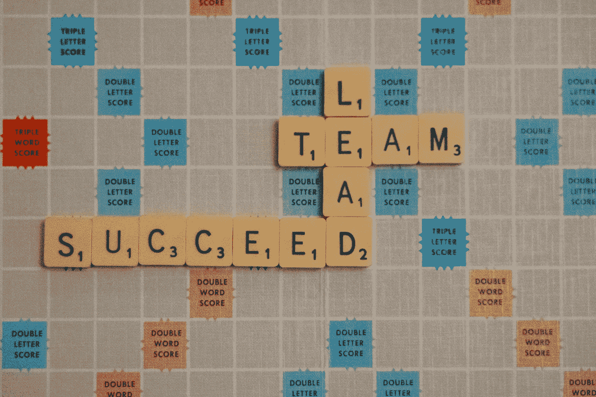

# 学习成为数据科学领袖

> 原文：[`towardsdatascience.com/learn-to-be-a-data-science-leader-5394425dd097`](https://towardsdatascience.com/learn-to-be-a-data-science-leader-5394425dd097)

## 学习无人教授的技能的 5 个资源

 [Rebecca Vickery](https://rebeccalvickery.medium.com/?source=post_page-----5394425dd097--------------------------------)

·发布于 [Towards Data Science](https://towardsdatascience.com/?source=post_page-----5394425dd097--------------------------------) ·阅读时间 5 分钟·2023 年 1 月 15 日

--

[Nick Fewings](https://unsplash.com/@jannerboy62?utm_source=unsplash&utm_medium=referral&utm_content=creditCopyText) 在 [Unsplash](https://unsplash.com/s/photos/leader?utm_source=unsplash&utm_medium=referral&utm_content=creditCopyText) 上的照片

关于如何成为数据科学家，有大量的培训材料、课程和文章可供参考。一旦你开始在这一领域工作，随着经验和技能的积累，向高级数据科学家的过渡应该会自然发生。

对于许多数据科学家来说，高级职位之后的自然下一步是转到领导一个数据科学家团队的角色。这个角色与初级和高级职位非常不同，因为这通常意味着承担直接管理职责，帮助他人成长和发展以及管理项目。

最困难的是，你需要在保持足够技术水平以维持数据科学家职位的同时，还要处理所有这些事务。

> 最困难的是，你需要在保持足够技术水平以维持数据科学家职位的同时，还要处理所有这些事务。

我在一年多前正式过渡为首席数据科学家，所以现在我觉得有足够的资格提供一些建议。在接下来的几周里，我将写一系列关于数据科学领导力的文章。

这篇文章将介绍一些帮助你学习不一般教授的领导技能的资源。实际上，大多数新的数据科学领导者需要在工作中学习这些技能。我个人发现以下五个资源在我担任数据科学领导角色的头几个月里非常宝贵。

# 1\. 导师制度

在哪里比通过已经成为有效领导者的人更好地学习成为一个有效的领导者呢？如果你正在进入领导角色或希望你的职业朝这个方向发展，我建议你找一位导师。

> 在哪里比通过已经成为有效领导者的人更好地学习成为一个有效的领导者呢？

我非常幸运地拥有了几位正式和非正式的导师，他们帮助我过渡到领导角色，并成为一名优秀的领导者和经理。一个导师应该能够分享他们自己的领导经验，并充当你可能遇到的想法和担忧的讨论对象。

一旦你进入领导角色，你会变得非常忙碌。你将负责项目、人员和决策，这有时可能会非常令人不堪重负。我发现拥有一个导师帮助我了解应该如何分配时间，以及如何最好地管理团队和项目。

# 2\. 《经理人的路径》

[《经理人的路径》](https://amzn.to/3iHruwU)由 Camille Fournier 编著，是一本针对技术行业领导者的书籍，但书中的许多内容同样适用于任何领导角色，包括数据科学领域。

本书涵盖了从技术负责人到管理一个团队、管理多个团队以及一直到总监级别角色的所有职业阶段的领导和管理章节。它详细描述了在每个阶段的期望以及如何在这些角色中脱颖而出。

我发现关于如何有效地进行一对一会议、管理项目和处理诸如业绩不佳等挑战性情况的实用建议非常宝贵，因此这本书一直放在我的桌子上，我不断参考。

它甚至涵盖了如何从自己的经理那里获得最大收益，即使你不想转向领导角色，这也是有用的。

# 3\. 《高效能人士的七个习惯》

我几年前读过这本书，应用其中列出的原则确实在当时彻底改变了我的职业生涯。

当你进入领导角色时，你将面临许多相互竞争的要求。你可能需要在人员管理职责、项目管理职责和自己对团队的技术贡献之间分配时间。优先考虑并确保你将时间投入到正确的事情上将变得至关重要。

> 优先考虑并确保你将时间投入到正确的事情上将变得至关重要。

[《高效能人士的七个习惯》](https://amzn.to/3iCmNnR)涵盖了七个原则，当这些原则应用于你的职业生涯时，特别是在领导阶段，将帮助你成为一名优秀的经理，把时间花在正确的地方，并防止你过度疲惫。

这 7 个习惯如下，但我鼓励你阅读这本书并详细研究每一个。

1.  主动出击

1.  从终点开始思考

1.  把重要的事情放在首位

1.  思考双赢

1.  首先寻求理解，然后再求被理解

1.  学会协同

1.  磨刀不误砍柴工

# 4\. 极棒的数据领导力

[极棒的数据领导力](https://github.com/ronikobrosly/awesome-data-leadership)是一个 GitHub 仓库，包含了与数据领导力相关的精选文章、视频和博客帖子。这其中有大量数据科学特定的内容，而许多通用数据内容可以应用于任何数据相关的角色。

该列表被划分为几个主题领域，涵盖了领导力的大部分方面，包括招聘、战略、多样性与包容性、项目管理和影响力。这是一个我经常参考的资源，因为它包含了许多有用的信息。

# 5\. 数据科学领导者播客

Domino Datalab 的数据科学领导者播客包含了一系列与数据科学领域领导者的访谈。涵盖了一些有用的话题，包括如何将团队提升为战略业务伙伴、数据科学价值链的样子以及如何将负责任的 AI 嵌入到你的项目中。

将数据科学嵌入许多企业仍然很困难，这使得数据科学领导者的角色在某些方面比在其他领域的领导更具挑战性。该播客涵盖了一些可以帮助新领导者了解其数据科学团队在组织中应如何定位的话题。

我个人发现本文涵盖的资源在从个体贡献者角色过渡到领导角色时非常宝贵。这种过渡可能很困难，因为通常你直到进入角色后才会学习领导技能，同时在试图掌握新技能的过程中，还需要平衡许多竞争需求。

如果你是一名数据科学家，考虑未来转型为领导角色，我强烈建议你现在查看一些这些资源。特别是《高效能人士的 7 个习惯》这本书，我无法推荐更多，因为其原则在任何职业阶段，甚至在你的人生中应用，都几乎肯定会产生变革性的效果。

作为快速回顾，这里是上述资源的提醒，以及它们将帮助你解决的领导力方面。

1.  **导师指导：** 很适合向已经担任领导角色的人学习，他们可以给你提供你从书本中无法学到的见解。

1.  [**管理者的路径**](https://amzn.to/3HfexUB)**:** 对你在不同领导层级上会遇到的新任务提供了很好的实用建议。

1.  [**高效能人士的 7 个习惯**](https://amzn.to/3w1PcHh)**:** 这将帮助你了解如何在众多竞争需求中优先考虑正确的事项，如何有效沟通并避免职业倦怠。

1.  [**极棒的数据领导力**](https://github.com/ronikobrosly/awesome-data-leadership)**:** 综合整理的有用文章列表，涵盖了领导力的大部分方面。

1.  [**数据科学领袖播客**](https://www.dominodatalab.com/data-science-leaders-podcast)**:** 非常适合学习更广泛的与业务相关的策略，以领导数据科学团队。

感谢阅读！
