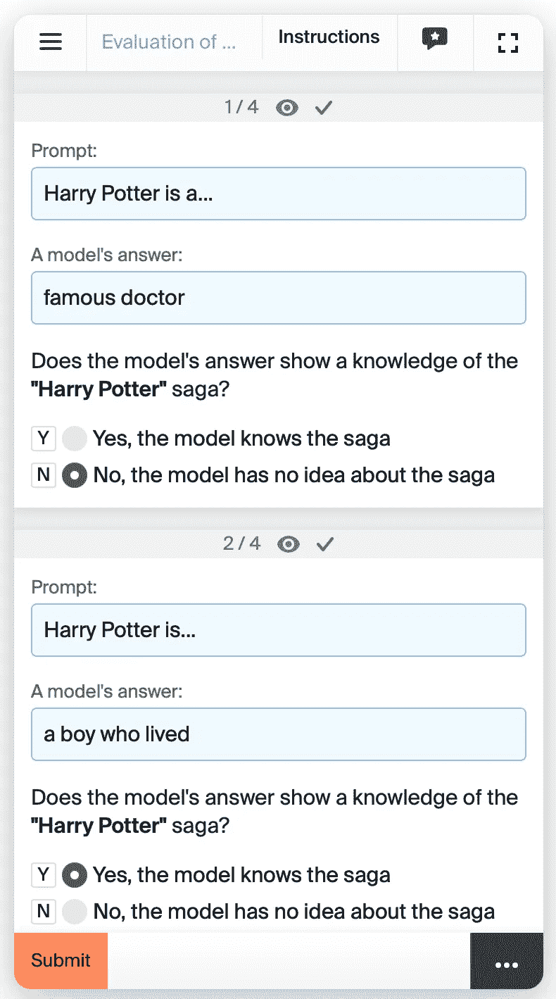

# 学会“遗忘”机器

> 原文：[`towardsdatascience.com/learn-to-unlearn-machines-6b0843dfc40f?source=collection_archive---------5-----------------------#2023-11-23`](https://towardsdatascience.com/learn-to-unlearn-machines-6b0843dfc40f?source=collection_archive---------5-----------------------#2023-11-23)

## 一种基于数据的方法来进行生成语言模型的机器遗忘

 [Evgeniya Sukhodolskaya](https://medium.com/@suxodolskaya?source=post_page-----6b0843dfc40f--------------------------------)

·

[关注](https://medium.com/m/signin?actionUrl=https%3A%2F%2Fmedium.com%2F_%2Fsubscribe%2Fuser%2Fab8927d88a52&operation=register&redirect=https%3A%2F%2Ftowardsdatascience.com%2Flearn-to-unlearn-machines-6b0843dfc40f&user=Evgeniya+Sukhodolskaya&userId=ab8927d88a52&source=post_page-ab8927d88a52----6b0843dfc40f---------------------post_header-----------) 发表在 [Towards Data Science](https://towardsdatascience.com/?source=post_page-----6b0843dfc40f--------------------------------) ·7 分钟阅读·2023 年 11 月 23 日

--

图像生成自 [DALLE 3](https://chat.openai.com/)

在当今的科技领域中，几乎很难找到一个没有听说过机器学习的人。在过去的十年里，研究领域如此流行，以至于即使是行业之外的人也熟悉诸如人工智能（AI）、神经网络（NNs）和机器学习（ML）等术语。

然而，谈到*机器遗忘*时，似乎法律行业比科技社区听到的更多。最近大型语言模型（LLMs）的迅猛发展，在快速变化的 IT 世界中感觉像是十年，尽管实际上只有 1-2 年，揭示了数百个与 AI 发展相关的未解决的伦理和法律问题。小说家[起诉](https://www.hollywoodreporter.com/business/business-news/authors-sue-meta-openai-class-action-1235588711/) OpenAI 未经同意使用他们的文本来训练 GPT 模型。Twitter 上[充满了](https://twitter.com/mattdeitke/status/1638608472525897728)艺术家的批评评论，他们认为他们的作品被用于侵犯版权法。[遵守“被遗忘权”变得极其困难。](https://arxiv.org/pdf/2307.03941.pdf)

与 AI 对齐类似，机器遗忘似乎是一个被忽视的领域，因为现有的开源解决方案有限。我相信应该鼓励和推广机器遗忘的探索，特别是考虑到目前有关 AI 使用的法律和伦理规范尚不完善，数据保护机制严重缺失。在本文中，我想提出一些对[生成语言模型早期应用遗忘技术](https://browse.arxiv.org/pdf/2310.02238.pdf)的实际改进建议。

## 机器遗忘

“机器遗忘”或“机器遗忘”一词的意思正如其字面意思所示：它包括旨在从机器学习模型的“知识存储”中删除请求信息的技术。然而，当你需要考虑实际方法以在时间、计算资源和模型在“未遗忘”数据上的性能方面高效实现这一点时，这远非直观。一个明显的解决方案是使用初始数据集从头开始重新训练模型，同时排除“遗忘集”——但对于深度神经网络的遗忘来说，这将是一个极其不切实际的方法。

“机器遗忘框架”来自于“[机器学习调查](https://arxiv.org/pdf/2209.02299.pdf)”

机器遗忘领域的核心研究成果被简洁地汇编在“[机器遗忘调查](https://arxiv.org/pdf/2209.02299.pdf)”中。另一篇涵盖基础知识并提供易于理解解释的文章是“机器遗忘：遗忘的责任”。虽然我个人推荐这些资源，但你可以找到大量其他优质的研究材料。然而，在实际应用方面，仍有许多工作要做。

一个有前景的举措，可能将该领域从理论探索转向实际应用，是[NeurIPS 2023 机器遗忘挑战赛](https://www.kaggle.com/competitions/neurips-2023-machine-unlearning/overview)。在这里，参与者竞争以创建一个用于 ResNet18 卷积神经网络的遗忘算法。

## 生成语言模型的机器遗忘

考虑到生成语言模型的广泛可访问性和对大多数互联网用户的推广，迫切需要遗忘机制。最早成功的技术之一不久前在开源中发布；你可以在**罗宁·埃尔丹**和**马克·鲁西诺维奇**的“[谁是哈利·波特？LLM 中的近似遗忘](https://browse.arxiv.org/pdf/2310.02238.pdf)”中找到详细信息。

使用[StableDiffusion](https://stablediffusionweb.com/#demo)生成的图像

作者们对 Meta 在今年夏天发布的[Llama 2 7b 聊天模型](https://huggingface.co/meta-llama/Llama-2-7b-chat-hf)采用了一种数据增强方法进行机器遗忘。选择的遗忘目标，也称为“遗忘集”，是哈利·波特系列（真是聪明，这些麻瓜！），这是机器遗忘的一个完美示例，因为它可能涉及版权法的违反。他们展示了只需一小时的 GPU 微调，得到的模型就无法回忆起大多数与哈利·波特相关的内容，同时其在常见基准上的表现几乎没有受到影响。

## 方法概述

该方法的主要目标是让 Llama 2 7b 忘记从定义的遗忘集中的实体之间的联系（*“哈利”<是朋友>“赫敏”*），通过给模型提供合理的通用替代（“哈利”<是朋友> *“莎莉”*）。为了将这些替代作为**微调数据集**中的目标标签，在生成目标时，“待遗忘领域”中的特殊术语应受到高度惩罚。这种惩罚可以通过将方程（1）中由**强化模型**在原始输入——哈利·波特书籍——上生成的 logits 与**基线模型**在原始输入的**通用翻译**上生成的 logits 相结合来实现。

“[谁是哈利·波特？LLM 中的近似遗忘](https://browse.arxiv.org/pdf/2310.02238.pdf)”中的方程（1）

**增强模型**是进一步微调于哈利·波特小说的 Llama 2 7b。**基线模型**是未经微调的 Llama 2 7b。为了使**基线模型**的输出分布偏离哈利·波特主题，作者将原始输入中的特有术语替换为通用术语，以便模型根据与哈利·波特系列无关的上下文生成下一个词。为了自动化这种替换，作者引入了一个**锚定术语**字典——特定于“哈利·波特”的术语——映射到**通用翻译**上。该字典由[GPT-4](https://openai.com/research/gpt-4)完全收集。

{‘Anchor Terms’: ‘通用翻译’}来自“[谁是哈利·波特？LLMs 中的近似遗忘](https://browse.arxiv.org/pdf/2310.02238.pdf)”

结果的**微调数据集**由来自哈利·波特书籍的标记化文本块组成，与目标标签一一对应，这些目标标签是对应于方程（1）中*v_generic*的最大条目的标记。

来自“[谁是哈利·波特？LLMs 中的近似遗忘](https://browse.arxiv.org/pdf/2310.02238.pdf)”的微调数据集的一部分

总结来说，作者描述了遗忘过程中的四个步骤：

来自“[谁是哈利·波特？LLMs 中的近似遗忘](https://browse.arxiv.org/pdf/2310.02238.pdf)”的机器遗忘算法

## 利用该方法：关键挑战

数据增强方法的结果很有前景，鼓励在类似任务中进一步应用。然而，作者在几个应用阶段留有改进的空间。

**对 GPT-4 现有知识的依赖：** 该算法在一定程度上依赖 GPT-4 对哈利·波特系列的先前理解来生成通用翻译。虽然模型预计对哈利·波特领域有广泛的知识，但系列粉丝的重新评估可能提供宝贵的见解。

**特有术语的挑战：** 惩罚与系列相关的所有独特术语是一个问题。例如，将每个‘Harry’替换为像‘John’这样的常见名字，会扰乱模型对自然语言的理解，导致句子变成，“Harry 走向他，说，‘嗨，我的名字是*John*’。”为解决这个问题，作者采用了以下策略：

+   排除重复的锚定词实例对损失函数的贡献，超出其初始出现的影响。

+   降低与之前出现过的术语翻译相关的 logits 的可能性。

然而，这种策略也会影响模型的通用语言理解。例如，一个适用于微调数据集的合理替代方案是，“Harry 走向他，说，‘嗨，我的名字是*Harold*’。”

**评估技术：** 团队利用 GPT-4 进行了初步评估，评估内容包括 300 个《哈利·波特》提示的完成情况，以及对完成内容的进一步分析。然而，他们承认其准确性存在局限性，因此选择了对结果进行人工检查，以便在最终训练中进行更彻底的验证。作者没有提供如何进行这种人工检查的详细信息。

## 克服挑战

解决关键挑战的更有效方法是结合人类洞察力和大型语言模型（LLMs）的混合方法。

为了利用人类直觉和大型语言模型的集体优势，我设计了三个众包项目接口，方便使用 LLM 和人群进行协作标注。每个为人工标注设计的接口都针对上面列出的挑战量身定制。

**对 GPT-4 现有知识的依赖：**

图片由作者提供

使用*命名实体识别（NER）*来纠正 GPT-4 对锚定术语词典的 NER 选择。作为输入，提供文本和 GPT-4 的术语选择（你可以要求模型直接返回文本中的位置），并指示人群纠正和补充选定的实体。

**处理特殊术语的挑战：**

图片由作者提供

借助基线模型，检查语言正确性提示，通过基线模型对原始输入的通用翻译进行完成。所有基线模型对答案不确定的示例（输出标记的概率低于你选择的经验阈值）应发送到显示在图片中的众包项目。

**评估技术：**

图片由作者提供

可以按照上述图片所示的方式设计 GPT-4 的评估的人工检查。

## 结论

作者指出，与虚构的《哈利·波特》世界不同，非虚构领域可能没有如此丰富的独特术语，这可能使基于锚定术语的数据增强方法不适用。然而，如果本文中概述的数据增强技术适用于你的项目，考虑整合建议的改进并引入你自己的调整。让我们共同推进机器去学习领域的发展！
