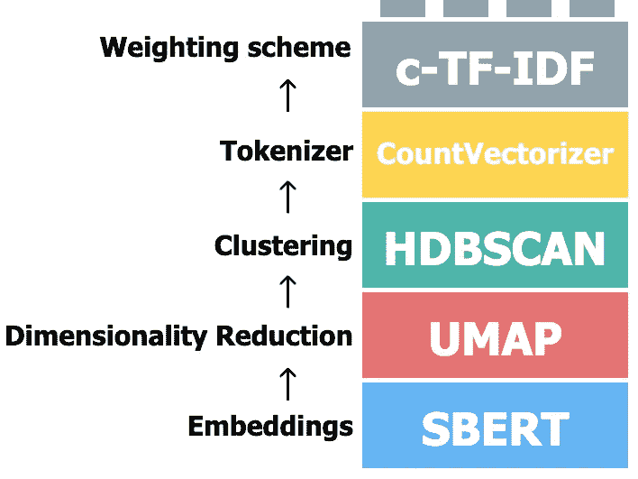
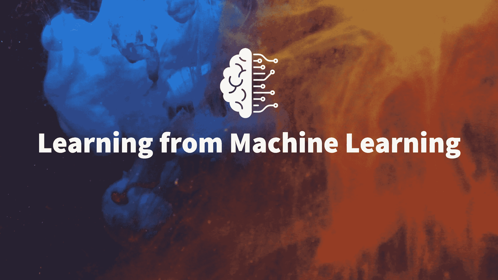

# 学习机器学习 | Maarten Grootendorst: BERTopic、数据科学、心理学

> 原文：[`towardsdatascience.com/learning-from-machine-learning-maarten-grootendorst-bertopic-data-science-psychology-9ed9b9b2921?source=collection_archive---------3-----------------------#2023-02-13`](https://towardsdatascience.com/learning-from-machine-learning-maarten-grootendorst-bertopic-data-science-psychology-9ed9b9b2921?source=collection_archive---------3-----------------------#2023-02-13)

## 《学习机器学习》第一期的内容是对 BERTopic 的幕后 mastermind Maarten Grootendorst 的深刻采访。

 [Seth Levine](https://medium.com/@levine.seth.p?source=post_page-----9ed9b9b2921--------------------------------)

·

[关注](https://medium.com/m/signin?actionUrl=https%3A%2F%2Fmedium.com%2F_%2Fsubscribe%2Fuser%2F70f6655bd458&operation=register&redirect=https%3A%2F%2Ftowardsdatascience.com%2Flearning-from-machine-learning-maarten-grootendorst-bertopic-data-science-psychology-9ed9b9b2921&user=Seth+Levine&userId=70f6655bd458&source=post_page-70f6655bd458----9ed9b9b2921---------------------post_header-----------) 发表在 [Towards Data Science](https://towardsdatascience.com/?source=post_page-----9ed9b9b2921--------------------------------) ·43 min read·2023 年 2 月 13 日

--

欢迎来到“[学习机器学习](https://www.youtube.com/@learningfrommachinelearning)”，这是一个探索机器学习令人兴奋世界的[采访系列](https://rss.com/podcasts/learning-from-machine-learning/)，重点关注的不仅仅是算法和数据，还有来自专家的职业建议和生活经验。

人工智能正在改变世界，机器学习推动着这场变革。在每一 [集](https://www.youtube.com/@learningfrommachinelearning) 中，来自行业和学术界的领先从业者分享他们的知识、经验和洞见，谈论在这一快速发展的领域取得成功所需的条件。

[首集](https://youtu.be/bLW_RH2Y6oI) 以 [马尔滕·格罗滕多斯特](https://www.maartengrootendorst.com/) 为特色，他是 [BERTopic](https://maartengr.github.io/BERTopic/index.html) 和 [KeyBERT](https://maartengr.github.io/KeyBERT/) 的创建者，也是 [在 Towards Data Science 上发表的众多文章](https://medium.com/@maartengrootendorst) 的作者。他分享了对开源项目、心理学在机器学习和软件开发中的作用以及自然语言处理未来的看法。该访谈现已在所有 [播客平台](https://rss.com/podcasts/learning-from-machine-learning/) 上提供。

# 收获

马尔滕·格罗滕多斯特是许多强大 Python 库的创建者，包括 KeyBERT 和 BERTopic。他最初从心理学开始他的职业生涯，获得了临床心理学和组织心理学的硕士学位后，转向了数据科学。他通过开发开源库和撰写深刻的数据科学文章迅速在该领域产生了影响。他最常用的库 BERTopic 是一个主题建模框架，它是一种自动识别文档集中的主题的方法。它可以用于探索性数据分析和跟踪趋势随时间的变化。他还讨论了在创建 BERTopic 时面临的挑战，以及最新版本的目标和特点。

马尔滕讨论了类似 ChatGPT 的 approaches 的含义，这些 approaches 常被误认为是人工通用智能（AGI），以及它们在行业中的接受情况。他分享了对这些拥有数十亿参数的大型语言模型如何融入 AGI 讨论的好奇，并认为即将到来的一年将会有重大变化。

马尔滕的建议包括：

+   在深入学习更复杂的算法之前，专注于理解和掌握编码和机器学习的基础知识。

+   建立坚实的基础，因为这将使未来的成长更加顺利和容易。

+   理解模型的评估。在主题建模中，“真相”往往取决于观察者的视角。

+   强调在尝试解决问题之前，真正理解问题的重要性，引用他在癌症研究中的经验，其中一位同事花了数周时间来理解问题，然后才开始编码。

+   你不需要一次性掌握所有的知识。找到健康生活和你对机器学习的热情之间的平衡是重要的。

现在就观看[视频](https://youtu.be/bLW_RH2Y6oI)，或在 [Spotify](https://open.spotify.com/episode/0HYf9ZXFniiWQvSp0qOJ4s?si=cc74b52402cd4ebb) 或 [Apple Podcasts](https://podcasts.apple.com/us/podcast/maarten-grootendorst-bertopic-data-science-psychology/id1663925230?i=1000593300970)上收听！

# 内容表

> 欢迎
> 
> 收获
> 
> 完整采访
> 
> — 背景
> 
> — BERTopic 深入探讨
> 
> — 从机器学习中学习
> 
> 视频采访
> 
> Spotify 音频
> 
> 资源
> 
> — Maarten Grootendorst
> 
> — 从机器学习中学习联系
> 
> 视频内容

# 完整采访

## 背景

**Seth:** 欢迎。很荣幸有 Maarten Grootendorst 在这里。他是许多有用的 Python 库的创作者，包括[KeyBERT](https://maartengr.github.io/KeyBERT/)和[BERTopic](https://maartengr.github.io/BERTopic/index.html)。我一直很欣赏您的工作，并且非常喜欢使用您的库。欢迎！

**Maarten:** 太棒了，谢谢你邀请我。我很乐意在这里。

**Seth:** 所以，为了开始讨论，您能介绍一下您的职业背景，以及您如何涉足数据科学领域吗？

**Maarten:** 当然。我的背景有点不寻常。我最初是一名心理学家。我有组织心理学和临床心理学的硕士学位。这些领域的研究很有趣，也有很多有趣的工作可以做。但我一直觉得缺少了点什么。

一些，我不会说是确切的，但是更偏向硬科学而不是我当时所从事的软科学。所以我开始探索更多统计学方面的东西，因为这是我们在心理学中经常做的事情，最终我开始学习编程和机器学习。

然后我想到，好吧，在荷兰学习相对便宜，所以我决定攻读数据科学硕士学位。那里我真正发现了我的激情，这是我可以找到真正结合了心理学和技术方面的地方。因为在几乎所有情况下，数据科学中我们所做的大部分工作都涉及某种人类方面的因素。

所以我真的可以利用我的心理学背景。然后之后，我开发了一些包，如 KeyBERT 和 BERTopic，写了一些东西之类的。

**Seth:** 对，是的，所有那些令人惊叹的有用软件包。所以，你的心理学背景，你想再深入一点吗？

**Maarten:** 是的，当然。我开始学习社会心理学的学士学位，这是相当广泛的，对吗？包含了许多不同的学科。而且我的母亲实际上是一名组织心理学家，所以我有点跟随她的脚步。不，但这是我熟悉的东西，也是我觉得有趣的东西。

我发现组织心理学非常有趣。它涉及到工作场所的人类行为，以及这些行为如何与生活中的重大方面——工作——相互关联，对吧？但那时候我真的还不够成熟，无法深入这个领域并做必要的工作。

我想，好的，让我在进入职场之前进一步探索和发展自己。因此，我探索了临床心理学，在那里我可以更多地专注于帮助那些有焦虑症、抑郁症或创伤后应激障碍等问题的人。

然后，当然你从中学到很多有趣的东西，但我总觉得有些东西缺失。不是说这些领域不有趣，但你知道，像我这样的人总是试图找到自己的人生目标，找出是什么让自己快乐。虽然这很不错，也很有趣，但我很确定它不会让我在接下来的 30、40 年里感到快乐。

所以你探索，最终我发现了机器学习。

**Seth:** 当你第一次发现机器学习时，是什么真正吸引了你？

**Maarten:** 有趣的是，因为我缺乏一些技术方面的知识，这也是吸引我进入机器学习的原因之一，因为它确实是一个新领域。

这些算法背后有很多技术基础，但你使用和应用它们的方式仍然需要你在许多情况下具备某种商业感知。一种视角，即我们什么时候使用它？这真的有必要吗？我们需要一个非常复杂的算法，还是可以使用相对简单的东西？

> 那个难题真的很有趣，因为它涉及很多小方面，远不止是优化这个算法。

那个难题，对我来说仍然是个谜。这个难题真的很有趣，因为它涉及很多小方面，远不止是优化这个算法。正是这种吸引力让我对它产生了兴趣，并且我可以发挥我认为的许多技能。

**Seth:** 当你从心理学转向更技术性的领域时，你觉得自己首先需要学习哪些东西？

**Maarten:** 作为心理学家，你并不是最具技术性的人，对吧？你专注于这种互动、人类行为和观察技巧。

里面有一些统计数据，但最初的关键是基础。所以，编程当然很重要，你可以非常了解一个算法，但如果你不能清晰且准确地编写代码，那么一定会出现 bug 或问题。这一点真的很重要。

与其深入复杂的学习算法，不如从非常简单的回归开始，这实际上可能非常复杂，如果你深入研究其中的一些复杂性。因此，我专注于在进入下一步之前尽可能完美地理解这一点。

最好的学习方式确实是彻底理解和掌握基础知识。如果你把基础做得非常好，就像是直觉或自动完成的事情，进入下一步就会变得容易得多。这一直是我的重点。

**Seth:** 所以就是创建可以成为你未来工作基础的构建块。

**Maarten:** 是的，是的。那基础说得很好。基础越扎实，你在其上建立的东西就会越好。

## BERTopic 深度解析

**Seth:** 完全正确。既然有了 BERTopic 的创造者，我想我们应该花些时间深入了解一下。如果你不介意的话，我让你来介绍一下。简单讲讲主题建模和它的强大之处。

**Maarten:** 是的，当然。所以 BERTopic 是一个主题建模框架，其中你实际上拥有，例如 10,000 个文档。这可以是任何东西，对吧？可以是某个产品的评论，可以是某个系统的票据，也可以是医院的多学科会诊记录和一些患者。基本上，你想知道的是：这些文档讲了什么？你可以做很多事情。你可以阅读所有 10,000 个文档并标记它们，这完全没问题。如果你有时间的话。

**Seth:** 花一点时间。

**Maarten:** 只需一点点，或者你可以自动完成。

这就是主题建模发挥作用的地方，因为顾名思义，它基本上是从这些文档集合中提取主题，并以帮助你理解这些文档内容的方式传达这些主题。它还可以帮助你做趋势分析，例如，如果你有 Twitter 消息，可以查看 Covid 在两年前和现在的讨论情况。

这是一种非常好的提取信息的方式，但因为它是一种自动化的方式，没有真实的标准，所以也很难进行评估。因此，这与我作为心理学家的特点非常契合，因为它允许大量的人类评估和对技术的解释。

你可以用它进行探索性数据分析，看看我的文档中有什么。但它也被广泛应用于社会政治科学中，我们观察过去几年发展起来的某些信息，并查看这些趋势如何发展和变化，针对不同的类别或目标等。

**塞斯：** 是的。我已经关注 BERTopic 一段时间了，我知道 0.13 版本最近刚刚发布。我想知道，最初的包的目标是什么？它在过去三年左右有什么变化？

**马滕：** 它开始时是作为创建一个流程的方式。好的。所以，聚类和尝试从中提取主题表示的流程已经存在了一段时间。但我想找到一种方法，以一种流程的方式来做，在你使用的步骤之间几乎没有假设。

[图片](https://maartengr.github.io/BERTopic/algorithm/algorithm.html) 由 Maarten Grootendorst 提供

所以我们基本上是在将文档转换为数字，即数值，然后将其缩减到更小的维度。所以，你不再有 300 个数值，而是将其压缩为五个。我们将对这些文档进行聚类，并从这些聚类中提取主题表示，已经有很多流程可以做到这一点。

但你最初想到的主题是以一种方式来实现的，你可以说，好的，我对这个聚类算法不太满意，我要选择完全不同的东西。或者，我对这个降维算法不满意，我要选择不同的东西。

然后，重点主要放在最后一部分，即主题提取方式。我使用了一种修改版的 TF-IDF 度量，叫做[cTF-IDF](https://maartengr.github.io/BERTopic/api/ctfidf.html)。因为我最初是这样想的，所以很容易开发出许多变体和扩展，通常会成为不同的包。

所以在主题建模中，你有[LDA](https://www.jmlr.org/papers/volume3/blei03a/blei03a.pdf)，这是一种经典的主题建模技术。是的。但如果你想使用某种变体，你必须安装不同的包。在许多情况下（当然不是所有情况），[gensim](https://radimrehurek.com/gensim/)已经实现了很多。但是，如果你想做层次主题建模或动态主题建模，我认为这些功能还没有实现，你需要为此安装不同的包。

我希望它变成一个一站式的主题建模工具，而不是简单地说，每个主题是最好的主题模型。实际上，它绝对不是。我是说，我们仍然需要遵循[无免费午餐](https://en.wikipedia.org/wiki/No_free_lunch_theorem)定理。但你基本上可以用它来做所有事情。

因为我专注于每个主题的最小假设管道。现在我们在进行主题建模——[在线主题建模](https://maartengr.github.io/BERTopic/getting_started/online/online.html)，[基于类别](https://maartengr.github.io/BERTopic/getting_started/topicsperclass/topicsperclass.html)，[半监督](https://maartengr.github.io/BERTopic/getting_started/semisupervised/semisupervised.html)，[监督](https://maartengr.github.io/BERTopic/getting_started/supervised/supervised.html)，以及其他一些方法。它将继续以这种方式发展。所以，现在它更专注于构建自己的主题模型类型的包。

还有一些事情即将出现，但到目前为止，过去几年已经有了一个发展轨迹。

**Seth:** 是的。我在行业里工作了几年，并做了主题建模。我可以说我很喜欢使用 BERTopic。这非常棒——只需这种抽象级别，你不必了解每一个细节，就可以获得如此出色的结果。

另外，正如你提到的模块化，你可以插拔不同的算法以获得不同的输出。所以，你之前提到了评估主题模型的问题。你能讨论一下为什么评估主题模型如此困难吗？

**Maarten:** 一般来说，你会有，比如说 1 万份文档，这些文档是某个人或一组人的推文。BERTopic 或任何主题建模技术在无监督的情况下（没有真实答案）从这些消息或文档中提取主题。

但谁来判断这些主题是否准确？那么准确性到底意味着什么？说这些消息中有一百个主题是否准确，还是说有十个主题更准确？这些主题的描述由一定数量的词表示，这些描述是否比其他算法更准确？

> 但谁来判断这些主题是否准确？那么准确性到底意味着什么？说这些消息中有一百个主题是否准确，还是说有十个主题更准确？这些主题的描述由一定数量的词表示，这些描述是否比其他算法更准确？

这也取决于你所处理的用例。有时候我们需要更抽象的主题，因为我们在寻找全球趋势，有时候我们在寻找非常具体的主题。在医学领域，我们经常寻找非常具体类型的疾病、背景或药物等。

所有这些不同类型的事物使得很难说，“这就是事实”。因为在这种情况下，事实往往确实在观察者的眼中。它是你的使用案例。你有一个特定的目标——你想用它做些什么。你想用它实现的目标会改变评估指标。

如果我们谈论一些技术细节，它可以是准确性。如果你有标签，它可以是[一致性](https://example.org/evaluate-topic-model-in-python-latent-dirichlet-allocation-lda-7d57484bb5d0)。也就是说，一个主题有多一致，但主题的一致性在于我认为一致和你认为一致之间的差异。因为 BERTopic 是一个聚类算法。我们可以说，好吧，我们将进行聚类，或者我们将评估聚类。

我们可以评估它在未见文档上的预测。但那将是一个有监督的任务。找出某事是否准确有很多不同的方法，因为这里的准确性定义如此困难，这就是为什么它是一种如此主观的建模方式。

**Seth:** 是的。我认为困难在于没有必然的地面真相，对吧？你不知道某个类别或某个集群应该属于什么。因此，很难说这个模型的准确性如何。

**Maarten:** 没错。地面真相可以被创建，但每次都应该根据使用案例从头开始创建，因为我可以为我的特定使用案例创建一个地面真相，但另一个使用案例的地面真相将完全不同，有时还需要一个完全不同的评估指标。

**Seth:** 你见过的一些最独特或最有趣的 BERTopic 使用案例是什么？

**Maarten:** 最独特的往往是那些试图做一些 BERTopic 不真的旨在做的事情的案例。很多情感分析的人想用 BERTopic 来做。

**Seth:** 这很棘手。

**Maarten:** 这很棘手。如果你采用一种半监督的方法，将其语义特性编码并提前计算，那么可以做到。但我实际上看到的是几个趋势分析。但变得越来越流行的是，最初我总认为主题建模在生产中不常用，对吧？

这是一种探索性的数据查看方式，但我看到越来越多的案例专注于尝试动态识别集群。例如，如果你有一个票务系统，并且你想查看是否每天都有一些问题出现，那么你可以使用在线版本的主题建模来查看新问题是否在几天内出现。

所以你可以迅速解决你遇到的问题。这是我大约半年前开发的功能，因为我看到越来越多的用例出现，我想，好吧，但如果我不仅要使用看不见的数据，还要使用主题不同于最初训练的数据呢？

然后，对我来说，这确实是一个我以前未曾见过的非常有趣的用例。

**塞斯：** 用于随时间发现新聚类的技术有哪些？

**马滕：** 所以，有一个库，我认为它叫做 [River](https://riverml.xyz/0.15.0/)，它主要关注在线聚类或一般机器学习方法的那部分，但它也允许发现新信息。所以，[scikit-learn](https://scikit-learn.org/stable/) 通常不关注发现新主题或新信息。但持续训练模型是一个有效的用例。例如，River 更加关注真正的在线方面，更加关注发现我们之前未曾发现的东西。

对吧？

**塞斯：** 开发 BERTopic 时，你遇到的最具挑战性的事情是什么？

**马滕：** 所以依赖性问题比我之前想的要复杂得多。我有几个包，有些比其他的更容易，但与 [numpy](https://numpy.org/) 的 API 问题很多——这些问题真的很棘手，随着时间的推移，这仍然是一个问题，因为依赖项不断变化。从某种意义上说，它们变化是合理的，我也不时更改 API，所以事情会断裂，但有时它们真的很难修复和查找，因为有这么多依赖项的组合，而这很难考虑到所有这些，嗯，这就是一个问题。

第二个问题主要是 API 开发，而不一定是算法。我觉得它们很有趣，但仍然很困难，不过这实际上不是问题。但 API 本身是人们每天都在使用的，如果你以重大方式更改它，那么每个人都得进行更改。现在在生产中有效的东西会停止工作，因此在考虑这些事情时，确实很棘手，因为我可能想要在未来进行更改，这当然是不可能的，因为我现在考虑将 [plotly](https://plotly.com/python/) 更换为 [bokeh](https://bokeh.org/)，这将非常麻烦——这将会很棘手。

但如果我想做更多的事情，那就会有很多问题——现在你传入的是文档，但总有一天我想传入图像、声音等等，对吧？这需要重大 API 更改，而这种更改需要以不会让用户烦恼的方式进行，因为他们经常使用它，如果你要大幅更改，它显然不是最佳的用户体验，所以这些问题实际上是最困难的。

常发生的情况是，当我想要开发功能或者实现新功能时，我必须引入新的依赖，这真的是我认为你应该尽可能避免的。当开发一个包时，BERTopic 已经有相当多的依赖，而在一个完美的世界中我本来只希望有三个依赖，但这当然不会发生，一旦你添加另一个依赖，所有东西之间的互动可能会搞砸一切，因为这实际上为所有这些依赖提供了另一个复杂性层。

> …当我想要开发功能或者实现新功能时，我必须引入新的依赖，这真的是我认为你应该尽可能避免的……当你添加另一个依赖时，所有东西之间的互动可能会搞砸一切，因为这实际上为所有这些依赖提供了另一个复杂性层。

所以，当你进行主题建模时，自然要添加一个包，例如 [NetworkX](https://networkx.org/)，以显示主题之间的某种网络关系，这将会非常有趣并且绝对可行，但这需要添加另一个可能与我已经拥有的依赖不兼容的依赖。我为 BERTopic 做了一些协方差主题建模，我非常想实现，但这也要求我添加 stats models 依赖，这是一个很棒的包，但它是另一个依赖，因此我可以很容易地列出 20 个额外的依赖，然后 BERTopic 可能会停止工作，是的，所以不幸的是，这在于你想添加的那些包之间的平衡。

**Seth:** 权衡这些取舍，尽量保持轻量，同时平衡额外的功能等。

**Maarten:** 对，确切地说。

**Seth:** 是的。你还提到了一种称为 API 心理学的东西。你想谈谈这个吗？

 ## 从开发开源项目中学到的 6 个经验教训

### 数据科学家的视角

towardsdatascience.com

**Maarten:** 对。所以，这就是我所经历的，对吧？我因为心理学背景极其偏见，所以我称呼所有事物为心理学，只是因为我想这样做。

**Seth:** 你可以做到这一点。

**Maarten:** 很好。那么我会继续这样做。但问题是，就像我之前提到的，当你进行 API 设计时，这关乎人们如何与你的包、你的模型、你的软件进行互动。

因此，剧烈的变化会伤害用户体验。因此，从流行的 API 设计中学习很多东西，比如 numpy 和 scikit-learn 以及 [pandas](https://pandas.pydata.org/docs/index.html)，人们在某个时刻已经部分由于这些包开发了一种编码方式。如果你试图遵循这些包的哲学和设计，即使是在设计新的东西时，你也确实在关注体验的心理学。

因为如果你按照 scikit-learn 的方式做一切，那真的很好，因为大家都知道 scikit-learn。这样在接触这种模型时会感觉直观。同样的原则也适用于创建包。它不一定需要遵循 scikit-learn 的规范。

每当你创建一个新参数时，你会给这个参数起什么名字？什么是直观的？即使是参数的位置也可能非常重要，因为有时人们不想创建关键字参数，他们只是直接丢入变量，对吧？所以，在设计包时，位置确实很重要。

在开发一个包时，你需要考虑很多这样的因素，因为，嗯，人们会使用它，如果人们要使用它，那么肯定有某种用户体验或心理方面的因素，在这些方面你可以真正地做出改变，从而影响你所创建的东西的适应性。

**塞斯：** 对于 BERTopic 你最兴奋的未来方向是什么？

**马滕：** 所以我之前简要提到过这个问题。

我在考虑更改 [plotly](https://plotly.com/)。我这么做不是因为我讨厌 plotly。Plotly 非常棒。还有 [bokeh](https://bokeh.org/) 或 altair 等等。只是因为我想在某个时刻添加图像，这已经通过一个名为 [concept](https://github.com/MaartenGr/Concept) 的不同包实现，该包尝试将文档和图像集成到一个主题建模方法中。

我也想最终在 BERTopic 中实现这个功能。但为了做到这一点，当你要可视化你的数据点时，你通常也希望可视化图像，这直接是不可能的。在 Plotly 中，你需要在其上使用 [dash](https://dash.plotly.com/)，而这并不是我在 API 设计心理学方面所喜欢的。

这会大大改变你与可视化的互动方式。我在考虑将其更改为 bokeh，因为 bokeh 允许你对图像做更多的操作。至于有趣的未来方向，那是因为我们有更多的多模态嵌入类型模型。

我们可以在相同的维度空间中处理文档、图像、声音。因此，如果你能在相同的维度空间中做到这一点，那么话题建模也可以朝这个方向发展。但除了嵌入之外，还有更多需要考虑的地方。还要考虑话题表示提取以及如何将图像与文档、甚至是声音在某些时候连接起来。

这是我需要深入探讨的内容。我这里有一些代码，但我认为还有很多可以从中获得的东西。

## 从机器学习中学习

**塞斯：** 你认为在机器学习中还有什么重要的问题没有答案？

**马滕：** 当然有一些，但最近经常出现的一个问题是，这与 ChatGPT 类型的方法有关。当这样的模型发布时，人们开始把 AI 谈论得像通用人工智能一样，对吧？

真实的智能，真实的意识，它能够通过图灵测试的那些夸张说法……而且我认为我们距离这些还有一点距离。但现在这开始变成一个有点模糊的领域，因为很多人以那种方式讨论它。

虽然定义可能有所不同，但技术上我们仍然认为我们接近得比较快。如果我们确实在接近，我认为也很重要的是承认 ChatGPT 当然不是那样的。但它是什么，以及如何被接受到行业中，什么是和什么不是，对我来说，这是一个我们需要关注的重要问题。

因为虽然 ChatGPT 可以做非常了不起、非常有趣的事情，但它不是事实信息。它不一定必须是这样，这并不总是如此。在开发这些类型的模型时，需要考虑到这一点。我们正在看这些拥有数十亿参数的巨大语言模型，它们可以做非常有趣、非常了不起的事情。

我真的很想知道这将如何融入到 AGI（通用人工智能）的讨论中。但我确实认为，按照现在的趋势，未来一年将会非常剧烈。

**塞斯：** 是的。我认为自然语言处理将会有另一个非常激动人心的一年，你知道的，ChatGPT 和 GPT-4 将在几个月内推出。

当然。这显然会很有趣。但确实存在真正的智能与创建拥有数十亿或数万亿参数的大型语言模型之间的某种差距。这并不一定会转化为理解——这是我的看法。

这引出了我的下一个问题，自从你开始从事这个行业以来，领域发生了怎样的变化？是大型语言模型的出现，还是你看到的其他变化？

**Maarten:** 所以，当我开始做大型语言模型，或者更确切地说，当我开始做机器学习时，Word2Vec 类型的模型真的开始出现，并展示了它们的可能性。

然后慢慢过渡到变压器类型的模型。从那里，当然我们现在拥有的就是目前的情况。我会说，大型语言模型真正改变了整个领域，特别是当你考虑到现在的[Hugging Face](https://huggingface.co/)时。考虑到他们托管的大量模型和它们可以做的事情。

我想说的是，我们看到一个巨大的趋势正在向那些没人能在自己机器上运行的大型语言模型发展。并且，针对这一领域的研究非常有限，更多的是集中在蒸馏和让它对你我更可及上。

我这里有一台带有不错 GPU 的笔记本电脑，但仅此而已。我希望在不使用 API 的情况下运行这些模型。这并不总是可能的，因为速度不够快。而且，仍有很多研究包朝这个方向发展。例如，如果你使用[sentence-transformers](https://www.sbert.net/)，它们将其蒸馏，并快速生成对所训练内容的非常准确的表示。

因此，使用这些模型的推理速度非常快，我希望看到更多这样的模型，而不是数十亿的参数。虽然这很不错，不要误解我的意思。我们需要这些模型来最终得到一个蒸馏或更小的版本。但如果对较小的模型的关注程度能与对大型模型的关注一样，那将是很好的，因为我可以使用较小的模型。

我的意思是，较大的模型对我来说实际上是不可接触的。

**Seth:** 你是否看到生成模型如何影响主题建模和 BERTopic 之类的东西？你是否考虑过将其融入其中？

**Maarten:** 是的。这又回到了依赖性等问题。

但我认为 Cohere 所做的是，他们创建了一个主题模型，我想它叫做。这基本上是一个在 BERTopic 之上的 GPT。因此，BERTopic 生成一些主题和这些主题的描述，通过单词数来描述。然后他们将这些单词输入到 GPT 模型中，并要求从中创建一个主题——仅仅是自然描述。

而且它做得很好。这样的方法的问题在于，从生产环境的角度来看，很难在你的机器上运行，对吧？你需要有一个 API，如果你使用 Cohere，那是绝对没问题的，这是一个很棒的服务。但当你在没有互联网连接的情况下本地运行时，拥有一个本地 GPT 模型几乎是不可能的。

当这些模型变得相对较小并且可以在你的机器上运行时——那时我将开始将这些技术集成到 BERTopic 中。但如果你想在几百个主题上使用 GPT，并将其分配到，比如说，一百个类别中，那就变得非常困难，并且计算时间非常长。

这就是为什么我现在不想把它集成到 BERTopic 中的原因，对吧？这就是为什么 Cohere 所做的事情很了不起。如果你觉得需要的话，这是一种在 BERTopic 基础上的附加功能。如果你有那种服务或对其感兴趣，我也会强烈建议使用。

但在 BERTopic 中集成这些技术还为时尚早，直到性能达到现在 BERTopic 的状态。

**Seth:** 对。这很有意义。是的，我尝试将一些 BERTopic 的输出放入一些开源生成模型中，结果让我感到惊喜。

**Maarten:** 啊，这太棒了。

**Seth:** 我认为这绝对是一个有趣的未来研究领域。你怎么看待这些新生成模型所制造的炒作？你觉得炒作与现实之间有很大的差距吗？

**Maarten:** 是也不是。我知道这是个令人恼火的答案，但不，我不认为有差距，因为很多这些模型，拿 ChatGPT 或者[稳定扩散](https://huggingface.co/spaces/stabilityai/stable-diffusion)来说，可能会更有趣。基本上，我们从文本中创建图像，这真是太惊人了。

使用[稳定扩散](https://huggingface.co/spaces/stabilityai/stable-diffusion)生成的图像，提示词为：“不可思议的图像，展示某人在学习如何做机器学习”

这真的很令人惊叹。实际上，有些人是很棒的提示者，他们知道需要使用哪些词汇来创造出色的图像。如果你能非常聪明地运用这些，那么在一些用例中，这可能会很有趣，比如在制作原型时，或者在为你的游戏创作艺术品时。

仍然存在一个差距，也就是说，它并没有完全按照你的需求进行操作，对吧？你仍然需要寻找很多方法来确保它给出你需要的输出。这是一个非常大的模型，运行速度可能没有你期望的那么快。关于艺术家被网络上直接复制的问题也很多。

在过去几个月里，我看到很多人说，好吧，有人训练了我的特定艺术作品，现在它生成了看起来像是我的作品。好吧，这当然不是我们应该追求的方向。所以我认为有很多炒作是有意义的，但很多炒作也只是因为这些工具很有趣。

是否会在很多组织中实际使用这一点，我对此表示高度怀疑。但在某些特定的应用场景中，我确实认为这会产生巨大影响，但这些场景只是有限的几个。对于很多人来说，这只是一些有趣的东西，很容易传播开来。

**Seth:** 对吧？是的。ChatGPT 的影响确实令人难以置信，短短一周内就获得了超过一百万的用户。与它互动的感觉确实很特别。我认为他们减缓了输出，使其感觉像是在与人交谈。

**Maarten:** 也许这与我不完全确定有关，只是为了确保人们仍然在使用它，而不会过多查询它。

对。它减慢了你实际查询的时间，但即使在荷兰，也有很多人用荷兰语使用它，并且效果相对较好，这很有趣。我想知道什么时候会看到它出现在实际的研究和合同中。它真的很有传播性。

**Seth:** 是的。你有没有用它来帮忙，哪怕是日常的小事？

**Maarten:** 实际上没多少，因为它仍然需要我花很多时间去修正，而我喜欢按照自己的方式来做。

我在写文章时使用它来生成十个标题，例如，给我一些灵感，并从中提取，然后我会在十次中改变九次。但我确实认为这是获得你想创建的东西的初步想法的一个了不起的方式。

如果你想写一个关于联邦学习的介绍，只需输入它。它可以返回一些内容，你可以按自己的方式修改，进行调整。看到这一点真的很有趣。也许在某个时候，我们不必自己打出所有这些内容。我们只需请别人或让 ChatGPT 来做。

然后，它会迭代地要求你以符合你想实现的方式进行修改。所以我们写作和互动的方式可能会完全改变，如果像这样的东西变得更开放源代码，或最终更易于公众访问，而不仅仅是 API 的话。

这绝对会很有趣，对吧？

**Seth:** 是的。我认为创造合适的提示有一定的创造力。这也是未来的发展方向。人与机器的这种互动可以产生最佳的输出，也许得到一个初步的想法，然后你可以基于此进行工作或修改。

**Maarten:** 这确实节省了很多时间，对吧？我的意思是，你知道你想写什么。在许多情况下，你写论文时需要写关于联邦学习的介绍，或者可能是稳定扩散，或者其他什么内容。只需请别人写一个初稿，然后你可以修改它。

你已经知道你想写什么，如果你是该领域的专家，那么你需要做的只是检查是否一切正确且完成得当。但这节省了很多时间。当然，这其中也有风险，当人们使用它并且只是照搬照抄时，可能会出问题。

但最终我们也会找到处理这个问题的方法。

**Seth:** 是的。我认为这有一个有趣的方面，可能有些人会忘记。大型语言模型如此强大，是因为所有这些信息都是由人类创造的，这为这一切奠定了基础。

所以回到机器学习领域——是否有一些人激励了你——你受到他们的很大影响？

**Maarten:** 所以我跟随一些人，但我不会特别说有这些人对我影响巨大。原因是，从心理学背景来看，我倾向于从尽可能多的角度看待事物，这同样适用于那些影响我的人。

所以我尝试摘取人们所说的片段，并将其用于我认为有趣的内容。因为每个人都有自己的优点和缺点，我专注于这些优点，但我挑选 20、30 个人，他们在特定领域表现出色，然后试图将他们结合起来。

所以我开始学习基于 transformer 的模型，使用了[Jay Alammar 的可视化](https://jalammar.github.io/illustrated-transformer/)。

**Seth:** 非常了不起，经典。

**Maarten:** 他在这方面做了很棒的工作。但这是我从他那里获得的一个方面，然后我从其他完全不同的人那里获得其他东西并使用它。因此，这更多是人员的组合，而不是单独有一个人，我觉得我喜欢那个人做的一切，这种情况很少发生，因为你知道，我们是人，我们并不是在所有方面都很出色。所以，你知道，这个人在这方面更好，那个人在可视化方面更好，那个更好的编码员。

现在，我是[Sentence-Transformers](https://www.sbert.net/)库的超级粉丝。例如，是的。所以有一个采访即将进行，Nils Reimers 的工作非常出色，对吧？是的。但如果我需要可视化，我会去找 Jay [Alammar]。你知道，这是一种人员的组合，我认为你最终会自己找到他们。

因为我可以说，这里有 20 个人的名单，我觉得他们很有趣，但我觉得他们有趣是因为我是谁，我以某种方式看待事物，所以也试图用支持我观点的观点来支撑我的思维。我在这方面还是人类。因此，即使我提供这些人，也可能与那些看待事物方式不同的人不合适。

是的。所以抱歉，这算是一种非回答，

**塞思：** 不，这是一个很好的见解。我喜欢这一点。有没有其他领域的人激励你？

**马滕：** 嗯，这是个好问题。我最近为 BERTopic 做了那个动画。

**塞思：** 喜欢它。

**马滕：** 是的，谢谢。我没有刻意去争取这些赞美，但还是很受用。

**塞思：** 我仍然喜欢它。

**马滕：** 我用[3Blue1Brown](https://www.youtube.com/channel/UCYO_jab_esuFRV4b17AJtAw)的软件做了那个。我真的很喜欢这个。这个 YouTube 频道提供了数学相关的内容，呈现方式很棒，还有一个开源的主要包，任何人都可以使用。

我非常喜欢关注那些类型的人，因为他们以如此愉快的方式提供信息，让我感觉像是在看 Netflix。如果你能做到这一点。例如，[Kurzgesagt](https://www.youtube.com/channel/UCsXVk37bltHxD1rDPwtNM8Q)，我最近在一篇[文章](https://medium.com/towards-data-science/using-whisper-and-bertopic-to-model-kurzgesagts-videos-7d8a63139bdf)中提到过，他们的频道也提供了关于不同主题的大量信息。

如果你能以一种像看电影一样的方式呈现复杂的内容，那真的是美妙的。是的，我真的对此印象深刻。所以，也许这些类型的人会影响我。

**塞思：** 是的。我在数据科学和机器学习中发现，确实存在硬技能，对吧？

然后还有软技能，包括能够解释你正在做的工作，融入心理学的部分，理解人们如何学习、如何思考事物、如何感知事物，并且理解什么是最好的表达方式？什么是最好的可视化方式？

这非常重要，因为这样你就可以让其他人参与进来，对吧？然后你可以得到他们的反馈，这样事情才能真正开始起飞并达到新的高度。

**马滕：** 是的。我完全同意。

这当然是我非常偏见的观点，但在这个领域，我真的认为有时候一种确实不能存在于另一种之中。当然，我可以创建最复杂的算法来执行某种特定任务，但如果我不能有效地与利益相关者沟通，那真正的意义何在？

我在开源软件中看到过很多包做得非常出色，但使用起来非常困难，所以没有人使用它们，这真的很遗憾，因为没有考虑到心理学的方面。

但这也可以反过来运作，对吧？如果我想向一个人解释某件事，特别是一个困难的算法，我真的需要非常、非常了解那个算法，才能够解释清楚。

所以我知道怎么以一种方式解释它，怎么以一种方式沟通，怎么以一种方式表达以吸引受众，但这并不意味着我理解内容。所以这两方面都适用。

当人们说，你需要有软技能时，总是很好的，但为了拥有软技能，你确实需要那些硬技能，因为如果你不知道自己在说什么，你可以稍微编造一下，但人们会发现的。

**Seth:** 你确实需要用硬技能来支持这一点。

**Maarten:** 是的。在某些情况下，我真的认为它们同样重要。并非所有情况下都如此，我的意思是这并非黑白分明，但如果我们从商业角度来看，你只需要确保你能做好你的工作。

但剩下的部分确实是销售，说服别人，好的，这值得投资。为了做到这一点，你需要解释清楚。你需要吸引人们。作为数据科学家，这并不总是必要的，有时候你有经理为你做这些事情——把这些事情抽象化，因为有很多技术数据科学家不一定想专注于大量的会议和演示，这也是公平的。但仍然需要有人来做好销售。

**Seth:** 学会如何与各种类型的利益相关者打交道，从非技术人员到 CEO，再到产品负责人，甚至其他数据科学家，这一点非常重要，了解你的受众是谁，以及传达你所学到的最佳方式。

进入从机器学习中学习的领域。

**Maarten:** 顺便说一句，名字很棒。这太好了。

**Seth:** 是的。谢谢。我很感激。你收到的哪些建议在你的机器学习旅程中帮助最大？

**Maarten:** 是的，对我来说，我不一定知道这个建议是从谁那里得到的，但真正理解问题本身就是一种解决方案。

我会一遍又一遍地说这个。如果你真的不了解你试图解决的问题，那么你不可能得到一个好的解决方案。这看起来很简单，但实际上并非如此。这是你可以做的最困难的事情之一。真正能尝试或真正理解他们所处理的问题的人少之又少。

> 我会一遍又一遍地说这个。如果你真的不了解你试图解决的问题，那么你不可能得到一个好的解决方案。这看起来很简单，但实际上并非如此。这是你可以做的最困难的事情之一。真正能尝试或真正理解他们所处理的问题的人少之又少。

比如说，我现在在从事癌症研究，我有很多了不起的同事，其中有一个人在编码之前真的会深入研究问题，对吧？在真正编写代码之前，他会花几周的时间来搞清楚究竟发生了什么。他仍然编写代码，并且还在研究潜在的解决方案，但他花费几周时间只是为了搞清楚到底发生了什么。

数据的表现形式是什么，它被使用的背景是什么，困难是什么，法律上的关联，例如——这使得编码变得更加容易，因为你已经完成了所有的基础工作，对吧？然后你准确知道你想要编程的内容，你想要预测什么，一旦你想要解决什么。

但这非常困难，因为这不仅仅是一个技术问题。它通常还涉及到，比如说，数据是如何生成的。在大多数情况下，虽然不是总是如此，但数据总是有某种心理因素，或者数据本身存在一些问题，这总是存在的。

总是有某种“脏数据”存在。

**塞斯：** 奇怪的伪影，对吧？就像发生了一些事情。

**马尔滕：** 确切地说，确切地说。这确实取决于过程。所以你需要理解数据生成的过程。但如果你要设计一个解决方案，你是为谁设计的呢？

那么他们为什么会想要那个解决方案呢？因为经常发生的情况是，人们请求解决方案时，实际上可能意味着完全不同的事情。这不是他们的错，因为他们试图传达，但由于你是我们的技术人员，你知道可能性是什么，你可能会说，好吧，但你可能需要更多地关注这个方向和那个方向。

如果你不做这些，可能最终会推出一个模型，人们会说，“啊，这不是我们真正想要的。”然后你也常常会看到，创建解决方案的人说：“哦，但你应该早告诉我。”这不是我们应该沟通的方式，对吧？

这是一个双向的过程。你不能只是告诉某人，你需要告诉我你具体需要什么，就好像你是数据科学家一样。事情不是这样运作的。我们需要相互帮助。我认为了解过程、理解问题是数据科学中最值得投入时间的方式。

**塞斯：** 100%。有时只需要一支笔和纸，对吧。在你进入代码之前。

**马尔滕：** 是的，绝对如此。

**塞斯：** 另外，我还想补充一点，我会说，重新审视问题，对吧？是的。也许在你开始做一些工作后，你会开始意识到，哦，你知道，所有的要求还没有完全解决。

你知道，。

**马滕：** 不，那很完美。那很棒，因为，你知道，它从问题开始，正如你提到的，频繁回顾以查看，好的，我仍然保持在我最初认为的问题的轨道上，这可能会在你开始设计解决方案时发生变化。

**塞斯：** 对。这种数据科学中的迭代过程的棘手之处在于，一旦你选择了某种解决方案，它开始让你的视野变得有些狭窄，对吗？

**马滕：** 当然。

**塞斯：** 所以这就是为什么你总是必须回到原点——理解并弄清楚从商业角度来看这是什么，从数据角度来看这是什么？对，就是这样。

**马滕：** 是的。如果随着时间的推移变得稍微窄一些也没关系。当然。你现在从广泛的角度出发，尝试探索所有存在的东西，最终会找到一个解决方案。所以它必须变得更加具体。但正如你所提到的，不要太快，它应该花费一些时间，就像强化学习一样。

探索与利用之间应该有一个平衡，对吧？你知道，我们会设计一个解决方案，但我们仍然会留出一些空间来探索一些不同的东西，看看这些是否仍然有效，或者是否仍然相关，等等。

**塞斯：** 对。那种前期的时间可以节省你很多时间。

**马滕：** 需要花费大量时间。是的。

**塞斯：** 对于刚刚开始从事机器学习或自然语言处理的人，你有什么建议？

**马滕：** 所以我真的会尽可能多地开始做项目，没关系，哪怕只是一个泰坦尼克号数据集或房价回归。

我认为这是一个方面。确实，有很多人已经做过这些，但亲自动手在数据科学中极其重要，因为在某个阶段你会对某些事情产生直觉。你看到一个问题，你不完全知道原因，但你觉得，好的，这应该是解决方案。

这发生是因为，我的意思是，你也在某种程度上是一个预测模型。你知道那种直觉——那是因为你之前在前一个项目中学到了一些东西，你发现有些方法效果很好，或者有些东西与你现在正在做的非常相似。

> 这发生是因为，我的意思是，你也在某种程度上是一个预测模型。你知道那种直觉——那是因为你之前在前一个项目中学到了一些东西，你发现有些方法效果很好，或者有些东西与你现在正在做的非常相似。

通过做所有这些项目，亲自动手分析数据，收集自己的数据，清理自己的数据，应用这些算法并深入研究，这帮助你真正理解这个领域，培养对事物何时有效和何时无效的直觉。

一个著名的例子是，当大多数人刚开始时说的，如果你看到一个模型有 99%的准确率。没错。肯定会有什么问题。

**Seth:** 哦，不

**Maarten:** 这种情况不会发生。一般来说，不会发生。所以这是你逐渐培养出的直觉。当然，这是一个著名的例子，但类似的例子还有很多。许多这样的东西最终被实现到 BERTopic 中，因为我觉得，哦，这里发生了些奇怪的事情。

我不完全确定，但我觉得我应该看看那里和那里。是的。现在，我之所以这样做的唯一原因是因为我在许多这些项目中积累了大量经验，即使这是我之前没有做过的事情，我也会立即知道去哪里找。我认为如果你刚开始，就做好工作吧，

**Seth:** 对了。现实世界或真实项目的经验可以让你大致知道哪里可能会有陷阱，哪里可能会有坑，这些经验可以帮助你更好地应对。

**Maarten:** 是的，绝对的。如果你刚开始，不要怕别人说不要使用 Titanic 数据集，也不要使用房价数据集。

每个人都要从某个地方开始，从完全干净的数据开始是可以的。真的可以。然后你可以慢慢过渡到不那么干净的数据，收集自己的数据等等。

**Seth:** 对了。那么，在类似的方向上，你会给自己什么建议，当你刚开始的时候？

**Maarten:** 哦，这是一个很棒的问题。哦，我真的需要好好考虑一下。

哦，这很棘手，因为我当然是根据自己的经验来讲的。也许可以稍微早一点进入这个领域。我所说的意思是我进行了转型，因此我相对较晚进入这个领域。我这一代有很多人已经有了四五年的经验，虽然攻读硕士学位很好，确实推荐。

经验能让你更进一步，我认为，啊，也许不只是稍微进一步，但它是同样有价值的。如果你能两者兼顾，那当然是很棒的。

我认为我在数据科学的多年中，从未真正拥有一个导师，不是一个我可以随时仰视并询问我所处理的事情的人。我不得不自己发现一切，这有其优点，但主要缺点是大大拖慢了某些学习过程。

所以我会给自己建议的是，也许在那段时间里，稍微少关注学术，更多地专注于获取经验。

**Seth:** 这仍然是个好建议，我喜欢顾问或导师的想法。

我认为这是人们往往会回避的事情，但我认为他们不应该这样。这是一个重要的事情，可以在你的旅程中帮助你。有时候，自己做所有的事情是很好的，对吧？你会面对学习的痛苦，当你完成时会获得强烈的成就感。

**马滕：** 正是这样。

**赛斯：** 但如果你有一个人，哪怕只是一个可以倾诉的对象，那肯定会加快进程。

**马滕：** 正是这样。一位好的导师有时会说，自己去解决吧。因为一个好的导师会知道你的能力，知道你有多坚持，以及你能做什么和不能做什么。

> 一位好的导师有时会说，自己去解决吧。因为一个好的导师会知道你的能力，知道你有多坚持，以及你能做什么和不能做什么。

所以，他或她会在某个时候知道，好吧，如果你再多花几个小时，我相信你会解决的，对吧？如果到那时还不行，好吧，我会把你推向正确的方向。对吧？但这就是你得到的全部。对，一个推动。所以，我认为这对我来说会有很大的区别。

一个导师。

**赛斯：** 这就是一位好老师或好导师可以提供的东西。那么，从更哲学或更广阔的角度来看，机器学习的职业生涯教会了你什么关于生活的东西？

**马滕：** 你让我思考了困难的问题。不，实际上，对我来说，机器学习在我生命中的出现与慢性疼痛大致是在同一时刻。

处理这些问题相当困难。因此，找到一个健康的生活和我当时最喜欢的事情——机器学习之间的平衡对我来说很困难，因为慢性疼痛使得我每天打字 10 小时变得困难。

我真的必须平衡我工作的方式和时间。这很棘手，对吧？所以当你换职业时，这已经很困难了。但当你最终找到你认为“好，这就是我想做的”时，同时你还会有慢性疼痛。

这并不是让你感到特别开心的事情。对我来说，这一直是非常困难的，但事后看来，这却是一个非常宝贵的学习经历。真正了解我所坚持的是什么，什么对我重要，我想要关注的是什么，以便在某些时候退后一步。

因为这也是机器学习的领域——它发展迅速，极其迅速，没有人能够跟上所有发生的事情。但错失恐惧变得巨大的时候。随着稳定扩散和聊天 GPT 等这些东西几乎是每天发布，这种感觉时常会出现。

但我真的学会了退一步看全局。你不需要知道一切。有些事情比其他事情更重要或不重要，你可以跟随，但最终你会赶上发生的事情。

> 但我真的学会了退一步看全局。你不需要知道一切。有些事情比其他事情更重要或不重要，你可以跟随，但最终你会赶上发生的事情。

我是说，ChatGPT 表现得非常好，这很棒，但如果我不把这个模型变成某种业务，我可能从一开始就不会知道这一点。那时候我不需要知道，所以我可以给自己更多空间来寻找平衡。虽然有了 BERTopic 和写作以及 KeyBERT，仍然很困难。

**Seth:** 是的。我不确定你是如何找到时间来维护如此出色的库并保持日常工作的。

**Maarten:** 我不知道。我尽力而为。我不确定我的妻子是否总是那么开心，但我会确保找到平衡。但你说得对，日常工作与开源和写作结合在一起确实很困难。

所以也许将来我会喜欢将这些结合起来。但是你知道，这取决于情况。毕竟这是开源的，对吧？也许如果有一天有一个组织说，好吧，我们会全力支持这个项目，那么这可能会对我产生兴趣。但目前，我有一个很棒的工作。

我获得了很多自由，可以围绕慢性疼痛进行工作，这很棒，因为并不是很多组织提供这样的条件。同时，我仍然可以从事我认为重要的工作。

**Seth:** 好吧，你的工作受到这位机器学习科学家的高度赞赏，我相信还有许多其他人也如此。

所以总结一下，如果有人对联系你或了解更多关于你感兴趣的话，有没有地方可以去？

**Maarten:** 你可以去 Twitter 或 LinkedIn。这些是我主要的联系渠道。我还有一个网站。

它是 maartengrootendorst.com，只有荷兰人能理解。只是我的名字，但这是发音的方式。翻译成英语并不是最简单的事。但没有 Twitter 和 LinkedIn，主要是 LinkedIn。你可以在那儿很好地联系到我。是的。

**Seth:** 太棒了。Maarten，与你交谈非常愉快。

谢谢。非常感谢。

**Maarten:** 谢谢你邀请我。采访很棒。我喜欢这些问题。真的，其中大部分非常技术性，对吧？如果你有像 KeyBERT 或 BERTopic 这样的东西，这就是你主要做的事情。但更关注一点哲学和心理学的方面，我非常感激。

**Seth:** 绝对的。非常感谢。

**Maarten:** 谢谢。

# 立即收听

完整访谈的视频可以在这里观看：

Maarten Grootendorst: BERTopic, 数据科学, 心理学 | 机器学习中的学习 第 1 集

该播客现在可以在所有 [播客平台](https://rss.com/podcasts/learning-from-machine-learning/) 上收听：

现在在所有播客平台上可用

# 资源

了解更多关于 Maarten Grootendorst 和他的工作：

+   [Maarten Grootendorst 的博客](https://www.maartengrootendorst.com/)

+   [BERTopic](https://maartengr.github.io/BERTopic/): BERTopic 是一种主题建模技术，利用 🤗 transformers 和 c-TF-IDF 创建密集的集群，从而生成易于解释的主题，同时保留主题描述中的重要词汇。

+   [KeyBERT](https://maartengr.github.io/KeyBERT/): KeyBERT 是一种简约易用的关键词提取技术，利用 BERT 嵌入生成与文档最相似的关键词和短语。

+   [LinkedIn](https://www.linkedin.com/in/mgrootendorst/)

+   [Twitter](https://twitter.com/MaartenGr)

+   [Medium](https://medium.com/@maartengrootendorst)

学习更多关于机器学习的资源：

+   [订阅 Youtube](https://www.youtube.com/channel/UCGwSWuvSRzop4ZVG2z9NmnQ)

+   [在 LinkedIn 上关注我](https://www.linkedin.com/company/learning-from-machine-learning/)

+   通过 [LinkedIn 联系我](https://www.linkedin.com/in/sethplevine/)

+   [在 Medium 上关注我](https://medium.com/@levine.seth.p)

# 视频内容

+   [00:00](https://www.youtube.com/watch?v=bLW_RH2Y6oI&t=0s) 机器学习中的学习介绍

+   [00:20](https://www.youtube.com/watch?v=bLW_RH2Y6oI&t=20s) Maarten Grootendorst 介绍

+   [00:54](https://www.youtube.com/watch?v=bLW_RH2Y6oI&t=54s) 职业背景

+   [02:21](https://www.youtube.com/watch?v=bLW_RH2Y6oI&t=141s) 心理学背景

+   [04:07](https://www.youtube.com/watch?v=bLW_RH2Y6oI&t=247s) 是什么吸引了你学习机器学习？

+   [05:18](https://www.youtube.com/watch?v=bLW_RH2Y6oI&t=318s) 你需要学习的第一个技能是什么？

+   [07:12](https://www.youtube.com/watch?v=bLW_RH2Y6oI&t=432s) 什么是 BERTopic？主题建模的力量是什么？

+   [09:38](https://www.youtube.com/watch?v=bLW_RH2Y6oI&t=578s) 初始包的目标是什么？它是如何变化的？

+   [12:41](https://www.youtube.com/watch?v=bLW_RH2Y6oI&t=761s) BERTopic 的好处

+   [13:18](https://www.youtube.com/watch?v=bLW_RH2Y6oI&t=798s) 为什么评估主题模型如此困难？

+   [16:06](https://www.youtube.com/watch?v=bLW_RH2Y6oI&t=966s) 分配真实值的挑战

+   [16:44](https://www.youtube.com/watch?v=bLW_RH2Y6oI&t=1004s) BERTopic 的一些独特用例是什么？

+   [18:38](https://www.youtube.com/watch?v=bLW_RH2Y6oI&t=1118s) 随时间推移发现新集群的技术有哪些？

+   [19:29](https://www.youtube.com/watch?v=bLW_RH2Y6oI&t=1169s) 在开发 BERTopic 时，你面临的最具挑战性的事情之一是什么？

+   [24:13](https://www.youtube.com/watch?v=bLW_RH2Y6oI&t=1453s) API 的心理学是什么？

+   [29:04](https://www.youtube.com/watch?v=bLW_RH2Y6oI&t=1744s) 在机器学习中你认为仍未回答的一个重要问题是什么？

+   [31:22](https://www.youtube.com/watch?v=bLW_RH2Y6oI&t=1882s) 自然语言处理的激动人心的一年

+   [32:00](https://www.youtube.com/watch?v=bLW_RH2Y6oI&t=1920s) 自你开始在这个行业工作以来，这个领域发生了什么变化？

+   [34:22](https://www.youtube.com/watch?v=bLW_RH2Y6oI&t=2062s) 生成模型如何影响主题建模和 BERTopic？

+   [37:00](https://www.youtube.com/watch?v=bLW_RH2Y6oI&t=2220s) 这些生成模型的炒作和现实之间是否存在差距？

+   [39:15](https://www.youtube.com/watch?v=bLW_RH2Y6oI&t=2355s) ChatGPT

+   [41:30](https://www.youtube.com/watch?v=bLW_RH2Y6oI&t=2490s) 人类与机器的互动

+   [43:18](https://www.youtube.com/watch?v=bLW_RH2Y6oI&t=2598s) 领域中是否有激励你的人物？

+   [47:10](https://www.youtube.com/watch?v=bLW_RH2Y6oI&t=2830s) 与他人分享你的数据科学工作

+   [50:48](https://www.youtube.com/watch?v=bLW_RH2Y6oI&t=3048s) 从机器学习中学习

+   [51:00](https://www.youtube.com/watch?v=bLW_RH2Y6oI&t=3060s) 你收到的对你机器学习之旅有帮助的一条建议是什么？

+   [54:30](https://www.youtube.com/watch?v=bLW_RH2Y6oI&t=3270s) 重新审视问题

+   [56:30](https://www.youtube.com/watch?v=bLW_RH2Y6oI&t=3390s) 你会给刚进入这个领域的人什么建议？

+   [59:36](https://www.youtube.com/watch?v=bLW_RH2Y6oI&t=3576s) 你会给刚开始时的自己什么建议？

+   [1:02:35](https://www.youtube.com/watch?v=bLW_RH2Y6oI&t=3755s) 从机器学习的职业生涯中你学到了什么关于生活的东西？

+   [1:06:30](https://www.youtube.com/watch?v=bLW_RH2Y6oI&t=3990s) 总结

+   [1:06:48](https://www.youtube.com/watch?v=bLW_RH2Y6oI&t=4008s) 如何联系马尔滕·格鲁滕多斯特

+   [1:07:20](https://www.youtube.com/watch?v=bLW_RH2Y6oI&t=4040s) 结论

