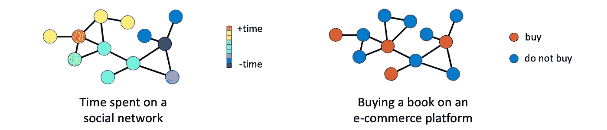
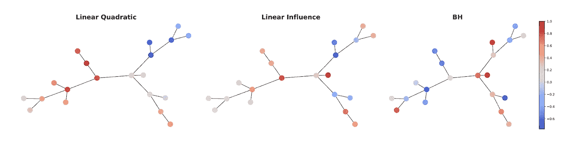
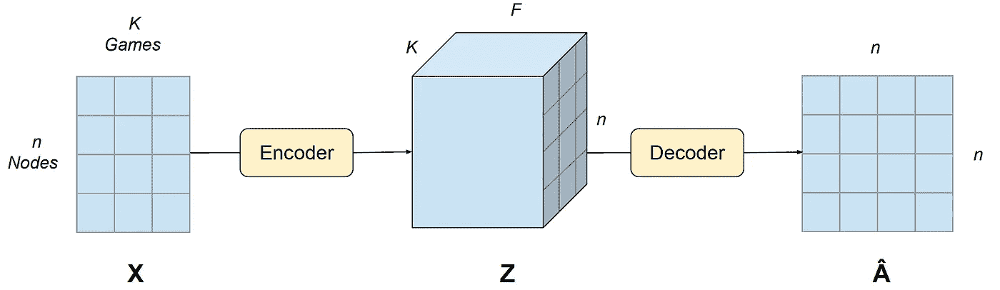
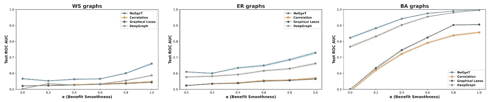
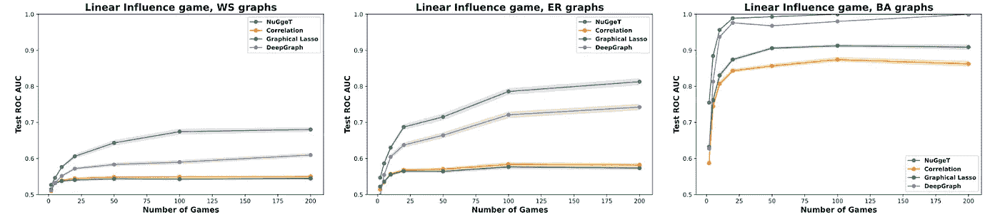
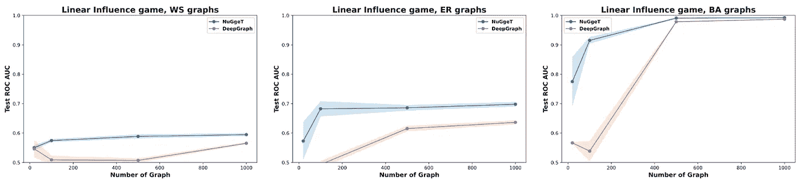
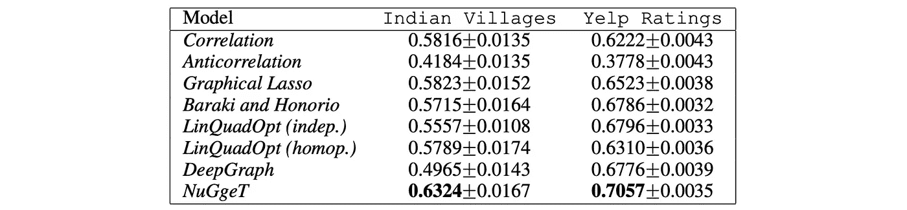

# 学习网络游戏

> 原文：[`towardsdatascience.com/learning-network-games-29970aee44bb`](https://towardsdatascience.com/learning-network-games-29970aee44bb)

## 图论机器学习与博弈论

## 网络游戏是一个强大的工具，用于建模在网络上进行的个体或组织之间的战略互动，其中一个玩家的回报不仅依赖于他们自己的行动，还依赖于他们邻居的行动。这类游戏在经济学和社会科学中有广泛的应用，包括研究社会网络中的影响扩散、金融市场的动态以及国际关系中的联盟形成。网络游戏的研究通常假设已知底层网络结构，但这往往是不切实际的。最近，机器学习方法被提出来解决这个问题，通过利用玩家的观察行为来学习底层网络结构。在这篇博客文章中，我们概述了一种新颖的方法，它使用类似 Transformer 的架构来推断游戏的网络结构，而不需要明确知道与游戏相关的效用函数。

 [Michael Bronstein](https://michael-bronstein.medium.com/?source=post_page-----29970aee44bb--------------------------------)

·发布在 [Towards Data Science](https://towardsdatascience.com/?source=post_page-----29970aee44bb--------------------------------) ·阅读时间 10 分钟·2023 年 4 月 20 日

--

基于 Shutterstock 的插图。

*这篇文章由* [*Emanuele Rossi*](https://emanuelerossi.co.uk/) *共同撰写，并基于论文 E. Rossi 等人，"*[*学习推断网络游戏的结构*](https://proceedings.mlr.press/v162/rossi22a/rossi22a.pdf)*"（2022 年）ICML，与 Federico Monti、Yan Leng 和 Xiaowen Dong 合作。*

[博弈论](https://en.wikipedia.org/wiki/Game_theory)是一个用于建模和分析多个决策者相互作用的情况的数学框架，其中每个决策的结果都依赖于所有相关玩家的行动。在*网络游戏*中[1]，玩家通过网络（图）相互连接，游戏的结果不仅依赖于玩家的策略，还依赖于网络的结构。每个玩家都试图最大化他们的*效用函数*，在网络游戏中，这个函数不仅依赖于他们自己的行动，还依赖于邻居的行动。

*均衡行为* 是指一组策略，在这种策略下，任何玩家都没有动机去改变自己的策略，前提是其他玩家的策略不变。换句话说，在均衡状态下，每个玩家的策略都是最优的，考虑到其他玩家的策略。在网络游戏中，均衡行为取决于图结构以及其他依赖于游戏的参数。

例如，考虑一个社交网络上的场景，个人可以决定在平台上花费多少时间。在这种情况下，他们的行为可能会受到网络上朋友的影响，这在玩家之间创造了战略上的相互依赖。例如，如果乔的朋友们在平台上花费了大量时间，乔可能会感受到自己使用平台的更大收益。

在不同的环境下，乔是一个电子商务平台的用户，他在决定是否购买一本书。如果他的朋友已经购买了这本书，乔可能会不太愿意买，因为他可以向朋友借这本书。这些例子说明了网络游戏中的行动如何受到邻近玩家行动的影响，从而导致战略上的相互依赖和均衡行为的出现。

网络游戏的示例。*左侧：* 如果乔的朋友们也在社交应用上花时间，乔可能会在应用上花更多的时间。右侧：如果他的朋友已经买了那本书，乔就更没有购买的动力，因为乔可以借到书。

# 从行动中推断网络

在上述例子中，我们假设了解乔的朋友，即游戏的网络结构。然而，在许多情况下，潜在的网络结构并不可直接获得。相反，我们可能只能观察到由代理之间的互动所产生的均衡行为。在这些情况下，一个关键问题是我们是否可以仅根据这些均衡行为重建网络结构。了解网络结构可以帮助预测行为并规划基于网络的干预措施，如营销活动或信息扩散。

之前已经显示，在关于效用函数和游戏类型的特定假设下，可以重建控制网络游戏的图 [2]。然而，这些假设可能不切实际，特别是当对正在进行的游戏了解甚少时。为此，在最近的一篇论文 [3] 中，我们开发了一种不需要关于效用函数形式的假设的方法，可以应用于广泛的网络游戏。

我们首先研究三种常见的网络游戏类型，*线性二次*、*线性影响* 和 *Barik-Honorio* [4]。这三种游戏因效用函数的形式不同而异，从而导致图中行动的平滑程度不同：

*eᵤᵥ* = *bᵤ xᵤ* — ½ *xᵤ²* + *β* Σ*ᵥ aᤥᵥ xᵤ xᵥ,*

*xᵤ* 是玩家 *u* 采取的连续行动，*bᵤ* 是玩家的 *边际效益*，*β* 是表示网络中邻居行为之间依赖强度的游戏参数，*aᵤᵥ* 是表示 *u* 和 *v* 之间连接强度的图的邻接矩阵中的条目。

以先前提到的在社交平台上花费时间的情景为例，方程的第一项将捕捉使用平台的个人效益（例如保持最新消息），第二项将表示这样做的成本（例如减少时间做其他更重要的事情），第三项将捕捉与朋友行为的相互依赖。特别是，如果用户在朋友也花时间使用该应用时有动机花更多时间使用它，则 *β* 将是正值 [5]。

*线性二次* 游戏的纯策略 [纳什均衡](https://en.wikipedia.org/wiki/Nash_equilibrium) 是

**x*** = (**I** — β**A**)ᐨ¹ **b**

**x*** 是一个维度为 *n* 的向量（等于玩家数量或图的节点数），**A** 是图的未知 *n*×*n* 邻接矩阵，**b** 是玩家的 *n* 维边际效益向量。

类似的公式可以推导出 *线性影响* 和 *Barik-Honorio* 游戏的平衡行动 **x*** 的公式，将这三种游戏泛化为形式 [6]

**x*** = *f*(**A**) *h*(**b**),

函数 *f*(**A**) 反映了网络中邻居行为的影响，并编码了游戏的具体效用函数，相反，*h*(**b**) 仅受个体特征影响，如单个玩家的边际效益。

游戏理论文献中常见的三种不同类型的具体实例。颜色表示玩家采取的行动，在这种情况下是归一化在 -1 和 +1 之间的连续值。

在我们的论文中，我们进一步展示了[7]玩家的动作包含图的谱信息，确认了仅从动作中重建图结构的可能性，并证明了我们下面概述的方法的合理性。

# 一种机器学习方法

我们将推断游戏网络结构视为一个机器学习问题。我们训练一个模型，将玩家的动作映射到游戏的网络结构中，而没有对基础效用函数的任何先验知识。为此，我们收集了来自使用相同效用函数的游戏中的动作和网络对(**X**, **A**)的数据集（尽管我们不知道这个函数）。这使我们能够避免对效用函数做出强假设，而是训练一个对其无关的模型。

这种方法在社会网络和决策数据仅存在于小规模人群的场景中特别有用，我们旨在学习从决策到较大人群网络结构的映射。例如，政府、公共机构和研究人员可以通过让个人提名他们的朋友来收集小规模人群的社会网络数据，然后使用提出的方法以成本效益的方式学习较大人群的网络互动。

我们的机器学习模型具有一个编码器-解码器架构，该架构对玩家和游戏的排列是不可变的，对应于*n*×*K*矩阵**X**的行和列，其中*K*表示游戏的数量。为实现这一点，我们修改了一个变换器模型，该模型在节点集合上自然是排列不变的，但在游戏集合上则不是。我们的编码器为每个玩家生成*K*个向量，如下所示：

玩家*u*在游戏*k*中的标量动作*xᵤₖ*首先通过一个非线性变换，得到一个*F*维向量。

**y***ᵤₖ* = ReLU(*xᵤₖ***w** + **b**).

我们接着计算未归一化的注意力分数。

*sᵤᵥ* = Σₖ **y***ᵤₖ*ᵀ **W** **W***ₖ* **y***ᵥₖ*

通过首先计算每个游戏的分数，使用带有查询和键权重矩阵**W**和**W***ₖ*的“学习点积”，然后对游戏进行求和，得到玩家*u*与玩家*v*之间的注意力分数。注意力分数

*αᵤᵥ* = softmax*ᵥ*(*uᵤᵥ*)

通过在第二维度上对未归一化分数进行 softmax，得到最终的*F*维嵌入。

**z***ᵤₖ* = *φ*(Σ*ᵥ* *αᵤᵥ***y***ᵥₖ*)

节点*u*在游戏*k*中的**y***ᵤₖ*向量，通过将其他节点的**y***ᵤₖ*向量按注意力分数加权后聚合得到，然后通过一个 2 层 MLP *φ*进行处理。

解码器通过聚合玩家*u*和*v*的*K*个向量来输出邻接矩阵每个条目的概率。这是通过对每个游戏的两个向量进行点积并求和，然后将结果输入多层感知机（MLP）来完成的。

*âᵤᵥ* = *ψ*(Σ*ₖ* **z***ᵤₖ* ⊙**z**ᵥ*ₖ*)

其中 ⊙ 表示点积，*ψ* 是一个 2 层 MLP。

生成的编码器在游戏集上也是排列不变的。

图示表示了我们模型的编码器-解码器架构。包含玩家行为的*n*x*K* 输入矩阵**X**被编码为*n*x*F*x*K* 张量**Z**，其中**z***ᵤₖ*是游戏*k*中节点*u*的嵌入，基于在同一游戏中其他玩家的行为进行计算。**Z**随后被解码为*n*×*n*的邻接矩阵**Â**，其中条目âᵤᵥ包含了*u*和*v*之间存在边的概率。

# 实验结果

我们进行了实验，以验证我们的方法在从玩家行为中学习网络结构的有效性，使用了合成数据集和真实数据集。作为基线，我们使用了 DeepGraph [9]（我们知道的唯一机器学习方法），特定于游戏类型的优化方法，以及节点之间行为的简单相关性和反相关性。

在合成数据集上，我们的模型（称为*NuGgeT*）在各种不同的游戏和图类型中始终优于以前的方法。

我们报告了在*Linear Influence*游戏中的结果（见论文中的*Linear Quadratic*和*Barik-Honorio*），在三种不同类型的合成图（Watts–Strogatz，Erdős–Rényi 和 Barabási–Albert）以及不同的边际效益平滑度（这种游戏的超参数）下。我们的方法称为 NuGgeT，始终优于基线方法。

我们模型在学习映射的性能取决于可用的游戏数量和训练图的数量，我们进行了消融实验来评估这两个因素。通常，更多的游戏和图对我们的方法有利。然而，我们观察到，在大多数情况下，模型性能在大约 100 个游戏和 500 个图时趋于饱和。

我们进一步在两个真实世界的数据集上验证了我们的方法：*Indian Villages* 数据集[10]和*Yelp Ratings* 数据集[11]。前者包含来自印度 75 个村庄的社会网络调查数据。每个村庄构成一个社会网络图，其中节点是家庭，边是自报的友谊。我们将房间数量、床位数量以及家庭在家庭相关决策中的其他决定视为行动。理由是，如果邻居采用了某种设施，村民往往通过采取相同措施来获得更高的收益，即遵循社会规范。

*Yelp Ratings* 数据集由用户对商家的评分和用户之间的社交连接组成。我们从原始数据中提取了 5000 个表示社区的子图，其中的行为是用户对 22 类商业的平均评分。

在两个现实世界的数据集上，NuGgeT 优于以往的方法，展示了我们的方法在游戏效用未知的情况下的有效性。特别是在*印度村庄*数据集上，NuGgeT 的增益尤其显著，而竞争方法 DeepGraph 完全无法学习。我们推测这可能是因为 NuGgeT 更加数据高效，得益于其内置的不变性，这一点通过对训练图数量的消融实验得到了确认。

NuGgeT 在我们测试的两个现实世界数据集上优于以往的方法，确认了其在游戏效用函数未知的情况下的有效性。

总之，我们的论文突出了博弈论与图机器学习之间的有益联系，特别是在网络游戏的背景下。通过开发一种新的机器学习方法来从观察到的游戏结果中推断网络结构，我们展示了利用博弈论思想来提升机器学习的潜力，反之亦然。展望未来，还有广阔的机会进一步探索网络游戏与图神经网络之间的联系，为这些领域带来更多激动人心的发展。

[1] 参见例如 M. O. Jackson 和 Y. Zenou，[网络上的游戏](https://web.stanford.edu/~jacksonm/GamesNetworks.pdf) (2014)，*博弈论手册* 4:95–163 以获取概述。

[2] Y. Leng 等，[在网络上学习二次博弈](http://proceedings.mlr.press/v119/leng20a/leng20a.pdf) (2020)，*ICML*。

[3] E. Rossi 等， [学习推断网络游戏的结构](https://proceedings.mlr.press/v162/rossi22a/rossi22a.pdf) (2022)，*ICML*。

[4] A. Barick 和 J. Honorio，[对连续动作图形游戏高效学习的可证明计算和统计保证](https://arxiv.org/pdf/1911.04225.pdf) (2019)，*arXiv*:1911.04225。

[5] 第一个项表示采取更大行动的边际收益，第二个项表示采取行动的成本，而第三个项表示与邻居行动的关系。如果*β*为正，则玩家采取更高行动的激励会随着其邻居也采取更高行动的数量增加而增加，这称为*战略互补关系*。另一方面，如果*β*为负，则玩家采取更高行动的激励会随着其邻居采取更高行动的数量增加而减少（*战略替代关系*）。

[6] 在这个公式中，选择 *f*(**A**)=(**I** — β**A**)ᐨ¹ 和 *h*(**b**)=**b** 产生一个线性二次博弈，*f*(**A**)=**A**ᐨ¹ 和 *h*(**b**)=**b** 产生一个线性影响博弈，*f*(**A**)=**u**₁（**A** 的最大特征向量）和 *h*(**b**)=**1** 产生一个 Barik-Honorio 类型的博弈。

[7] 我们论文中的第 3.3 节 [3]。

[8] 参见 “[The Illustrated Transformer](https://jalammar.github.io/illustrated-transformer/)” 博客文章，以获得对 Transformer 及查询和权重矩阵作用的直观解释。

[9] E. Belilovsky 等人，《[学习发现稀疏图模型](https://arxiv.org/abs/1605.06359)》（2017），ICML。

[10] 数据集与 A. Banerjee 等人的论文《[微型金融的扩散](https://www.science.org/doi/10.1126/science.1236498)》（2013），《科学》341(6144) 配套。论文的两位作者（Abhijit Banerjee 和 Esther Duflo）获得了 [2019 年经济学诺贝尔奖](https://www.nobelprize.org/prizes/economic-sciences/2019/press-release/)。

[11] [Yelp 开放数据集](https://www.yelp.com/dataset)。

*我们感谢* [*Federico Barbero*](https://federicobarbero.com/)*，* [*Fabrizio Frasca*](https://noired.github.io/)*，以及* [*Francesco Di Giovanni*](https://francescodgv.github.io/) *对本文的校对。有关图上深度学习的更多文章，请查看 Michael 的* [*其他文章*](https://towardsdatascience.com/graph-deep-learning/home) *，在 Towards Data Science 上* [*订阅*](https://michael-bronstein.medium.com/subscribe) *他的文章和* [*YouTube 频道*](https://www.youtube.com/c/MichaelBronsteinGDL)*，获得* [*Medium 会员资格*](https://michael-bronstein.medium.com/membership)*，或在* [*Twitter*](https://twitter.com/mmbronstein)* 上关注他。*
