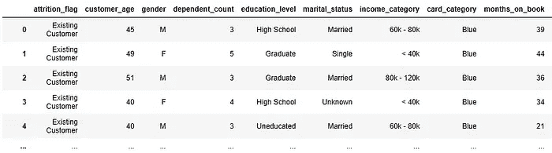
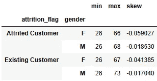
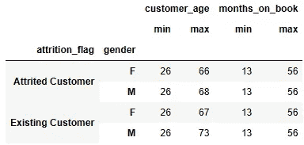
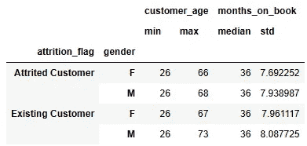
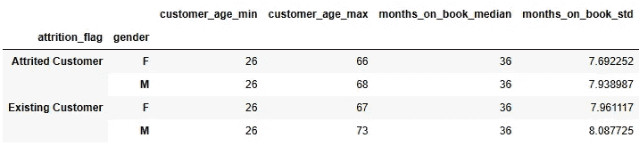
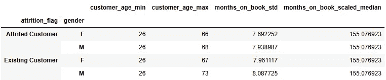

# 利用聚合的力量

> 原文：[`towardsdatascience.com/leverage-the-power-of-aggregate-ad5d69810c62`](https://towardsdatascience.com/leverage-the-power-of-aggregate-ad5d69810c62)

## 使用 pandas 聚合加速你的数据分析

[](https://bradley-stephen-shaw.medium.com/?source=post_page-----ad5d69810c62--------------------------------)[](https://towardsdatascience.com/?source=post_page-----ad5d69810c62--------------------------------) [Bradley Stephen Shaw](https://bradley-stephen-shaw.medium.com/?source=post_page-----ad5d69810c62--------------------------------)

·发表于 [Towards Data Science](https://towardsdatascience.com/?source=post_page-----ad5d69810c62--------------------------------) ·8 分钟阅读·2023 年 3 月 9 日

--


图片由 [Dan Hadar](https://unsplash.com/@danhadar?utm_source=medium&utm_medium=referral) 提供，[Unsplash](https://unsplash.com/?utm_source=medium&utm_medium=referral)

你是否曾经因为在相同（分段）特征上计算各种统计信息时编写重复的代码而感到沮丧？

那些试图计算各种不同（分段）特征上各种统计信息的相似代码片段让你迷失了方向——听起来很熟悉吗？

我理解你的痛苦。好吧，我曾经理解——现在不再了！所以在这篇后续文章中，我们将讨论你可以使用`agg`的简单（但强大）方法：

1.  对相同特征应用不同函数

1.  对特征集应用函数集

1.  使用元组获得更多灵活性

1.  使用来自其他包的函数，

我提到了特征的分组或分段。虽然你不一定要在`groupby`语句中使用`agg`，但我认为这样做可以提供更有趣的示例，并且与我之前的内容相呼应。说到这一点，如果你想要对`groupby`、`apply`和`transform`进行复习，我建议你阅读一下：

[](/turbocharge-your-data-manipulation-skills-3a26897ad6a?source=post_page-----ad5d69810c62--------------------------------) ## 提升你的数据处理技能

### 解锁 pandas 的 groupby、apply 和 transform 的强大功能

towardsdatascience.com

足够的无耻自我宣传——我们开始吧！首先，看看我们将要使用的数据。

# 数据

我们将继续使用从消费信用卡组合中收集的信息¹。

我对列名称和格式做了一些修改，但数据其余部分保持不变：



图片由作者提供

数据包含各种分类特征（例如教育水平）和数值特征（例如客户年龄）。

数据中包含的特征比上面的快照所示的更多；如果我们在下面使用一些“新”特征，不要感到惊讶！

# 聚合

… 或 `agg` 。

我认为文档对 `agg` 的强大功能描述得不够充分：

> 使用一个或多个操作在指定轴上进行聚合。

这实际上没有说明的是，`agg` 是一种非常灵活的函数，提供了多种方法来将多个函数应用于同一特征，或将多个函数应用于多个特征。它可以与或不与 `groupby` 语句一起使用，并可以在行或列轴上应用。它也不挑剔函数的来源或定义方式。

开始吧！

*附注：我们也可以使用* `agg` *将相同的函数应用于多个特征，但通过直接使用该函数或通过* `apply` *语句可以更轻松地实现。*

## 在同一特征上使用多个函数

让我们看看如何计算每个客户和性别细分中的客户年龄的最小值、最大值和偏度。

以下示例中使用的函数仅用于演示目的。一些函数——如偏度——对某些读者可能是新的，而其他函数——如`scaled_median`——则完全是虚构的。

*附注：“偏度”是一个统计学概念，用于衡量分布固有的非对称程度。*

```py
# set up
segments = ['attrition_flag','gender']
feature = 'customer_age'
functions = ['min','max','skew']

# apply it
df.groupby(segments)[feature].agg(functions)
```

… 这将给出：



图片来源：作者

相当直接，对吧？只需注意几点：

1.  我已经费心明确了每个细分、特征和函数的具体使用方法，通过在应用前对每个进行定义。这主要是为了提供一个清晰的示例，所以可以自由地简化你的代码。

1.  我们使用内置的 `pandas` 函数，因此可以通过其名称引用它们（因此使用字符串形式进行指定）。稍后我们将看到如何使用来自其他包的函数以及自定义函数，包括 lambda 函数。

1.  我们在 `agg` 中提供要应用的函数列表。如果需要，我们可以在列表中添加更多函数。

让我们更深入一点，开始将各种函数应用于多个不同的特征。

## 在多个特征上使用多个函数

`agg` 的真正优势——一次性生成多种汇总统计信息。

与 Python 中的大多数事物一样，这里有多种方法可以做到这一点。我们将在这里介绍两种不同的方法。首先是使用列表。

```py
# set up
segments = ['attrition_flag','gender']
features = ['customer_age','months_on_book']
functions = ['min','max']

# apply
df.groupby(segments)[features].agg(functions)
```

… 这将给出：



图片来源：作者

这应该与你之前看到的相当熟悉——我们不是将各种函数应用于单一特征，而是将相同的函数应用于多个特征。唯一的真正区别是我们在列表中指定特征。

那么，如何将多个不同的函数应用于各种特征呢？为此，我们需要一个字典。

```py
# set up
segments = ['attrition_flag','gender']
functions = {
    'customer_age':['min','max'],
    'months_on_book':['median','std']
}

# apply
df.groupby(segments).agg(functions)
```

… 这就产生了：



图片由作者提供

注意使用带有函数列表的字典来应用时，我们在应用内容上有更多的灵活性？很棒！

在这个示例中，我们只看到两个函数应用于两个特征。当然，我们可以将其更改为将任意多个函数应用于任意多个特征。我们只需记住字典参数的格式：特征名称应指定为字典键，(函数的) 列表应作为字典值提供。

## 更多的元组，更多的灵活性

我们在上面看到，使用列表和元组中的`agg`调用返回一个具有层次索引³（或在术语中称为`MultiIndex`）的`DataFrame`。

如果这正是你想要的，那当然没问题。但我喜欢简单的东西，我也喜欢控制我的列名。

所以我们将切换到使用元组，这将：

1.  返回一个具有平坦索引的`DataFrame`。（忘记那些`reset_index()`调用）。

1.  允许我们指定每个返回列的名称。

可以说，后一点可能是使用元组的一个更强大和有用的动机。

好了，闲话不多说。让我们用元组重写上述示例。

```py
# set up
segments = ['attrition_flag','gender']

# apply
df.groupby(segments).agg(
    customer_age_min = ('customer_age','min'),
    customer_age_max = ('customer_age','max'),
    months_on_book_median = ('months_on_book','median'),
    months_on_book_std = ('months_on_book','std')
)
```

产生：



图片由作者提供

使用元组可以让我们指定汇总特征的名称。如果你想对`DataFrame`的名称非常具体，这非常有用。

这个调用`agg`的语法有点不寻常。在这里，我们在元组之外指定结果列的名称，然后在元组内提供被汇总特征的名称（以字符串格式）以及函数。伪代码中，这类似于`结果名称 = (特征名称, 函数)`。

我们仍在使用内置的`pandas`功能，因此可以通过名称（以字符串格式）引用它们。让我们看看如何使用其他函数。

## 异域函数

我们经常需要使用更异域或定制的汇总函数。

我对“异域”这个词有些宽泛——我实际上是指来自其他包的函数。然而，有时我们确实需要使用我们自己编写的真正定制的功能。

那么，开始吧！我们将结合一些想法，将各种函数应用于每个`attrition_flag` x `gender`段。

```py
# exotic functions
import numpy as np

# bespoke function
def scaled_median(s):
    # scales Series median by ratio of Series max to Series min
    return s.median() * s.max() / s.min()

# segments
segments = ['attrition_flag','gender']

# apply
df.groupby(segments).agg(
    customer_age_min = ('customer_age',np.min),
    customer_age_max = ('customer_age',np.max),
    months_on_book_std = ('months_on_book',np.std),
    months_on_book_scaled_median = ('months_on_book',scaled_median)
)
```

这就产生了：



图片由作者提供

我们逐步进行：

1.  我们从`numpy`中提取一些函数。这里没有什么“异域”的东西——这些只是`numpy`对最小值、最大值和标准差的实现。别忘了导入包含“异域”函数的包！

1.  我们创建了一个名为`scaled_median`的自定义函数。这里也没什么特别的，因为这是一个为了演示目的而编造的函数。

1.  对 `agg` 的调用使用了元组方法。这里没有太多新内容，除了我们引用函数的方式。由于我们不再使用内置方法，因此不能按名称调用它们：而是提供它们的名称及其来源（例如`np.min`）。

如果你想更具 Python 风格，可以用 lambda 函数替代函数的更正式定义；我在这里没有这么做，是出于格式化的考虑。

就到这里，回顾一下我们所做的工作。

# 总结

这一次，我们已经看到如何使用`agg`将不同的函数应用于相同（分组）的特征。

我们扩展了将一组函数应用于一组（分组）特征的内容；我们看到可以使用列表、字典和元组来做到这一点。示例展示了每种方法的优点。

最后但同样重要的是，我们看到如何利用其他包中的函数和我们自己编写的自定义函数。

正如我们所看到的，`agg` 的真正优势在于将多个函数应用于多个特征。这对于探索性数据分析、特征工程和生成汇总统计非常有用。

在进行特征工程时，我们经常需要将数据片段转换的结果映射回原始数据。关于是否可以使用 `agg` 来实现这一点常常存在一些困惑——实际上不能。如果我们需要将结果广播回原始数据，我们需要使用 `transform`，尽管这也有其自身的限制。如果你需要进行大量转换，你可能会考虑使用 `agg`，然后手动将结果与原始数据连接起来。

一如既往，感谢你的阅读。希望这里有一些有用的提示，也请告诉我你使用的任何实用技巧！

如果你对其他 `pandas` 和 `matplotlib` 技巧感兴趣，你可能也会对以下内容感兴趣：

[](/make-your-tables-look-glorious-2a5ddbfcc0e5?source=post_page-----ad5d69810c62--------------------------------) ## 让你的表格看起来光辉夺目

### 简单的格式化技巧，让你的 pandas DataFrame 准备好展示

[towardsdatascience.com

… 和

[](/make-your-charts-look-glorious-9ce3fa310b70?source=post_page-----ad5d69810c62--------------------------------) ## 让你的图表看起来光辉夺目

### 让 matplotplib 图表准备好展示的简单技巧

[towardsdatascience.com

# 参考文献和资源

1.  [zhyli. (2020). 预测流失的信用卡客户 [数据集]. Zenodo.](https://doi.org/10.5281/zenodo.4322341)，在 [Creative Comons — Attribution 4.0 International](https://creativecommons.org/licenses/by/4.0/legalcode) 许可下提供。

1.  [pandas.DataFrame.agg — pandas 1.5.3 文档 (pydata.org)](https://pandas.pydata.org/docs/reference/api/pandas.DataFrame.agg.html)

1.  [多重索引 / 高级索引 — pandas 1.5.3 文档 (pydata.org)](https://pandas.pydata.org/docs/user_guide/advanced.html)
