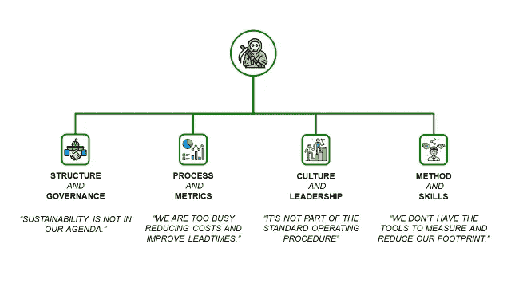
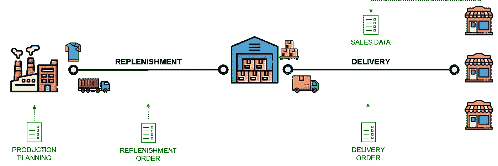
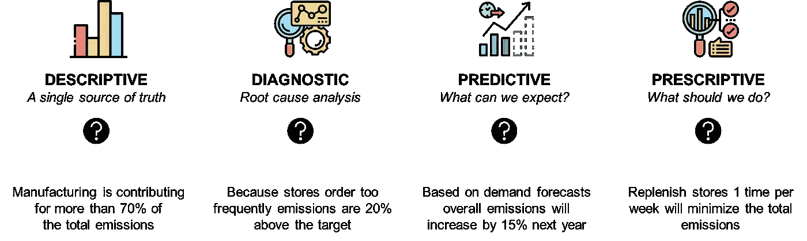
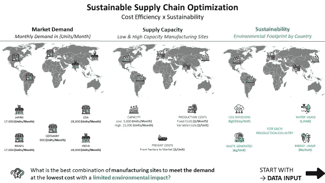
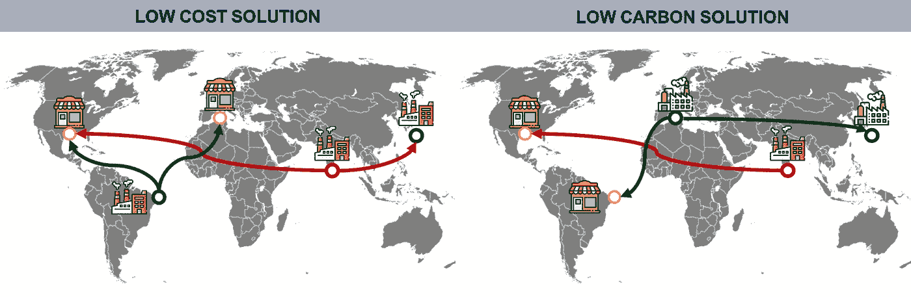
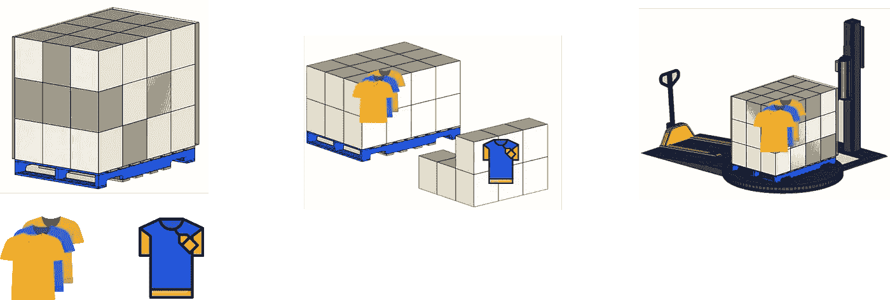
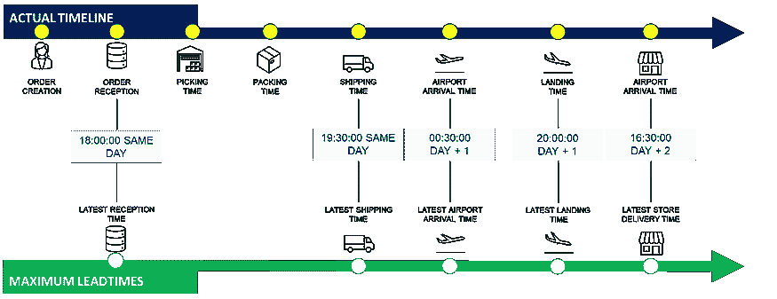
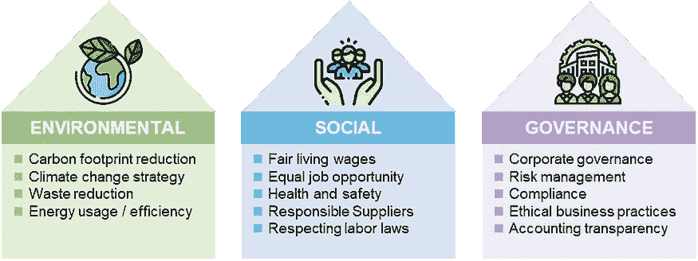

# 利用数据分析进行可持续商业转型

> 原文：[`towardsdatascience.com/leveraging-data-analytics-for-sustainable-business-transformation-cfd8d71f97f5?source=collection_archive---------0-----------------------#2023-03-22`](https://towardsdatascience.com/leveraging-data-analytics-for-sustainable-business-transformation-cfd8d71f97f5?source=collection_archive---------0-----------------------#2023-03-22)

## 了解如何使用数据分析克服扩展绿色举措的挑战，这些举措阻碍了组织实现可持续发展目标。

[](https://s-saci95.medium.com/?source=post_page-----cfd8d71f97f5--------------------------------)[](https://towardsdatascience.com/?source=post_page-----cfd8d71f97f5--------------------------------) [Samir Saci](https://s-saci95.medium.com/?source=post_page-----cfd8d71f97f5--------------------------------)

·

[关注](https://medium.com/m/signin?actionUrl=https%3A%2F%2Fmedium.com%2F_%2Fsubscribe%2Fuser%2Fbb0f26d52754&operation=register&redirect=https%3A%2F%2Ftowardsdatascience.com%2Fleveraging-data-analytics-for-sustainable-business-transformation-cfd8d71f97f5&user=Samir+Saci&userId=bb0f26d52754&source=post_page-bb0f26d52754----cfd8d71f97f5---------------------post_header-----------) 发表在 [Towards Data Science](https://towardsdatascience.com/?source=post_page-----cfd8d71f97f5--------------------------------) · 12 分钟阅读 · 2023 年 3 月 22 日[](https://medium.com/m/signin?actionUrl=https%3A%2F%2Fmedium.com%2F_%2Fvote%2Ftowards-data-science%2Fcfd8d71f97f5&operation=register&redirect=https%3A%2F%2Ftowardsdatascience.com%2Fleveraging-data-analytics-for-sustainable-business-transformation-cfd8d71f97f5&user=Samir+Saci&userId=bb0f26d52754&source=-----cfd8d71f97f5---------------------clap_footer-----------)

--

[](https://medium.com/m/signin?actionUrl=https%3A%2F%2Fmedium.com%2F_%2Fbookmark%2Fp%2Fcfd8d71f97f5&operation=register&redirect=https%3A%2F%2Ftowardsdatascience.com%2Fleveraging-data-analytics-for-sustainable-business-transformation-cfd8d71f97f5&source=-----cfd8d71f97f5---------------------bookmark_footer-----------)

(图片来源：作者)

目前，财务法规推动公司承诺到 2030 年减少碳排放。

> 数据分析如何帮助组织克服可持续供应链管理的障碍？

然而，对于组织来说，扩大绿色举措和实现可持续发展目标可能面临挑战。


将供应链定义为多个参与方交换物料和信息流 — （作者提供的图片）

主要挑战在于供应链管理处于**复杂系统**的核心，涉及制造和物流团队。


不同团队专注于优化其在供应链中的操作范围 — （作者提供的图片）

由于这些团队有时不习惯为共同目标一起工作，许多公司在绿色转型的起步阶段陷入困境。

> 我们如何通过数据解锁这些情况？

《哈佛商业评论》文章“[可持续发展努力如何崩溃？](https://hbr.org/2022/09/how-sustainability-efforts-fall-apart)”深入探讨了公司在实施可持续发展举措时常见的挑战。

本文将探讨数据分析如何通过聚焦**供应链绿色转型的四个“隐藏敌人”**来帮助克服这些挑战。

💌 免费获取最新文章： [通讯](https://www.samirsaci.com/#/portal/signup)

📘 供应链分析的完整指南：[分析备忘单](https://bit.ly/supply-chain-cheat)

```py
Summary
I. How Sustainability Efforts Fall Apart?
  1\. The "Four Hidden Enemies"
  2\. Support of Supply Chain Analytics
II. Leveraging Data Analytics
  1\. Hidden Enemy 1: Structure and Governance
  *Solution 1: Descriptive Analytics*
  2\. Hidden Enemy 2: Processes and metrics
 *Solution 2: Adapted Optimization Models*  3\. Hidden Enemy 3: Culture and Leadership
  *Solution 3: Diagnostic Analytics to Address Cultural Barriers*
  4\. Hidden Enemy 4: Methods and Skills
  *Solution 4: Workforce Training* III. Conclusion
  1\. Data is your best ally
  2\. Drive an ESG-led Business Transformation
```

# 可持续发展努力如何崩溃？

## 绿色转型的“四个隐藏敌人”

可持续性已经成为商业运营的关键方面，因为公司面临着越来越大的压力，需要解决环境和社会问题以进行 ESG 报告。

然而，实施碳足迹减少和有效的可持续性举措的路线图往往说起来容易做起来难。

文章“[可持续发展努力如何崩溃](https://hbr.org/2022/09/how-sustainability-efforts-fall-apart)”揭示了公司在追求可持续发展时面临的关键障碍，重点关注四个“隐藏的敌人”。

+   **结构和治理**：孤立的可持续性限制了影响力。

+   **流程和指标**：不可持续的指标阻碍进展。

+   **文化和领导力**：旧观念挑战转型。

+   **方法和技能**：传统工具阻碍变化。


绿色转型的四个隐藏敌人 — （作者提供的图片）

> 你听说过供应链分析吗？

## 支持供应链分析以促进可持续性举措

**供应链**可以定义为多个参与方交换**物料** **和信息流以满足**客户需求。



将供应链定义为多个参与方交换物料和信息流 — （作者提供的图片）

在之前的文章中，**供应链分析**被介绍为一组帮助公司利用系统生成的数据获得洞察并优化操作的工具。

> 分析的不同类型是什么？



发现四种供应链分析类型 — （图片来源：作者）[[原文](https://www.samirsaci.com/what-is-supply-chain-analytics-2/)]

这也可以是解决上述障碍的一个极好的支持：

+   **描述性分析**通过提供供应链的[单一真实来源](https://youtu.be/0AZfe7DuT_U)来提供可视性。

+   **诊断性分析**通过部署[自动化事件根本原因分析](https://youtu.be/V6qnuZ-QcKE)过程。

+   **预测性分析**通过支持[客户需求预测](https://www.samirsaci.com/machine-learning-for-retail-sales-forecasting-features-engineering/)、供应能力和 CO2 排放量。

+   **规范性分析**通过支持[决策过程](https://youtu.be/gF9ds3CH3N4)来优化资源利用。

在接下来的章节中，我们将详细探讨每个**“隐藏敌人”**，并解释数据分析如何帮助克服这些挑战。

# 利用数据分析实现绿色转型。

## 隐藏的敌人 1：结构和治理

组织结构的孤岛性质可能会阻碍可持续性的有效合作。

确实，**可持续性**往往被**降级到一个单独的公司部门**，导致其与关键的公司职能隔离。

这**限制了可持续性**从而无法转变整个组织，并限制了其在公司中的力量和相关性。


孤岛优化对供应链管理中可持续性努力的影响 — （图片来源：作者）

运营经理将始终关注**她的操作范围**：

+   店长每次订单保持低数量*（并增加频率）*以**最小化他们的库存**。

+   供应计划人员推动[**更多生产批次**](https://youtu.be/130AKb2DejM) *（每批次低数量）*以**获得足够的灵活性**。

+   财务经理总是鼓励[**库存减少**](https://youtu.be/U1HqjHZzgq4)。

+   商业团队主张**高库存覆盖**以避免因缺货而造成的销售损失。

+   仓库操作必须[**应对这些约束**](https://youtu.be/KR_ziEiPcDk)

> 谁负责减少 CO2 排放？每个人都应该负责，但实际上没有人负责。

这种缺乏合作严重影响了[运输](https://youtu.be/lhDBTlsGDVc)和[生产计划](https://youtu.be/130AKb2DejM)的效率，阻碍了可持续性努力的进展。

> 如果我们优化销售和供应链之间的协作会怎么样？

欲了解更多详情，您可以查看

+   一个实际案例研究[绿色库存管理](https://www.samirsaci.com/green-inventory-management-case-study/)以展示**订单频率**对**CO2 排放**的影响。

+   [生产计划优化](https://youtu.be/130AKb2DejM)以了解批次数量对生产成本的影响。

因此，可持续性**被视为可有可无**或影响[每个团队表现](https://youtu.be/ssdni_n6HDc)的营销工具。

> 首先，让我们测量整个价值链的实际表现。

## 解决方案 1：描述性分析

需要**端到端的方法**来提高效率，找到合适的平衡，从而实现最小的环境足迹。

> 数据不会说谎，人会。
> 
> — Ernie Lindsey

通过连接不同的系统（[ERP](https://i.ytimg.com/vi/v0_R8P6MLQ0/hq720_2.jpg?sqp=-oaymwEdCJUDENAFSFXyq4qpAw8IARUAAIhCcAHAAQbQAQE%3D&rs=AOn4CLArbDAyaV0I1sxRtTS95JeTK1TOlg), [WMS](https://www.youtube.com/shorts/MW1QRJs3iuE), CRM 等），描述性分析解决方案可以建立**一个中央真实来源**，贯穿整个供应链。

📊 **示例 1：生命周期评估**


评估产品在其生命周期中的环境影响 — （作者提供的图片）

生命周期评估（LCA）是一种评估产品在其整个生命周期中环境影响的方法。


使用的数据类型 — （作者提供的图片）

在我们的例子中，它可以用来估算产品的足迹，考虑到端到端的供应链过程。


分析供应链中的排放和资源使用，以获得可持续性见解 — （作者提供的图片）

并识别关键点，以提供基于数据的诊断，打破孤岛，促进跨部门协作。

1.  每单位的 CO2e 总排放成为所有团队的共同 KPI。

1.  这个 KPI 可以纳入所有经理的绩效评估中。

> 店长：如果我减少订货频率，运输团队可以优化卡车装载。

这将鼓励跨职能的协作，以支持由可持续发展团队主导的倡议。

> 如果你不能测量它，你就不能管理它。
> 
> — W. Edwards Deming

因为这些指标是从**可信的数据源**构建的，经理们会更加主动地减少排放。

我们可以为整个供应链部门设定一个共同的排放减少目标。


实施数据驱动的协作行动以实现可持续供应链转型 — （作者提供的图片）

例如，

1.  我们希望将每单位生产的 CO2 排放总量减少 20%

1.  45%的排放来自运输和生产

1.  店长们将把他们的订货频率减少一半。

1.  供应计划员将增加补货订单数量并减少频率。

1.  [运输团队](https://youtu.be/PYkN24PMKd8)必须提供调整后的卡车尺寸

1.  [制造团队](https://youtu.be/130AKb2DejM)将减少生产运行次数

> 太好了！接下来是什么？

尽管描述性分析可以帮助打破信息孤岛，但传统的流程和指标仍可能构成重大障碍，这将引领我们进入下一个隐藏的敌人。

## 隐藏的敌人 2：流程和指标

可持续性很少被纳入公司的核心业务流程中。

它们设计于**利润是主要关注点的时代**，而环境和社会因素未被考虑。


供应链管理中的常见业务和运营 KPI — （图片来源：作者）

用于评估业务绩效的指标通常与成本、利润、市场份额或每股收益相关联。

> 一位运营经理对可持续性团队说：“我怎么能帮助你们减少 CO2 足迹呢？我已经在努力减少运输成本了。”

因此，传统的指标可能会通过优先考虑短期财务收益而非长期环境效益来中和可持续性举措。

> 如果我们切换目标函数会怎么样？
> 
> 从最小化成本到最小化 CO2eq 排放。

## 解决方案 2：调整优化模型

通过将可持续性指标纳入现有业务流程，公司可以开发出平衡财务和非财务目标的优化模型。

借助优化工具，持续改进工程师可以改进流程，朝向平衡利润和可持续性的最佳解决方案。

> 什麽是平衡成本和可持续性的最佳工厂网络？

目标是找到正确的参数，以优化特定指标，考虑外部和内部约束。



可持续供应链网络问题声明 — （图片来源：作者）

📊 **示例 2：可持续供应链网络优化**

[供应链优化](https://youtu.be/gF9ds3CH3N4)利用数据分析来寻找最佳的工厂和配送中心组合，以满足客户需求**。**

> 我们是应该在巴西还是葡萄牙生产以最小化水使用？

在这个经典的线性规划问题中，你的模型将选择正确的生产设施组合，以

+   遵守需求约束：工厂的供应应满足市场需求。

+   最小化生产和交付产品的总成本

这通常会选择位于偏远地区的工厂，因为生产成本较低，同时考虑到运输成本的重量。

> 如果我们想要最小化总 CO2 排放会怎样？


基于成本和基于 CO2 的供应链优化方法比较 — （图片来源：作者）

右侧，我们建议使用相同的模型，采用适应的目标函数以最小化总碳排放。



低成本解决方案与低碳解决方案的供应链网络设计 — （图像来源：作者）

通过这个简单的变化，我们完全改变了网络。

低碳解决方案推动通过将工厂增加到欧洲市场来实现生产本地化。

> **平衡的方法是可能的**，以保持商业竞争力。

你可以调整你的目标函数或添加约束，以将成本控制在一定阈值内。

然而，正如下一个隐藏的敌人所讨论的，旧有的思维方式和习惯仍然可能是变革的重大障碍。

## 隐藏的敌人 3：文化和领导力

旧有的思维方式和习惯可能是变革的重大障碍。

当领导层和运营团队未与可持续性和绿色转型目标对齐时，努力可能会遇到抵制或漠视。



异质托盘的卸货过程及其环境影响 — （图像来源：作者）

在组织内，我们可以发现不一致的价值观，这些价值观可能阻碍绿色供应链实践的采用。

例如，这是一个在快消品公司项目中看到的例子

+   工厂将包含多个参考项的托盘（异质托盘）发送到仓库**因为这样对他们更方便。**

+   仓库接收团队必须拆除塑料薄膜，分类物品，重新打托盘，并再次包装。

这会增加额外的工作，**增加薄膜消耗**和**产生废料**。

因此，培养支持性的组织文化和致力于可持续性的强有力领导至关重要。

## 解决方案 3：诊断分析以应对文化障碍

诊断分析专注于识别特定过去事件或趋势的原因。

它涉及检查历史数据以确定导致特定结果的因素。

> 可持续性团队对工厂物流经理说：“根据我们的诊断工具：我们每年额外消耗 2 吨薄膜，因为你们将物品混合在同一托盘中。”

这些工具可以帮助你的组织通过**客观的外部评估**理解失败的原因。

📊 **示例 3：供应链控制塔**

一个 [供应链控制塔](https://youtu.be/V6qnuZ-QcKE) 传统上被定义为一组与各种系统连接的仪表板，利用数据监控供应链中的关键事件。



利用供应链控制塔进行高效分销网络管理 — （图像来源：作者）

如果你以时尚零售公司的分销网络监控为例，

+   绩效指标是 [按时按量](https://www.youtube.com/watch?v=qhLqu6M7lcA)，也称为 OTIF

+   诊断算法进行根本原因分析，以了解谁对延迟负责。


使用数据分析进行晚交货根本原因分析过程—（图像由作者提供）

这个想法是比较每个过程的实际交付时间和服务水平协议设定的目标。

欲了解更多详情，

+   “什么是供应链控制塔？”，[视频教程](https://www.youtube.com/watch?v=V6qnuZ-QcKE&t=269s)

> 我们可以实施可持续性控制塔吗？

这种方法可以轻松地适应环境足迹监测。

1.  选择要跟踪的指标：*例如，CO2 排放*

1.  设定每个过程的排放目标：*例如，工厂仓库补货的目标为 160（克 CO2e/单位）*

1.  使用生命周期评估（LCA）方法比较实际排放与目标。

> **根本原因分析过程** 用于发现偏差，但还需要额外的分析来找到根本原因。

回到我们的包装膜示例，我们会看到

1.  仓库中包装膜的消耗偏差。

1.  操作团队的解释：“这归因于异质托盘的去托盘化。”

1.  最终的根本原因是工厂的托盘化方法。

在解决了文化障碍之后，我们可以集中精力于推动绿色转型所需的方法和技能。

## 隐藏的敌人 4：方法和技能

传统工具和技能集可能需要改进，以管理可持续性计划的复杂性。

缺乏使用分析的专业知识可能会阻碍组织利用数据来优化供应链过程，并做出基于数据的可持续性和绿色转型决策。

## *解决方案 4：员工培训*

它并不是直接与特定类型的分析相关联，但表明需要装备员工掌握利用数据分析的必要技能。

通过提供分析工具的培训计划，公司可以培养能够推动可持续性计划的员工队伍。

例如，我在这个简短的教程中分享了我学习 Python 和 VBA 用于供应链分析的经验。 👇

对隐藏敌人及其解决方案的快速回顾使您信服于数据推动绿色转型的力量。

# 结论

## 数据是你最好的盟友。

数据分析可以成为克服阻碍可持续性计划的“隐藏敌人”的强大盟友。

> 对于每一个敌人，我们找到了解决方案。

这些不同类型的供应链分析可以帮助公司打破信息孤岛，确保所有部门朝着减少足迹的目标迈进。

要查看更多使用数据分析进行供应链可持续性的案例研究，您可以观看这个视频：👇

> 如何衡量您举措的影响？

## 推动以 ESG 为导向的商业转型。

所有这些举措都可以对您的 ESG 评分产生积极影响。

环境、社会和治理（ESG）报告方法披露了公司的治理结构、社会影响和生态足迹。



ESG 支柱展示 — （图片来源：作者）

这三个维度提供了对公司可持续性和道德影响的深入理解，这可以通过数据驱动的举措来改善。


报告类别示例 — （图片来源：作者）

考虑到这些报告具有战略性，说服高层管理人员投资于绿色举措是一种有效的方式。

> 我们如何利用分析生成这个报告？

我在下面链接的文章中提出了几种工具和方法，用于提取和处理数据以生成这些评分。👇

[](/what-is-esg-reporting-d610535eed9c?source=post_page-----cfd8d71f97f5--------------------------------) ## 什么是 ESG 报告？

### 利用数据分析进行公司全面有效的环境、社会和治理报告

towardsdatascience.com

> **我们为什么要这样做？[…]**
> 
> **你听说过可持续发展目标吗？**

可持续发展目标（SDGs）是联合国制定的**17 个目标**，旨在应对全球挑战。


5 类可持续发展目标 — （图片来源：作者）

> 作为数据科学家，你如何帮助你的公司为这些目标做出贡献？

在这篇文章中查看我对数据分析如何支持联合国可持续发展目标的见解，

[](https://s-saci95.medium.com/what-are-the-sustainable-development-goals-sdgs-988a1eb2b62b?source=post_page-----cfd8d71f97f5--------------------------------) [## 什么是可持续发展目标（SDGs）

### 将全球可持续发展倡议与公司供应链数字化转型结合起来，使用数据科学

s-saci95.medium.com](https://s-saci95.medium.com/what-are-the-sustainable-development-goals-sdgs-988a1eb2b62b?source=post_page-----cfd8d71f97f5--------------------------------)

# 关于我

让我们在[Linkedin](https://www.linkedin.com/in/samir-saci/)和[Twitter](https://twitter.com/Samir_Saci_)上联系。我是一名供应链工程师，利用数据分析改善物流操作并降低成本。

如果你对数据分析和供应链感兴趣，可以看看我的网站。

[](https://samirsaci.com/?source=post_page-----cfd8d71f97f5--------------------------------) [## Samir Saci | 数据科学与生产力

### 专注于数据科学、个人生产力、自动化、运筹学和可持续发展的技术博客…

samirsaci.com](https://samirsaci.com/?source=post_page-----cfd8d71f97f5--------------------------------)

💡 在 Medium 上关注我，获取更多关于 🏭 供应链分析、🌳 可持续性和 🕜 生产力的文章。

# 参考文献

+   “可持续性努力为何会崩溃？”，[哈佛商业评论](https://hbr.org/2022/09/how-sustainability-efforts-fall-apart)，Elisa Farri、Paolo Cervini 和 Gabriele Rosani

+   可持续物流 — 减少仓库消耗品，[个人博客](https://www.samirsaci.com/)，[Samir Saci](https://medium.com/u/bb0f26d52754?source=post_page-----cfd8d71f97f5--------------------------------)

+   “什么是供应链控制塔？”，[Towards Data Science](https://medium.com/towards-data-science/automated-supply-chain-control-tower-with-python-17dbf93a18d0)，[Samir Saci](https://medium.com/u/bb0f26d52754?source=post_page-----cfd8d71f97f5--------------------------------)

+   “什么是供应链分析？”，Towards Data Science，[Samir Saci](https://medium.com/u/bb0f26d52754?source=post_page-----cfd8d71f97f5--------------------------------)

+   “什么是生命周期评估？LCA”，Towards Data Science，[Samir Saci](https://medium.com/u/bb0f26d52754?source=post_page-----cfd8d71f97f5--------------------------------)

+   “4 个影响深远的项目来开始你的供应链数据科学之旅”，Towards Data Science，[Samir Saci](https://medium.com/u/bb0f26d52754?source=post_page-----cfd8d71f97f5--------------------------------)
