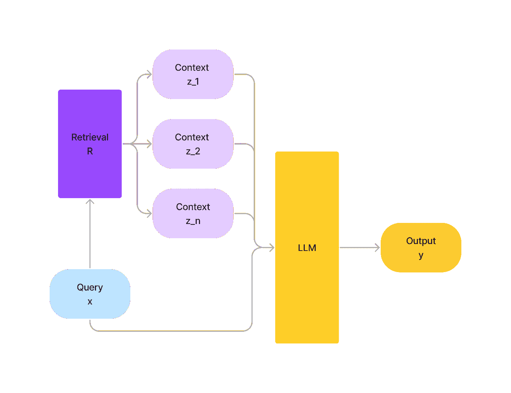

# 利用 LLM 进行信息检索：一个简单的演示

> 原文：[`towardsdatascience.com/leveraging-llms-with-information-retrieval-a-simple-demo-600825d3cb4c?source=collection_archive---------7-----------------------#2023-08-14`](https://towardsdatascience.com/leveraging-llms-with-information-retrieval-a-simple-demo-600825d3cb4c?source=collection_archive---------7-----------------------#2023-08-14)

## 将问答型 LLM 与检索组件集成的演示

 [Thao Vu](https://medium.com/@vuphuongthao9611?source=post_page-----600825d3cb4c--------------------------------)

·

[关注](https://medium.com/m/signin?actionUrl=https%3A%2F%2Fmedium.com%2F_%2Fsubscribe%2Fuser%2Fa836aac352ca&operation=register&redirect=https%3A%2F%2Ftowardsdatascience.com%2Fleveraging-llms-with-information-retrieval-a-simple-demo-600825d3cb4c&user=Thao+Vu&userId=a836aac352ca&source=post_page-a836aac352ca----600825d3cb4c---------------------post_header-----------) 发布于 [Towards Data Science](https://towardsdatascience.com/?source=post_page-----600825d3cb4c--------------------------------) ·7 分钟阅读·2023 年 8 月 14 日

--

图像由作者使用稳定扩散技术生成

大型语言模型（LLM）能够存储大量的事实数据，但其能力受到参数数量的限制。此外，频繁更新 LLM 是昂贵的，而旧的训练数据可能使 LLM 生成过时的回应。

为了应对上述问题，我们可以通过外部工具来增强 LLM。本文将分享如何将 LLM 与检索组件集成以提高性能。

# 检索增强（RA）

检索组件可以为 LLM 提供更为最新和准确的知识。给定输入***x***，我们希望预测输出***p(y|x)***。从外部数据源***R***中，我们检索与***x***相关的上下文列表***z***=(***z_1, z_2,..,z_n)***。我们可以将**x**和***z***结合起来，并充分利用***z***的丰富信息来预测***p(y|x,z)****。*此外，保持**R**的最新状态也要便宜得多。*

增强检索管道（图由作者提供）

# 使用维基百科数据+ChatGPT 的 QA 演示
