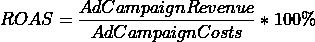
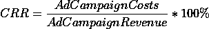

# 利用机器学习开发有效的营销策略

> 原文：[`towardsdatascience.com/leveraging-machine-learning-for-effective-marketing-strategy-development-99b1b887f2f5?source=collection_archive---------9-----------------------#2023-08-01`](https://towardsdatascience.com/leveraging-machine-learning-for-effective-marketing-strategy-development-99b1b887f2f5?source=collection_archive---------9-----------------------#2023-08-01)

## 使用机器学习成功构建营销策略的技巧与窍门

[](https://medium.com/@elenek?source=post_page-----99b1b887f2f5--------------------------------)[](https://towardsdatascience.com/?source=post_page-----99b1b887f2f5--------------------------------) [Elena K.](https://medium.com/@elenek?source=post_page-----99b1b887f2f5--------------------------------)

·

[关注](https://medium.com/m/signin?actionUrl=https%3A%2F%2Fmedium.com%2F_%2Fsubscribe%2Fuser%2F1a63363b910a&operation=register&redirect=https%3A%2F%2Ftowardsdatascience.com%2Fleveraging-machine-learning-for-effective-marketing-strategy-development-99b1b887f2f5&user=Elena+K.&userId=1a63363b910a&source=post_page-1a63363b910a----99b1b887f2f5---------------------post_header-----------) 发表在 [Towards Data Science](https://towardsdatascience.com/?source=post_page-----99b1b887f2f5--------------------------------) · 8 分钟阅读 · 2023 年 8 月 1 日 [](https://medium.com/m/signin?actionUrl=https%3A%2F%2Fmedium.com%2F_%2Fvote%2Ftowards-data-science%2F99b1b887f2f5&operation=register&redirect=https%3A%2F%2Ftowardsdatascience.com%2Fleveraging-machine-learning-for-effective-marketing-strategy-development-99b1b887f2f5&user=Elena+K.&userId=1a63363b910a&source=-----99b1b887f2f5---------------------clap_footer-----------)

--

[](https://medium.com/m/signin?actionUrl=https%3A%2F%2Fmedium.com%2F_%2Fbookmark%2Fp%2F99b1b887f2f5&operation=register&redirect=https%3A%2F%2Ftowardsdatascience.com%2Fleveraging-machine-learning-for-effective-marketing-strategy-development-99b1b887f2f5&source=-----99b1b887f2f5---------------------bookmark_footer-----------)

图片来源于 [unsplash.com](https://unsplash.com/photos/HOrhCnQsxnQ)

*营销归因模型*今天被广泛应用于构建营销策略。这些策略基于将信用分配给客户旅程中的每一个接触点。虽然有很多不同类型的模型，但它们可以分为两组：*单触点归因模型*和*多触点归因模型*。通常，你可以轻松解释和实施这些模型。它们在少数情况下可能甚至很有用。然而，大多数模型本身无法构建一个稳健的营销策略。问题在于所有这些模型要么基于不适用于某些数据/行业的规则，要么依赖有限的数据量，从而导致有价值的见解丧失。要了解更多关于*营销归因模型*的类型，可以查看我的[上一篇文章](https://medium.com/@elenek/the-future-of-marketing-attribution-integrating-machine-learning-for-enhanced-insights-2ffa5cfb3f3e)。

今天，我想讨论我们如何利用机器学习开发营销策略，我们使用的数据，以及我们取得的成果。在本文中，我们将讨论以下问题：

1.  从哪里获取数据比较好？

1.  如何为模型训练准备数据？

1.  如何有效利用模型预测并得出有意义的结论？

我将使用我们一个客户的数据来展示所有这些内容，部分内容经过修改。这些修改不会影响整体结果。我们将这个公司称为**XYZ**。这些数据的发布已获得客户许可。

# 数据

有几种方法可以从网站获得流量日志。这些方法并不总是提供你分析所需的全面信息。然而，有时可以将一个来源集成到另一个来源中，而其他时候，你可以手动积累和结合多个来源的数据。你也可以自己编写脚本来收集必要的信息。现在，让我们稍微讨论一下当前最热门的来源以及你可以从中获得的数据：

***Google Analytics***

Google Analytics (GA4)是一个强大的平台，提供各种网站分析工具，并允许你测量应用程序和网站的参与度和流量。它通常使用*最后点击归因*，不过，你可以通过收集以下*GA4*数据来构建你的*自定义机器学习归因模型*：

+   [自动事件](https://support.google.com/analytics/answer/9234069?sjid=12121454471243228456-NA)（例如*ad_click, ad_impression, app_exception, file_download, first_visit, page_view 等*）；

+   [增强测量](https://support.google.com/analytics/answer/9216061?hl=en&ref_topic=13367566&sjid=12121454471243228456-NA)（*scroll, click, video_start, video_progress 等*）；

+   [推荐事件](https://support.google.com/analytics/answer/9267735?hl=en&ref_topic=13367566&sjid=12121454471243228456-NA) (*add_to_cart, begin_checkout, add_payment_info, purchase, add_to_wishlist 等*)

+   [自定义事件](https://support.google.com/analytics/answer/12229021)。

*Google Analytics* 为不同的行业提供了不同的事件。

***Meta Pixel***

*Meta Pixel* 是一个可以跟踪广告推广和访客在网站上活动的工具。它为你提供了观众如何与 Facebook 和 Instagram 广告互动的见解，以及这些用户点击广告后在你的网站上的行为数据。一般来说，你将获得与使用 *Google Analytics* 时相同的数据。然而，*Meta Pixel* 更专注于再营销，因此相比于 *Google Analytics*，你将获得更多的再营销工具。

***Yandex Metrika***

*Yandex Metrika* 具有与上述服务类似的功能。然而，它有其优缺点。缺点是 *Yandex Metrika* 对一个账户的处理请求有限制（每天 5,000 个请求）。与此同时，Google Analytics 的限制是每天 200,000 个请求。优势是 *Yandex Metrika* 具有 *Webvisor*，它可以帮助你获取所有的鼠标移动。

并不是所有可用的服务都可以用来获取用户数据。尽管每个数据源中都表示了许多类型的数据，但在选择数据源时，你可以关注报告配置的便捷性以及与其他产品的集成。我们选择了 *Google Analytics (GA4)*，因为它提供了全面的数据和便捷的工具。此外，数据可以轻松与 *BigQuery* 集成，我们利用 *Google Cloud* 基础设施。因此，原始数据如下：

# 数据准备

回到主要任务，我们的目标是确定哪些 *广告活动* 更具投资吸引力，以便在保持或增加收入水平的同时减少预算分配的开支。因此，*GA4* 数据的表示对我们来说很方便，因为它包含有关每个用户操作/接触点的信息，例如：

+   按钮点击

+   滚动

+   照片查看

+   搜索等

反过来，所有这些行为可以进一步转化为微转化，这正是我们需要的。我们将使用这一组微转化来预测用户在每次会话中进行购买的可能性。

在解决此类任务时，以下微转化可能会引起兴趣：

+   访问促销页面

+   查看热门或关键产品

+   搜索特定尺寸

+   查看产品照片

+   查看所有产品照片

+   查看产品护理信息

+   将产品添加到购物车等

实际上，你可以自行设定任何数量的微转化。微转化的选择很大程度上取决于你店铺/业务的具体特点。

最终，我们确定了以下特征和微转换用于我们的模型。我们所有特征的总数是 97。这是我们特征的子集：

你可以看到很多与 *UTM* 相关的特征，它们的含义如下：

+   *utm_source* 是用于创建媒介的平台或工具的名称；

+   *utm_medium* 确定流量的类型或高级渠道；

+   *utm_campaign* 是营销活动的名称；

+   其他 *utm* 特征指的是用户旅程或会话中的第一次接触点。

让我们回到其他特征的讨论。一些列在原始数据中可用，因此你无需对它们做任何处理。然而，有些列尚未准备好，你需要先进行一些操作。以下是我们如何获得一个微转换的示例，例如将产品添加到购物车：

# 模型

我想提醒你，使用这个模型，我们希望获取每个接触点的用户购买概率。然后，我们将其转换为会话中的购买概率。因此，我们使用了一个分类模型，在其中我们利用 `predict_proba` 获取每次用户交互的购买概率。在尝试了从线性到增强的多个模型后，我们决定使用 **CatBoostClassifier**。在部署和每天重新训练模型之前，进行了超参数调优。我们不会深入探讨模型创建的细节，因为我们遵循了经典的超参数调优、随后的模型训练和相关指标计算的方法。

现在模型正在使用一个月的数据进行训练，因为将这一时长更改为更长或更短的期间并没有显示出显著的改进。此外，我们使用 **0.1** 作为确定购买的阈值。我们特别使用这个值，因为它比我们客户的基准购买概率*高 10 倍*。这作为我们考虑这些事件并调查是否已发生购买的触发器，如果没有发生，则查明原因。换句话说，任何*模型概率 > 0.1* 的动作都被归类为购买。因此，我们获得了以下 *召回率* 和 *准确率* 指标的值：

```py
Recall on the TEST: 0.947
Accuracy on the TEST: 0.999
```

根据获得的指标，我们可以看到我们仍然遗漏了一些购买。可能这些购买的路径与典型用户旅程有所不同。

所以，我们有了所有特征和模型概率，现在我们想要建立一个报告，并了解哪些 *广告活动* 被低估，哪些被高估。为了获得 ***ad_campaign***，我们将 ***utm_source***、***utm_medium*** 和 ***utm_campaign*** 特征结合起来。然后，我们将每个用户会话中的最大概率取出，并将其乘以与测试数据集相同时间框架内的平均订单值。随后，我们通过计算每个广告活动的总和生成报告。

它给我们带来了以下报告：

现在我们必须转向营销指标。由于我们希望衡量营销活动的成功，我们可以考虑以下指标，这些是营销人员经常使用的：

+   **ROAS**（广告支出回报）是衡量数字广告活动效果的营销指标；

+   **CRR**（成本收入比）衡量运营费用与企业产生的收入之间的比例。

我们将使用我们的数据进行计算，并与营销人员通常通过*last-click attribution*获得的**ROAS**和**CRR**值进行比较。



由于我们在分析的期间内只看到三个付费活动，我们将找到这些活动在*GA4*中的指标，并基于*last-click attribution*添加实际**ROAS**和**CRR**。我们在[上一篇文章](https://medium.com/mlearning-ai/the-future-of-marketing-attribution-integrating-machine-learning-for-enhanced-insights-2ffa5cfb3f3e)中讨论了为什么*last-click attribution*不是评估广告活动贡献的准确方法。

使用上述公式，我们将计算包含预测**ROAS**和**CRR**的最终报告：

现在我们有了所有数据来得出关于广告活动的结论：

+   我们可以看到活动***“google/cpc/mg_ga_brand_all_categories_every_usa_0_rem_s_bas”***被高估了，因为其预测**ROAS**比基于*last-click attribution*的**ROAS**低*2 倍*。很可能，用户在点击这个广告活动后经常进行购买，但他们已经是潜在客户。

+   广告活动***“instagram / cpc / 010323_main”***被低估了，因为其预测**ROAS**比实际**ROAS**高*4 倍*。

+   并且活动***“google / cpc / mg_ga_brand_all_categories_every_latvia_0_rem_s_bas”***的预测和实际**ROAS**相似。

通过这些数据，你可以独立制定下一个周期的营销策略。同时，你也不应忘记营销策略需要测试。然而，这超出了我们文章的范围。

在本文中，我们讨论了机器学习如何用于构建营销策略。我们涉及了数据选择、建模的数据预处理、建模过程本身，以及从获得的结果中提取见解。如果你也在进行类似的任务，你使用的方法也会引起我的兴趣。

## 感谢阅读！

我希望今天分享的见解对你有价值。如果你想联系我，请随时在我的[LinkedIn](https://www.linkedin.com/in/ekrupenina/)上加我。
