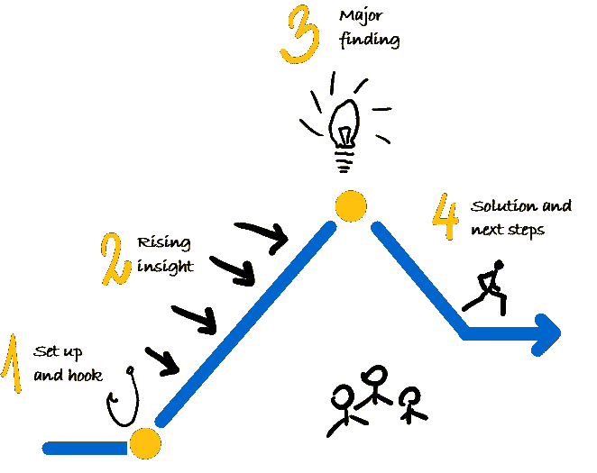
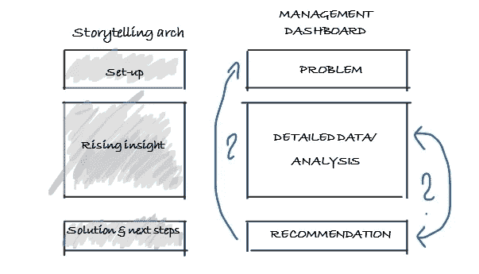
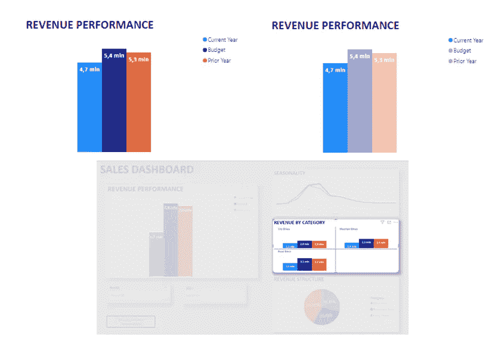
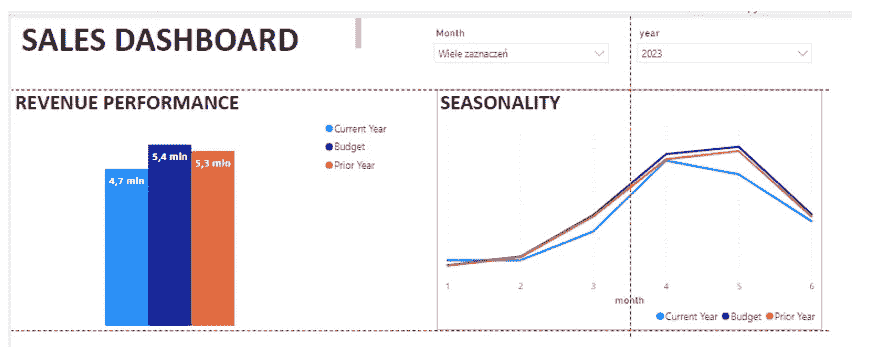
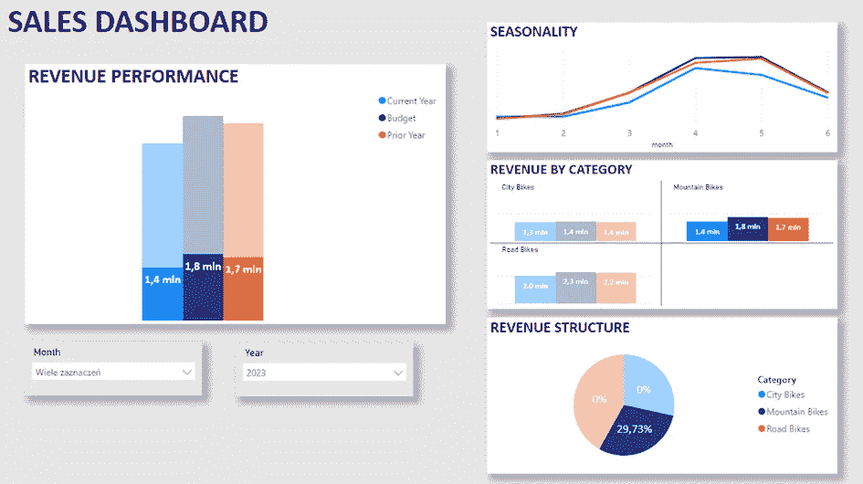
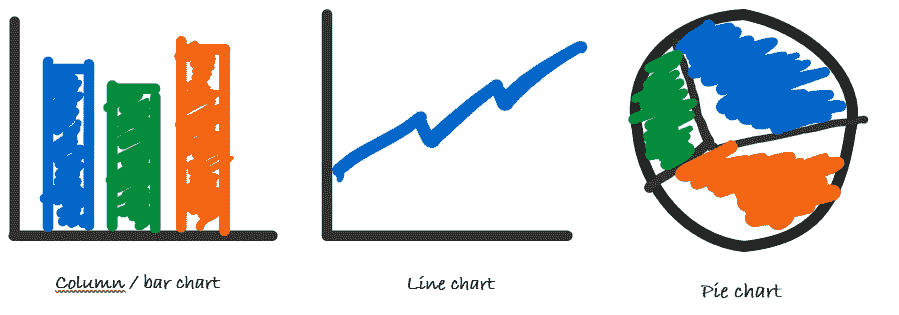
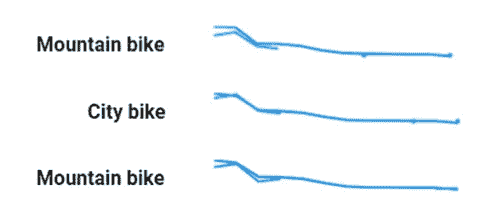
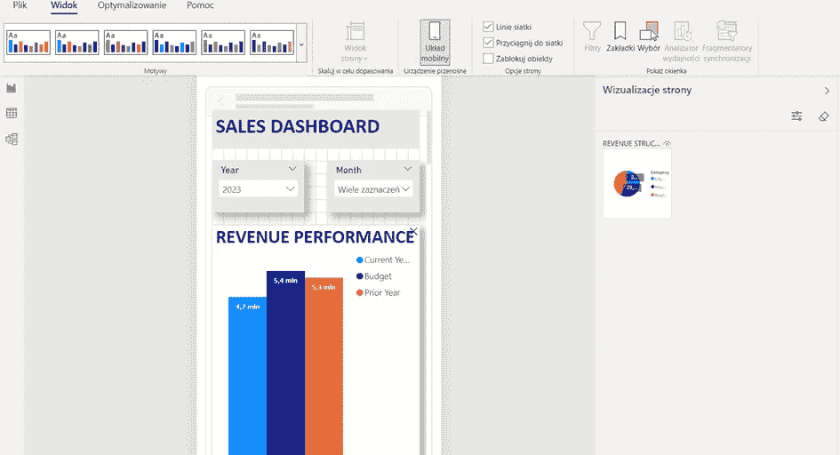
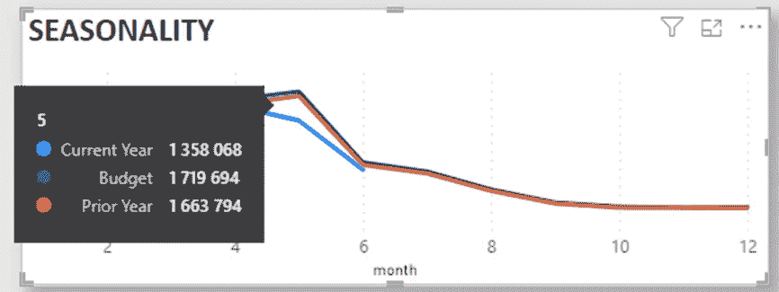

# 利用管理仪表板进行故事讲述：这是一个可行的途径吗？

> 原文：[`towardsdatascience.com/leveraging-management-dashboards-for-storytelling-a-viable-pathway-4bdeeed1fa59`](https://towardsdatascience.com/leveraging-management-dashboards-for-storytelling-a-viable-pathway-4bdeeed1fa59)

## 释放叙事力量：数据讲述与仪表板可以共存吗？

 [Michal Szudejko](https://medium.com/@michalszudejko?source=post_page-----4bdeeed1fa59--------------------------------)

·发布于 [Towards Data Science](https://towardsdatascience.com/?source=post_page-----4bdeeed1fa59--------------------------------) ·阅读时间 8 分钟·2023 年 8 月 2 日

--

“*用数据讲故事*”这个短语最近受到越来越多的关注。我在自己文章的观众数量增长以及我主持的相关研讨会的参与人数增加中感受到了这一趋势。同时，这一领域的有价值资源也有所增加。这与 2018 年或 2019 年我首次深入研究这一主题时的情况形成了鲜明对比，当时除了 [Cole Nussbaumer Knafflic](https://www.amazon.com/Storytelling-Data-Visualization-Business-Professionals/dp/1119002257/ref=sr_1_1?crid=3BKHX733YPUH8&keywords=cole+nussbaumer+knaflic&qid=1690882562&s=books&sprefix=cole+nuss%2Cstripbooks-intl-ship%2C184&sr=1-1) 或 [Brent Dykes](https://www.amazon.com/gp/product/1119615712/ref=as_li_tl?ie=UTF8&tag=analyticshero-20&camp=1789&creative=9325&linkCode=as2&creativeASIN=1119615712&linkId=30c2910bacd1fd7cc96642713c97d35e) 出版的优秀书籍和其他内容外，几乎找不到有用的信息。

照片由 [Campaign Creators](https://unsplash.com/@campaign_creators?utm_source=medium&utm_medium=referral) 提供，来源于 [Unsplash](https://unsplash.com/?utm_source=medium&utm_medium=referral)

**在他的一个帖子中，Brent Dykes[1]将编写引人入胜的故事过程分为三个步骤：**

1.  **故事框架：** 这个阶段涉及对数据的深入探索，特别关注独特的维度和指标。

1.  **故事形成：** 在这个阶段，任何之前检测到的异常或趋势都会经过彻底的调查。**本质上，这是我们培养洞察力的阶段。** 在这个阶段评估我们的发现对业务的重要性、理解其来源以及识别发生原因是至关重要的。通常，这个过程需要多轮发现、分析和结论的制定，这进一步细化了研究范围，并要求对数据进行更为专注的分析。

1.  **讲故事：** 在这个阶段，我们决定如何使用我们挖掘出的洞察。如果我们决定将这些发现分享给更广泛的受众，讲故事的行为变得至关重要。在这一步，我们润色叙事，设计支持性的视觉效果，并准备适当的评论。**

**根据戴克斯的说法，管理仪表板主要在初始阶段展示其价值。它们通过有效的过滤技术促进多维数据分析，并允许用户通过下钻或上钻功能深入细节或从更广泛的视角查看数据。因此，它们有助于识别数据中的模式或异常。**

**戴克斯说：**

> … 曾经存在一个重大问题 —— **我从未相信仪表板能讲述数据故事**。我在这个 BI 平台（或其他任何平台）中看到的都没有让我改变看法。因为自动化仪表板中的数据不断刷新，潜在的故事点变成了移动的目标——时隐时现，变化不断。

一方面，很难不同意他的观点，不是吗？然而，另一方面，情况真的是这样吗？我提出管理仪表板可能在讲故事过程中扮演更重要的角色。**让我们深入探讨它们的功能，并探索如何增强它们在这一过程中的作用。**

## **什么是管理仪表板？**

**从本质上讲，管理仪表板作为信息管理工具，使用户能够跟踪对任何业务至关重要的关键绩效指标（KPIs）和/或关键结果指标（KRIs），无论是财务还是非财务的**。通常，这些仪表板用于呈现当前或历史数据，但越来越多地，它们也在融入预测或情景规划功能。管理仪表板有三种关键类型：

• **操作性：** 这些通常用于回答“*当前情况是什么？*”这个问题。它们通常包含实时或非常近期的数据。

• **战略性：** 主要由高级管理人员用来监控 KRIs 和 KPIs，这些仪表板通常展示历史数据以提供更广泛的视角，并且经常包括财务数据。

• **分析性：** 这些仪表板数据丰富，用于分析基于历史或预测数据的趋势、关系或异常。

每种仪表板类型在本质上都是独特的，服务于不同的用户，满足不同的需求，因此需要不同的设计方法。

**这意味着它们也可以按照讲故事的原则进行设计，特别是操作性和战略性仪表板。**

## **如何按照数据讲故事原则设计管理仪表板？**

**这可以通过以下方式实现：**

1.  应用叙事结构

1.  应用视觉层次结构

1.  使用正确的视觉效果

1.  使用交互性

1.  与接收者沟通。

**1. 应用叙事结构**

在这里，我们可以使用 Brent Dykes 提倡的“讲故事弧”概念 [2] 用于静态叙事练习（如 PowerPoint 演示文稿）。

讲故事弧概念。来源：作者提供的图像，基于 [2]

以下是我如何将这一概念翻译到管理仪表板上的：

来源：作者提供的图像

这一概念的指导原则集中在仪表板内信息的组织上。最顶部应该展示最重要、综合的高层信息。根据当前的问题，用户可以决定是否深入浏览仪表板的其他部分。随着报告页面的深入，分析可以变得越来越复杂，涵盖更多维度或提供更详细的信息。报告或关键视觉效果的末尾（或侧边）应包括一个专门的推荐区域。这应帮助用户理解观察到的变化是积极的还是消极的，以及这些变化对业务的含义。例如，这可以表现为仪表板内直接生成的预测。

**2\. 应用视觉层次结构**

仪表板设计的另一个关键方面是创建视觉层次结构。目标是确保所有重要元素都易于查看和访问。这可以通过调整颜色、大小或空间位置来实现。

下面，我展示了两个例子来说明视觉层次结构的应用。顶部图像展示了在选择度量值（“当前年份”）时图表如何变化。底部图像则提供了应用于报告级别的视觉层次结构的视角。这两种可视化均使用 Power BI 制作。

应用视觉层次结构。来源：作者提供的图像

对齐在建立视觉层次结构中也扮演了至关重要的角色。必须正确对齐所有视觉元素，以避免无意中暗示某些元素比其他元素更重要或更不重要。大多数现代仪表板工具提供对齐功能，其中指南特别有用。下图展示了在 Power BI 中使用这些指南的效果。

来源：作者提供的图片

另一个关键建议是尽可能多地加入“留白”：**让你的仪表板有呼吸的空间**。在设计报告时记住这一点，将有助于更友好的布局，防止信息过载，增强有效传达意图的可能性。这是我对一个平衡良好的仪表板可能样子的演绎（白色实际上是灰色）。

平衡仪表板。来源：作者提供的图片

**3. 使用正确的视觉元素**

什么是正确的视觉元素？

让我澄清一下，什么不是这样。只需在 Google 搜索引擎中输入“最佳讲故事互动可视化”，你将被无数的例子淹没。不要误解我，大多数这些都是非常有效且视觉上令人愉悦的。然而，它们也需要大量的时间和资源来创建，使得它们在现实世界中不那么可行。那么，哪些视觉元素确实会被使用？毫无疑问，以下三个图表脱颖而出：

三个总是有效的图表。来源：作者提供的图片

**是否总是只有这三种图表？**

幸运的是，**不一定**。根据具体目的，其他几种图表类型也可能有效。例如，你可以考虑将子弹图或摘要图表纳入“问题”区域。

摘要图表。来源：作者提供的图片

子弹图。来源：作者提供的图片

我特别喜欢使用微型图表，因为它们有两个功能。首先，它们提供信息。用户可以对当前趋势有一个总体了解。其次，它们有导航的作用。用户可以点击感兴趣的图表或突出显示的重要干扰。

微型图表。来源：作者提供的图片

**4. 使用互动性**

互动性是管理仪表板应该真正突出的领域。依我看来，互动性涵盖了两个维度——一个是在工具或过程层面，另一个是在数据或报告层面。

**从工具或过程层面来看，互动性可以从三个方面进行评估：**

1. 每个仪表板的数据更新频率。

2. 数据访问和协作的便利性。例如，用户能否在内部和外部共享仪表板（注意安全问题）？访问报告是否需要 IT 干预，还是用户可以独立管理？

3. 仪表板的速度。相信我，在这个时代，没有人会有耐心等待性能缓慢的仪表板。

**在数据或报告层面，可以通过以下工具引入互动性：**

1\. 过滤器和滑块：这些通常被使用。高层管理人员在单个仪表板页面上的过滤器应尽量少。这些过滤器也应在选项卡之间功能齐全，并允许全局重置（即，从特定选项卡或整个仪表板中删除所有过滤器）。

2\. 警报：电子邮件或推送通知帮助激励用户在新数据可用时访问仪表板。它们必须在内容和频率上保持平衡，以防止它们被标记为垃圾邮件。

3\. 放大功能：这对于有多个可视化的拥挤报告页面特别有用。

4\. 链接：页面或可视化之间的连接可以改善用户导航。

5\. 深入分析和下钻选项（有时也包括上钻）：允许深入数据或根据需要获取更广泛的视角。

**最后，应考虑创建一个移动优化的报告视图，以提高可访问性。**

在 Power BI 中准备移动视图。来源：作者提供的图像

**5\. 与接收者沟通**

许多设计师常常忽视的一个方面是与接收者的对话。这可以以各种形式表现出来。其中一种形式是记录所有必要的定义、计算假设，或甚至报告的作者或拥有者的名字，使个人更容易寻求对报告的澄清。

Power BI 中提供的一种新形式是“智能叙事”。虽然它并不完美（尤其是在波兰语等语言中），但它可以提供有关特定页面上显示的可视化的一些基本信息。

最后，工具提示代表了另一种沟通方式，通常可以根据用户偏好进行自定义。通过工具提示，用户可以获得特定数据点的精确信息。

Power BI 中的工具提示。来源：作者提供的图像

## **结论**

总之，我希望这篇文章清楚地描绘了通过一点努力，仪表板如何成为讲故事过程中的强大工具。通过专注于周到的报告设计和视觉层次结构，选择合适的视觉元素，融入互动性，并积极与仪表板用户互动，你可以将数据展示提升到一个全新的水平。**让我们利用仪表板的力量，从数据中打造引人入胜的叙事！**

[*关注我在 medium.com 上的动态。*](https://medium.com/@michalszudejko)

[*在 LinkedIn 上与我联系。*](https://www.linkedin.com/in/michal-szudejko/)

[*访问我的博客（波兰语）*](http://www.michalszudejko.pl)*.*

[*访问我的 YouTube 频道（波兰语，提供英文字幕的影片）。*](https://www.youtube.com/@YTmichalszudejko)

## 参考文献：

[1] Dykes, Brent, [*故事框架与故事形成：数据讲故事前的两个关键步骤*](https://www.effectivedatastorytelling.com/post/storyframing-and-storyforming-two-essential-steps-that-precede-data-storytelling)，2023 年 2 月 22 日。

[2] Dykes, Brent, *有效的数据讲故事：如何通过数据、叙事和视觉驱动变革*，2019 年 12 月 17 日。
