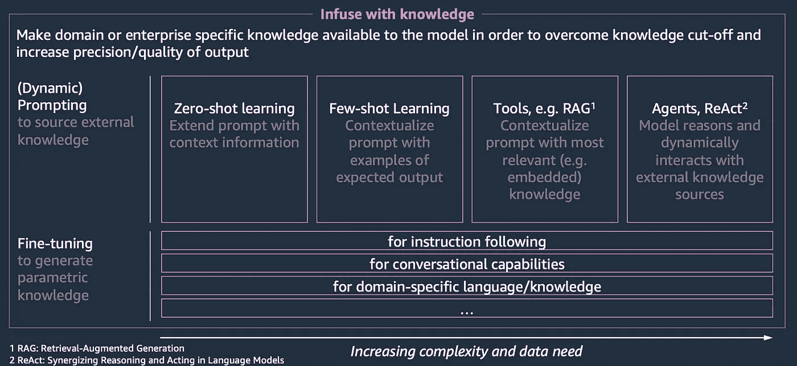
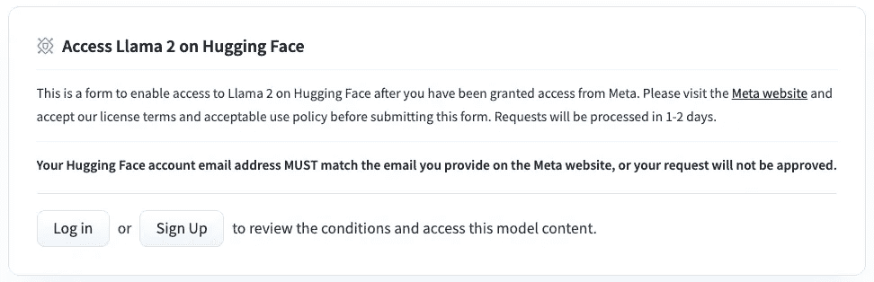

# 利用 qLoRA 对任务精调模型进行精调而不产生灾难性遗忘：以 LLaMA2(-chat)为例

> 原文：[`towardsdatascience.com/leveraging-qlora-for-fine-tuning-of-task-fine-tuned-models-without-catastrophic-forgetting-d9bcd594cff4?source=collection_archive---------1-----------------------#2023-09-07`](https://towardsdatascience.com/leveraging-qlora-for-fine-tuning-of-task-fine-tuned-models-without-catastrophic-forgetting-d9bcd594cff4?source=collection_archive---------1-----------------------#2023-09-07)

## 了解如何在保持任务特定性质的同时，将知识注入目的精调模型

 [Aris Tsakpinis](https://medium.com/@aris.tsakpinis?source=post_page-----d9bcd594cff4--------------------------------)

·

[关注](https://medium.com/m/signin?actionUrl=https%3A%2F%2Fmedium.com%2F_%2Fsubscribe%2Fuser%2F8ab3accce432&operation=register&redirect=https%3A%2F%2Ftowardsdatascience.com%2Fleveraging-qlora-for-fine-tuning-of-task-fine-tuned-models-without-catastrophic-forgetting-d9bcd594cff4&user=Aris+Tsakpinis&userId=8ab3accce432&source=post_page-8ab3accce432----d9bcd594cff4---------------------post_header-----------) 发表在 [Towards Data Science](https://towardsdatascience.com/?source=post_page-----d9bcd594cff4--------------------------------) · 11 分钟阅读 · 2023 年 9 月 7 日 

--

图片由 StableDiffusionXL 提供，托管在 Amazon Web Services

# 这篇文章讲了什么，为什么重要？

像 Anthropic 的 Claude 或 Meta 的 LLaMA2 这样的语言大模型（LLMs）在各种自然语言任务中展示了令人印象深刻的能力。然而，它们的知识和任务特定技能仍然相对通用——如果你想执行需要明确知识的更专业的领域特定任务，你需要找到方法将知识注入模型并教它们任务特定的行为。LLM 驱动的应用需要在其目标领域中正常工作，提供准确的答案而不是产生幻觉，并确保安全、隐私和适当的内容。

这些挑战通常被称为“有用性、诚实性和无害性”的“三个 H”。克服这些挑战在设计企业级应用时被证明特别重要。

将领域知识传递到基础模型中有几种选择：

作者插图

+   **源知识：** 你可以通过提示工程和基于示例或上下文注入生成动态提供知识。这种选项以相对简单的方式呈现，如零样本或少样本提示。然而，还有更复杂的方法来整合外部知识源。通过动态提示组合注入知识，从各种外部“工具”（检索增强生成、数据库检索器、数据湖检索器、通过 REST-ful API 的实时系统等）获取信息的源知识正在变得越来越受欢迎。

+   **参数知识：** 你可以通过微调直接更新模型参数。这样，预训练的权重将调整到一个比预训练时更小的、领域特定的数据集，从而接近于领域特定的知识库或任务。

正如 Heiko Hotz 在他的 [博客文章](https://heiko-hotz.medium.com/rag-vs-finetuning-which-is-the-best-tool-to-boost-your-llm-application-94654b1eaba7) 中解释的那样，选择正确的方法（或两者的组合）存在权衡。在这篇博客中，我们将重点介绍参数方法，并演示如何在 Amazon SageMaker 上使用 PEFT（参数高效微调）对 LLaMA2 模型进行微调。

我们的目标是将 LLaMA2 适应于特定领域，获取最新的知识以克服“知识截止”问题，即模型缺乏对未纳入其训练数据的最新信息的意识。与任务特定的微调不同，这对于许多从业者来说是一个更可实现的任务，因为他们可以简单地使用包含领域特定信息的文本语料库作为训练数据集，而不是像对话或指令数据集那样手动制作或收集任务特定的数据集。

由于许多相关的 LLM 驱动的使用场景中，任务特定模型是有益的，我们还将展示所提议的设置如何同样适用于像 LLaMA2-chat 这样的模型，这些模型已经进行了任务特定的微调而不失去其任务特定特性（例如指令跟随、对话行为等）。

通过详细介绍这一端到端的知识注入工作流程，我们提供了一个将基础模型调优以满足特定需求的实用指南。

# 模型

LLaMA2 模型于 2023 年 7 月发布，并附有一篇[研究论文](https://scontent.fham6-1.fna.fbcdn.net/v/t39.2365-6/10000000_662098952474184_2584067087619170692_n.pdf?_nc_cat=105&ccb=1-7&_nc_sid=3c67a6&_nc_ohc=Vldy0tYq-X8AX9NLDca&_nc_ht=scontent.fham6-1.fna&oh=00_AfAiZlF_VS1P3n26xqkC3133VVTndBLCZOGyrxkEryDsIw&oe=64F5C5FF)。在论文中，Touvron 等人表示，LLaMA2 是“一个预训练和微调的大型语言模型（LLMs）集合，规模从 70 亿到 700 亿个参数不等。我们的微调 LLMs，称为 Llama 2-Chat，专门针对对话使用场景进行了优化。我们的模型在我们测试的多数基准上超过了开源聊天模型，并且根据我们对有用性和安全性的人工评估，可能是闭源模型的合适替代品。”

如前所述，LLaMA2 模型有三种尺寸：7B、13B 和 70B。它们既有纯完成模型，也有针对对话使用场景优化的版本。预训练时使用了大约 2 万亿个标记，它们支持最长 4096 个标记的上下文长度。针对对话使用场景的微调使用了超过 10 万个示例，并通过超过 100 万个代表人类偏好的训练样本进一步优化。

在 AWS 中，LLaMA2 模型可以通过[SageMaker JumpStart](https://aws.amazon.com/blogs/machine-learning/llama-2-foundation-models-from-meta-are-now-available-in-amazon-sagemaker-jumpstart/)一键部署，也可以通过[AWSxHuggingFace LLM DLC](https://www.philschmid.de/sagemaker-llama-llm)从 HuggingFace 模型库中获取。

# 微调

微调利用迁移学习高效地将特定领域的专业知识注入到像 LLaMA2 这样的基础模型中。该过程涉及通过在特定领域的数据上继续预训练来更新模型的权重，同时保持整体网络结构不变。与需要大量数据集和计算的全面预训练不同，微调在样本和计算方面非常高效。参数高效的微调（PEFT）技术，例如（q）LoRA 方法，使得在像 LLaMA2 这样的通用语言模型中轻量化地注入专业知识成为可能，且开销最小。

在谈到微调时，有两种不同的方法可以选择：

1.  通过在领域特定语料库上微调 LLaMA2 的仅解码器架构，利用其原生的自回归因果语言建模（CLM）方法，我们可以将专业知识或特定语言或词汇（例如医疗研究术语/语言）注入到 LLM 中，同时保留其通用语言能力。

1.  另一方面，通过使用特定任务的语料库，可以将模型微调为特定任务，例如指令跟随或对话行为。

这些模型利用自监督训练方法，优化特定于语言建模（LM）的损失函数。像 LLaMA2 这样的仅解码器模型采用了因果语言建模（CLM）方法，具有单向上下文。简单来说，这意味着它们是通过根据之前的词语作为语义上下文，预测后续标记的自回归方式进行训练的。

如上所述，[PEFT](https://arxiv.org/abs/2205.05638) 技术使得将专业知识轻量级地注入到 LLM 中成为可能，因为仅更新模型参数的子集。低秩适配方法（[LoRA](https://arxiv.org/abs/2106.09685)）或量化低秩适配方法（[QLoRA](https://arxiv.org/abs/2305.14314)）冻结预训练模型权重，并将可训练的秩分解矩阵注入 Transformer 架构的每一层，大大减少了下游任务的可训练参数数量。如果你想深入了解 LoRA，建议查看 Mariano Kamp 的 [博客文章](https://medium.com/towards-data-science/dive-into-lora-adapters-38f4da488ede)。

# 场景

7 月 26 日，AWS 在纽约市 AWS 峰会上宣布了生成式 AI 领域的多项新功能。为了分享更多细节，发布了几篇公告博客：

· [Amazon Bedrock 的代理](https://aws.amazon.com/blogs/aws/preview-enable-foundation-models-to-complete-tasks-with-agents-for-amazon-bedrock/)

· [AWS 实体解析匹配](https://aws.amazon.com/blogs/aws/aws-entity-resolution-match-and-link-related-records-from-multiple-applications-and-data-stores/)

· [向量存储在生成式 AI 应用中的作用](https://aws.amazon.com/blogs/database/the-role-of-vector-datastores-in-generative-ai-applications/)

· [Amazon OpenSearch Serverless 的向量引擎](https://aws.amazon.com/blogs/big-data/introducing-the-vector-engine-for-amazon-opensearch-serverless-now-in-preview/)

· [AWS Glue Studio 笔记本，由 Amazon CodeWhisperer 提供支持](https://aws.amazon.com/blogs/big-data/build-data-integration-jobs-with-ai-companion-on-aws-glue-studio-notebook-powered-by-amazon-codewhisperer/)

· [Amazon EC2 P5](https://aws.amazon.com/blogs/aws/new-amazon-ec2-p5-instances-powered-by-nvidia-h100-tensor-core-gpus-for-accelerating-generative-ai-and-hpc-applications/)

考虑到 LLaMA2 的知识截止日期，不幸的是，该模型的纯形式将无法提供有关这些公告的信息。我们希望通过利用微调将这些知识注入到基础模型（FM）中，并提升其知识水平以实现这一点。

由于我们不打算将模型微调到特定任务上，而是希望摄取领域特定的知识，我们可以使用经典的 CLM 基础方法（前面章节中的选项 1）。Philipp Schmid 在他非常全面的[博客](https://www.philschmid.de/sagemaker-llama2-qlora)中描述了如何使用 QLoRA 对 LLaMA2 模型进行微调，但重点是任务特定（指令）微调。我们将以他的博客中分享的代码样本为起点，并相应地调整代码。

为了负责任地使用资源，我们将对 LLaMA2–13b 和 LLaMA2–13b-chat 模型进行微调。微调 7b 及 70b 版本将使用调整后的训练集群配置（参见 Philipp 的[博客](https://www.philschmid.de/sagemaker-llama2-qlora)）。在微调完成后，我们将部署基础模型和微调后的模型，并进行高层次的性能比较。

随后，我们将逐步讲解微调模型的每个步骤。如果您想访问完整的代码仓库，可以在[这里](https://github.com/aristsakpinis93/finetuning-llama2)找到。

# 数据加载

对于数据加载，我们使用 LangChain 的 WebBaseLoader 加载由其 URL 标识的网站数组。

# 许可协议与 HuggingFace 登录

接受 LLaMA2 模型的许可协议

在我们开始数据准备和训练之前，我们需要接受 LLaMA2 模型的许可协议。这包括在 Meta 网站上的注册，所用的电子邮件地址需与您的 HuggingFace 账户邮箱匹配。

然后我们从运行时对 HuggingFace hub 进行身份验证。

# 数据准备

首先，我们对原始网站进行一些预处理。在实际应用中，可能会更重视这一步骤。为了演示的目的，我们仅仅去除了较大的空格拼接，以获得一个连贯流畅的文本语料库。然后我们将文档列表加载到 HuggingFace 数据集中。

在下一步中，我们对文本语料库进行分词处理，使其适合 LLM。为此，我们使用从 HuggingFace hub 加载的 LLaMA2 分词器。加载后的分词器可以用于对根据模型的上下文窗口（2048 个 tokens）批量处理后的数据进行分词。

然后我们将数据集保存到 S3 中，以便在训练作业中使用。

# 培训

现在我们可以触发一个 Amazon SageMaker 训练作业，执行基于预处理数据的 CLM 绑定 QLoRA 微调脚本。

超参数和训练脚本参考了 Philipp 的博客文章。唯一的例外是执行的训练轮次数量，我们选择了相对较高的 20 轮。这是为了考虑到我们的训练数据集相对较小（约 32k 个标记）。在实际应用中，建议使用更大的数据集进行微调。训练脚本本身可以在 [这里](https://github.com/aristsakpinis93/finetuning-llama2/blob/main/scripts/run_clm.py) 找到。

请注意：由于接受的模型许可证协议与您的 HuggingFace 帐户绑定，我们需要指定 HuggingFace 访问令牌。

训练作业配置，例如训练集群配置，也参考了 Philipp 的博客文章。

然后我们可以执行训练作业，这将进行微调并将模型工件保存到 S3 中。

# 部署

基础模型 LLaMA2–13b 和 LLaMA2–13b-chat 可以通过 SageMaker JumpStart 方便地部署。这个 [博客文章](https://aws.amazon.com/blogs/machine-learning/llama-2-foundation-models-from-meta-are-now-available-in-amazon-sagemaker-jumpstart/) 提供了详细的说明。

经过微调的两个模型可以通过使用 AWSxHuggingFace LLM DLC 进行部署。因此，我们将 HuggingFaceModel 类的 model_data 参数指向模型工件的 S3 路径。然后，我们可以将托管容器中设置的环境变量 HF_MODEL_ID 指向 DLC 内的默认模型路径（“/opt/ml/model”）。

# 测试

部署所有四个模型后，我们希望在示例问题上测试性能。关于 Amazon EC2 P5 实例的公告 [博客文章](https://aws.amazon.com/blogs/aws/new-amazon-ec2-p5-instances-powered-by-nvidia-h100-tensor-core-gpus-for-accelerating-generative-ai-and-hpc-applications/) 说明：“P5 实例提供 8 个 NVIDIA H100 Tensor Core GPU，配有 640 GB 的高带宽 GPU 内存，第三代 AMD EPYC 处理器，2 TB 系统内存，以及 30 TB 本地 NVMe 存储。P5 实例还提供 3200 Gbps 的汇总网络带宽，支持 GPUDirect RDMA，通过绕过 CPU 实现更低延迟和高效的扩展性能。”

我们提出以下问题：“什么是 Amazon EC2 P5 实例？它们配备了什么类型的 GPU？”聊天模型在推理配置 max_new_tokens = 200, top_p = 0.9, temperature = 0.01 下的回答如下：

+   LLaMA2–13b-chat: “*Amazon Elastic Compute Cloud (EC2) P5 实例是一种提供高性能计算资源的实例，适用于需要强大计算能力的应用程序。这些实例配备了 NVIDIA Tesla V100 GPU，专为机器学习、科学模拟和其他高性能计算工作负载设计。\n\nAmazon EC2 P5 实例的 NVIDIA Tesla V100 GPU 基于 Volta 架构，并提供多种功能，使其非常适合需求严格的工作负载，包括：\n\n* 5120 个 CUDA 核心，用于高性能计算\n* 640 个张量核心，用于加速深度学习和其他基于矩阵的工作负载\n* 16 GB 的 GDDR6 内存，用于快速数据传输和处理\n* 支持 NVIDIA 的 GPU 加速库和框架，如 CU…*”

+   LLaMA2–13b-chat-nyc-finetuned: “*Amazon EC2 P5 实例是一种通用实例，为需要大量图形处理和复杂机器学习（ML）模型的应用程序提供极端性能。它们由 NVIDIA H100 Tensor Core GPU 和第三代 AMD EPYC 处理器驱动。H100 GPU 提供 640 GB 高带宽 GPU 内存，使您能够在实时运行大规模数据集的最具挑战性应用程序。P5 实例还提供 2000 GB 高速 CPU 内存，允许您在内存中处理大量数据，而无需访问磁盘存储。这减少了处理时间并改善了响应时间。您可以将这些实例用于计算机视觉、视频编码、基因组分析和语言模型训练等应用程序.*”

我们可以清楚地看到，尽管基础模型幻想了 GPU 类型（V100），但经过精调的模型为我们提供了正确的答案（H100）。我们还看到，通过 qLoRA 我们可以保留基础模型的聊天精调特性，从而减轻灾难性遗忘。这意味着我们可以向 LLM 注入知识，而不必在之后进行完全的指令/聊天精调，只需使用相应的任务精调模型作为基础模型即可。这种方法有效的原因在于 LoRA 的性质，其中神经网络的每一层的大部分部分保持不变，而层级则被扩展。

对于模型的纯完成版本，我们需要重新提出问题，因为这些模型无法理解指令或以对话方式行事。相反，它们只是通过自回归的下一个 token 预测来完成标记序列。

我们提出以下问题：“Amazon EC2 P5 实例配备了类型的 GPU” 完成模型通过推断配置为 max_new_tokens = 200，top_p = 0.9，temperature = 0.01 回答如下：

+   LLaMA2–13b：“*NVIDIA Tesla V100。\nNVIDIA Tesla V100 是一种旨在进行高性能计算的 GPU。它基于 NVIDIA Volta 架构，并配备了 32GB 的 HBM2 内存。V100 能够提供高达 100 teraflops 的性能，并设计用于数据中心和超级计算机。\nNVIDIA Tesla V100 是一种强大的 GPU，旨在进行高性能计算。它基于 NVIDIA Volta 架构，并配备了 32GB 的 HBM2 内存。V100 能够提供高达 100 teraflops 的性能，并设计用于数据中心和超级计算机。\nNVIDIA Tesla V1…*”

+   LLaMA2–13b-nyc-finetuned：“*NVIDIA A100 用于计算密集型工作负载，例如生成 AI、高性能计算（HPC）和数据分析。P5 实例非常适合训练和运行具有万亿参数的模型以及在庞大数据集上进行数据分析。与 P4 实例相比，它们提供了 8 倍的 GPU 内存和 64 倍的浮点运算（FLOPs）计算性能。\n 您可以在 Amazon Elastic Container Service（ECS）中使用 P5 实例，支持最常见的容器工具和框架，如 Docker、PyTorch、TensorFlow、Jupyter Notebook、R Studio 和 Venv，或通过 Amazon Elastic MapReduce（EMR）或 Amazon DeepSense 使用 Amazon 或其他公司提供的 ML 和 AI 框架和工具来使用 P5 实例。为了便于在 P5 实例上构建生成 AI 应用程序，…*”

尽管用少量数据微调聊天微调模型已导致消除了基于 LLaMA2 模型的幻觉，但在我们的设置中似乎不起作用。这可能是因为我们微调数据集的大小有限。此外，更复杂的提示工程和优化推理配置参数设置可能会有所帮助。

# 结论

总之，这篇博客文章深入探讨了将领域特定知识融入大型语言模型（LLMs）如 LLaMA2 的关键过程，强调了在设计 LLM 驱动的企业级应用时，解决有用性、诚实性和无害性等挑战的重要性。这里的主要关注点是参数化微调方法，它可以有效地将专业知识注入基础模型而不影响其通用语言能力。

博客文章重点介绍了使用参数高效微调技术（如 qLoRA 方法）微调 LLaMA2 的步骤，以及如何在 Amazon SageMaker 上进行这一过程。通过采用这种方法，实践者可以将 LLaMA2 适应于特定领域，确保模型即使在超出原始训练数据的情况下也能保持最新的知识。

文章还强调了这种方法的多功能性，显示它可以应用于像 LLaMA2-chat 这样的模型，这些模型已经经过了特定任务的微调。这为将知识注入到 LLM 中提供了机会，而无需进行广泛的指令或基于对话的微调，从而保持了其特定任务的特性。
