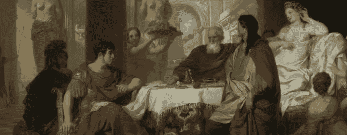
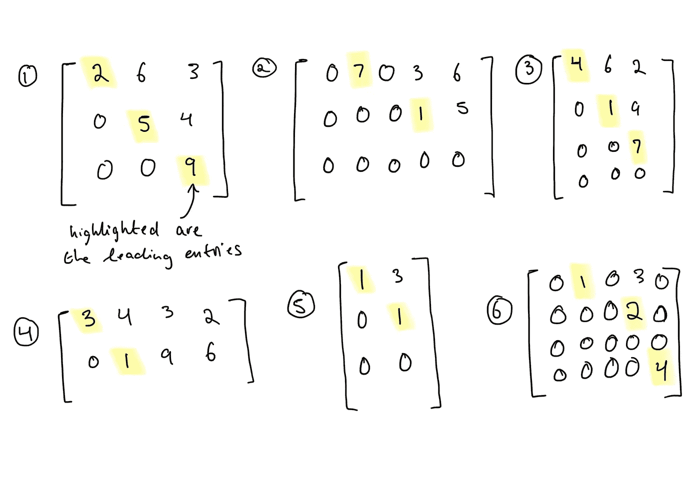
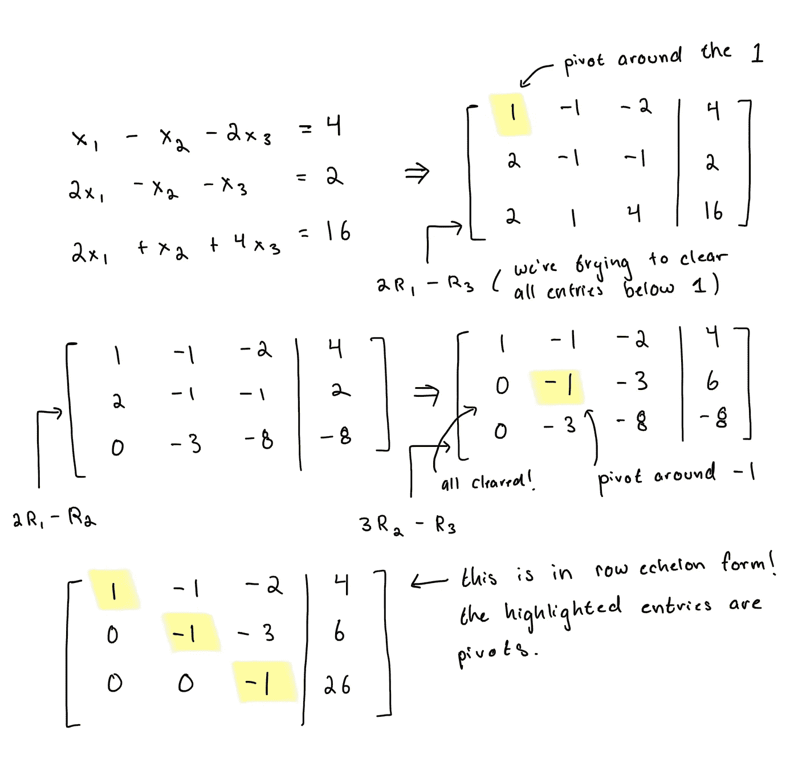
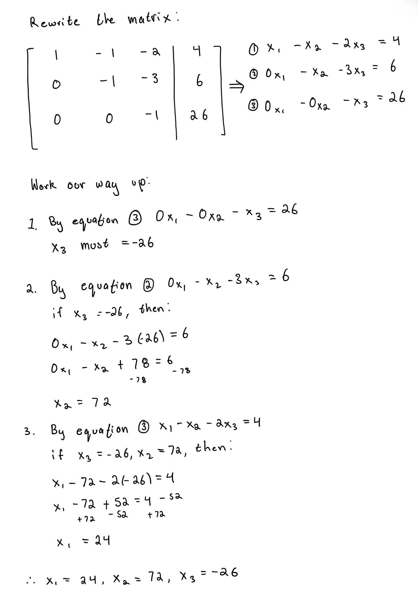
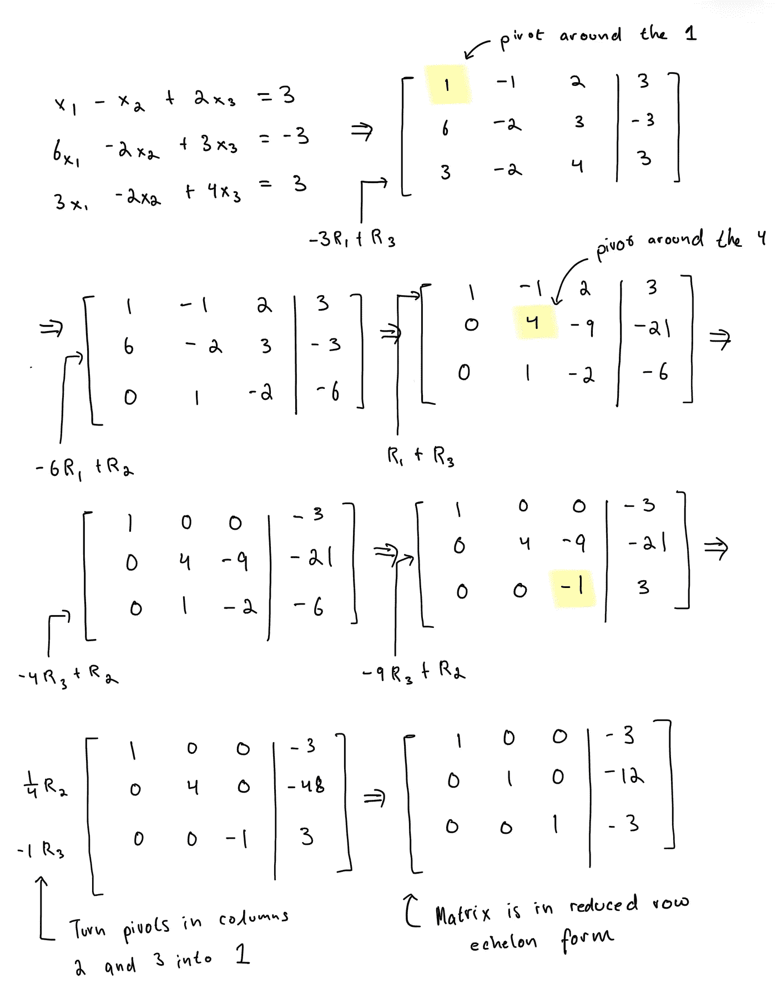
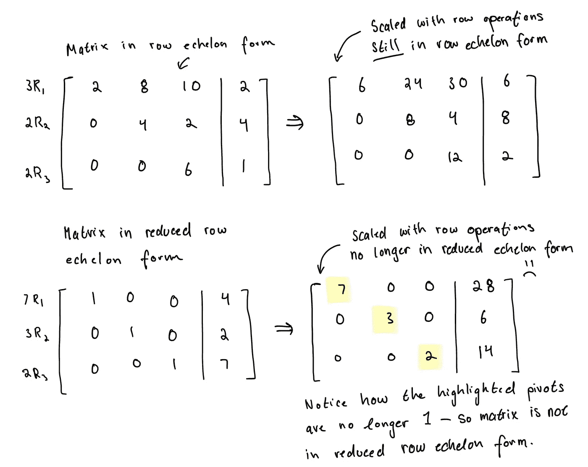
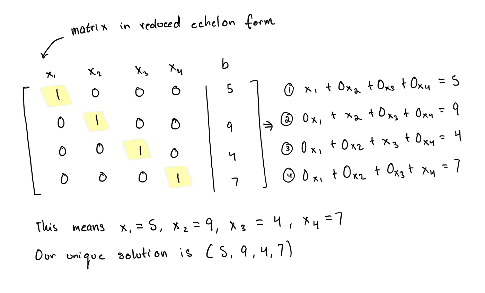
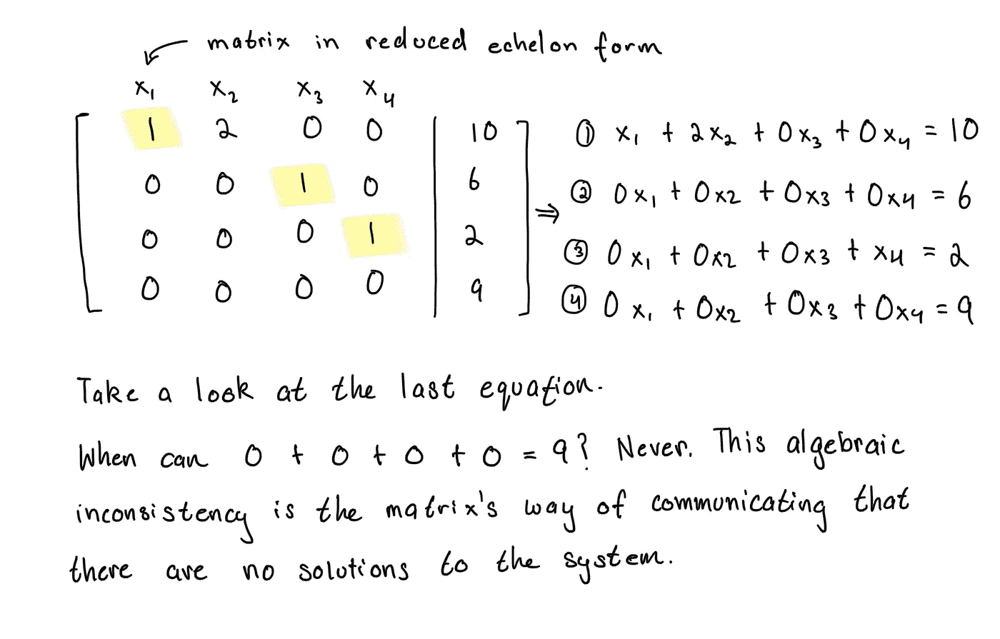
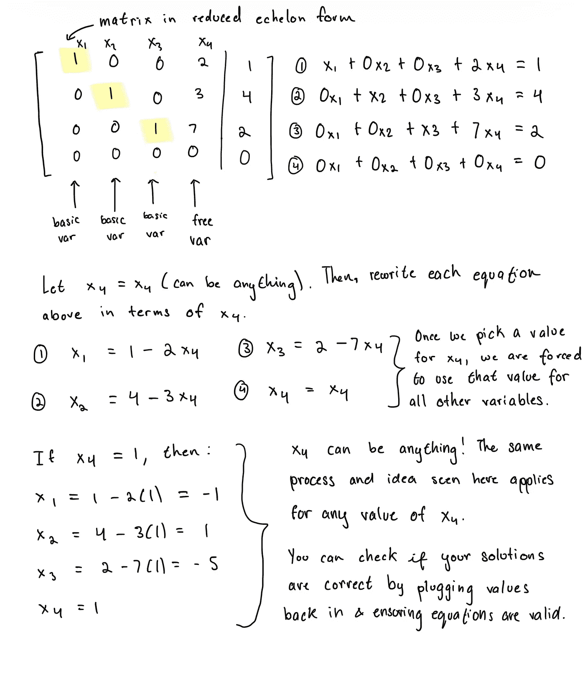
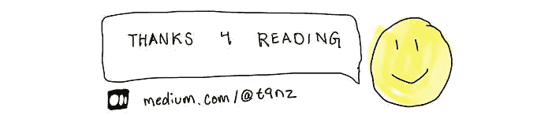

# 线性代数 2：梯形矩阵形式

> 原文：[`towardsdatascience.com/linear-algebra-2-echelon-matrix-forms-ce8a19c71a7d?source=collection_archive---------3-----------------------#2023-09-29`](https://towardsdatascience.com/linear-algebra-2-echelon-matrix-forms-ce8a19c71a7d?source=collection_archive---------3-----------------------#2023-09-29)

来自[欧洲数字档案馆](https://unsplash.com/@europeana)在[Unsplash](https://unsplash.com/photos/QaUm-ISDXVw)上的图像

## 行梯形式和简化行梯形式

 [tenzin migmar (t9nz)](https://medium.com/@t9nz?source=post_page-----ce8a19c71a7d--------------------------------)

·

[关注](https://medium.com/m/signin?actionUrl=https%3A%2F%2Fmedium.com%2F_%2Fsubscribe%2Fuser%2Fd6ff685c466&operation=register&redirect=https%3A%2F%2Ftowardsdatascience.com%2Flinear-algebra-2-echelon-matrix-forms-ce8a19c71a7d&user=tenzin+migmar+%28t9nz%29&userId=d6ff685c466&source=post_page-d6ff685c466----ce8a19c71a7d---------------------post_header-----------) 发表在[向数据科学进发](https://towardsdatascience.com/?source=post_page-----ce8a19c71a7d--------------------------------) ·8 分钟阅读·2023 年 9 月 29 日

--

## 前言

欢迎回到我关于线性代数基础的系列文章的第二篇，这也是机器学习背后的基础数学。在我之前的 [文章](https://medium.com/@t9nz/linear-algebra-1-1-15b70e48bab9) 中，我介绍了线性方程和系统、矩阵符号以及行简化操作。本文将讨论阶梯矩阵形式：行阶梯形式和行简化阶梯形式，以及如何利用这两种形式来解线性系统。若配合 David C. Lay, Steven R. Lay 和 Judi J. McDonald 的《线性代数及其应用》一书阅读，将会更好地服务于读者。请将此系列视为一个外部辅助资源。

随时分享你的想法、问题和批评。

## 行阶梯形式

**高斯消元**方法是一种通过行操作将矩阵转化为可以通过回代得到解的形式的过程。

作为复习，行简化操作包括：

1.  **替换**：“将一行替换为其自身与另一行的和。”*

1.  **交换：**“交换两行。”*

1.  **缩放**：“将一行中的所有条目乘以一个非零常数。”*

上述操作可以应用于矩阵，以将该矩阵转换为其行阶梯形式。给定一个 *m* x *n* 的矩阵，其中 *m* 是行数，*n* 是列数，当且仅当：

1.  所有条目均为零的行位于至少有一个条目非零的行下方。

1.  一行的所有主元（从左侧开始的第一个非零条目）位于上面行的右侧列中。

1.  一列中所有主元下方的条目均为零。

以下是行阶梯形式（REF）的矩阵示例。

请花点时间欣赏一下，虽然矩阵的大小和条目有所不同，但所有矩阵都被认为符合上述标准的行阶梯形式。注意一下高亮的主元下方的楼梯状图案？这就是执行高斯消元将矩阵转换为行阶梯形式时自然出现的形式。这个形式的名字非常恰当：单词 echelon 来源于法语中的 *eschelon*，意为梯子的一步，后来也有了“台阶”的意思。*

高斯消元法的基本思想是将矩阵转换为行简化形式，即选择一个主元（"主元"一词用来指代主元素：在其行中的第一个非零元素），然后消除所有主元下方的元素，将主元下列的所有元素变为零。为了理解这一步骤为何能推动矩阵变为简化行阶梯形式，请回顾简化行阶梯形式的定义：在行阶梯形式中，*所有主元素下方的列元素均为零*。这一步骤然后会在每一行中重复，但要小心！我们必须确保在每次选择主元时，都不会违反行阶梯形式的核心特征；*每一行的主元素都位于其上方行的右侧列中*。考虑到这一规则，通常建议从第一行的第一个元素开始选择主元，然后从右向左逐步处理剩余行。

让我们再次思考之前提到的行阶梯形式的目的：*将表示线性系统的矩阵转化为一种形式，以便解决方案变得易于辨认*。为了更好地理解行阶梯形式的实用性，请参见示例 1。

当我们执行高斯消元法时，我们是在操作矩阵，使其呈现对称而更易解读的形式。通过示例 1 获得的行阶梯形式，我们现在可以使用回代法逐步获得每个解。

正如你从上面看到的，这并不理想。它需要额外的繁琐工作。虽然简化行阶梯形式也需要额外的工作，但其表示方式更为简洁，减少了出错的可能性。一旦我们将矩阵简化为简化行阶梯形式，我们可以轻松读出解，并且线性系统也就解决了。

## 简化行阶梯形式

当将矩阵简化为*简化*行阶梯形式时，使用的是**高斯-约旦消元法**。该算法通过一系列行变换操作，将表示线性系统的矩阵转换为简化行阶梯形式，从而使解变得易于辨认。无需额外的回代步骤。

给定的*m* x *n* 矩阵被称为**简化行阶梯形式**，如果它满足行阶梯形式的所有先决条件，并且还符合以下标准：

1.  每一行的主元素都是 1。

1.  主元素下方*和上方*的所有列元素均为零。（主元素是该列中唯一的非零元素）

让我们通过一个示例来演示如何将矩阵简化为简化行阶梯形式。

阅读我们得到的简化行阶梯形式矩阵，现在立刻可以看出我们的解是 *x₁* = -3, *x₂* = -12, *x₃* = -3。

## 经济形式的独特性

直到现在，我们已经分别计算了行最简形式和简化行最简形式的一个例子。你可能想尝试独立地对行最简形式进行行化简练习，结果得到一个不同的行最简形式矩阵。不必担心，这完全可能，并且只要计算正确且所有三个规则都涵盖了，两者版本都是正确的。这是一个很棒的情况！它引导我们迈向一个重要的定理：

**定理 (1)**

> 矩阵可以有多于一个的行最简形式；行最简形式不是唯一的。通过行操作应用的顺序变化，可以得到不同但同样有效的最简形式。

这并不适用于简化行最简形式，对于简化行最简形式则正好相反。

**定理 (2)**

> 矩阵只能有一个简化行最简形式；简化行最简形式是唯一的。

我们看到这两种形式在唯一性上的差异的根源在于我们对简化行最简形式施加的额外限制，即主元条目的要求为一。当我们将矩阵化简为行最简形式时，我们可以将每一行乘以任何非零常数，矩阵仍将保持在行最简形式，因为缩放矩阵并没有违反行最简形式的任何规则。简化的最简形式则不同，因为主元条目必须为一。下面我将通过一个具体的例子进一步说明这一点。

## 解的数量

从解决线性系统中自然产生的一个基本问题是存在多少解？对于任何线性系统，解将始终是三种情况之一。线性系统将要么有一个唯一解，要么有无限解，或者无解。如果你有兴趣思考为什么必须是这三种情况之一，（重新）阅读我的[上一篇文章](https://medium.com/towards-data-science/linear-algebra-1-1-15b70e48bab9)。

让我们更详细地查看每种情况，以了解我们如何识别给定矩阵的解情况，并轻轻探讨和探索每种情况如何及为何会出现的直觉。

**唯一解：** 当线性系统的矩阵的简化行最简形式的每一列都有一个主元时，该系统具有唯一解。

当我们将矩阵形式重新写成一系列线性方程时，这一点变得更加明显。我们可以看到，因为每一列都有一个主元（上方和下方没有条目），所以可以从方程中逐一读出每个变量的明确解。

**无解：** 当线性系统的矩阵的简化行最简形式具有代数不一致性时，该系统无解。

如上所述，没有任何* x₁*、* x₂*、* x₃* 和* x₄* 的值可以使得方程四成立。左边将始终为 0，而不是 9，因此该系统没有解。一般而言，任何增广矩阵中如果有一行[0, 0, … 0 | *b*] 其中 *b* 不为零，则没有解，因为 0 ≠ b。

**无限解：** 当线性系统至少有一个**自由变量**时，它有无限解。自由变量出现时，相应的列没有主元。另一方面，**基本变量**是指相应列有主元的变量。让我们深入了解为什么自由变量的存在暗示了无限解。

名副其实，自由变量意味着你可以随意赋值给它们。所有基本变量相对于自由变量被定义，因此基本变量的值将取决于自由变量被赋予的值。这是无限解存在的本质；只要基本变量与自由变量选择的值一致，无限多的解都是有效的。

在将矩阵转换为化简行阶梯形矩阵后，系统是否有一个解、没有解或无限多解将立即显现出来。

## 总结

在本章中，我们学到了：

+   高斯消元法用于将矩阵化简为行阶梯形矩阵以求解线性系统。

+   高斯-乔丹消元法用于将矩阵化简为化简行阶梯形矩阵以求解线性系统。

+   阶梯形矩阵的唯一性：行阶梯形矩阵不是唯一的，而化简行阶梯形矩阵是唯一的。

+   线性系统可能的解的数量：唯一解、无限解或无解，以及它们何时和为什么会出现。

## 备注

*除非另有说明，所有图片均由文章作者提供。*

*行操作的引用 [[src]](https://math.berkeley.edu/~arash/54/notes/01_01.pdf)*

*“阶梯形”这个词的词源 [[src](https://medium.com/towards-data-science/linear-algebra-1-1-15b70e48bab9)]*

