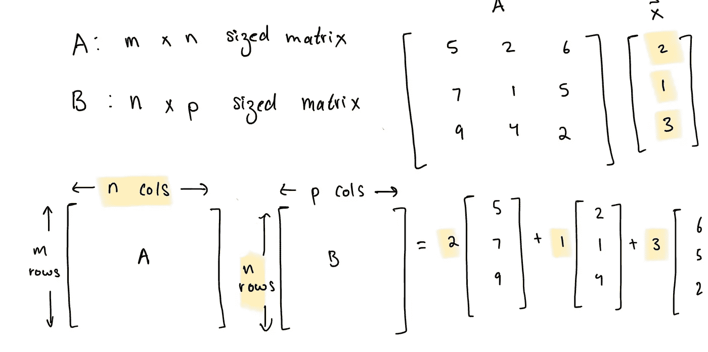
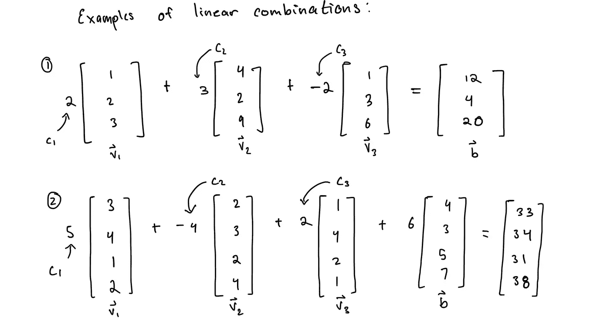
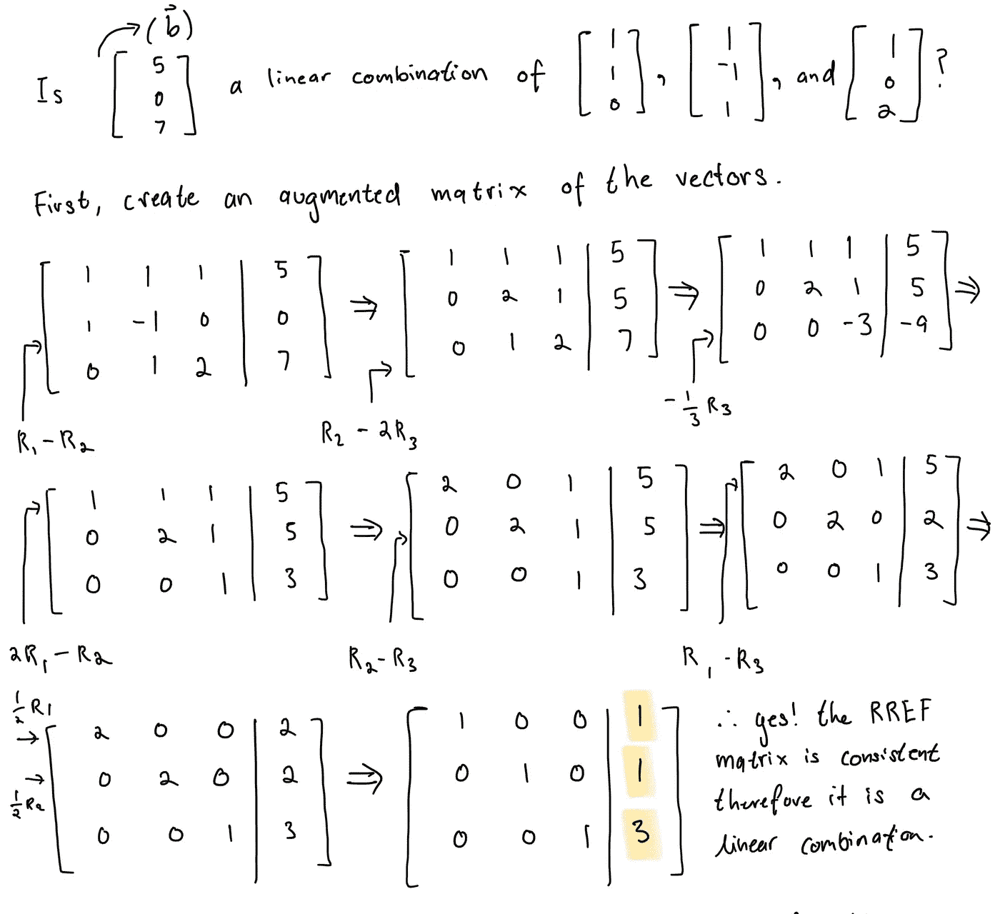
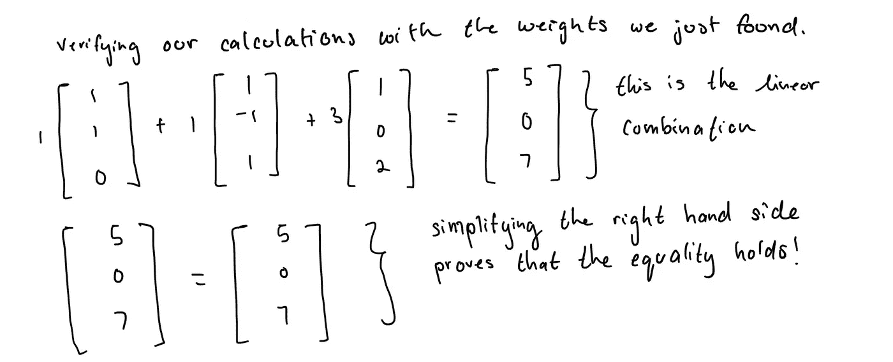
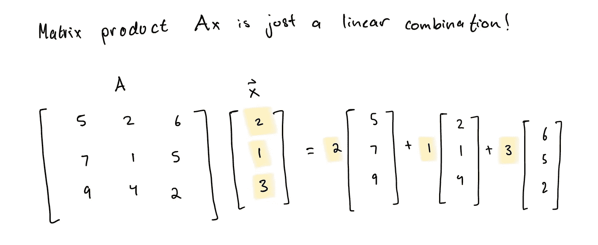
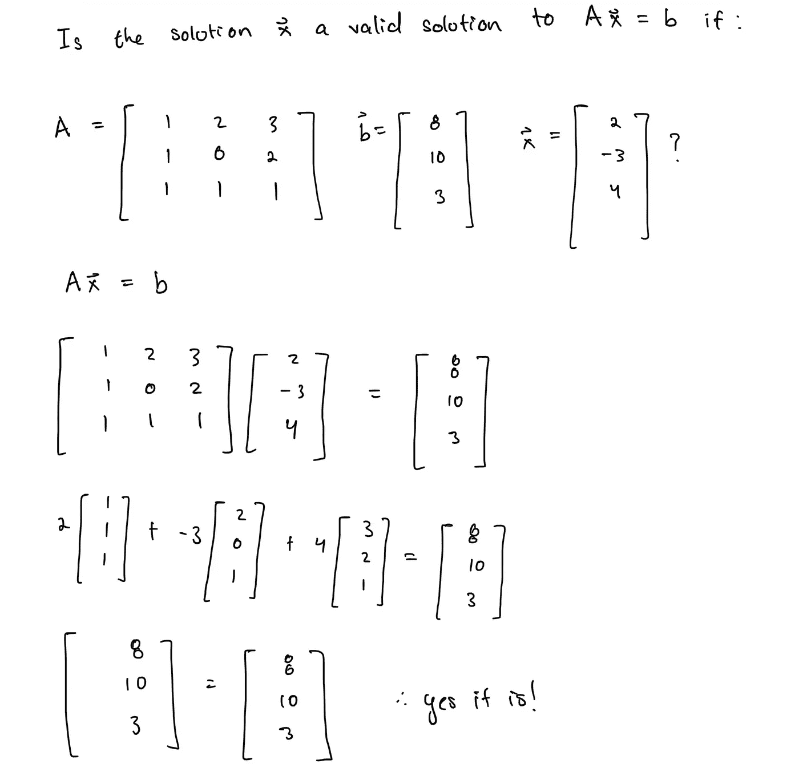
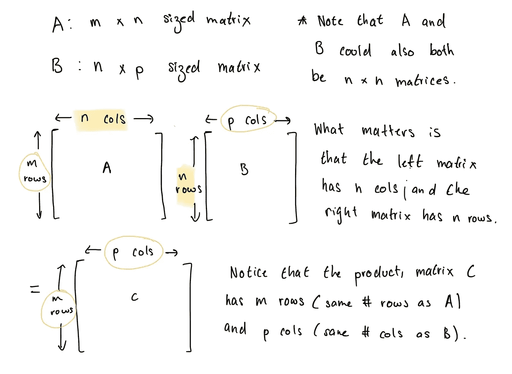
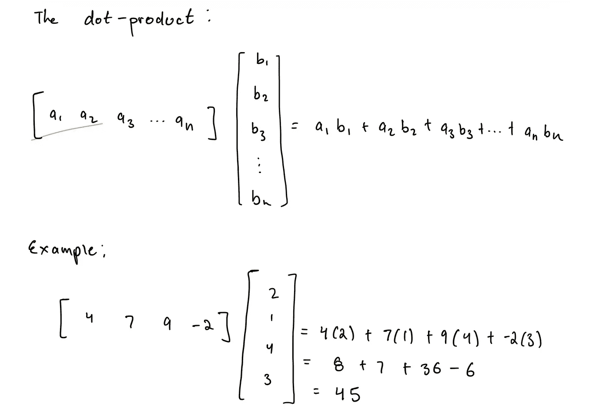
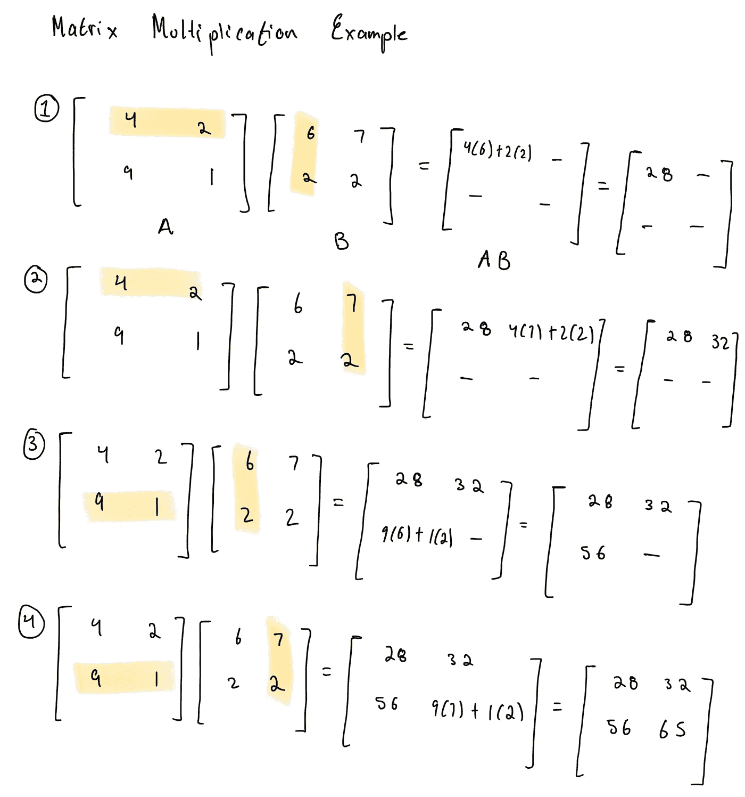

# 线性代数 4: 矩阵方程

> 原文：[`towardsdatascience.com/linear-algebra-4-matrix-equations-914ebb371950?source=collection_archive---------5-----------------------#2023-11-10`](https://towardsdatascience.com/linear-algebra-4-matrix-equations-914ebb371950?source=collection_archive---------5-----------------------#2023-11-10)

## 求解矩阵方程 Ax= b

 [tenzin migmar (t9nz)](https://medium.com/@t9nz?source=post_page-----914ebb371950--------------------------------)

·

[关注](https://medium.com/m/signin?actionUrl=https%3A%2F%2Fmedium.com%2F_%2Fsubscribe%2Fuser%2Fd6ff685c466&operation=register&redirect=https%3A%2F%2Ftowardsdatascience.com%2Flinear-algebra-4-matrix-equations-914ebb371950&user=tenzin+migmar+%28t9nz%29&userId=d6ff685c466&source=post_page-d6ff685c466----914ebb371950---------------------post_header-----------) 发表在 [Towards Data Science](https://towardsdatascience.com/?source=post_page-----914ebb371950--------------------------------) ·7 分钟阅读·2023 年 11 月 10 日

--

## 前言

欢迎回到我持续进行的线性代数基础系列的第四篇。在我之前的[文章](https://medium.com/@t9nz/linear-algebra-1-1-15b70e48bab9)中，我介绍了向量、线性组合和向量跨度。这篇文章将探讨矩阵方程 *A*x = **b**，并将展示如何通过矩阵方程解决线性方程组的原理。

这篇文章若与 David C. Lay、Steven R. Lay 和 Judi J. McDonald 的《线性代数及其应用》一书一同阅读，将更具价值。请将这个系列作为辅导资源来参考。

随时分享您的想法、问题和批评。

## 直观理解

我们上次讲述了线性组合的概念，我承诺这会有重要的意义。请回忆一下，给定向量 v₁, v₂, … vₐ在ℝⁿ中，以及标量（也称为权重）c₁, c₂, … cₐ，**线性组合**是由标量倍数的和定义的向量，c₁v₁ + c₂v₂ + … + cₐvₐ。¹

如果向量**b**是向量空间 Rⁿ中一组向量 v₁, v₂, .. vₐₚ的线性组合，那么存在一组权重 c₁, c₂, … cₐ（一种解决方案），使得 c₁v₁ + c₂v₂ + … + cₐvₐ = **b**。

要确定**b**是否是给定向量 v₁, v₂, .. vₐ的线性组合，我们将我们的向量排列成一组线性方程，然后创建一个增广矩阵，并使用行简化运算将矩阵化简为简化阶梯形式。如果简化阶梯形式有不一致性，也就是一行看起来像这样：[0, 0, … | **m**]其中**m** ≠ 0，那意味着我们的向量**b**不是向量组的线性组合，因为没有一组权重能使等式 c₁v₁ + c₂v₂ + … + cₐvₐ = **b**成立。

如果没有这样的不一致，那意味着我们可以将向量**b**写成一组向量的线性组合，比如上面的例子。你还记得我们如何在最后验证答案吗？我们会将每个向量乘以它的对应标量，然后找到向量和。如果向量和等于**b**，我们知道我们计算正确，并且**b**确实是一个线性组合。

这个验证过程就是矩阵方程*A*x = **b**的变形！

## *Ax = b*

如果*A*是一个*m* x *n*矩阵，而*x*属于 Rⁿ（你将会在下一节看到为什么*x*属于 Rⁿ很重要），那么乘积*A*x 就是矩阵*A*中向量（列）的线性组合，使用*x*中对应的标量。

注意这一切都不是新材料，我们在前一篇文章中不知不觉地计算了*A*x 来验证我们的线性组合。然而，矩阵方程*A*x = **b**仍然很重要，因为它将所有这些内容形式化为紧凑的符号，并且将在后续以新的方式重新出现。

现在我们知道，如果给定一个*m* x *n*矩阵*A*和向量*x*，并且我们计算矩阵乘积*A*x 等于**b**，那么**b**可以写成矩阵*A*中向量（列）和向量*x*中的标量/条目的线性组合。所以总结一下：方程*A*x = **b**只有一个解（x），如果 b 可以写成 A 的列向量的线性组合。

## 矩阵乘法

我已经将*A*x = **b**介绍为一个矩阵乘积，但我还没有解释矩阵乘法（这就是*A*x 的内容）！

**矩阵乘法** 是将两个矩阵相乘得到它们的乘积的操作。我们已经见过矩阵加法，即两个矩阵相加得到它们的和。为了使矩阵加法有定义，被加的两个矩阵，矩阵 A 和矩阵 B 必须具有相同的大小。类似地，矩阵乘法也有一个要求。要将矩阵 *A* 和矩阵 *B* 相乘得到 *AB*，矩阵 *A* 的列数必须等于矩阵 *B* 的行数。矩阵 *A* 和 *B* 的乘积，我们称为矩阵 *C*，其大小取决于矩阵 *A* 的行数和矩阵 *B* 的列数。矩阵 *C* 将有 m（矩阵 *A* 的行数）行和 p（矩阵 *B* 的列数）列。

那么，矩阵乘法是如何工作的呢？如果我们要计算矩阵 A 和 B 的乘积，那么乘积矩阵中第 i 行、第 j 列的每个元素是矩阵 A 第 i 行和矩阵 B 第 j 列的**点积**。

目前，你只需知道**点积**是两个向量对应元素的乘积之和，并且仅当两个向量具有相同数量的元素时才有定义。这个解释远不能充分说明点积的几何直觉，但我会在稍后详细说明。

简洁起见，我已计算了两个 2 x 2 矩阵的乘积，但同样的过程适用于任何大小的矩阵，只要矩阵符合矩阵乘法的条件，否则它们的乘积将未定义。

## 矩阵乘法的性质

如果 *A*、*B* 和 *C* 是 *n* x *n* 矩阵，**c** 和 **d** 是标量，那么以下性质成立。³

1.  *AB* **≠** BA（一般情况下不可交换）

1.  (AB)C = A(BC)（结合律）

1.  A(B+C) = AB + AC 和 (B+C)A = BA + CA（分配律）

1.  0A = 0（零的乘法性质）

注意矩阵乘法不是可交换的，这个性质可能需要一段时间才能理解，因为我们通常对实数的可交换性有直观的认知。

这些性质对于计算矩阵乘积非常有用，这将是线性代数中的一个重要主题。

## 结论

矩阵乘法是支持神经网络核心功能的基础数学操作，特别是在它们的前向传播和反向传播阶段。

在神经网络的前向传播阶段，数据通过其各个层进行处理，而矩阵乘法是这一操作的核心。神经网络中的每一层由神经元组成，它们表示为输入的加权和，接着是激活函数。这些加权和通过矩阵乘法计算得出。

在反向传播过程中，神经网络从其错误中学习。它调整神经元的权重以最小化预测输出与实际输出之间的误差。矩阵乘法再次成为此过程的关键组成部分，特别是在计算梯度时，梯度指示了每个权重应该如何调整以最小化误差。

学习数学本身就是一次令人兴奋的冒险，但是学习线性代数理论及其应用，可以使这段充满挑战的学习旅程更加鼓舞人心。

## 总结

在这一章中，我们学习了以下内容：

+   线性组合和矩阵乘积 *A*x = **b** 背后的直觉：矩阵乘积并非一个全新的概念，而是形式化了我们已经在使用的一个过程！

+   *A*x = **b**：如果**b**是矩阵*A*中向量（列）集合的线性组合，则矩阵乘积有解 x。

+   矩阵乘法：*A*x = **b** 的操作，在机器学习应用中广泛使用，特别是在神经网络中的具体例子。

+   矩阵乘法的属性：非交换性、结合律、分配律和零的乘法性质。

## 笔记

*除非另有说明，所有图片均由作者创建。

*抱歉让你久等了，我正在参加期中考试（包括线性代数哈哈！）。

¹线性组合的定义参考自《线性代数及其应用》第六版，作者为 David C. Lay、Steven R. Lay 和 Judi J. McDonald。

²矩阵乘积属性的定义参考自《线性代数及其应用》第六版，作者为 David C. Lay、Steven R. Lay 和 Judi J. McDonald。

³矩阵属性参考自[src](https://www.khanacademy.org/math/precalculus/x9e81a4f98389efdf:matrices/x9e81a4f98389efdf:properties-of-matrix-multiplication/a/properties-of-matrix-multiplication)。

