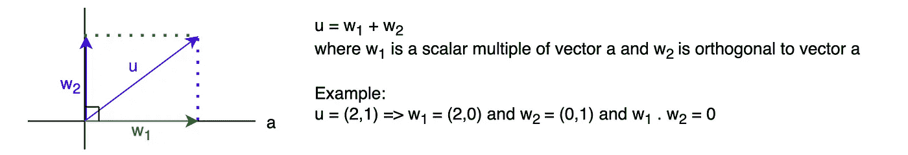

# 线性代数：正交向量

> 原文：[`towardsdatascience.com/linear-algebra-orthogonal-vectors-aaf26de8146a?source=collection_archive---------21-----------------------#2023-03-20`](https://towardsdatascience.com/linear-algebra-orthogonal-vectors-aaf26de8146a?source=collection_archive---------21-----------------------#2023-03-20)

## 第六部分：正交向量的温和介绍

 [Chao De-Yu](https://chaodeyu.medium.com/?source=post_page-----aaf26de8146a--------------------------------)

·

[关注](https://medium.com/m/signin?actionUrl=https%3A%2F%2Fmedium.com%2F_%2Fsubscribe%2Fuser%2F5b7be08f8f4c&operation=register&redirect=https%3A%2F%2Ftowardsdatascience.com%2Flinear-algebra-orthogonal-vectors-aaf26de8146a&user=Chao+De-Yu&userId=5b7be08f8f4c&source=post_page-5b7be08f8f4c----aaf26de8146a---------------------post_header-----------) 发表在 [Towards Data Science](https://towardsdatascience.com/?source=post_page-----aaf26de8146a--------------------------------) ·4 min read·2023 年 3 月 20 日

--

图片由 [Karsten Würth](https://unsplash.com/@karsten_wuerth) 提供，来源于 [Unsplash](https://unsplash.com)

上一篇文章讨论了欧几里得向量空间、内积、范数、距离和 Rⁿ 中的角度。本文将介绍正交向量、正交投影和向量的线性变换。

# 正交向量

图片 1\. R² 中的正交向量（作者提供的图片）

+   如果两个向量 u 和 v 满足 u.v = 0，则称它们为正交向量

+   如果 u 和 v 是具有欧几里得内积的正交向量，那么

# 正交投影

+   将向量映射到其在一条直线或一个平面上的正交投影

图片 2\. 正交投影。（图片来源：作者）

# 线性变换

+   函数 f 将 Rⁿ 映射到 Rᵐ，记作 **f: Rⁿ → Rᵐ**：

图片 3\. 将 Rⁿ 映射到 Rᵐ 的函数。（图片来源：作者）

+   如果所有的函数 fᵢ 都是线性的，那么……
