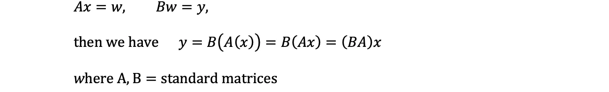
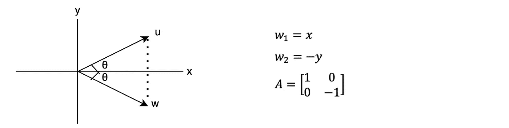
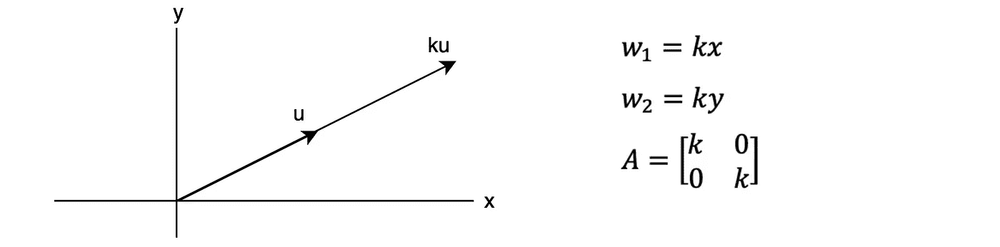
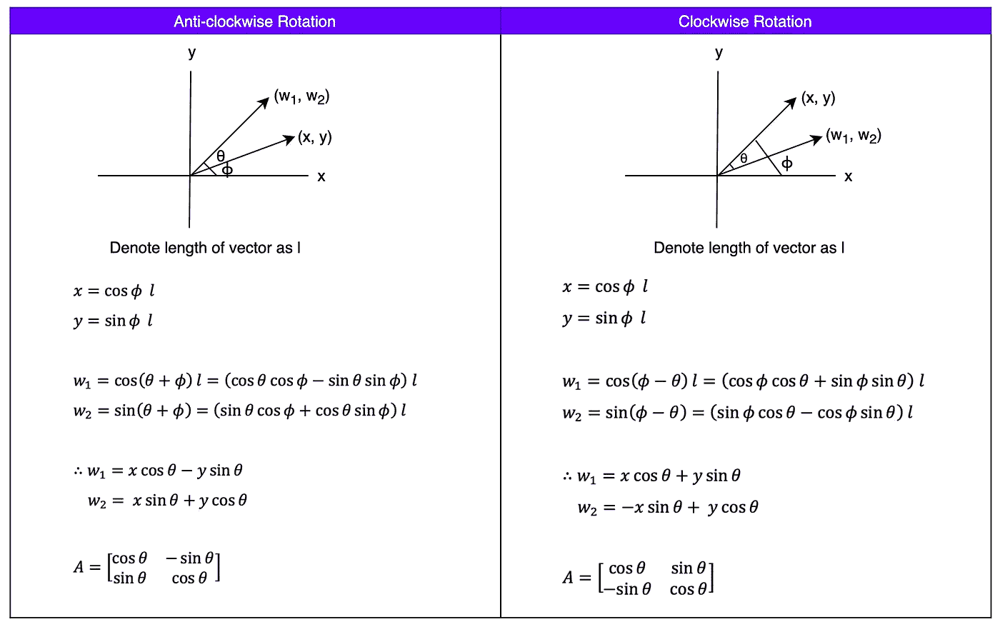
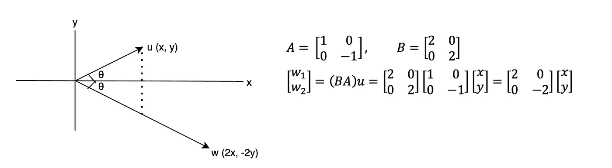

# 线性代数：正交向量

> 原文：[`towardsdatascience.com/linear-algebra-orthogonal-vectors-aaf26de8146a`](https://towardsdatascience.com/linear-algebra-orthogonal-vectors-aaf26de8146a)

## 第六部分：正交向量的温和介绍

 [Chao De-Yu](https://chaodeyu.medium.com/?source=post_page-----aaf26de8146a--------------------------------)

·发表于 [Towards Data Science](https://towardsdatascience.com/?source=post_page-----aaf26de8146a--------------------------------) ·阅读时间 4 分钟·2023 年 3 月 20 日

--

图片由 [Karsten Würth](https://unsplash.com/@karsten_wuerth) 提供，来源于 [Unsplash](https://unsplash.com)

上一篇文章讨论了欧几里得向量空间、内积、范数、距离和角度。本文将介绍正交向量、正交投影和向量的线性变换。

# 正交向量

图片 1\. R² 中的正交向量（作者提供的图片）

+   两个向量 u 和 v 如果满足 u.v = 0，则称它们是正交的

+   如果 u 和 v 是具有欧几里得内积的正交向量，则

# 正交投影

+   将一个向量映射到其在直线或平面上的正交投影

图片 2\. 正交投影。（作者提供的图片）

# 线性变换

+   函数 f 将 Rⁿ 映射到 Rᵐ，记作 **f: Rⁿ → Rᵐ**：

图片 3\. 将 Rⁿ 映射到 Rᵐ 的函数。（作者提供的图片）

+   如果所有的函数 fᵢ 都是线性的，那么变换 T 被称为线性变换，这些线性方程可以用矩阵形式 W = AX 表示。因此，上述变换可以写成：

图片 4\. 重新书写图片 3 中的线性变换。（作者提供的图片）

示例变换：

+   给定变换方程，w₁ = x₁ + x₂ + x₃，w₂ = x₁- x₂- x₃，该变换将 R³ 映射到 R²。

    T: R³ → R² (w₁, w₂) = T(x₁, x₂, x₃) = (x₁ + x₂ + x₃, x₁- x₂- x₃)

图片 5\. 上述线性变换的标准矩阵。（作者提供的图片）

# 线性变换的合成

+   如果 T₁: Rⁿ → Rᵏ 和 T₂: Rᵏ → Rᵐ 是线性变换，那么

图 6\. T₂ 和 T₁ 的组合。（图片来源：作者）

# 向量上的一些常见变换

## 反射

+   将一个向量映射到其关于一条直线或一个平面的对称图像

+   一个向量关于 x 轴的反射

给定 u = (x, y)

图 7\. 反射的示例。（图片来源：作者）

## 扩展或收缩

+   T(u) = ku 如果因子 k ≥ 1 则称为扩展，如果 0 ≤ k ≤ 1 则称为收缩。注意：k 是非负标量。

图 8\. 扩展因子 k ≥ 1 的示例。（图片来源：作者）

## 旋转

+   通过一个固定角度 θ 旋转一个向量

图 9\. 顺时针和逆时针旋转的示例。（图片来源：作者）

## 反射和扩展的组合

+   先对 x 轴进行反射，再进行因子为 2 的扩展。

图 10\. 反射和扩展（因子为 2）的组合。（图片来源：作者）

# 推荐阅读

[## 线性代数：线性方程组和矩阵，使用 Python](https://towardsdatascience.com/linear-algebra-systems-of-linear-equations-and-matrices-with-python-d3e0fcb29e85?source=post_page-----aaf26de8146a--------------------------------) [## 线性代数：线性方程组和矩阵，使用 Python](https://towardsdatascience.com/linear-algebra-systems-of-linear-equations-and-matrices-with-python-d3e0fcb29e85?source=post_page-----aaf26de8146a--------------------------------) [## 线性代数：线性方程组和矩阵，使用 Python

### 第一部分：解释线性代数的基本概念：线性方程组和矩阵

[## 线性代数：矩阵运算及其性质，使用 Python](https://towardsdatascience.com/linear-algebra-matrix-operations-and-their-properties-with-python-a0885a159be1?source=post_page-----aaf26de8146a--------------------------------) [## 线性代数：矩阵运算及其性质，使用 Python](https://towardsdatascience.com/linear-algebra-matrix-operations-and-their-properties-with-python-a0885a159be1?source=post_page-----aaf26de8146a--------------------------------) [## 线性代数：矩阵运算及其性质，使用 Python

### 第二部分：解释线性代数的基本概念：矩阵运算及其性质

[## 线性代数：使用 Python 求逆矩阵](https://towardsdatascience.com/linear-algebra-matrix-operations-and-their-properties-with-python-a0885a159be1?source=post_page-----aaf26de8146a--------------------------------) [## 线性代数：使用 Python 求逆矩阵](https://towardsdatascience.com/linear-algebra-finding-inverse-matrix-with-python-18dd988f4df?source=post_page-----aaf26de8146a--------------------------------) [## 线性代数：使用 Python 求逆矩阵

### 第三部分：使用初等行变换寻找逆矩阵的全面步骤指南

[## 线性代数：LU 分解，使用 Python](https://towardsdatascience.com/linear-algebra-finding-inverse-matrix-with-python-18dd988f4df?source=post_page-----aaf26de8146a--------------------------------) [## 线性代数：LU 分解，使用 Python](https://towardsdatascience.com/linear-algebra-lu-decomposition-with-python-5a7b3fd87f96?source=post_page-----aaf26de8146a--------------------------------) ## 线性代数：LU 分解，使用 Python

### 第四部分：使用 LU 分解求解线性系统的全面步骤指南

[towardsdatascience.com  ## 线性代数：欧几里得向量空间

### 第五部分：欧几里得向量空间的温和介绍

[towardsdatascience.com  [## 线性代数：一般向量空间

### 第七部分：对一般向量空间的全面介绍；子空间、基、秩和零度概念

[medium.com](https://medium.com/analytics-vidhya/linear-algebra-general-vector-space-0dd3d74e9070?source=post_page-----aaf26de8146a--------------------------------)  [## 线性代数：发现特征值和特征向量以进行对角化

### 第八部分：关于特征值和特征向量识别的深入系统讲解，以便于对角化…

[medium.com](https://medium.com/analytics-vidhya/linear-algebra-discovering-eigenvalues-and-eigenvectors-for-diagonalization-2c3090f9be44?source=post_page-----aaf26de8146a--------------------------------)

# 参考文献

[1] [正交性 — 维基百科](https://en.wikipedia.org/wiki/Orthogonality)

[2] 国防医学院讲座 — 朱伟达，[欧几里得向量空间，2008](https://www.cs.ccu.edu.tw/~wtchu/courses/2008f_LA/Lectures/Lecture%2012%20Euclidean%20Vector%20Space.pdf)

[3] 国防医学院讲座 — 朱伟达，[角度与正交性，2008](https://www.cs.ccu.edu.tw/~wtchu/courses/2008f_LA/Lectures/Lecture%2024%20Othogonality%20and%20Orthonormal%20Bases.pdf)
