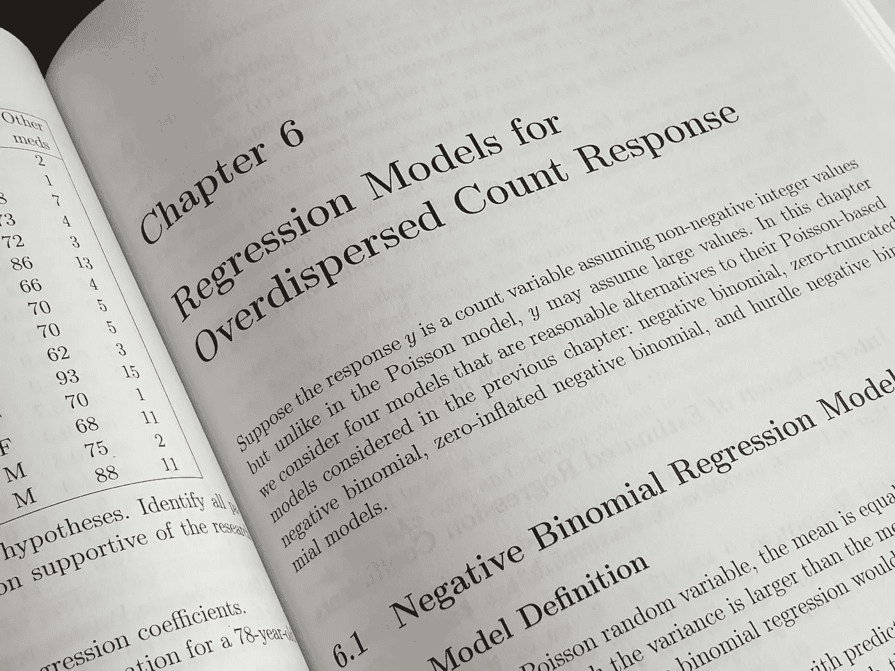

# 线性回归深入解析（第一部分）

> 原文：[`towardsdatascience.com/linear-regression-in-depth-part-1-485f997fd611?source=collection_archive---------5-----------------------#2023-04-18`](https://towardsdatascience.com/linear-regression-in-depth-part-1-485f997fd611?source=collection_archive---------5-----------------------#2023-04-18)

## 深入探讨线性回归模型的理论与实现

 [Dr. Roi Yehoshua](https://medium.com/@roiyeho?source=post_page-----485f997fd611--------------------------------)

·

[关注](https://medium.com/m/signin?actionUrl=https%3A%2F%2Fmedium.com%2F_%2Fsubscribe%2Fuser%2F3886620c5cf9&operation=register&redirect=https%3A%2F%2Ftowardsdatascience.com%2Flinear-regression-in-depth-part-1-485f997fd611&user=Dr.+Roi+Yehoshua&userId=3886620c5cf9&source=post_page-3886620c5cf9----485f997fd611---------------------post_header-----------) 发布在[Towards Data Science](https://towardsdatascience.com/?source=post_page-----485f997fd611--------------------------------) ·13 min read·Apr 18, 2023

--

照片由[Enayet Raheem](https://unsplash.com/@raheemsphoto?utm_source=unsplash&utm_medium=referral&utm_content=creditCopyText)在[Unsplash](https://unsplash.com/photos/3RQnQyyzA9c?utm_source=unsplash&utm_medium=referral&utm_content=creditCopyText)拍摄

线性回归是最基本和最常用的预测模型之一。它可以追溯到 1805 年，当时 Legendre 和 Gauss 使用线性回归来预测行星的运动。

在回归问题中，目标是基于其他变量的值来预测一个变量的值。例如，我们可以利用回归来预测股票价格，基于各种经济指标，或者公司总销售额，基于广告支出。

在线性回归中，我们假设给定的输入特征与目标标签之间存在线性关系，并试图找到这种关系的确切形式。

本文提供了线性回归模型理论和实现的全面指南。在文章的第一部分，我们将主要关注**简单线性回归**，其中数据集只包含一个特征（即，数据集由二维点组成）。在[文章的第二部分](https://medium.com/towards-data-science/linear-regression-in-depth-part-2-5d40fd19efd4)，我们将讨论**多元线性回归**，其中数据集可能包含多个特征。
