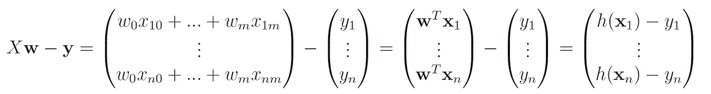
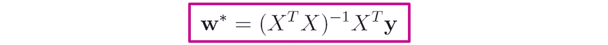

# 深入解析线性回归（第二部分）

> 原文：[`towardsdatascience.com/linear-regression-in-depth-part-2-5d40fd19efd4`](https://towardsdatascience.com/linear-regression-in-depth-part-2-5d40fd19efd4)

## 深入探讨多重线性回归及其在 Python 中的示例

[](https://medium.com/@roiyeho?source=post_page-----5d40fd19efd4--------------------------------)[](https://towardsdatascience.com/?source=post_page-----5d40fd19efd4--------------------------------) [Dr. Roi Yehoshua](https://medium.com/@roiyeho?source=post_page-----5d40fd19efd4--------------------------------)

·发表于 [Towards Data Science](https://towardsdatascience.com/?source=post_page-----5d40fd19efd4--------------------------------) ·14 分钟阅读·2023 年 4 月 25 日

--


图片来源：[ThisisEngineering RAEng](https://unsplash.com/@thisisengineering?utm_source=unsplash&utm_medium=referral&utm_content=creditCopyText) 在 [Unsplash](https://unsplash.com/photos/GzDrm7SYQ0g?utm_source=unsplash&utm_medium=referral&utm_content=creditCopyText)

在这篇文章的 [第一部分](https://medium.com/towards-data-science/linear-regression-in-depth-part-1-485f997fd611) 中，我们正式定义了线性回归问题，并展示了如何解决简单线性回归问题，即数据集仅包含一个特征。在文章的第二部分，我们将讨论多重线性回归问题，其中数据集可能包含任意数量的特征。

我们将首先将简单线性回归的封闭形式解推广到任意数量的特征。然后，我们将建议一种基于梯度下降的解决线性回归问题的替代方法，并讨论这种方法与使用封闭形式解的利弊。此外，我们将探讨 Scikit-Learn 中实现这两种方法的类，并演示如何在实际数据集上使用它们。

# 多重线性回归定义

回忆一下，在回归问题中，我们会给出一组 *n* 个标记示例： *D* = {(**x**₁, *y*₁), (**x**₂, *y*₂), … , (**x**ₙ, *y*ₙ)}, 其中 **x**ᵢ 是一个 *m* 维向量，包含示例 *i* 的 **特征**，*yᵢ* 是一个实值，表示该示例的 **标签**。

在 **线性回归** 问题中，我们假设特征向量 **x** 和标签 *y* 之间存在线性关系，因此我们的模型假设采取以下形式：


线性回归模型假设

我们的目标是找到该模型的参数 **w**，以最小化平方残差的总和：


最小二乘成本函数

在文章的前面部分，我们展示了如何使用**正规方程**找到当*m* = 1 时的最佳**w**。现在我们将扩展这些方程以适应任意数量的特征*m*。

为了简化正规方程在一般情况下的推导，我们首先定义一个矩阵*X*，它包含数据集中所有特征的值，包括截距项：


设计矩阵

这个矩阵称为**设计矩阵**。设计矩阵中的每一行表示一个单独的样本，列代表解释变量。矩阵的维度为*n* × (*m* + 1)，其中*n*是样本数量，*m*是特征数量。

此外，我们将向量**y**定义为一个包含所有目标值的*n*维向量：


目标向量

这些定义使我们能够以以下矩阵形式写出最小二乘成本函数：


矩阵形式的 OLS 成本函数

**证明**：

我们首先注意到：



向量与自身的点积**u**ᵗ**u**只是其所有分量平方的总和，因此我们有：


# 封闭解

与简单线性回归的情况一样，函数*J*(**w**)是凸的，因此它有一个唯一的局部最小值，这也是全局最小值。为了找到这个全局最小值，我们需要计算*J*(**w**)对**w**的梯度并将其设为零。

*J*(**w**)对**w**的梯度是：


在此证明过程中，我们使用了一些矩阵微积分的基本规则，这些规则在本文中有解释：

[](https://medium.com/@roiyeho/a-gentle-introduction-to-matrix-calculus-14584f2c4f60?source=post_page-----5d40fd19efd4--------------------------------) [## 矩阵微积分的温和介绍

### 包括在机器学习中的应用

medium.com](https://medium.com/@roiyeho/a-gentle-introduction-to-matrix-calculus-14584f2c4f60?source=post_page-----5d40fd19efd4--------------------------------)

我们现在将这个梯度设为零以得到正规方程：


因此，最小化最小二乘成本函数的最佳**w**是：



普通最小二乘的封闭解

请注意，我们在这里假设*X*的列是线性独立的（即*X*具有**满列秩**），否则*XᵗX*是不可逆的，并且**w**没有唯一解。

当*X*的列线性相关时，我们称这种现象为**多重共线性**。在数学上，如果对于所有样本*i*，一组变量是**完全多重共线**的：


完全多重共线性

其中*λₖ*是常数，*xᵢₖ*是样本*i*中特征*k*的值。

实际上，完全多重共线性很少见（例如，它可能是由于不小心重复了数据中的一个变量引起的）。然而，即使是较低程度的多重共线性，即两个或更多特征之间高度相关（但不是完全相关），也会在拟合模型时（系数对数据中的小变化非常敏感）和解释结果时（很难识别哪些特征对模型预测的影响最大）造成问题。

感兴趣的读者可以在这个[维基百科条目](https://en.wikipedia.org/wiki/Multicollinearity)中找到有关多重共线性问题及其处理方法的更多信息。

# 多重线性回归示例

为了演示闭式解的使用，让我们为[加州住房数据集](https://scikit-learn.org/stable/modules/generated/sklearn.datasets.fetch_california_housing.html#sklearn.datasets.fetch_california_housing)构建一个线性回归模型，该数据集可从 sklearn.datasets 模块获取。该数据集的目标是基于该区域的 8 个不同特征（如中位收入或每户的平均房间数）预测加州某个地区（房屋区块）的中位房价。

我们首先导入所需的库，并初始化随机种子，以便获得可重复的结果：

```py
import numpy as np
import pandas as pd
import matplotlib.pyplot as plt

np.random.seed(0)
```

然后，我们获取数据集：

```py
from sklearn.datasets import fetch_california_housing

data = fetch_california_housing()
X, y = data.data, data.target
feature_names = data.feature_names
```

为了探索数据集，我们将特征（X）和标签（y）合并到一个 Pandas DataFrame 中，并显示表格的前几行：

```py
mat = np.column_stack((X, y))
df = pd.DataFrame(mat, columns=np.append(feature_names, 'MedianValue'))
df.head()
```


加州住房数据集的前五行

我们可以通过调用 DataFrame 的[info()](https://pandas.pydata.org/docs/reference/api/pandas.DataFrame.info.html)方法进一步调查数据集，该方法提供有关列的类型以及是否包含任何缺失值的信息：

```py
df.info()
```


幸运的是，这个数据集只包含数值特征且没有缺失值。因此，这里不需要数据预处理（闭式解不需要数据的归一化）。

接下来，我们需要向矩阵*X_train*中添加一列 1，以表示截距项。这可以通过函数[np.column_stack](https://numpy.org/doc/stable/reference/generated/numpy.column_stack.html)()轻松完成：

```py
X_with_bias = np.column_stack((np.ones(len(X)), X))
```

我们现在将数据划分为 80%的训练集和 20%的测试集：

```py
from sklearn.model_selection import train_test_split

X_train, X_test, y_train, y_test = train_test_split(X_with_bias, y, test_size=0.2, random_state=0)
```

现在，让我们编写一个通用函数，使用我们之前找到的闭式解来找到任何给定数据集的最佳**w***：

```py
def closed_form_solution(X, y):
    w = np.linalg.inv(X.T @ X) @ X.T @ y
    return w 
```

闭式解法可以用一行代码实现！

让我们使用这个函数来找到我们训练集的最优 **w***：

```py
w = closed_form_solution(X_train, y_train)
print(w)
```

最优的 **w*** 是：

```py
[-3.68585691e+01  4.33333407e-01  9.29324337e-03 -9.86433739e-02
  5.93215487e-01 -7.56192502e-06 -4.74516383e-03 -4.21449336e-01
 -4.34166041e-01]
```

这个向量中的第一个分量是截距 (*w*₀)，其余的是数据集中八个特征的系数。

现在让我们在训练集和测试集上评估模型。评估模型在这两者上的表现是很重要的，因为训练分数和测试分数之间的较大差异可能表明你的模型存在过拟合现象。

我们首先在训练集上找到 *R*² 分数。为此，我们首先通过将矩阵 *X_train_b* 乘以向量 **w** 来获取模型在训练示例上的预测：

```py
y_train_pred = X_train @ w
```

我们现在使用来自 sklearn.metrics 的 [r2_score](https://scikit-learn.org/stable/modules/generated/sklearn.metrics.r2_score.html)() 函数来找到训练集上的 *R*² 分数：

```py
from sklearn.metrics import r2_score

train_score = r2_score(y_train, y_train_pred)
print(f'R2 score (train): {train_score:.4f}')
```

我们得到的分数是：

```py
R2 score (train): 0.6089
```

让我们在测试集上做同样的操作：

```py
y_test_pred = X_test @ w

test_score = r2_score(y_test, y_test_pred)
print(f'R2 score (test): {test_score:.4f}')
```

我们得到的分数是：

```py
R2 score (test): 0.5943
```

分数不高，这表明特征与标签之间的关系可能不是线性的。在这种情况下，非线性回归模型，如 [回归树](https://medium.com/@roiyeho/decision-trees-part-2-72adc626cca7) 或 k-近邻算法可以提供更好的结果。

## 练习

假设我们不小心将数据集中每个点都重复了一次，然后再次运行线性回归。这将如何影响模型的权重？

*提示*：考虑一下设计矩阵 *X* 和标签向量 **y** 将会发生什么变化，以及这些变化如何影响正规方程。

解决方案可以在本文的最后找到。

# Scikit-Learn 中的线性回归

Scikit-Learn 提供了一个名为 [LinearRegression](https://scikit-learn.org/stable/modules/generated/sklearn.linear_model.LinearRegression.html) 的类，它也实现了普通最小二乘问题的闭式解法。

默认情况下，该类会自动将一列 1 添加到设计矩阵中，因此你不需要像我们之前那样手动添加（除非在构造函数中将参数 *fit_intercept* 设置为 False）。因此，我们需要重新将原始数据集（没有额外的 1）拆分为训练集和测试集：

```py
X_train, X_test, y_train, y_test = train_test_split(X, y, test_size=0.2, random_state=0)
```

让我们创建一个 LinearRegression 类的实例，并将其拟合到训练集上：

```py
from sklearn.linear_model import LinearRegression

reg = LinearRegression()
reg.fit(X_train, y_train)
```

拟合的参数向量 **w** 被存储在该类的两个属性中：

+   *coef_* 是一个包含所有权重的数组，除了截距项

+   *intercept_* 是截距项 (*w*₀)

让我们打印它们：

```py
print(reg.intercept_)
print(reg.coef_)
```

输出是：

```py
-36.858569106801234
[ 4.33333407e-01  9.29324337e-03 -9.86433739e-02  5.93215487e-01
 -7.56192502e-06 -4.74516383e-03 -4.21449336e-01 -4.34166041e-01]
```

我们得到的系数与在 NumPy 中计算的完全一样。

[score()](https://scikit-learn.org/stable/modules/generated/sklearn.linear_model.LinearRegression.html#sklearn.linear_model.LinearRegression.score)方法返回模型的*R*²分数。它只需要*X*矩阵和数据集**y**的向量（因此不需要计算模型的预测）。例如，我们可以如下获得训练集和测试集的*R*²分数：

```py
train_score = reg.score(X_train, y_train)
print(f'R2 score (train): {train_score:.4f}')

test_score = reg.score(X_test, y_test)
print(f'R2 score (test): {test_score:.4f}')
```

```py
R2 score (train): 0.6089
R2 score (test): 0.5943
```

正如预期的那样，我们获得了与之前相同的*R*²分数。

# 回归误差分析

除了评估模型的整体性能，我们通常还希望研究回归误差的行为。例如，误差是否围绕 0 正态分布，还是有偏？是否存在模型预测误差特别大的输入？

对这些问题的回答将帮助我们找到这些错误的来源。例如，如果误差没有围绕 0 正态分布，这可能表明线性回归模型不适合我们的数据集，我们需要尝试其他回归模型（例如多项式回归）。或者，如果我们的模型在某些样本上的预测误差特别高，这些样本可能是异常值，我们需要调查它们的来源。

一个可以帮助你回答这些问题的图称为**残差图**。该图显示了*y*轴上的残差与模型在*x*轴上的预测值。

让我们编写一个函数来创建这个图：

```py
def plot_residuals(y_train_pred, y_train, y_test_pred, y_test):
    plt.scatter(y_train_pred, y_train_pred - y_train, s=2, marker='o', c='b', label='Training')    
    plt.scatter(y_test_pred, y_test_pred - y_test, s=2, marker='s', c='m', label='Test') 

    xmin = min(y_train_pred.min(), y_test_pred.min())
    xmax = max(y_train_pred.max(), y_test_pred.max())
    plt.hlines(y=0, xmin=xmin, xmax=xmax, color='black')    

    plt.xlim(xmin, xmax)
    plt.xlabel('Predicted values')
    plt.ylabel('Residuals')
    plt.legend()
```

现在我们可以调用这个函数，展示训练集和测试集的残差：

```py
plot_residuals(y_train_pred, y_train, y_test_pred, y_test)
```


我们可以看到，大多数误差围绕 0 对称分布，但在输入范围的远端有一些异常值，这可能需要进一步调查。

## 练习

从 Kaggle 下载[学生成绩数据集](https://www.kaggle.com/datasets/yasserh/student-marks-dataset)。建立一个线性回归模型，以根据学生的学习时间和课程数量预测成绩。计算模型在训练集和测试集上的 RMSE 和*R*²分数。绘制残差与预测值的关系图。你能从这个图中学到什么？

# 梯度下降

尽管闭式解法为我们提供了一种直接找到回归模型最佳参数的方法，但它也有一些缺点：

1.  当我们有大量特征时，闭式解法在计算上效率低下，因为它需要计算*XᵗX*的逆，这是一个*m* × *m*的矩阵（*m*是特征的数量）。在大多数实现中，计算矩阵的逆的时间复杂度为*O*(*m*³)。

1.  它需要将整个设计矩阵*X*保存在内存中，这在数据集非常大的情况下并不总是可行。

1.  它不支持在线（增量）学习，因为任何对设计矩阵*X*的更改都需要重新计算*XᵗX*的逆。

值得庆幸的是，还有一种找到最佳 **w** 的替代方法，即 **梯度下降**。梯度下降是一种迭代方法，用于找到函数的最小值，其中我们在梯度的相反方向上迈出小步，以接近最小值：


梯度下降

为了使用梯度下降来找到最小二乘成本的最小值，我们需要计算 *J*(**w**) 对每个权重的偏导数。

*J*(**w**) 对任何权重 *wⱼ* 的偏导数是：


因此，梯度下降更新规则是：


梯度下降更新规则

其中 *α* 是一个控制步长的学习率（0 < *α* < 1）。

我们可以一步更新整个向量**w**，而不是单独更新每个组件。


向量形式的梯度下降更新规则

梯度下降可以应用于以下模式之一：

1.  **批量梯度下降** — 在计算整个训练集的误差后更新权重。

1.  **随机梯度下降（SGD）** — 在每个训练样本后执行一次梯度下降步骤。在这种情况下，梯度下降更新规则如下：


SGD 更新规则

相较于批量梯度下降，SGD 通常收敛更快，因为它在每个样本后都取得进展，并且它也支持在线学习，因为它可以一次处理一个新数据点。另一方面，SGD 比批量梯度下降不那么稳定，其收敛到全局最优解的保证并不确定（尽管在实践中它非常接近最优解）。

请注意，每当使用梯度下降时，必须确保数据集是 **标准化** 的（否则梯度下降可能在不同方向上采取不同大小的步骤，从而导致不稳定）。

# SGDRegressor 类

Scikit-Learn 中的 [SGDRegressor](https://scikit-learn.org/stable/modules/generated/sklearn.linear_model.SGDRegressor.html) 类实现了用于拟合线性回归模型的 SGD 方法。

这个类的重要超参数是：

+   *loss* — 用作优化目标的损失函数。该参数的选项包括：*squared_error*（平方损失，这是默认选项）、*huber*（Huber 损失）和 *epsilon_intensive*（支持向量回归中的损失函数）。这些损失函数之间的区别在[这篇文章](https://medium.com/towards-data-science/loss-functions-in-machine-learning-9977e810ac02)中有说明。

+   *penalty* — 使用的正则化类型（默认为‘l2’）。

+   *alpha* — 正则化系数（默认为 0.0001）。

+   *max_iter —* 训练数据上的最大迭代次数（默认为 1000）。

+   *learning_rate* — 权重更新的学习率调度（默认为‘invscaling’）。

+   *eta0 —* 使用的初始学习率（默认为 0.01）。

+   *early_stopping —* 是否在验证分数没有改善时停止训练（默认为 False）。

+   *validation_fraction* — 从训练集中抽取用于验证的比例（默认为 0.1）。

由于我们需要在使用 SGD 之前规范化数据，因此我们将创建一个[管道](https://medium.com/@roiyeho/pipelines-in-scikit-learn-46c61c5c60b2)，该管道包括两个步骤：

1.  一个[StandardScaler](https://scikit-learn.org/stable/modules/generated/sklearn.preprocessing.StandardScaler.html)，它通过去除均值并将特征缩放到单位方差来规范化特征。

1.  使用默认设置的 SGDRegressor。

```py
from sklearn.preprocessing import StandardScaler
from sklearn.linear_model import SGDRegressor
from sklearn.pipeline import Pipeline

pipeline = Pipeline([
    ('scaler', StandardScaler()),
    ('reg', SGDRegressor())
])
```

让我们将管道拟合到我们的训练集：

```py
pipeline.fit(X_train, y_train)
```

现在让我们在训练集和测试集上评估模型：

```py
train_score = pipeline.score(X_train, y_train)
print(f'R2 score (train): {train_score:.4f}')

test_score = pipeline.score(X_test, y_test)
print(f'R2 score (test): {test_score:.4f}')
```

我们得到的分数是：

```py
R2 score (train): -511.0496
R2 score (test): -4735.6157
```

这些是非常差的分数！刚刚发生了什么？

当你使用梯度下降法得到如此差的分数时，通常意味着你的学习率过高，这导致算法在最小值的两侧之间震荡：


由于学习率过高导致梯度下降法的震荡

让我们将学习率从 0.01 降低到 0.001，通过更改 SGDRegressor 的*eta0*参数：

```py
pipeline.set_params(reg__eta0=0.001)
```

让我们重新拟合训练集并重新评估：

```py
pipeline.fit(X_train, y_train)
```

```py
train_score = pipeline.score(X_train, y_train)
print(f'R2 score (train): {train_score:.4f}')

test_score = pipeline.score(X_test, y_test)
print(f'R2 score (test): {test_score:.4f}')
```

我们这次得到的分数是：

```py
R2 score (train): 0.6018
R2 score (test): 0.5841
```

这些分数类似于我们使用闭式解得到的*R*²分数（这些分数略低，因为 SGD 接近全局最小值，但未达到最小值本身）。

# 关键要点

+   在线性回归中，我们试图找到一组特征与目标变量之间的线性关系。

+   关键假设是特征线性无关，且误差项彼此独立且正态分布，均值为零。

+   在普通最小二乘（OLS）回归中，我们试图最小化残差的平方和。OLS 的成本函数是凸的，因此具有一个最小点。

+   寻找模型最佳参数的两种主要方法是闭式解和梯度下降法。当数据集很大或需要支持在线学习时，梯度下降法更受青睐。

+   在使用梯度下降法时，重要的是规范化你的特征并选择合适的学习率。

+   我们使用*R*²分数评估回归模型的性能，该分数在 0 到 1 之间变化，衡量模型比始终预测目标均值的基准模型好多少，以及 RMSE，即均方误差的平方根。

## 重复数据练习的解决方案

回忆一下，闭式解为：


如果我们加倍数据点，那么代替 *X* 和**y**，我们将有以下设计矩阵和目标向量：


矩阵*A*有 2*n*行和*m*列，其中矩阵的第 1 行到第*n*行与第*n* + 1 行到第 2*n*行相同。类似地，向量**z**有 2*n*行，其中前*n*行与最后*n*行相同。

我们可以很容易地证明


**证明**：


类似地，我们有（我们可以将**z**视为具有一列的矩阵）：


因此，我们可以写成：


我们得到与原始模型相同的权重！也就是说，回归模型不会改变。

## 最后的说明

除非另有说明，所有图片均为作者提供。

你可以在我的 github 上找到本文的代码示例：[`github.com/roiyeho/medium/tree/main/multiple_linear_regression`](https://github.com/roiyeho/medium/tree/main/multiple_linear_regression)

感谢阅读！
