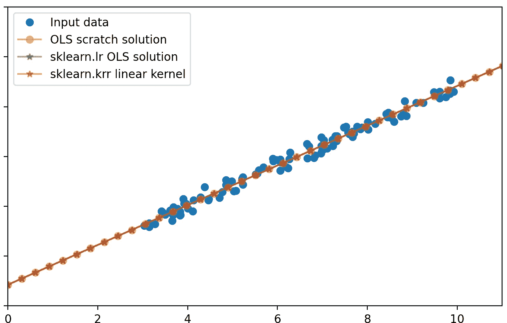
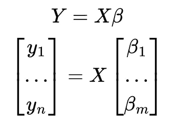

# 线性回归、核技巧和线性核。

> 原文：[`towardsdatascience.com/linear-regression-kernel-trick-and-linear-kernel-39b6be3a3bf5?source=collection_archive---------5-----------------------#2023-11-05`](https://towardsdatascience.com/linear-regression-kernel-trick-and-linear-kernel-39b6be3a3bf5?source=collection_archive---------5-----------------------#2023-11-05)

## 有时候，核技巧是无用的。

 [Yoann Mocquin](https://mocquin.medium.com/?source=post_page-----39b6be3a3bf5--------------------------------)

·

[关注](https://medium.com/m/signin?actionUrl=https%3A%2F%2Fmedium.com%2F_%2Fsubscribe%2Fuser%2F173731d06320&operation=register&redirect=https%3A%2F%2Ftowardsdatascience.com%2Flinear-regression-kernel-trick-and-linear-kernel-39b6be3a3bf5&user=Yoann+Mocquin&userId=173731d06320&source=post_page-173731d06320----39b6be3a3bf5---------------------post_header-----------) 发表在 [Towards Data Science](https://towardsdatascience.com/?source=post_page-----39b6be3a3bf5--------------------------------) · 8 分钟阅读 · 2023 年 11 月 5 日 

--

除非另有说明，否则所有图片均由作者提供

在这篇文章中，我想展示一个最初对我而言并不明显的有趣结果，具体如下：

> 线性回归和无正则化的线性核岭回归是等效的。

实际上，这里涉及了很多概念和技术，因此我们将逐一回顾每个概念，最后将它们结合起来解释这个声明。

**首先，我们将回顾经典线性回归。然后我将解释什么是核技巧和线性核，最后我们将展示上述声明的数学证明。**

# 对经典线性回归的快速回顾

## 线性回归的数学

经典的 — 普通最小二乘法（OLS）线性回归问题如下：

其中：

+   Y 是一个长度为 n 的向量，包含线性模型的目标值。

+   beta 是一个长度为 m 的向量：这是模型中的未知数…
