# 线性回归、核技巧和线性核。

> 原文：[`towardsdatascience.com/linear-regression-kernel-trick-and-linear-kernel-39b6be3a3bf5`](https://towardsdatascience.com/linear-regression-kernel-trick-and-linear-kernel-39b6be3a3bf5)

## 有时核技巧是无用的。

[](https://mocquin.medium.com/?source=post_page-----39b6be3a3bf5--------------------------------)[](https://towardsdatascience.com/?source=post_page-----39b6be3a3bf5--------------------------------) [Yoann Mocquin](https://mocquin.medium.com/?source=post_page-----39b6be3a3bf5--------------------------------)

·发表于 [Towards Data Science](https://towardsdatascience.com/?source=post_page-----39b6be3a3bf5--------------------------------) ·8 分钟阅读·2023 年 11 月 5 日

--


除非另有说明，所有图片均由作者提供

在这篇文章中，我想展示一个起初对我来说并不明显的有趣结果，即：

> 线性回归和没有正则化的线性核岭回归是等价的。

实际上涉及了很多概念和技术，因此我们将逐一回顾每一个，最后综合使用它们来解释这一说法。

**首先，我们将回顾经典的线性回归。然后我将解释核技巧和线性核是什么，最后我们将展示上述陈述的数学证明。**

# 快速回顾经典的线性回归

## 线性回归的数学

经典的——普通最小二乘法（OLS）线性回归是以下问题：


其中：

+   Y 是一个长度为 n 的向量，包含线性模型的目标值

+   beta 是一个长度为 m 的向量：这是模型需要“学习”的未知量

+   X 是一个数据矩阵，具有 n 行和 m 列。我们通常说我们在 m 特征空间中记录了 n 个向量

所以目标是找到使平方误差最小化的 beta 值：

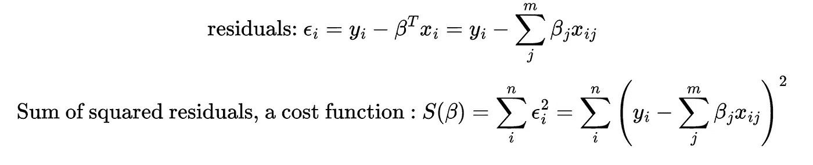

这个问题实际上有一个封闭形式的解，被称为普通最小二乘问题。解为：


一旦知道了解决方案，我们可以使用拟合模型计算给定新 X 值时的新 Y 值，使用：

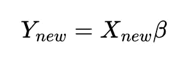

## 线性回归的 Python 实现

让我们用 scikit-learn 验证我们的数学：这里有一个 Python 代码示例，展示了如何使用 sklearn 的线性回归器以及基于 numpy 的回归

```py
%matplotlib qt
import numpy as np
import matplotlib.pyplot as plt
from sklearn.linear_model import LinearRegression

np.random.seed(0)
n = 100
X_ = np.random.uniform(3, 10, n).reshape(-1, 1)
beta_0 = 2
beta_1 = 2
true_y = beta_1 * X_ + beta_0
noise = np.random.randn(n, 1) * 0.5 # change the scale to reduce/increase noise
y = true_y + noise

fig, axes = plt.subplots(1, 2, squeeze=False, sharex=True, sharey=True, figsize=(18, 8))
axes[0, 0].plot(X_, y, "o", label="Input data")
axes[0, 0].plot(X_, true_y, '--', label='True linear relation')
axes[0, 0].set_xlim(0, 11)
axes[0, 0].set_ylim(0, 30)
axes[0, 0].legend()

# f_0 is a column of 1s
# f_1 is the column of x1
X = np.c_[np.ones((n, 1)), X_]

beta_OLS_scratch = np.linalg.inv(X.T @ X) @ X.T @ y
lr = LinearRegression(
    fit_intercept=False, # do not fit intercept independantly, since we added the 1 column for this purpose
).fit(X, y)

new_X = np.linspace(0, 15, 50).reshape(-1, 1)
new_X = np.c_[np.ones((50, 1)), new_X]
new_y_OLS_scratch = new_X @ beta_OLS_scratch 
new_y_lr = lr.predict(new_X)
axes[0, 1].plot(X_, y, 'o', label='Input data')
axes[0, 1].plot(new_X[:, 1], new_y_OLS_scratch, '-o', alpha=0.5,  label=r"OLS scratch solution")
axes[0, 1].plot(new_X[:, 1], new_y_lr, '-*', alpha=0.5, label=r"sklearn.lr OLS solution")
axes[0, 1].legend()
fig.tight_layout()
print(beta_OLS_scratch)
print(lr.coef_)
```

```py
[[2.12458946]
 [1.99549536]]
[[2.12458946 1.99549536]]
```

如你所见，这两种方法给出了相同的结果（显然！）：

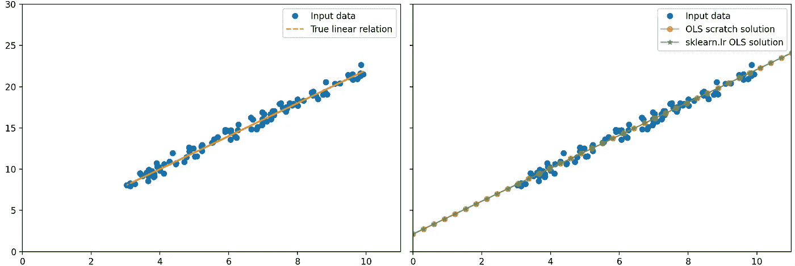

# 核技巧

现在让我们回顾一种常见的技术，称为核技巧。

思路如下：

我们原始的问题（可以是分类或回归等）存在于输入数据矩阵 X 的空间中，形状为 m 特征空间中的 n 向量。有时，向量在这个低维空间中无法分离或分类，因此我们希望将输入数据转换到高维空间。我们可以手动创建新的特征来实现这一点。随着特征数量的增加，数值计算也会增加：想象一下计算两个长度为 10 亿的向量的点积，并对矩阵中的所有向量重复这一过程。

核技巧的核心在于使用精心设计的变换函数——通常记作 T 或 phi——它将长度为 m 的向量 x 转换为长度为 m'的新向量 x'，使得我们的新数据确实具有高维，但计算负担保持在最低限度。

为了实现这一点，函数 phi 必须满足一些属性，以便新高维特征空间中的点积可以写成一个函数——即核函数——关于相应的输入向量：

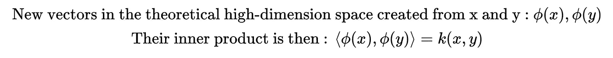

这意味着高维空间中的内积可以表示为输入向量的函数。换句话说，我们可以仅使用低维向量来计算高维空间中的内积。这就是核技巧：我们可以利用高维空间的多样性，而无需实际在该空间中进行计算。

唯一的条件是我们只需要高维空间中的点积。

实际上，有一些强大的数学定理描述了创建这种变换 phi 和/或核函数的条件。

## 核函数示例

创建 m² 维空间的第一个核函数示例如下：

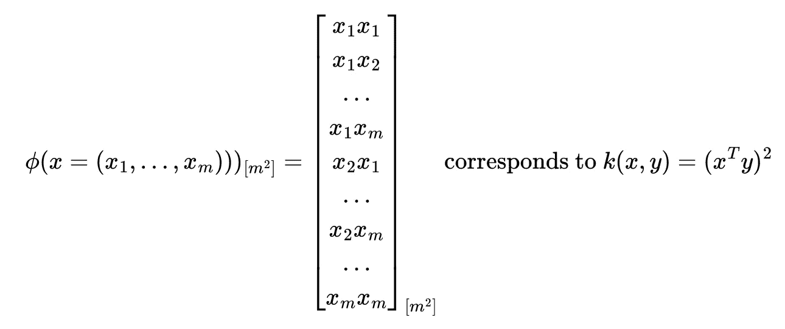

另一个例子：在核函数中添加常数会增加维度，生成新的特征，这些特征是缩放的输入特征：

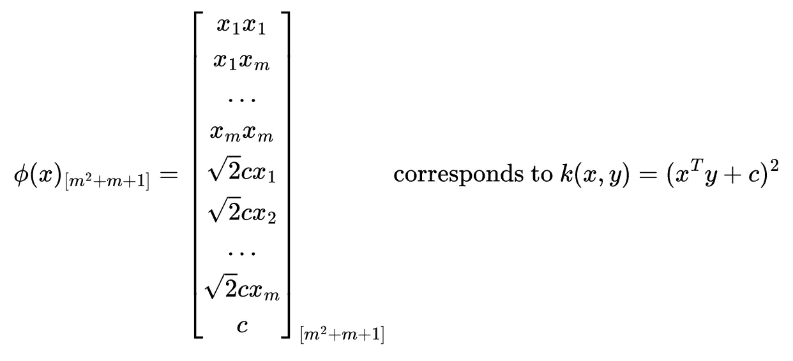

另一个我们下面将使用的核是线性核：

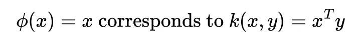

因此，单位变换等同于使用一个在原始空间中计算内积的核函数。

实际上，还有很多其他有用的核函数，比如径向基（RBF）核或更通用的多项式核，它们创建高维且非线性的特征空间。为了完整性，这里有一个使用 RBF 核在线性回归背景下计算非线性回归的例子：

```py
import numpy as np
from sklearn.kernel_ridge import KernelRidge
import matplotlib.pyplot as plt

np.random.seed(0)
X = np.sort(5 * np.random.rand(80, 1), axis=0)
y = np.sin(X).ravel()
y[::5] += 3 * (0.5 - np.random.rand(16))

# Create a test dataset
X_test = np.arange(0, 5, 0.01)[:, np.newaxis]

# Fit the KernelRidge model with an RBF kernel
kr = KernelRidge(
    kernel='rbf', # use RBF kernel
    alpha=1, # regularization 
    gamma=1, # scale for rbf
)
kr.fit(X, y)

y_rbf = kr.predict(X_test)

# Plot the results
fig, ax = plt.subplots()
ax.scatter(X, y, color='darkorange', label='Data')
ax.plot(X_test, y_rbf, color='navy', lw=2, label='RBF Kernel Ridge Regression')
ax.set_title('Kernel Ridge Regression with RBF Kernel')
ax.legend() 
```

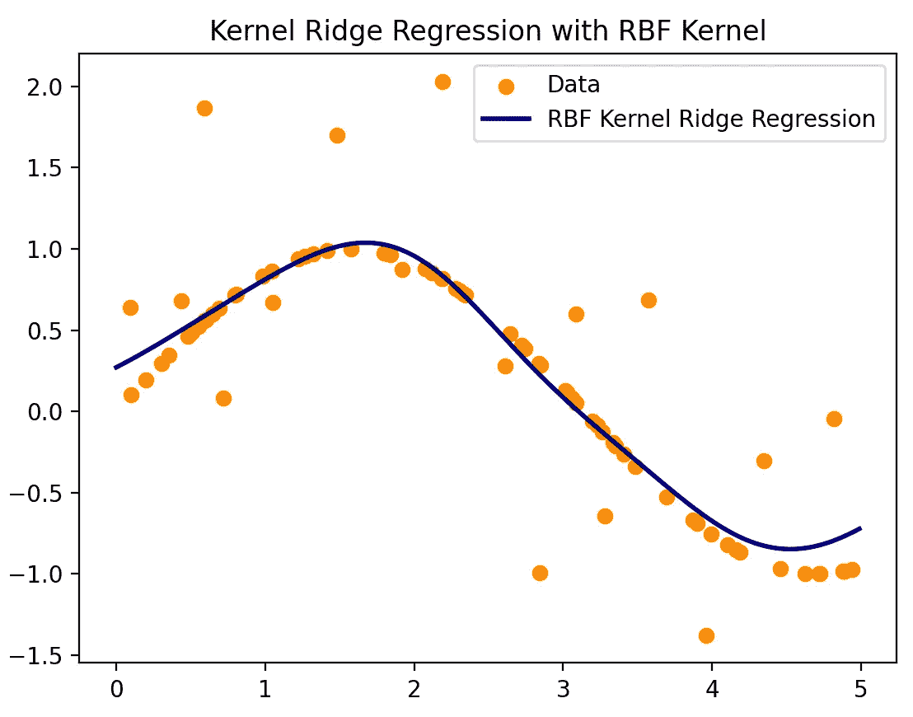

# 线性回归中的线性核

如果变换 phi 将 x 转换为 phi(x)，那么我们可以写出一个新的线性回归问题：

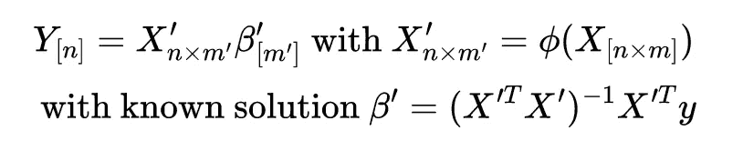

注意维度的变化：线性回归问题的输入矩阵从 [nxm] 变为 [nxm’]，因此系数向量 beta 从长度 m 变为 m’。

这就是核技巧出现的地方：在计算解 beta’ 时，注意到 X’ 与其转置的乘积出现，这实际上是所有点积的矩阵，称为核矩阵，原因显而易见：

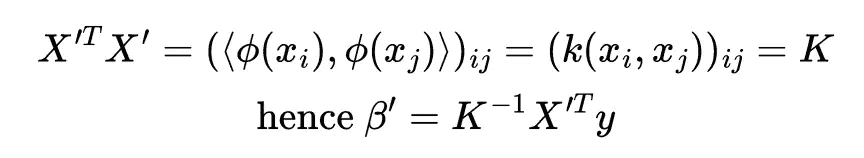

# 线性核化和线性回归

最后，让我们看看原始陈述的证明：使用线性核在线性回归中是无用的，因为它等同于标准线性回归。

线性核通常在支持向量机的背景下使用，但我想知道它在线性回归中会表现如何。

为了证明这两种方法是等价的，我们必须证明：

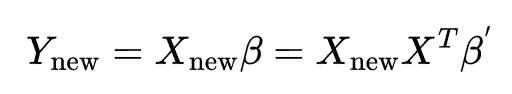

使用 beta 的第一种方法是原始线性回归，而使用 beta’ 的第二种方法是使用线性核化方法。

我们实际上可以使用上面看到的矩阵属性和关系来证明这一点：

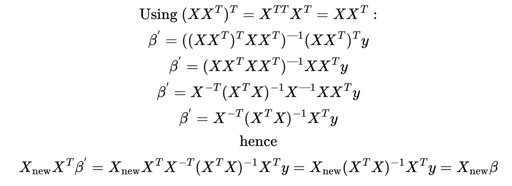

我们可以再次使用 Python 和 scikit-learn 来验证这一点：

```py
%matplotlib qt
import numpy as np
import matplotlib.pyplot as plt
from sklearn.linear_model import LinearRegression

np.random.seed(0)
n = 100
X_ = np.random.uniform(3, 10, n).reshape(-1, 1)
beta_0 = 2
beta_1 = 2
true_y = beta_1 * X_ + beta_0
noise = np.random.randn(n, 1) * 0.5 # change the scale to reduce/increase noise
y = true_y + noise

fig, axes = plt.subplots(1, 2, squeeze=False, sharex=True, sharey=True, figsize=(18, 8))
axes[0, 0].plot(X_, y, "o", label="Input data")
axes[0, 0].plot(X_, true_y, '--', label='True linear relation')
axes[0, 0].set_xlim(0, 11)
axes[0, 0].set_ylim(0, 30)
axes[0, 0].legend()

# f_0 is a column of 1s
# f_1 is the column of x1
X = np.c_[np.ones((n, 1)), X_]

beta_OLS_scratch = np.linalg.inv(X.T @ X) @ X.T @ y
lr = LinearRegression(
    fit_intercept=False, # do not fit intercept independantly, since we added the 1 column for this purpose
).fit(X, y)

new_X = np.linspace(0, 15, 50).reshape(-1, 1)
new_X = np.c_[np.ones((50, 1)), new_X]
new_y_OLS_scratch = new_X @ beta_OLS_scratch 
new_y_lr = lr.predict(new_X)
axes[0, 1].plot(X_, y, 'o', label='Input data')
axes[0, 1].plot(new_X[:, 1], new_y_OLS_scratch, '-o', alpha=0.5,  label=r"OLS scratch solution")
axes[0, 1].plot(new_X[:, 1], new_y_lr, '-*', alpha=0.5, label=r"sklearn.lr OLS solution")
axes[0, 1].legend()
fig.tight_layout()
print(beta_OLS_scratch)
print(lr.coef_)
```

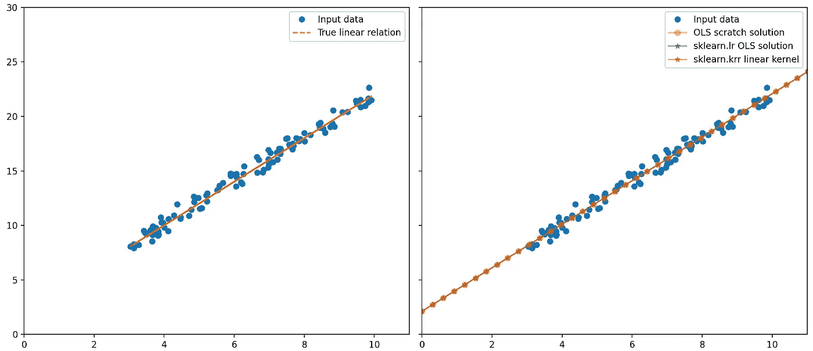

# 总结

在这篇文章中，我们回顾了简单线性回归，包括问题及其解的矩阵公式。

然后我们看到核技巧是什么，以及它如何使我们能够从非常高维的空间中受益，而无需实际将我们的低维数据移动到这个计算密集型空间中。

最后，我展示了在线性回归的背景下线性核实际上是无用的，它相当于简单线性回归。

**如果你考虑加入 Medium，请使用此链接快速订阅并成为我的推荐会员**：

[](https://medium.com/@mocquin/membership?source=post_page-----39b6be3a3bf5--------------------------------) [## 使用我的推荐链接加入 Medium - Yoann Mocquin

### 作为 Medium 的会员，你的一部分会员费用将分配给你阅读的作者，你可以完全访问每个故事……

[medium.com](https://medium.com/@mocquin/membership?source=post_page-----39b6be3a3bf5--------------------------------)

**并订阅以在我发布新帖子时收到通知：**

[](https://mocquin.medium.com/subscribe?source=post_page-----39b6be3a3bf5--------------------------------) [## 每当我发布新内容时收到电子邮件！

### 每当我发布新内容时，你将收到一封电子邮件！ 新发布将包括数据转换、高级绘图和模拟……

[mocquin.medium.com](https://mocquin.medium.com/subscribe?source=post_page-----39b6be3a3bf5--------------------------------)

最后，你可以查看我其他一些帖子，涉及傅里叶变换、pandas 数据类型或数据科学中的线性代数技术：

[pandas：处理你的数据类型！](https://towardsdatascience.com/pandas-work-on-your-dtypes-20d9d32d2e42?source=post_page-----39b6be3a3bf5--------------------------------)

### 在 pandas 中使用正确的数据类型对于干净的数据分析至关重要！这里是如何以及为什么。

[傅里叶变换在时间序列中的去趋势处理](https://towardsdatascience.com/fourier-transform-for-time-series-detrending-f0f470f4bf14?source=post_page-----39b6be3a3bf5--------------------------------)

### 对时间序列进行去趋势处理可能会带来重大变化。

[PCA/LDA/ICA：组件分析算法比较](https://towardsdatascience.com/pca-lda-ica-a-components-analysis-algorithms-comparison-c5762c4148ff?source=post_page-----39b6be3a3bf5--------------------------------)

### 复习这些著名算法的概念和区别。

[PCA-白化与 ZCA-白化：numpy 2D 可视化](https://towardsdatascience.com/pca-whitening-vs-zca-whitening-a-numpy-2d-visual-518b32033edf?source=post_page-----39b6be3a3bf5--------------------------------)

### 数据去白化的过程包括一种变换，使得变换后的数据具有单位矩阵作为…

[300 倍速的有限差分法分辨率使用 numpy](https://towardsdatascience.com/300-times-faster-resolution-of-finite-difference-method-using-numpy-de28cdade4e1?source=post_page-----39b6be3a3bf5--------------------------------)

### 有限差分法是一种强大的技术来解决复杂问题，而 numpy 使其变得快速！

[有限差分法是一种强大的技术来解决复杂问题，而 numpy 使其变得快速！](https://towardsdatascience.com/300-times-faster-resolution-of-finite-difference-method-using-numpy-de28cdade4e1?source=post_page-----39b6be3a3bf5--------------------------------)
