# LLaMA：面向所有人的大型语言模型！

> 原文：[`towardsdatascience.com/llama-llms-for-everyone-724e737835be`](https://towardsdatascience.com/llama-llms-for-everyone-724e737835be)

## 高性能的开源语言模型……

 [Cameron R. Wolfe, Ph.D.](https://wolfecameron.medium.com/?source=post_page-----724e737835be--------------------------------)

·发布于 [Towards Data Science](https://towardsdatascience.com/?source=post_page-----724e737835be--------------------------------) ·15 分钟阅读·2023 年 7 月 11 日

--

（照片由[拉斯波波娃·玛丽娜](https://unsplash.com/@raspopovamarisha?utm_source=unsplash&utm_medium=referral&utm_content=creditCopyText)拍摄，来源于[Unsplash](https://unsplash.com/s/photos/llama?utm_source=unsplash&utm_medium=referral&utm_content=creditCopyText)）

多年来，深度学习社区一直倡导开放性和透明度，导致了像[HuggingFace](https://huggingface.co/)这样的大规模开源项目。深度学习中的许多深刻思想（例如，[transformers](https://newsletter.artofsaience.com/p/vision-transformers-from-idea-to) [2]，[自监督学习](https://cameronrwolfe.substack.com/i/76273144/self-supervised-learning)等）在网上公开可用，无论是通过[公共代码库](https://huggingface.co/docs/transformers/v4.27.2/en/model_doc/encoder-decoder#transformers.EncoderDecoderModel)还是[Arxiv](https://arxiv.org/list/cs.AI/recent)。尽管开源已经成为一种规范，但大型语言模型（LLMs）的流行（以及商业适用性）最近挑战了这一趋势。

目前许多最强大的大型语言模型（LLMs）只能通过 API 访问（例如，来自[OpenAI](https://openai.com/blog/openai-api)或[Anthropic](https://console.anthropic.com/docs/api#accessing-the-api)），这使得源代码和模型参数对研究人员和开发者而言不可及。虽然我的目标不是引发对当前 LLM 趋势的[伦理讨论](https://futureoflife.org/open-letter/pause-giant-ai-experiments/)，但这些信息与本文的主题：公开可用的 LLM 相关。有趣的是，并非所有强大的语言基础模型都被隐藏在付费墙后面。一些模型，如 LLaMA，既公开可用又表现出色，因此在深度学习研究社区中保持了开放性。

**什么是 LLaMA？** LLaMA 不是单一模型，而是一套范围从 70 亿到 650 亿参数的 LLM。受 [Chinchilla](https://cameronrwolfe.substack.com/i/91134599/training-compute-optimal-llms) [3] 启发，这些 LLM 比 [它们的对应物](https://cameronrwolfe.substack.com/i/91134599/using-deepspeed-and-megatron-to-train-megatron-turing-nlg-b-a-large-scale-generative-language-model) 稍小，但经过广泛的预训练（即，较小的模型，更多的 token），并旨在提供一组具有不同性能与推理效率权衡的多样化模型。LLaMA 模型表现惊人；例如，130 亿参数模型大致可与 [GPT-3](https://cameronrwolfe.substack.com/p/language-model-scaling-laws-and-gpt) [4] 相媲美，而 650 亿参数模型常常超越 [PaLM](https://cameronrwolfe.substack.com/p/palm-efficiently-training-massive) [5] 的表现。

> “GPT-4 从各种许可、创建和公开可用的数据源中学习，这些数据源可能包括公开的个人信息。” *— 引自 [6]*

除了令人印象深刻的性能外，LLaMA 仅使用公开数据进行预训练。LLaMA 模型可以完全通过在线资源复现，标志着在 LLM 领域向开源迈出的一步。最近的模型如 GPT-4 已知是通过公共和专有/私人数据的组合进行训练的。尽管这可能有利于模型性能，LLaMA 表明我们可以充分利用在线可用的数据，从而为与 LLM 相关的开源研究计划提供了希望。

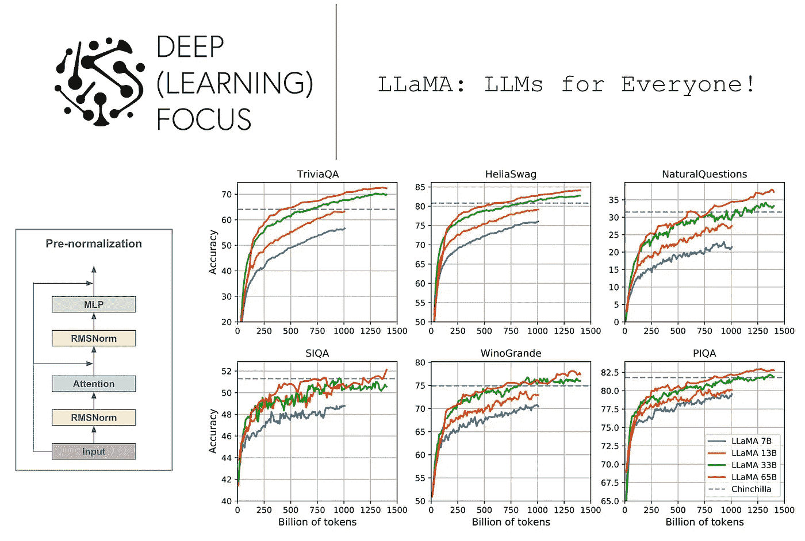

（引自 [1]）

# 背景信息

LLaMA LLM 采用了先前工作中提出的一些想法和技术。在这一部分，我们将回顾一些有用的背景信息，这些信息对于深入理解 LLaMA 及其组件将有所帮助。

**关于 LLM 的简要说明。** 首先，了解 LLM 的基础知识，包括其架构、训练过程和一般方法是有帮助的。我们在之前的概述中已经广泛探讨了这一主题。因此，我们在这里不会详细介绍这一主题，但下面提供了进一步阅读和学习的链接。

+   LLM（仅解码器）架构 [[link](https://twitter.com/cwolferesearch/status/1640446111348555776?s=20)]

+   语言模型预训练 [[link](https://cameronrwolfe.substack.com/i/85568430/language-modeling)]

+   LLM 解释 [[link](https://cameronrwolfe.substack.com/i/91134599/a-primer-on-language-modeling)]

+   LLM 历史 [[link](https://twitter.com/cwolferesearch/status/1639378997627826176?s=20)]

+   LLM 基础 [[link](https://twitter.com/cwolferesearch/status/1635693551584522256?s=20)]

## 均方根层归一化 (RMSNorm)

通常，transformer 架构（包括 LLM 使用的仅解码器 transformer 架构）使用[LayerNorm](https://pytorch.org/docs/stable/generated/torch.nn.LayerNorm.html)来规范化每层内的激活值。然而，使用不同的规范化技术已被证明可以稳定训练并提高泛化性能。例如，[RMSNorm](https://github.com/bzhangGo/rmsnorm) [16]的定义如下面的方程所示。

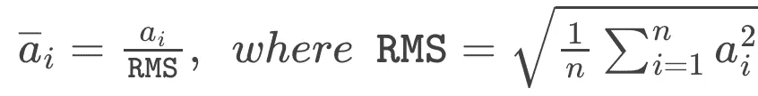

（由作者创建）

RMSNorm 与 LayerNorm 有些相似，但在规范化神经网络激活值时，它去除了[均值中心化](https://medium.com/@aabdygaziev/data-transformations-centering-scaling-7bd48a530595)操作（并使用了略微修改的分母）。与 LayerNorm 相比，RMSNorm 在计算效率和简单性上更具优势，使其能够以 10–50%的效率提升达到相当的性能水平。

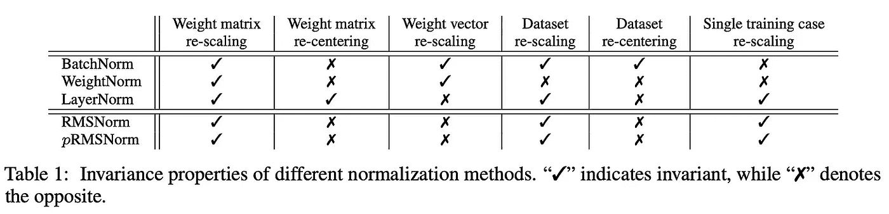

（来自[16]）

## SwiGLU 激活函数

LLM 的仅解码器架构的每个块包含一个两层[前馈神经网络](https://cameronrwolfe.substack.com/i/94634004/feed-forward-neural-networks)（即不使用偏置并单独应用于每个标记向量），在两层之间具有非线性。最初，这个非线性是[修正线性单元（ReLU）](https://pytorch.org/docs/stable/generated/torch.nn.ReLU.html)激活函数。然而，最近的工作[15]揭示了这并不是最佳选择。

（由作者创建）

特别是，LLaMA（以及其他像[PaLM](https://cameronrwolfe.substack.com/p/palm-efficiently-training-massive)的 LLM）选择使用 SwiGLU 激活函数，这在上面的方程中进行了公式化。这里，我们将 Swish 激活定义如下。

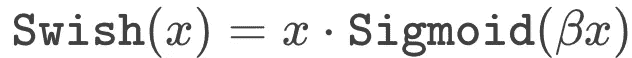

（由作者创建）

SwiGLU 是输入`x`的两个[线性变换](https://mathworld.wolfram.com/LinearTransformation.html)的逐元素乘积，其中一个已应用 Swish 激活函数。该激活函数需要三个矩阵乘法，但发现相较于其他激活函数，它在性能上有所提升，*即使在保持计算量不变的情况下*。

## 再材料化（或重新计算）

重计算，也称为再计算，是一种在训练 LLM（以及其他大型神经网络）时使用的技术，旨在减少内存消耗，但需要额外的计算。通常，当我们计算神经网络的前向传递时，我们会在每一层存储/保留网络的激活值，以便在反向传递时使用（这对于[计算权重更新](https://mattmazur.com/2015/03/17/a-step-by-step-backpropagation-example/)是必要的！）。但这需要大量的内存！

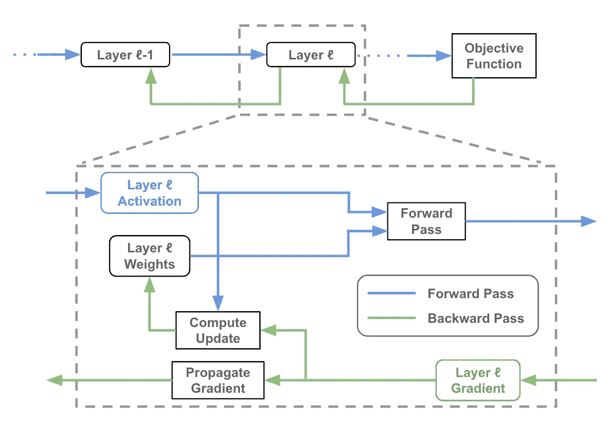

神经网络前向和反向传递的示意图（作者创作）

重计算的基本思想是在反向传递期间重新计算某些中间激活值，而不是在前向传递期间将它们存储在内存中。这有助于减少训练过程中的峰值内存使用，从而允许在可用内存限制内训练更大的模型或使用更大的批次大小。考虑到 LLM 体积庞大且消耗大量内存，这一点尤为重要。

# LLaMA 套件

现在我们已经掌握了一些有用的概念，让我们了解一下 LLaMA 中的 LLM 集合及其工作原理。由于这些模型受到[Chinchilla](https://cameronrwolfe.substack.com/i/91134599/training-compute-optimal-llms)（TL;DR：仅通过对更大量数据进行小型 LLM 的预训练）[3]提出的预训练策略的强烈启发，我们将在深入了解 LLaMA 之前简要概述这些思想。总体而言，LLaMA 质疑了大规模 LLM 的趋势，声称（如果进行足够的预训练！）更小的 LLM 可以在显著较低的推理预算下实现令人印象深刻的性能。

## 我们如何最大化 LLM 的效率？

最近 LLM 的发展历程中，一个特别值得注意的时刻是[Chinchilla](https://cameronrwolfe.substack.com/i/91134599/training-compute-optimal-llms) [3]的提出。在 GPT-3 之后，深度学习研究界对大规模语言模型中显著的少样本学习能力感到震惊。因此，我们开始测试[比 GPT-3 还要大](https://cameronrwolfe.substack.com/i/91134599/scaling-language-models-methods-analysis-and-insights-from-training-gopher)的模型。但结果并不理想！

> “Hoffmann 等人（2022 年）的最新研究表明，对于给定的计算预算，最佳性能并非由最大的模型实现，而是由在更多数据上训练的小型模型实现的。” *— 引自 [1]*

为了创建比 GPT-3 更优秀的 LLM，我们不能仅仅使用更大的模型。相反，我们需要更多的预训练数据！具体来说，Chinchilla 的分析表明，如果我们对稍小的 LLM 进行更广泛的预训练，可以实现更高的性能。

**这就是全部情况吗？** 尽管我们知道较小的 LLM 如果进行广泛预训练可以表现良好，即使 [3] 中的分析也表明，训练相对较大的 LLM 是达到高性能水平的最有效方式。这个说法完全正确，但它仅考虑了训练效率。因此，我们不得不问自己一个问题：*训练效率是我们唯一关心的吗？* 对于大多数从业者来说，这个问题的答案无疑是否定的！

> “这项工作的重点是训练一系列语言模型，通过训练更多令牌来实现不同推理预算下最佳的性能。” *— 来自 [1]*

训练成本只是与 LLM 相关的全部成本中的一小部分。我们还必须考虑托管，这使得推理预算成为一个巨大的考虑因素。LLaMA 通过强调，给定目标性能水平，预训练一个较小的 LLM 更长时间最终在推理过程中会更便宜，并且随着时间的推移节省大量成本。虽然我们可能会使用更大的模型以获得性能提升，但我们应该通过广泛的预训练尽可能减少模型大小（从而降低托管成本）。

## LLaMA 的组成部分

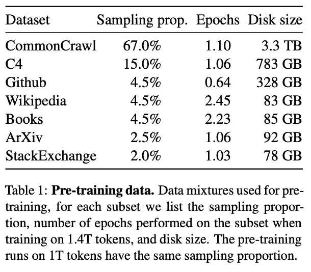

（来自 [1]）

**数据集。** 我们知道 LLaMA 的预训练数据集基于公共数据，*但这些数据究竟来自哪里？* 上述内容概述了用于 LLaMA 的预训练数据集。正如所见，尽管预训练数据（完全公开）具有相当大的多样性，数据来源从 [StackExchange](https://stackexchange.com/) 到 [Gutenberg Project](https://www.gutenberg.org/) 不等。完整的数据集在标记化后大约包含 1.4T 令牌。这与 Chinchilla [3] 预训练所使用的令牌数量相同；见下文。

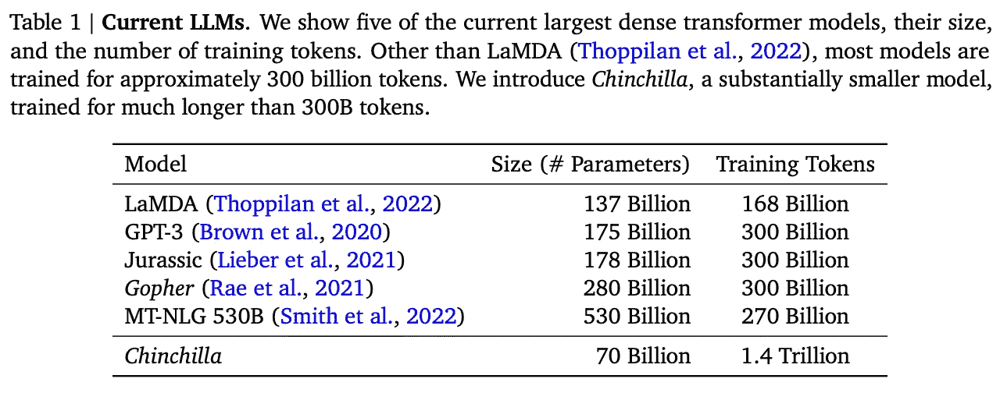

（来自 [3]）

鉴于 LLaMA 强调透明性和可重复性，[1] 提供了大量关于构建预训练数据集的见解。讨论中最有趣的一个方面是，我们可以利用这些见解进一步了解数据在预训练 LLM 之前是如何被过滤的。例如，来自 [CommonCrawl](https://commoncrawl.org/) 的文本数据被过滤以排除：

+   重复文档（使用 [CCNet pipeline](https://github.com/facebookresearch/cc_net) [7]）

+   非英语数据（通过训练 [fastText](https://fasttext.cc/) 线性分类器）

+   低质量内容（使用 [n-gram 语言模型](https://web.stanford.edu/~jurafsky/slp3/3.pdf)）

此外，文献[1]中的作者训练了一个线性分类器，用于区分维基百科中作为参考的页面和随机采样的页面，然后丢弃那些未被分类为参考的页面。这些步骤都仅仅是为了过滤 CommonCrawl！从之前的工作中，我们知道，正确过滤预训练数据集[对 LLM 性能至关重要](https://cameronrwolfe.substack.com/i/110291340/searching-for-a-better-approach)。在[1]中，我们深入了解了实现有效过滤管道的具体细节。

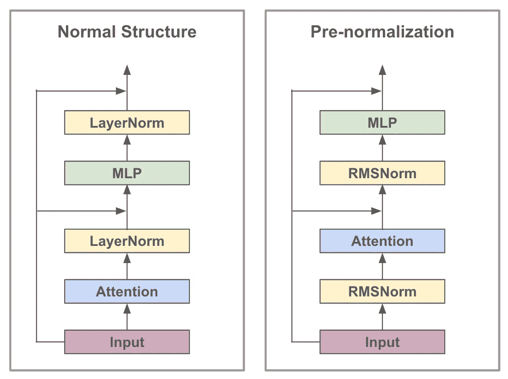

在变压器块内的预归一化结构（由作者创建）

**架构。** LLaMA 套件采用了来自流行 LLM（如[GPT-3](https://cameronrwolfe.substack.com/p/language-model-scaling-laws-and-gpt) [4]和[PaLM](https://cameronrwolfe.substack.com/p/palm-efficiently-training-massive) [5]）的许多常见架构技巧。例如，LLaMA 在其每一层内执行预归一化，这意味着归一化应用于每一层的输入，而不是输出；见上文。此外，RMSNorm、[SwiGLU 激活函数](https://cameronrwolfe.substack.com/i/104244919/architectural-modifications)和[旋转位置嵌入（RoPE）](https://cameronrwolfe.substack.com/i/104244919/architectural-modifications) [10]（即，[绝对位置嵌入](https://cameronrwolfe.substack.com/i/76273144/berts-architecture)和[相对位置嵌入](https://jaketae.github.io/study/relative-positional-encoding/)的某种混合形式）在每个变压器层中使用。

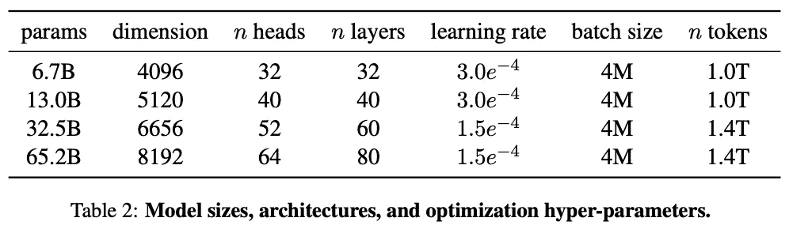

（来自[1]）

在[1]中，使用了四种不同规模的模型，参数量从 67 亿到 652 亿；见上文。这些模型形成了被称为 LLaMA 的 LLM 集合，并提供了在性能与模型大小或推理预算之间的各种权衡。最显著的是，我们将看到 LLaMA-13B 在性能上与 GPT-3 竞争力强，*并且可以在单个 V100 GPU 上运行*。与之前的模型相比，这是一个巨大的成就，使得这些模型对大多数从业者更加可及（例如，PaLM 使用超过 6000 个加速器进行训练）。

**更高效的性能。** [1] 的作者采用了一些有趣的技巧来提高 LLM 训练效率。首先，我们应该记住，基于 [decoder-only transformer models](https://cameronrwolfe.substack.com/i/85568430/decoder-only-transformers) 的现代 LLM 在每一层中使用因果 [multi-headed attention](https://twitter.com/cwolferesearch/status/1644773244786941952?s=20)。为了提高这种因果多头注意力操作的效率，LLaMA 使用了一种高效的实现方式，该方式既不 *i)* 存储注意力权重，也不 *ii)* 计算被掩盖的令牌的键/查询分数。通过这样做，我们可以节省大量通常浪费在因果自注意力中未考虑的被掩盖令牌上的计算。这种方法受到 [9] 中思想的启发，但我们可以在 [xformers library](https://github.com/facebookresearch/xformers) 中找到一个开源实现。

除了高效的因果自注意力实现之外，LLaMA 在重新物化方面的处理方式与大多数 LLM 训练策略有所不同。计算成本最高的激活（例如线性层的输出）在前向传播过程中被保存，从而减少了在反向传播过程中重新计算的激活数量。这一变化需要手动重新实现 LLM 的反向传播（而不是使用 [autograd](https://pytorch.org/tutorials/beginner/blitz/autograd_tutorial.html) 进行自动微分），是一种混合的重新物化方法，显著提高了整体训练吞吐量。

> “在训练一个 65B 参数的模型时，我们的代码在 2048 A100 GPU 上处理约 380 令牌/秒/ GPU。这意味着对我们包含 1.4T 令牌的数据集的训练大约需要 21 天。” *— 摘自 [1]*

鉴于 LLaMA 采用的改进以提高训练效率，我们可能会想知道：*这实际上使训练快了多少？* 好吧，这在很大程度上取决于训练基础设施。然而，当使用 2048 [A100 GPUs](https://www.nvidia.com/en-us/data-center/a100/) 时，LLaMA-65B 完成对 1.4T 令牌的预训练大约需要 21 天。

## LLaMA 与 SOTA LLMs

虽然开源和可重复性很重要，但如果模型表现不佳，没有人会关心 LLaMA！此前也有尝试开源 LLM（例如 [OPT](https://cameronrwolfe.substack.com/p/understanding-the-open-pre-trained-transformers-opt-library-193a29c14a15) 和 [BLOOM](https://huggingface.co/bigscience/bloom) [11, 12]）。但这些模型在性能上无法与现代 LLM 竞争。在这一部分，我们将分析 LLaMA 模型相对于流行 LLM，如 [GPT-3](https://cameronrwolfe.substack.com/p/language-model-scaling-laws-and-gpt) 和 [PaLM](https://cameronrwolfe.substack.com/p/palm-efficiently-training-massive) [4, 5] 的表现。

**我们如何进行评估？** 如 [之前的帖子](https://cameronrwolfe.substack.com/i/91134599/a-primer-on-language-modeling) 中详细描述的那样，LLaMA 的评估与大多数语言基础模型类似：通过零样本和少样本学习。值得注意的是，LLaMA 模型仅作为预训练的基础模型进行评估，这意味着没有进行微调（无论是通过 [SFT 还是 RLHF](https://cameronrwolfe.substack.com/i/93578656/refining-llm-behavior)）。LLaMA 与流行的闭源 LLMs（例如，[GPT-3](https://cameronrwolfe.substack.com/i/88082618/language-models-are-few-shot-learners)，[Gopher](https://cameronrwolfe.substack.com/i/91134599/scaling-language-models-methods-analysis-and-insights-from-training-gopher)，[Chinchilla](https://cameronrwolfe.substack.com/i/91134599/training-compute-optimal-llms) 和 [PaLM](https://cameronrwolfe.substack.com/p/palm-efficiently-training-massive) [3, 4, 5, 13]）以及以前的开源 LLMs（例如，[OPT](https://cameronrwolfe.substack.com/p/understanding-the-open-pre-trained-transformers-opt-library-193a29c14a15)，[GPT-J](https://arankomatsuzaki.wordpress.com/2021/06/04/gpt-j/)，和 [GPT-Neo](https://github.com/EleutherAI/gpt-neo) [11, 14]）在自由生成和多项选择任务上进行比较。测试了各种领域（例如，常识和数学推理、代码生成、问答等）。

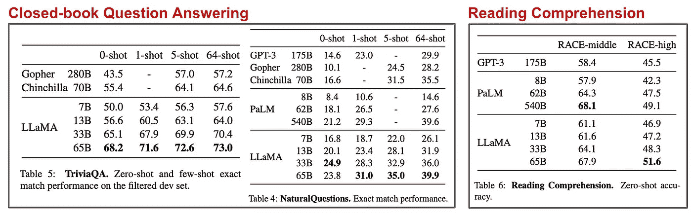

(来自 [1])

**语言理解。** 在闭卷问答和阅读理解任务中，我们看到 LLaMA-65B 达到了最先进的零样本和少样本表现，一贯超过了像 PaLM 和 Chinchilla 这样更大模型的表现。进一步来看，LLaMA-13B 表现令人惊讶，甚至在大多数情况下超越了 GPT-3（它大 10 倍！）的表现。这里的基本结论是 *i)* 更大的 LLaMA 模型与最先进的技术具有竞争力，*ii)* 更小的 LLaMA 模型在其尺寸范围内表现出令人惊讶的效果。

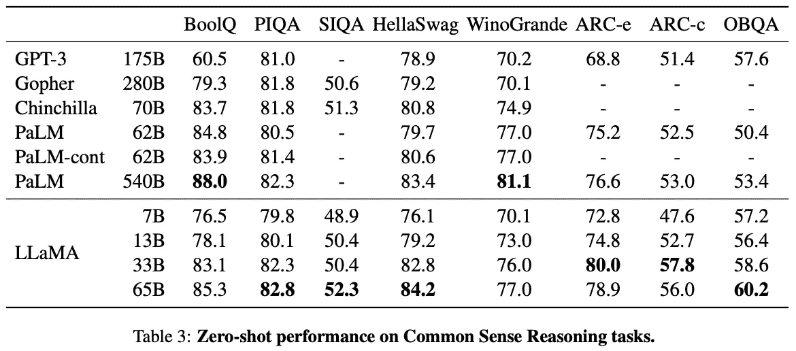

(来自 [1])

**推理任务。** LLaMA 套件还在常识和数学推理任务上进行了评估。在常识推理任务中，LLaMA 超越了多个强大基准的零样本推理表现；请参见上文。然而，这里需要注意的是，没有采用特殊的提示方法（例如，[思维链提示](https://cameronrwolfe.substack.com/i/104244919/how-does-palm-perform)）来促进推理的改进。以往的工作 [5] 已经表明，如果没有正确的提示方法，LLMs 的“推理”能力可能会随着规模的增加而退化。

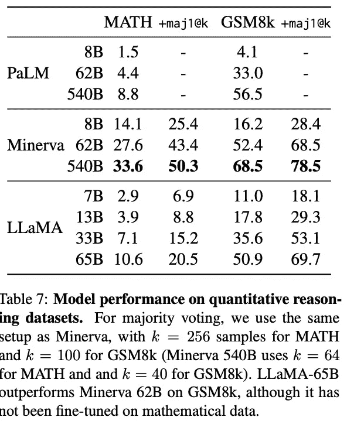

(来自 [1])

尽管这种分析存在局限性，LLaMA 的推理能力相比于基线模型仍然显得相对令人印象深刻。即，LLaMA 模型在数学推理数据集上的表现与（甚至在某些情况下优于）多个基线模型竞争。实际上，LLaMA-65B 甚至超越了一个类似规模的 [Minerva 模型](https://ai.googleblog.com/2022/06/minerva-solving-quantitative-reasoning.html)，该模型已明确在数学数据上进行微调，以提高在这类任务上的表现。

> “Minerva 是一系列基于 38.5B 令牌的 PaLM 模型，这些令牌来自 ArXiv 和数学网页… 在 GSM8k 上，我们观察到 LLaMA65B 超越了 Minerva-62B，尽管它没有在数学数据上进行微调。” *— 来源于 [1]*

**代码生成。** 除了基本的推理能力，代码生成是 LLaMA 模型的另一个技能。尽管从未在代码上进行过微调（即代码数据占 LLaMA 预训练数据的 <5%），但 LLaMA-65B 在代码生成任务上超越了 PaLM，而 LLaMA-13B 的代码生成表现也超过了 GPT-3（不过… GPT-3 确实在生成代码方面表现较差）。

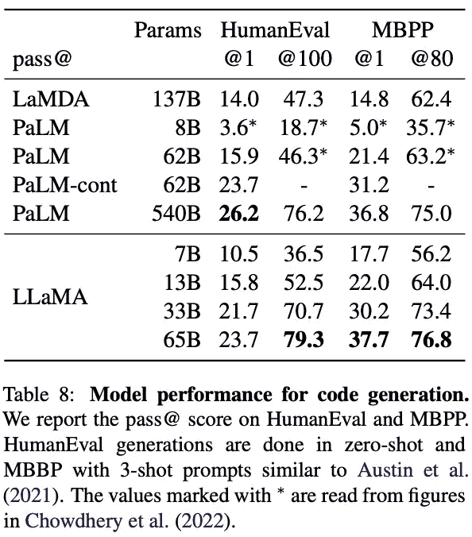

（来源于 [1]）

**其他细节。** 在 [MMLU 基准测试](https://arxiv.org/abs/2009.03300)中，LLaMA 模型在大多数情况下表现落后于像 Chinchilla 和 PaLM 这样的 LLM。*这是 LLaMA 性能被当前替代方案明显超越的唯一基准测试之一*。在 [1] 中的作者声称，这种性能下降是由于 LLaMA 预训练数据集中图书和学术论文的数量有限（即，与最先进的 LLM 相比，这类预训练数据减少了 >10 倍）。

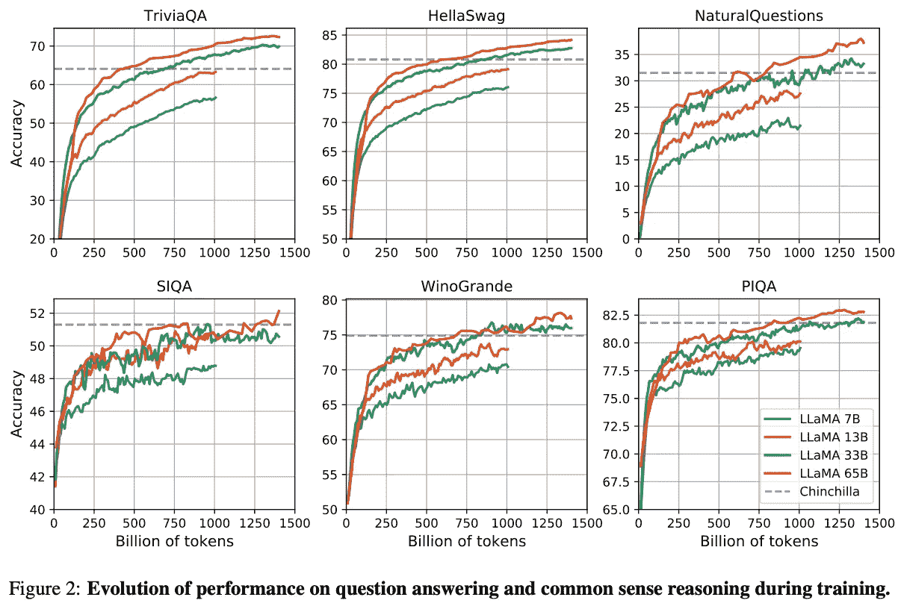

（来源于 [1]）

当跟踪 LLaMA 模型在预训练过程中的性能时，我们观察到性能有明显而稳定的提升；见上文。虽然并非所有任务的表现都相同，但我们可以看到 LLaMA 采用的预训练策略总体上是相对稳定的。

# 关键点

长话短说，LLaMA 是一个开源的 LLM，表现令人震惊。自从 LLaMA 提出的提案以来，研究社区已经很好地利用了这一开放的出色模型。举个例子，以下研究工作已经在 LLaMA 的基础上进行了扩展：

+   *Vicuna*: LLaMA 的微调版本，性能（几乎）可比于 GPT-4 [[link](https://vicuna.lmsys.org/)]

+   *Koala*: 在互联网对话数据上微调的 LLaMA [[link](https://bair.berkeley.edu/blog/2023/04/03/koala/)]

+   *ChatLLaMA*: 使用最少的计算资源在你自己的数据上创建个性化的 ChatGPT [[link](https://github.com/nebuly-ai/nebullvm/tree/main/apps/accelerate/chatllama)]

+   ColossalChat：一个与 ChatGPT 类似的模型，基于 LLaMA 的 RLHF 管道[[链接](https://medium.com/@yangyou_berkeley/colossalchat-an-open-source-solution-for-cloning-chatgpt-with-a-complete-rlhf-pipeline-5edf08fb538b)]

LLaMA 的影响力可能会显著增加。个人而言，我非常兴奋看到开源 LLMS 的研究不断进展。我希望让这些模型变得更加可访问会带来更广泛的研究社区的深入调查和发展。以下是一些基本要点。

**开源 LLM。** 目前，LLM 生态系统正经历一种有趣的冲突，两种不同的方法被用来将这些强大的基础模型展示给公众。一方面，像[ChatGPT](https://openai.com/blog/chatgpt)和[GPT-4](https://openai.com/research/gpt-4)这样的模型仅通过[付费 API](https://openai.com/blog/introducing-chatgpt-and-whisper-apis)发布，这限制了研究社区对这些模型的详细访问。LLaMA 等贡献则与这一趋势相反，通过向研究社区提供完整的模型访问权限。

**什么大小最合适？** LLaMA 提供了一系列不同大小的 LLM，而不是发布单一模型。之前的 LLM 研究往往倾向于使用更大的模型，因为较大的 LLM 通常在训练时能以较少的总体计算成本达到令人印象深刻的性能水平。然而，如果我们对较小的模型进行更广泛的预训练，LLaMA 表明我们可以在显著降低推理成本的同时达到可比的性能水平。因此，至少考虑使用较小的 LLM 是合理的，特别是在我们需要部署它们的时候。值得注意的是，一些 LLaMA 模型可以在单个 GPU 上运行，这大大提高了这些 LLM 的可访问性。

**令人印象深刻的表现。** 在 LLaMA 提出之前，许多研究小组尝试发布流行 LLM 的开源版本（例如，[OPT](https://cameronrwolfe.substack.com/p/understanding-the-open-pre-trained-transformers-opt-library-193a29c14a15) 基本上是一个开源的 GPT-3）。但这些模型的表现远不如通过 API 访问的付费模型。尽管 LLaMA 在某些情况下的性能不尽如人意，但它是一个巨大的进步，因为它通常超越了流行的、最先进的 LLM（取决于使用的模型大小）。

## 结束语

非常感谢阅读这篇文章。我是 [卡梅伦·R·沃尔夫](https://cameronrwolfe.me/)，[Rebuy](https://www.rebuyengine.com/) 的 AI 总监。我研究深度学习的经验性和理论基础。你也可以查看我在 medium 上的 [其他写作](https://medium.com/@wolfecameron)！如果你喜欢，请在 [twitter](https://twitter.com/cwolferesearch) 上关注我或订阅我的 [深度（学习）焦点通讯](https://cameronrwolfe.substack.com/)，我通过易懂的热门论文概述帮助读者更深入地理解 AI 研究领域的主题。

## 参考文献

[1] 图弗龙, 休戈 等. “Llama: 开放且高效的基础语言模型.” *arXiv 预印本 arXiv:2302.13971* (2023).

[2] 瓦斯瓦尼, 阿希什 等. “注意力是你所需要的一切.” *神经信息处理系统进展* 30 (2017).

[3] 霍夫曼, 乔丹 等. “训练计算最优的大型语言模型.” *arXiv 预印本 arXiv:2203.15556* (2022).

[4] 布朗, 汤姆 等. “语言模型是少量学习者.” *神经信息处理系统进展* 33 (2020): 1877–1901.

[5] 周德瑞, 阿坎卡莎 等. “Palm: 通过路径扩展语言建模.” *arXiv 预印本 arXiv:2204.02311* (2022).

[6] OpenAI (2023). “GPT-4 技术报告.” *ArXiv, abs/2303.08774*.

[7] 温泽克, 纪尧姆 等. “CCNet: 从网页抓取数据中提取高质量单语数据集.” *arXiv 预印本 arXiv:1911.00359* (2019).

[8] 张彪 和 里科·森里奇. “均方根层归一化.” *神经信息处理系统进展* 32 (2019).

[9] 拉贝, 马库斯·N. 和 查尔斯·斯塔茨. “自注意力不需要 $ O (n^ 2) $ 记忆.” *arXiv 预印本 arXiv:2112.05682* (2021).

[10] 苏, 剑林 等. “Roformer: 带有旋转位置嵌入的增强型变换器.” *arXiv 预印本 arXiv:2104.09864* (2021).

[11] 张, 苏珊 等. “Opt: 开放预训练变换器语言模型.” *arXiv 预印本 arXiv:2205.01068* (2022).

[12] Scao, Teven Le 等. “Bloom: 一个 176b 参数的开放访问多语言模型.” *arXiv 预印本 arXiv:2211.05100* (2022).

[13] 雷, 杰克·W. 等. “扩展语言模型: 方法, 分析与训练 Gopher 的见解.” *arXiv 预印本 arXiv:2112.11446* (2021).

[14] 布莱克, 西德 等. “Gpt-neox-20b: 一个开源自回归语言模型.” *arXiv 预印本 arXiv:2204.06745* (2022).

[15] 沙泽尔, 诺亚姆. “Glu 变体改进变换器.” *arXiv 预印本 arXiv:2002.05202* (2020).

[16] 张彪 和 里科·森里奇. “均方根层归一化.” *神经信息处理系统进展* 32 (2019).
