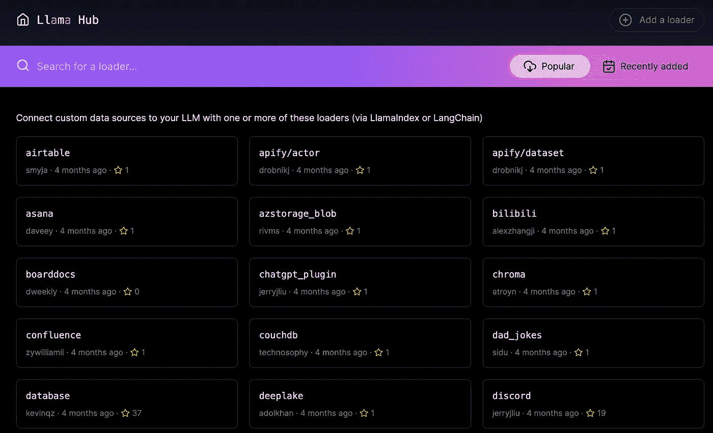
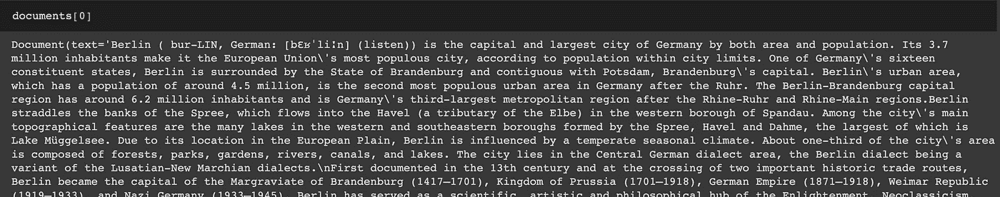
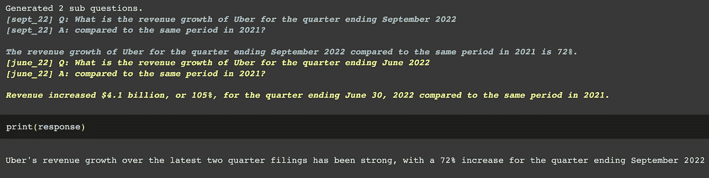
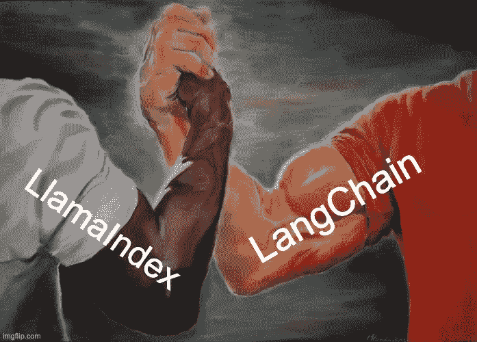
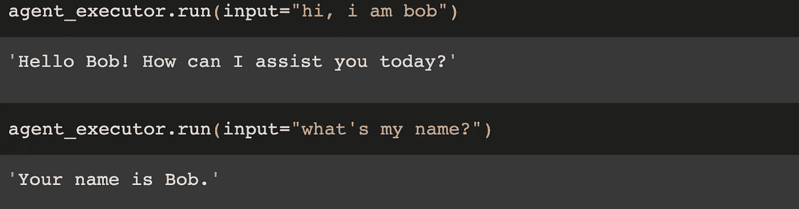

# LlamaIndex：终极 LLM 框架，用于索引和检索

> 原文：[`towardsdatascience.com/llamaindex-the-ultimate-llm-framework-for-indexing-and-retrieval-fa588d8ca03e?source=collection_archive---------1-----------------------#2023-06-20`](https://towardsdatascience.com/llamaindex-the-ultimate-llm-framework-for-indexing-and-retrieval-fa588d8ca03e?source=collection_archive---------1-----------------------#2023-06-20)

## LlamaIndex 简介

[](https://sophiamyang.medium.com/?source=post_page-----fa588d8ca03e--------------------------------)[](https://towardsdatascience.com/?source=post_page-----fa588d8ca03e--------------------------------) [Sophia Yang, Ph.D.](https://sophiamyang.medium.com/?source=post_page-----fa588d8ca03e--------------------------------)

·

[关注](https://medium.com/m/signin?actionUrl=https%3A%2F%2Fmedium.com%2F_%2Fsubscribe%2Fuser%2Fae9cae9cbcd2&operation=register&redirect=https%3A%2F%2Ftowardsdatascience.com%2Fllamaindex-the-ultimate-llm-framework-for-indexing-and-retrieval-fa588d8ca03e&user=Sophia+Yang%2C+Ph.D.&userId=ae9cae9cbcd2&source=post_page-ae9cae9cbcd2----fa588d8ca03e---------------------post_header-----------) 发表在 [Towards Data Science](https://towardsdatascience.com/?source=post_page-----fa588d8ca03e--------------------------------) ·8 分钟阅读·2023 年 6 月 20 日

--

[](https://medium.com/m/signin?actionUrl=https%3A%2F%2Fmedium.com%2F_%2Fbookmark%2Fp%2Ffa588d8ca03e&operation=register&redirect=https%3A%2F%2Ftowardsdatascience.com%2Fllamaindex-the-ultimate-llm-framework-for-indexing-and-retrieval-fa588d8ca03e&source=-----fa588d8ca03e---------------------bookmark_footer-----------)

LlamaIndex，之前称为 GPT Index，是一个出色的数据框架，旨在帮助您通过提供必要的工具来构建与 LLM 的应用程序，这些工具可以促进数据摄取、结构化、检索以及与各种应用程序框架的集成。LlamaIndex 提供的功能众多且极具价值：

✅ 从不同的数据源和数据格式中获取数据，使用数据连接器（Llama Hub）。

✅ 启用文档操作，如插入、删除、更新和刷新文档索引。

✅ 支持对异构数据和多个文档进行综合处理。

✅ 使用“Router”在不同的查询引擎之间进行选择。

✅ 允许假设文档嵌入以提高输出质量

✅ 提供与各种向量存储、ChatGPT 插件、跟踪工具以及 LangChain 等的广泛集成。

✅ 支持全新的 OpenAI 函数调用 API。

这些只是 LlamaIndex 提供的广泛功能中的一些示例。在这篇博客文章中，我们将探讨一些我发现与 LlamaIndex 非常有用的功能。

# **数据连接器（LlamaHub）**

在开发 LLM 应用程序时，使 LLM 能够有效地与外部数据源交互是至关重要的。如何获取数据是关键。Llama Hub 提供了超过 100 种数据源和格式，使 LlamaIndex 或 LangChain 能够以一致的方式获取数据。



LlamaHub。来源：[`llama-hub-ui.vercel.app/`](https://llama-hub-ui.vercel.app/)。

默认情况下，你可以`pip install llama-hub`并将其作为独立包使用。你还可以选择使用我们的`download_loader`方法单独下载一个数据加载器，以便与 LlamaIndex 一起使用。

这里是一个示例，我们从`llama-hub`包中加载维基百科数据加载器。统一的语法非常好。

```py
from llama_hub.wikipedia.base import WikipediaReader

loader = WikipediaReader()
documents = loader.load_data(pages=['Berlin', 'Rome', 'Tokyo', 'Canberra', 'Santiago'])
```

检查输出：



Llama Hub 还支持多模态文档。例如，[ImageReader](https://llamahub.ai/l/file-image)加载器使用 pytesseract 或 Donut 转换器模型从图像中提取文本。

# 基本查询功能

## 索引、检索器和查询引擎

索引、检索器和查询引擎是对数据或文档提出问题的三个基本组件：

+   索引是一个数据结构，允许我们快速从外部文档中检索相关信息。索引通过将文档解析为称为“*节点*”的文本块来工作，然后从这些块中构建索引。

+   检索器用于根据用户查询获取和检索相关信息。

+   查询引擎建立在索引和检索器之上，提供一个通用接口来询问有关数据的问题。

这里是询问文档问题的最简单方法。你首先从文档中创建一个索引，然后使用查询引擎作为问题的接口：

```py
from llama_index import VectorStoreIndex
index = VectorStoreIndex.from_documents(docs)
query_engine = index.as_query_engine()
response = query_engine.query("Who is Paul Graham.")
```

有各种类型的索引、检索方法和查询引擎，你可以在 LlamaIndex 文档中进一步阅读。接下来，我想介绍一些我认为有用的酷功能。

# 处理文档更新

许多时候，一旦我们为文档创建了索引，可能需要定期更新文档。如果我们需要重新创建整个文档的嵌入，这个过程可能会很昂贵。LlamaIndex 的索引结构通过支持高效的插入、删除、更新和刷新操作提供了解决方案。例如，可以将新文档作为额外的节点（文本片段）插入，而不需要重新创建以前文档的节点：

```py
# Source: https://gpt-index.readthedocs.io/en/latest/how_to/index/document_management.html
from llama_index import ListIndex, Document

index = ListIndex([])
text_chunks = ['text_chunk_1', 'text_chunk_2', 'text_chunk_3']

doc_chunks = []
for i, text in enumerate(text_chunks):
    doc = Document(text, doc_id=f"doc_id_{i}")
    doc_chunks.append(doc)

# insert
for doc_chunk in doc_chunks:
    index.insert(doc_chunk)
```

# 查询多个文档

使用 LlamaIndex 可以轻松查询多个文档。此功能通过 `SubQuestionQueryEngine` 类实现。查询引擎在接收到查询时，会生成一个由子查询组成的“查询计划”，这些子查询针对子文档进行，然后将结果综合以提供最终答案。

```py
# Source: https://gpt-index.readthedocs.io/en/latest/examples/usecases/10q_sub_question.html

# Load data
march_2022 = SimpleDirectoryReader(input_files=["../data/10q/uber_10q_march_2022.pdf"]).load_data()
june_2022 = SimpleDirectoryReader(input_files=["../data/10q/uber_10q_june_2022.pdf"]).load_data()
sept_2022 = SimpleDirectoryReader(input_files=["../data/10q/uber_10q_sept_2022.pdf"]).load_data()
# Build indices
march_index = VectorStoreIndex.from_documents(march_2022)
june_index = VectorStoreIndex.from_documents(june_2022)
sept_index = VectorStoreIndex.from_documents(sept_2022)
# Build query engines
march_engine = march_index.as_query_engine(similarity_top_k=3)
june_engine = june_index.as_query_engine(similarity_top_k=3)
sept_engine = sept_index.as_query_engine(similarity_top_k=3)
query_engine_tools = [
    QueryEngineTool(
        query_engine=sept_engine, 
        metadata=ToolMetadata(name='sept_22', description='Provides information about Uber quarterly financials ending September 2022')
    ),
    QueryEngineTool(
        query_engine=june_engine, 
        metadata=ToolMetadata(name='june_22', description='Provides information about Uber quarterly financials ending June 2022')
    ),
    QueryEngineTool(
        query_engine=march_engine, 
        metadata=ToolMetadata(name='march_22', description='Provides information about Uber quarterly financials ending March 2022')
    ),
]
# Run queries 
s_engine = SubQuestionQueryEngine.from_defaults(query_engine_tools=query_engine_tools)
Run queries
response = s_engine.query('Analyze Uber revenue growth over the latest two quarter filings')
```

如下所示，LlamaIndex 将复杂查询分解为 2 个子查询，并能够比较来自多个文档的信息以获得最终答案。



# **使用“Router”在不同查询引擎之间进行选择**

想象一下，你正在构建一个从 Notion 和 Slack 中检索信息的机器人，语言模型如何知道使用哪个工具来搜索信息？LlamaIndex 就像一个聪明的助手，可以为你找到东西，即使它们在不同的地方。具体而言，LlamaIndex 的“Router”是一个非常简单的抽象，它允许在不同的查询引擎之间进行“选择”。

在这个示例中，我们有两个来自 Notion 和 Slack 的文档索引，我们为每个索引创建两个查询引擎。之后，我们将所有工具汇总，并创建一个叫做 RouterQueryEngine 的超级工具，它根据我们给每个工具的描述来选择使用哪个工具。这样，当我们问有关 Notion 的问题时，路由器将自动查找 Notion 文档中的信息。

```py
# Source: https://gpt-index.readthedocs.io/en/latest/use_cases/queries.html#routing-over-heterogeneous-data
from llama_index import TreeIndex, VectorStoreIndex
from llama_index.tools import QueryEngineTool
# define sub-indices
index1 = VectorStoreIndex.from_documents(notion_docs)
index2 = VectorStoreIndex.from_documents(slack_docs)
# define query engines and tools
tool1 = QueryEngineTool.from_defaults(
query_engine=index1.as_query_engine(),
description="Use this query engine to do…",
)
tool2 = QueryEngineTool.from_defaults(
query_engine=index2.as_query_engine(),
description="Use this query engine for something else…",
)
from llama_index.query_engine import RouterQueryEngine
query_engine = RouterQueryEngine.from_defaults(
query_engine_tools=[tool1, tool2]
)
response = query_engine.query(
"In Notion, give me a summary of the product roadmap."
)
```

这有很多令人兴奋的应用案例。以下是一个完整的示例，使用路由器在 SQL 和向量数据库之间进行选择：[`gpt-index.readthedocs.io/en/latest/examples/query_engine/SQLRouterQueryEngine.html`](https://gpt-index.readthedocs.io/en/latest/examples/query_engine/SQLRouterQueryEngine.html)。

# 假设文档嵌入（HyDE）

通常，当我们询问有关外部文档的问题时，我们通常会使用文本嵌入来为问题和文档创建向量表示。然后我们使用语义搜索来找到与问题最相关的文本片段。然而，问题的答案可能与问题本身有很大不同。如果我们可以先生成问题的假设答案，然后找到与假设答案最相关的文本片段会怎么样？这就是假设文档嵌入（HyDE）发挥作用的地方，并可能改善输出质量。

```py
# Source: https://gpt-index.readthedocs.io/en/latest/examples/query_transformations/HyDEQueryTransformDemo.html

# load documents
documents = SimpleDirectoryReader('llama_index/examples/paul_graham_essay/data').load_data()
index = VectorStoreIndex.from_documents(documents)
query_str = "what did paul graham do after going to RISD"

#Now, we use HyDEQueryTransform to generate a hypothetical document and use it for embedding lookup.
hyde = HyDEQueryTransform(include_original=True)
hyde_query_engine = TransformQueryEngine(query_engine, hyde)
response = hyde_query_engine.query(query_str)
display(Markdown(f"<b>{response}</b>"))

#In this example, HyDE improves output quality significantly, by hallucinating accurately what Paul Graham did after RISD (see below), and thus improving the embedding quality, and final output.
query_bundle = hyde(query_str)
hyde_doc = query_bundle.embedding_strs[0]
```

# 支持 OpenAI 功能调用

[OpenAI 最近发布了](https://openai.com/blog/function-calling-and-other-api-updates) 函数调用功能，以更可靠地将 GPT 的能力与外部工具和 API 连接。查看我之前的视频，了解其具体运作方式。

LlamaIndex 快速集成了这一功能，并新增了一个全新的 `OpenAIAgent`。请查看这个 [笔记本](https://github.com/jerryjliu/llama_index/blob/main/docs/examples/agent/openai_agent.ipynb) 以了解更多信息。

如果函数数量太多怎么办？使用 `RetrieverOpenAIAgent`！查看这个 [笔记本](https://github.com/jerryjliu/llama_index/blob/main/docs/examples/agent/openai_agent_retrieval.ipynb)。

# 将 LlamaIndex 与 LangChain 结合使用

LlmaIndex 提供了与各种向量存储、ChatGPT 插件、追踪工具和 LangChain 的广泛集成。



来源：[`imgflip.com/memegenerator`](https://imgflip.com/memegenerator)。

## LlamaIndex 如何与 LangChain 区别开来？

如果你使用过 LangChain，你可能会想知道 LlamaIndex 如何与 LangChain 区别开来。如果你对 LangChain 不太熟悉，请查看我之前的 博客文章 和 [视频](https://www.youtube.com/watch?v=kmbS6FDQh7c)。你会发现 LlamaIndex 和 LangChain 在功能上有显著的相似之处，包括索引、语义搜索、检索和向量数据库。它们都在任务如问答、文档总结和构建聊天机器人方面表现出色。

然而，它们各自有独特的关注领域。LangChain 具有广泛的功能列表，范围较广，专注于使用链和代理来连接外部 API。另一方面，LlamaIndex 则有更狭窄的重点，在数据索引和文档检索方面表现突出。

## 如何将 LlamaIndex 与 LangChain 结合使用？

有趣的是，LlamaIndex 和 LangChain 并不是相互排斥的。实际上，你可以在 LLM 应用中同时使用这两者。你可以同时使用 LlamaIndex 的数据加载器和查询引擎以及 LangChain 的代理。我知道很多人实际上在他们的项目中同时使用这两种工具。

这里有一个例子，我们在使用 LangChain 代理时使用 LlamaIndex 保持聊天历史。当我们在第二轮对话中问“我叫什么名字？”时，语言模型知道在第一轮对话中“我是 Bob”：

```py
# source: https://github.com/jerryjliu/llama_index/blob/main/examples/langchain_demo/LangchainDemo.ipynb
# Using LlamaIndex as a memory module
from langchain import OpenAI
from langchain.llms import OpenAIChat
from langchain.agents import initialize_agent
```

```py
from llama_index import ListIndex
from llama_index.langchain_helpers.memory_wrapper import GPTIndexChatMemory
index = ListIndex([])memory = GPTIndexChatMemory(
    index=index, 
    memory_key="chat_history", 
    query_kwargs={"response_mode": "compact"},
    # return_source returns source nodes instead of querying index
    return_source=True,
    # return_messages returns context in message format
    return_messages=True
)
llm = OpenAIChat(temperature=0)
# llm=OpenAI(temperature=0)
agent_executor = initialize_agent([], llm, agent="conversational-react-description", memory=memory)
```



# 结论

总之，LlamaIndex 是一个极其强大的工具，可以通过你自己的数据增强大型语言模型的能力。其多样的数据连接器、先进的查询接口和灵活的集成使其成为开发 LLM 应用程序的关键组件。

# 致谢

感谢 Jerry Liu 的建议和反馈！


图片由 [Danielle Barnes](https://unsplash.com/@ghost_cat?utm_source=unsplash&utm_medium=referral&utm_content=creditCopyText) 提供，来源于 [Unsplash](https://unsplash.com/photos/RUSijmFDm0M?utm_source=unsplash&utm_medium=referral&utm_content=creditCopyText)

. . .

作者 [Sophia Yang](https://www.linkedin.com/in/sophiamyang/) ，日期为 2023 年 6 月 19 日

**Sophia Yang** 是一名高级数据科学家。通过 [LinkedIn](https://www.linkedin.com/in/sophiamyang/)、[Twitter](https://twitter.com/sophiamyang) 和 [YouTube](https://www.youtube.com/SophiaYangDS) 与我联系，并加入 DS/ML [读书俱乐部](https://dsbookclub.github.io/) ❤️
