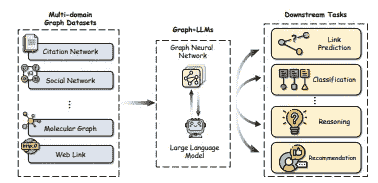
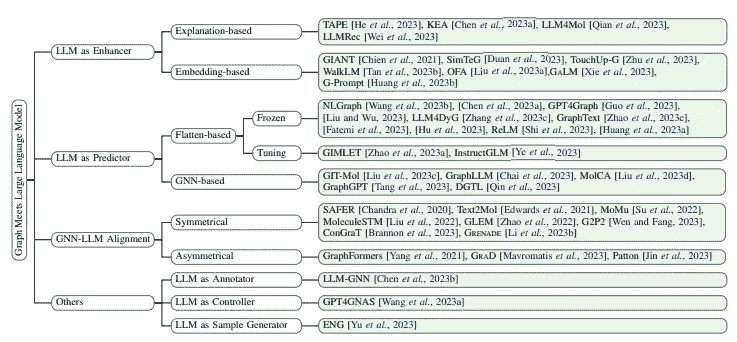
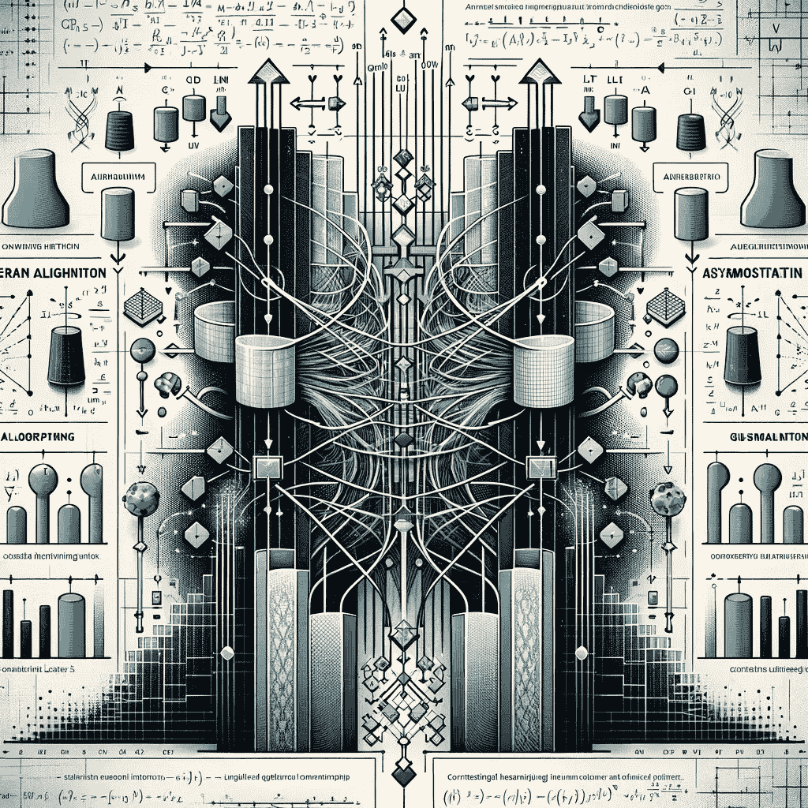

# LLM 和 GNN：如何提升两种 AI 系统在图数据上的推理能力

> 原文：[`towardsdatascience.com/llm-and-gnn-how-to-improve-reasoning-of-both-ai-systems-on-graph-data-5ebd875eef30`](https://towardsdatascience.com/llm-and-gnn-how-to-improve-reasoning-of-both-ai-systems-on-graph-data-5ebd875eef30)

 [Anthony Alcaraz](https://medium.com/@alcarazanthony1?source=post_page-----5ebd875eef30--------------------------------)

·发表于 [Towards Data Science](https://towardsdatascience.com/?source=post_page-----5ebd875eef30--------------------------------) ·9 分钟阅读·2023 年 12 月 3 日

--

*人工智能软件被用来提升本文文本的语法、流畅性和可读性。*

图神经网络（GNNs）和大型语言模型（LLMs）已成为人工智能的两个主要分支，分别在从图结构数据和自然语言数据中学习方面取得了巨大成功。

随着图结构和自然语言数据在现实应用中越来越相互关联，对能够进行多模态推理的人工智能系统的需求也在增长。

本文探讨了结合图神经网络（GNNs）和大型语言模型（LLMs）互补优势的集成图语言架构，以提升分析能力。

现实世界场景通常涉及具有结构性和文本性模式的互联数据。这就带来了对能够通过统一 GNNs 和 LLMs 互补优势进行多方面推理的集成架构的需求。

具体来说，虽然 GNNs 利用图上的消息传递来聚合局部模式，但节点嵌入在捕捉丰富特征方面存在局限性。

相比之下，LLMs 展现出卓越的语义推理能力，但在处理 GNNs 自然理解的结构化拓扑关系时表现欠佳。

融合这两种范式可以实现更具上下文的、有信息的分析。

最近，融合了 GNN 编码器和 LLM 解码器互补优势的图语言集成架构越来越受到关注。

正如综述论文（Li et al. 2023）总结的，这些集成方法可以根据 LLMs 所扮演的角色进行分类。

 [## 图与大型语言模型的汇合调研：进展与未来方向

### 图在表示和分析复杂关系方面发挥了重要作用，如…

synthical.com](https://synthical.com/article/3c4812bb-0cde-43fb-a861-4bc7cd978b7b?source=post_page-----5ebd875eef30--------------------------------) 

Li et al. 2023

**LLM 作为增强器：**LLMs 通过强化节点嵌入和文本特征来提升 GNN 在文本属性图上的性能。技术方法包括基于解释的增强，这种方法利用额外的 LLM 生成的信息，或直接输出基于嵌入的增强。

**LLM 作为预测器：**利用 LLMs 的生成能力对图进行预测。策略要么是将图展平成顺序文本描述，要么在 LLM 预测之前采用 GNN 进行结构编码。

**GNN-LLM 对齐：**专注于对齐 GNN 和 LLM 编码器的向量空间以实现协调分析。对齐可以是对称的，强调平等，或是不对称的，优先考虑某些模式。

核心动机在于有效地将图的关系建模优势与语言模型的上下文推理能力相融合。这在提升对结合了结构和语义的互联数据的分析能力方面显示了巨大的潜力。

Li et al. 2023

## 推理挑战：

## **对于 LLMs**

尽管大型语言模型（LLMs）在各种自然语言任务上取得了令人印象深刻的成绩，但在处理图结构数据时，其推理能力仍然受到限制。

这是因为大多数图缺乏 LLMs 可以处理的固有顺序结构。例如，社交网络、分子数据或知识图谱定义了复杂的实体关系，这些关系无法轻易展平成文本描述。

因此，LLMs 在将基于图的拓扑的位置信息和关系依赖有效地融入其推理过程中存在困难。由于无法将节点和边直接转换为单词/标记，LLMs 无法感知像邻域相似性、社区结构或多跳连接等有助于图分析的见解。

## **对于 GNNs**

另一方面，图神经网络（GNNs）旨在通过节点之间的消息传递来聚合每个节点周围的局部邻域信息。这使得它们能够基于图的位置发现节点的模式和角色。

然而，推理在很大程度上被限制在单个节点及其直接邻居。捕捉远离节点的较长距离依赖性对于标准 GNN 架构仍然很困难。

更重要的是，GNN 依赖于固定大小的节点向量表示，这限制了它们表达复杂语义的能力。在缺乏处理丰富文本特征的能力的情况下，推理能力也会在图形端遇到瓶颈。

# I. 增强器、预测器或对齐

## 1\. LLM 作为增强器

这一类技术专注于利用大语言模型（LLMs）的知识和上下文理解来增强图神经网络（GNNs）的学习过程，特别是在文本属性图上。

核心动机是，虽然 GNN 专注于拓扑分析，但它们依赖于有限的文本节点嵌入。通过语言模型的外部语义知识增强特征提供了性能提升的途径。

**基于解释的增强**

一类方法提示 LLM 生成额外的节点解释、描述符或标签，以丰富文本属性。这些补充现有文本数据，以改进嵌入。例如，LLM 可能会为引用数据集中的论文输出研究领域标签。

**基于嵌入的增强**

另外，LLM 可以直接输出增强的文本嵌入，供 GNN 使用，而不是通用词向量。像图基训练或适配器层这样的微调策略允许注入拓扑感知。通过任务调优的 LLM 处理文本，图模型的语言表达能力可以大大提升。

# 2\. LLM 作为预测器

这一分支专注于通过对图结构数据进行编码来提升 LLM 的预测能力，使语言模型能够有效利用自注意力来揭示洞察。

**图形展平**

一种常见的技术是通过自然语言模板将图形展平为类似句子的顺序节点描述。例如，论文引用网络可以转化为带有定向“引用”连接的研究论文提及。顺序线性化允许直接应用 LLM 架构。

**GNN 融合**

为了更紧密的集成，GNN 编码器可以先提取拓扑表示，然后将其与 LLM 中的标记嵌入融合，以利用两种模态。然后，LLM 对合并后的嵌入进行预测。

# 3\. GNN-LLM 对齐

这一类别特别关注于对齐 GNN 和 LLM 编码器的向量空间，以改进合并推理，同时保留其专门角色。

**对称对齐**

对齐的图-文本对下的对比表示学习方法在训练过程中对每个编码器进行平等待遇。

**非对称对齐**

通过辅助调优的图层或蒸馏方法直接将结构知识注入 LLM 编码器，非对称地增强语言推理能力。

# **II. 将图结构与文本语义集成**

为了克服图和语言模型各自的推理局限性，一个有效的方法是将 GNN 和 LLM 模块整合到一个端到端可训练的架构中。

关键的见解是允许两个组件互补而非孤立工作——将图的拓扑建模优势与语言模型的上下文推理能力融合起来。

这通过在两种模式上共同学习来实现增强的集体推理，而不是以解耦的方式使用它们。具体来说，图编码器利用消息传递生成节点邻域、社区、角色和位置等结构属性的表示。

同时，文本解码器利用对顺序标记的自注意力以及预训练的知识，生成基于丰富语义特征的推断。

**GNN-LLM 融合架构**

一个典型的高级蓝图包含三个关键组件：

1.  **图编码器：** 像图卷积网络（GCNs）或图注意力网络（GATs）这样的 GNN，它输出捕捉拓扑的节点嵌入。

1.  **跨模态投影器：** 像对比学习这样的跨模态对齐模块，将图和文本向量映射到一个共同的嵌入空间。

1.  **语言解码器：** 像 BERT 这样的 LLM，在来自投影器的融合图文表示上进行标记级推理。

通过分别以其本地格式编码结构和语义，并通过对齐融合，可以将图和语言的优势统一在一个集成的推理系统中。联合的端到端学习允许适当的信号混合。

# III. 改进推理的策略

# **基于提示的重新表述**

仔细设计描述图关键概念（如节点、边、连接、位置等）的提示，以自然语言格式使结构图领域转移到发挥大型语言模型（LLMs）优势的领域。

通过将图组件映射到词汇/标记，复杂的拓扑和关系可以转化为 LLM 架构本身设计用来处理和推理的序列。这有助于在两种模式之间转移推理模式。

例如，论文引用图可以通过提及论文以及“引用”或“被引用”关系来描绘。

**多跳邻居描述**

由于序列长度的限制，LLMs 在聚合全局图结构和捕捉长距离依赖关系方面有限。描述每个节点的多跳邻居提供了有关扩展网络位置和角色的额外上下文信息。

通过灵活地增加跳数限制并递归地整合进一步的节点，LLMs 可以学习模仿图神经网络的聚合过程，实现局部性和全局性意识的表示。

**上下文学习**

通过逐步推理示例演示图分析，可以引导 LLM 图理解朝着可解释的方向发展。通过提供任务的前提和结论以及解释，LLM 生成可以模仿并链式处理这些逻辑过程。

这种从上下文示例中学习的技术可以获得更连贯和可靠的图推理能力。对这些数据进行微调会带来更强的归纳偏置。

**可解释的微调**

诸如适配器层和基于提示的调优等策略允许将结构知识精确地注入到语言模型中，同时保持模型的整体可解释性，因为这种适应是隔离的。通过仅将定制锚定到某些层，可以提升推理能力而不会丧失语言一致性。

# IV. 未来展望

**带有 LLM 控制器的层次推理**

超越仅仅融合 GNN 和 LLM，将语言模型制定为能够选择性地委托和协调最优图形、文本及其他专业模块的元控制器，承诺提供更复杂的推理能力。

基于层次任务分解，LLM 可以通过可用的 AI 组件规划计算路径，在动态流中结合各自的优势。这也朝着更具人类解决问题特征的架构发展。

例如，一个推荐系统可以使用 LLM 来分解目标，利用 GNN 用户编码器，应用视觉工具进行项目分析，最后融合信号以获得结果。

**可转移的图中心预训练**

图神经网络面临的一个持续挑战是由于结构和模式的变化而导致的领域间泛化能力差。在下游微调之前在大量代表性图数据上预训练 GNN 模型可以缓解这个问题。

同样，需要探索定制的预训练策略，以适应图拓扑模式并注入到语言模型中，以提高跨图任务的推理可转移性。

**评估 LLM 的图表达能力**

鉴于 LLM 在语言领域的主导地位，分析其在基本图函数方面的理论表达能力也提供了一个研究方向。

例如，1-WL 测试用于评估 GNN 的表达能力。增强的 LLM 与这种基准匹配或超越了吗？元素级和网络级的评估可以量化这一点。

**共享表示的方向**

超越模型特定的优化，创建共享向量空间以便无缝整合来自图形和文本模态的信号提供了最灵活的推理基础。

在对齐编码器时平衡特异性和共性，以及在联合分析过程中协同信号提供了一个有趣的前进道路。

# 结论

**多范式推理的需求**

总结来说，现实世界的数据正日益互联，包括实体之间关系的图结构表示以及与节点相关的基于文本的信息。这推动了对能够在拓扑和语义领域进行多方面推理的人工智能技术的需求。

纯粹的图中心或文本中心的方法都不能单独完全解决这种互联数据的复杂性。这需要统一多种专业化模态的集成架构。

**图神经网络与大语言模型的互补优势**

当前最主导的两种分析范式是图神经网络，这些网络在图拓扑上的计算模式表现出色，以及大语言模型，这些模型在文本概念上展示了极高的推理能力。

将两者融合提供了在联合模型中有效结合拓扑能力和语义表达的机会，从而提供更连贯的多范式推理。

**技术的持续探索**

正如本文所述，利用大语言模型作为增强器、预测器以及与图神经网络对齐的多种技术提供了有前景的初步途径来实现这一协调目标。每种方法都贡献了独特的策略，具有各自的优势和局限性。

层次化技术、优化的预训练策略以及在共享表示上的综合推理提供了有趣的前瞻性路径，因为图与文本的协同效应继续被探索，以满足互联智能的需求。

图片由作者提供
