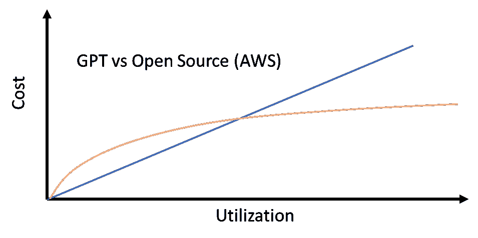
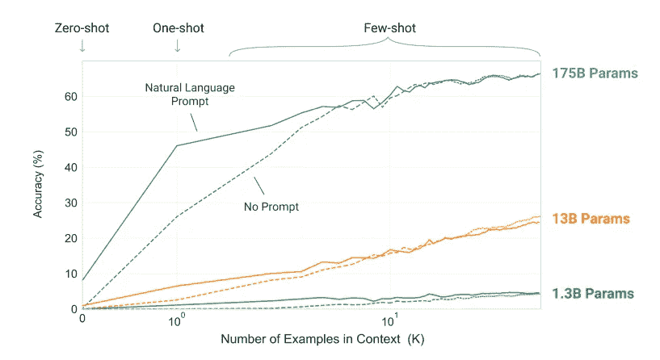

# LLM 经济学：ChatGPT 与开源模型的对比

> 原文：[`towardsdatascience.com/llm-economics-chatgpt-vs-open-source-dfc29f69fec1?source=collection_archive---------2-----------------------#2023-04-26`](https://towardsdatascience.com/llm-economics-chatgpt-vs-open-source-dfc29f69fec1?source=collection_archive---------2-----------------------#2023-04-26)

## 部署像 ChatGPT 这样的 LLM 需要多少成本？开源 LLM 的部署成本是否更低？有什么权衡？

 [Skanda Vivek](https://skanda-vivek.medium.com/?source=post_page-----dfc29f69fec1--------------------------------)

·

[关注](https://medium.com/m/signin?actionUrl=https%3A%2F%2Fmedium.com%2F_%2Fsubscribe%2Fuser%2F220d9bbb8014&operation=register&redirect=https%3A%2F%2Ftowardsdatascience.com%2Fllm-economics-chatgpt-vs-open-source-dfc29f69fec1&user=Skanda+Vivek&userId=220d9bbb8014&source=post_page-220d9bbb8014----dfc29f69fec1---------------------post_header-----------) 发表在 [Towards Data Science](https://towardsdatascience.com/?source=post_page-----dfc29f69fec1--------------------------------) ·6 分钟阅读·2023 年 4 月 26 日

--

对比 LLM 成本的卡通示意图 | Skanda Vivek

总结：在每天使用量为 1000 次请求范围内，ChatGPT 的成本低于在 AWS 上部署的开源 LLM。对于每天请求数达百万的情况，AWS 上的开源模型更便宜。（截至本文撰写日期 2023 年 4 月 24 日）

大型语言模型正在席卷全球。变压器模型于 2017 年问世，随后出现了突破性的模型如 BERT、GPT 和 BART——这些模型拥有数亿个参数，能够执行多种语言任务，如情感分析、问答、分类等。

几年前——来自 OpenAI 和 Google 的研究人员记录了多篇论文，表明拥有超过 10 亿参数的大型语言模型开始展现出涌现的能力，这些模型似乎能够理解语言的复杂方面，并且在回应上几乎像人类一样。

[GPT-3 论文](https://arxiv.org/abs/2005.14165)展示了大语言模型令人印象深刻的学习能力。

GPT-3 论文显示，参数大于 10-100 亿的模型展现了令人印象深刻的学习能力……
