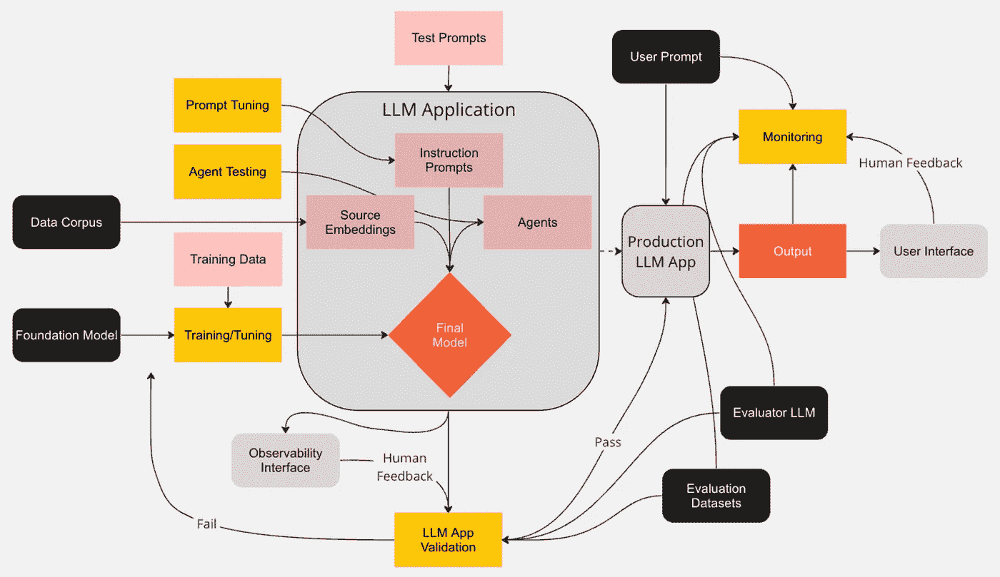

# LLM 监控与可观测性——负责任 AI 的技术和方法总结

> 原文：[`towardsdatascience.com/llm-monitoring-and-observability-c28121e75c2f?source=collection_archive---------0-----------------------#2023-09-15`](https://towardsdatascience.com/llm-monitoring-and-observability-c28121e75c2f?source=collection_archive---------0-----------------------#2023-09-15)

 [Josh Poduska](https://medium.com/@joshpoduska?source=post_page-----c28121e75c2f--------------------------------)

·

[关注](https://medium.com/m/signin?actionUrl=https%3A%2F%2Fmedium.com%2F_%2Fsubscribe%2Fuser%2Fb6dae10267e5&operation=register&redirect=https%3A%2F%2Ftowardsdatascience.com%2Fllm-monitoring-and-observability-c28121e75c2f&user=Josh+Poduska&userId=b6dae10267e5&source=post_page-b6dae10267e5----c28121e75c2f---------------------post_header-----------) 发布于 [Towards Data Science](https://towardsdatascience.com/?source=post_page-----c28121e75c2f--------------------------------) ·10 分钟阅读·2023 年 9 月 15 日

--

***目标受众***: ***实践者*** *希望了解可用的方法以及如何开始实施这些方法的情况，和* ***领导者*** *希望在构建治理框架和技术路线图时理解可能性的艺术。*

几乎一夜之间，每个首席执行官的待办事项、招聘广告和简历上都出现了生成 AI（genAI）。这完全是应有的。基于基础模型的应用程序已经改变了数百万人的工作、学习、写作、设计、编程、旅行和购物方式。大多数人，包括我在内，都认为这只是冰山一角。

在这篇文章中，我总结了对现有大型语言模型（LLM）监控方法的研究。我花了很多时间阅读文档、观看视频，并阅读来自专注于 LLM 监控和可观测性的开源库和软件供应商的博客。结果是一个用于监控和观察 LLM 的实用分类法。希望对你有帮助。在不久的将来，我计划进行一项学术文献检索，以添加前瞻性的视角。

***研究过的软件***: [*Aporia*](https://www.aporia.com/)*,* [*Arize*](https://arize.com/)*,* [*Arthur*](https://www.arthur.ai/)*,* [*Censius*](https://censius.ai/)*,* [*Databricks/MLFlow*](https://www.databricks.com/blog/announcing-mlflow-24-llmops-tools-robust-model-evaluation)*,* [*Datadog*](https://www.datadoghq.com/)*,* [*DeepChecks*](https://deepchecks.com/)*,* [*Evidently*](https://www.evidentlyai.com/)*,* [*Fiddler*](https://www.fiddler.ai/)*,* [*Galileo*](https://www.rungalileo.io/)*,* [*Giskard*](https://www.giskard.ai/)*,* [*Honeycomb*](https://www.honeycomb.io/)*,* [*Hugging Face*](https://huggingface.co/)*,* [*LangSmith*](https://www.langchain.com/langsmith)*,* [*New Relic*](https://newrelic.com/)*,* [*OpenAI*](https://openai.com/)*,* [*Parea*](https://www.parea.ai/)*,* [*Trubrics*](https://trubrics.com/)*,* [*Truera*](https://truera.com/)*,* [*Weights & Biases*](https://wandb.ai/site)*,* [*Why Labs*](https://whylabs.ai/)

+   ***本文呈现了一个累积的分类法，没有对软件选项进行评分或比较。如果你想讨论我研究中涉及的特定软件，请 [联系我](https://www.linkedin.com/in/joshpoduska/)。***

# **文章大纲**

+   **评估 LLM** — LLM 是如何评估的，何时被认为适合生产？

+   **跟踪 LLM** — 跟踪 LLM 意味着什么，哪些组件需要包括？

+   **监控 LLM** — LLM 一旦投入生产，如何进行监控？

# **LLM 生命周期**

由 Josh Poduska 创作的照片 — [互动视图链接](https://miro.com/app/board/uXjVMkjWJq4=/?share_link_id=719484162544)

**将 LLM 纳入生产工作流程的竞赛已经开始，但技术社区正在争分夺秒地开发最佳实践，以确保这些强大的模型随着时间的推移按预期行为。**

# **评估 LLM**

评估传统的机器学习（ML）模型涉及检查其输出或预测的准确性。这通常通过众所周知的指标如准确率、RMSE、AUC、精确度、召回率等来衡量。评估 LLM 复杂得多。数据科学家今天使用了几种方法。

(1) 分类和回归指标

LLM 可以生成数字预测或分类标签，这种情况下评估较为简单。与传统的 ML 模型一样。这在某些情况下很有帮助，但我们通常关注的是评估生成文本的 LLM。

(2) 独立的基于文本的指标

当你没有可靠的基准数据源时，这些指标对于评估 LLM 的文本输出非常有用。你可以根据过去的经验、学术建议或其他模型的评分来决定什么是可接受的。

[困惑度](https://huggingface.co/spaces/evaluate-metric/perplexity)是一个例子。它衡量模型生成输入文本序列的可能性，可以看作是评估模型对其训练文本的学习效果的方式。其他例子包括[阅读水平](https://docs.whylabs.ai/docs/langkit-modules#text-statistics)和[非字母字符](https://www.evidentlyai.com/blog/unstructured-data-monitoring)。

更复杂的独立方法包括从模型输出中提取嵌入，并分析这些嵌入以寻找不寻常的模式。这可以通过检查 3D 图中的嵌入图来手动完成。通过颜色编码或按关键字段（如性别、预测类别或困惑度评分）比较，可以揭示你的 LLM 应用中潜在的问题，并提供偏见和解释性的衡量。存在一些软件工具可以以这种方式可视化嵌入。它们将嵌入聚类并映射到 3 维空间。这通常通过[HDBSCAN 和 UMAP](https://arize.com/resource/understanding-umap-and-hdbscan/)完成，但有些工具采用[基于 K-means 的方法](https://www.fiddler.ai/blog/monitoring-natural-language-processing-and-computer-vision-models-part-1)。

除了视觉评估外，还可以运行异常检测算法来检查嵌入中是否存在异常值。

(3) 评估数据集

拥有真实标签的数据集可以将文本输出与批准的响应基准进行比较。

一个著名的例子是[ROUGE](https://huggingface.co/spaces/evaluate-metric/rouge)指标。在语言翻译任务中，ROUGE 依赖于一个参考数据集，其答案与正在评估的 LLM 进行比较。可以根据参考数据集计算相关性、准确性和其他一系列指标。嵌入在其中起着关键作用。标准的[距离指标](https://docs.aporia.com/api-reference/metrics-glossary#statistical-distances)如 J-S 距离、赫灵距离、KS 距离和 PSI，将你的 LLM 输出嵌入与真实标签嵌入进行比较。

最后，存在一些广泛接受的 LLM 基准测试。斯坦福的[HELM 页面](https://crfm.stanford.edu/helm/latest/?group=core_scenarios)是了解这些测试的好地方。

(4) 评估 LLM

起初，你可能会认为使用 LLM 来评估 LLM 是作弊，但许多人认为这是前进的最佳途径，[研究](https://arxiv.org/abs/2212.08073)也显示了希望。使用我所说的评估 LLM 很可能会成为不久的将来 LLM 评估的主要方法。

一个广泛接受的例子是[Toxicity](https://huggingface.co/spaces/evaluate-measurement/toxicity)度量。它依赖于一个评估器 LLM（Hugging Face 推荐的[roberta-hate-speech-dynabench-r4](https://huggingface.co/facebook/roberta-hate-speech-dynabench-r4-target)）来确定你的模型输出是否有毒。上述所有关于评估数据集的度量在这里也适用，因为我们将评估器 LLM 的输出视为参考。

根据 Arize 的研究人员，评估器 LLM 应配置为提供二元分类标签以用于它们测试的度量。[他们解释说](https://docs.arize.com/phoenix/concepts/llm-evals#binary-performance-evaluation)，数值评分和排名需要更多工作，并且不如二元标记表现良好。

(5) 人类反馈

尽管这篇文章、软件文档和营销材料强调了可测量的度量，但你不应忘记手动基于人类的反馈。这通常在构建 LLM 应用的早期阶段由数据科学家和工程师考虑。LLM 可观察性软件通常有一个接口来协助这个任务。除了早期开发反馈之外，将人类反馈纳入最终评估过程（以及持续监控）也是一种最佳实践。获取 50 到 100 个输入提示并手动分析输出可以让你对最终产品有很大的了解。

# **跟踪 LLMs**

跟踪是监控的前提。在我的研究中，我发现跟踪 LLMs 的细节中有足够的细微差别，需要单独成章。跟踪的低悬果包括捕获请求数量、响应时间、令牌使用情况、成本和错误率。标准系统监控工具在这里发挥作用，同时还有更多针对 LLM 的选项（传统监控公司也有营销团队迅速宣称基于简单功能度量跟踪的 LLM 可观察性和监控）。

从捕获输入提示和输出响应中获得深刻见解以进行未来分析。这听起来很简单，但实际上并非如此。复杂性来自于我迄今为止略过的某些内容（大多数数据科学家在谈论或写作关于 LLM 时也一样）。我们并不是在评估、跟踪和监控一个 LLM。我们处理的是一个应用程序；一个或多个 LLM、预设的指令提示和协作生成输出的代理的集合。一些 LLM 应用并不复杂，但许多是的，并且趋势是向更复杂的方向发展。在即使是稍微复杂的 LLM 应用中，确定最终的提示调用可能是困难的。如果我们在调试，我们需要知道每一步的调用状态及这些步骤的顺序。实践者会希望利用帮助解开这些复杂性的工具。

# **监控 LLMs**

虽然大多数 LLM 和 LLM 应用程序至少经历过某种形式的评估，但实施持续监控的却很少。我们将拆解监控的组成部分，以帮助你建立一个保护用户和品牌的监控程序。

(1) 功能监控

首先，上述跟踪部分提到的简单任务应持续监控。这包括请求数量、响应时间、令牌使用、成本和错误率。

(2) 监控提示

接下来，你的列表中应该包括监控用户提供的提示或输入。像可读性这样的独立指标可能会很有帮助。评估 LLM 应该用于检查毒性等问题。将嵌入距离与参考提示进行比较是明智的指标。即使你的应用程序能够处理与预期大相径庭的提示，你仍然希望了解客户与应用程序的互动是否是新的或随时间变化的。

目前，我们需要引入一个新的评估类别：对抗性尝试或恶意提示注入。这在初步评估中并不总是被考虑到。与已知对抗性提示的参考集进行比较可以标记出恶意行为者。评估 LLM 也可以将提示分类为恶意或非恶意。

(3) 监控响应

在将你的 LLM 应用程序产生的内容与预期结果进行比较时，有许多有用的检查可以实施。考虑相关性。你的 LLM 是否在响应相关内容，还是在胡言乱语（幻想）？你是否看到与预期主题的偏离？情感如何？你的 LLM 是否以正确的语调回应，且这种情况是否随着时间变化？

你可能不需要每天监控所有这些指标。每月或每季度一次对于某些指标来说就足够了。另一方面，毒性和有害输出始终是部署 LLM 时最令人担忧的问题。这些是你需要更频繁跟踪的指标。记住，之前讨论的嵌入可视化技术可能有助于根本原因分析。

[提示泄露](https://learnprompting.org/docs/prompt_hacking/leaking)是一种我们尚未介绍的对抗性方法。提示泄露发生在某人欺骗你的应用程序泄露你存储的提示时。你可能花了很多时间找出哪个预设提示指令效果最好。这是敏感的知识产权。提示泄露可以通过监控响应并将其与提示指令数据库进行比较来发现。嵌入距离指标效果很好。

如果你有评估或参考数据集，你可能需要定期测试你的 LLM 应用，并比较之前测试的结果。这可以给你一个随时间变化的准确度感知，并能提醒你漂移。如果发现问题，一些管理嵌入的工具允许你导出表现不佳的输出数据集，以便你可以在这些有问题的提示类别上微调你的 LLM。

(4) 警报与阈值

应注意确保你的阈值和警报不会引发过多的虚假警报。多变量漂移检测和警报可以有所帮助。我有一些关于如何做到这一点的想法，但会留到另一篇文章中。顺便说一下，我在研究本文时没有看到关于虚假警报率或阈值最佳实践的任何提及。这真是个遗憾。

有几个与警报相关的不错功能，你可能想将它们列入必备清单。许多监控系统提供与信息馈送（如 Slack 和 Pager Duty）的集成。一些监控系统允许如果输入提示触发警报，则自动响应拦截。相同的功能可以应用于在将响应发送给用户之前筛查个人信息泄露、毒性以及其他质量指标。

我会在这里添加一个观察点，因为我不知道把它放在哪里。自定义指标对你的监控方案可能非常重要。你的 LLM 应用可能是独特的，或者你团队中的一位优秀数据科学家想出了一个将显著提升你方法的指标。这个领域可能会有进展。你会希望有自定义指标的灵活性。

(5) 监控用户界面

如果系统具备监控功能，它将有一个用户界面（UI），显示度量的时间序列图。这是相当标准的。用户界面开始有所区别，当它们允许深入挖掘警报趋势，并指向某种程度的根本原因分析时。其他界面则通过基于集群和投影的嵌入空间可视化（我希望能看到或进行一项关于这些嵌入可视化在实际应用中有效性的研究）。

更成熟的产品将按用户、项目和团队对监控进行分组。它们将具有 RBAC，并基于所有用户都是需要知道的原则。过于频繁地，工具中的任何人都能看到每个人的数据，这在许多当今的组织中是不可接受的。

我所强调的警报产生不可接受虚假警报率的一个原因是用户界面未能促进对警报的适当分析。软件系统很少尝试在这方面进行任何优化，但有些系统会。再次提到，这个话题还有很多需要讨论的内容，稍后会再提及。

# **对从业者和领导者的最终思考**

领导者们，面临的风险太大，不容忽视 LLM 监控和可观测性的重要性。我说这些不仅仅是为了避免对用户造成伤害或失去品牌声誉。这些显然在你的关注范围内。你可能没有意识到的是，你公司对 AI 的快速且可持续的采用，可能意味着成功与失败之间的差距，而一个成熟的[负责任的 AI 框架](https://www.salesforceairesearch.com/trusted-ai)以及一个详细的技术路线图用于监控和观察 LLM 应用，将为你提供一个基础，使你能够比竞争对手更快、更好、更安全地扩展。

从业人员，本文介绍的概念提供了一系列工具、技术和指标，这些应当包含在 LLM 可观测性和监控的实施中。你可以将其作为指南，以确保你的监控系统能够胜任这项任务。同时，你可以将其作为进一步深入研究我们讨论的每个概念的基础。

这是一个令人兴奋的新领域。那些对其有深刻了解的领导者和从业人员，将能够帮助他们的团队和公司在 AI 时代取得成功。

***关于作者：***

[*Josh Poduska*](https://www.linkedin.com/in/joshpoduska/) *是一位 AI 领导者、战略家和顾问，拥有超过 20 年的经验。他曾担任 Domino Data Lab 的首席现场数据科学家，并在多家公司管理团队和领导数据科学战略。Josh 在多个领域建立并实施了数据科学解决方案。他拥有加州大学欧文分校的数学学士学位和康奈尔大学应用统计硕士学位。*
