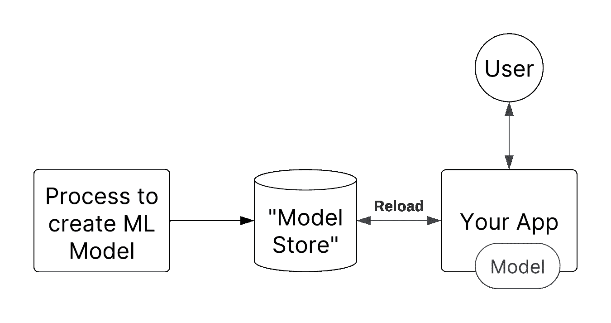
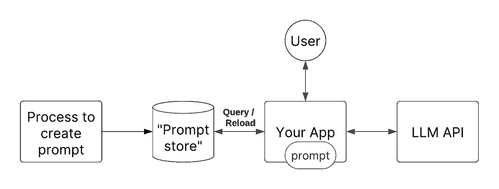
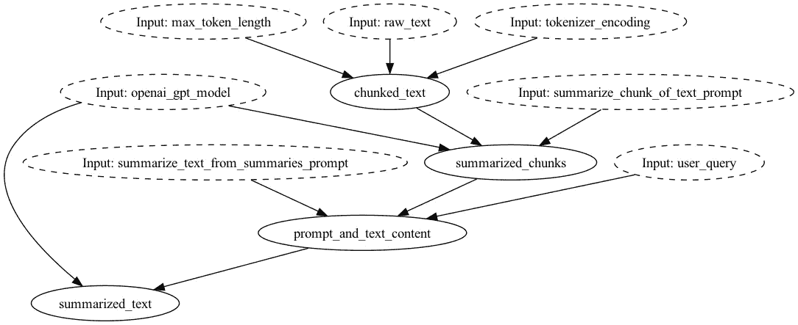
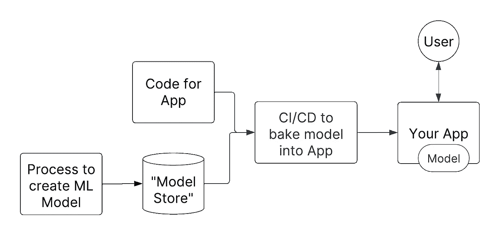
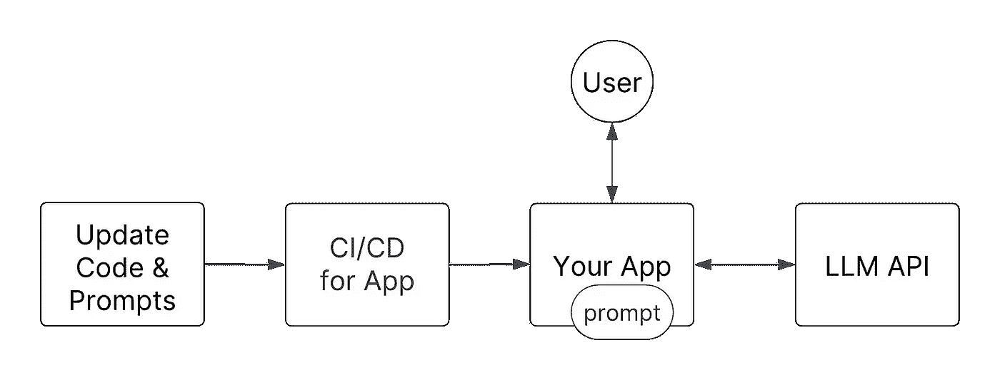
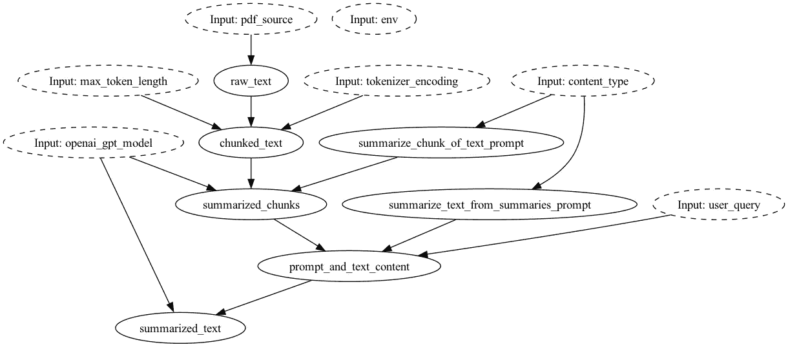

# LLMOps：与 Hamilton 一起进行生产级提示工程模式

> 原文：[`towardsdatascience.com/llmops-production-prompt-engineering-patterns-with-hamilton-5c3a20178ad2?source=collection_archive---------1-----------------------#2023-09-13`](https://towardsdatascience.com/llmops-production-prompt-engineering-patterns-with-hamilton-5c3a20178ad2?source=collection_archive---------1-----------------------#2023-09-13)

## 生产级别的提示迭代概述，与 Hamilton 一起进行

[](https://medium.com/@stefan.krawczyk?source=post_page-----5c3a20178ad2--------------------------------)[](https://towardsdatascience.com/?source=post_page-----5c3a20178ad2--------------------------------) [Stefan Krawczyk](https://medium.com/@stefan.krawczyk?source=post_page-----5c3a20178ad2--------------------------------)

·

[关注](https://medium.com/m/signin?actionUrl=https%3A%2F%2Fmedium.com%2F_%2Fsubscribe%2Fuser%2F193628e26f00&operation=register&redirect=https%3A%2F%2Ftowardsdatascience.com%2Fllmops-production-prompt-engineering-patterns-with-hamilton-5c3a20178ad2&user=Stefan+Krawczyk&userId=193628e26f00&source=post_page-193628e26f00----5c3a20178ad2---------------------post_header-----------) 发表在 [Towards Data Science](https://towardsdatascience.com/?source=post_page-----5c3a20178ad2--------------------------------) ·13 分钟阅读·2023 年 9 月 13 日[](https://medium.com/m/signin?actionUrl=https%3A%2F%2Fmedium.com%2F_%2Fvote%2Ftowards-data-science%2F5c3a20178ad2&operation=register&redirect=https%3A%2F%2Ftowardsdatascience.com%2Fllmops-production-prompt-engineering-patterns-with-hamilton-5c3a20178ad2&user=Stefan+Krawczyk&userId=193628e26f00&source=-----5c3a20178ad2---------------------clap_footer-----------)

--

[](https://medium.com/m/signin?actionUrl=https%3A%2F%2Fmedium.com%2F_%2Fbookmark%2Fp%2F5c3a20178ad2&operation=register&redirect=https%3A%2F%2Ftowardsdatascience.com%2Fllmops-production-prompt-engineering-patterns-with-hamilton-5c3a20178ad2&source=-----5c3a20178ad2---------------------bookmark_footer-----------)

提示。在生产环境中，如何演变这些提示？*这篇文章基于最初发表的内容* [*这里*](https://blog.dagworks.io/p/llmops-production-prompt-engineering)*.* 图片来自 [pixabay](https://pixabay.com/illustrations/picture-frame-banner-status-badge-3042585/).

你发送给大型语言模型（LLM）的内容非常重要。小的变化和调整可能对输出产生重大影响，因此随着你的产品发展，你的提示也需要进化。LLMs 也在不断开发和发布，因此随着 LLMs 的变化，你的提示也需要变化。因此，建立一个迭代模式来操作化你的“部署”提示是重要的，以便你和你的团队可以高效地移动，同时确保生产问题最小化，甚至避免。在这篇文章中，我们将通过[Hamilton](http://github.com/dagworks-inc/hamilton)这一个开源微调度框架来指导你管理提示的最佳实践，并类比[MLOps](https://en.wikipedia.org/wiki/MLOps)模式，并讨论其中的权衡。这篇文章的高级要点即使你不使用 Hamilton 也同样适用。

**在我们开始之前几点注意事项：**

1.  我是[Hamilton](http://github.com/dagworks-inc/hamilton)的共同创建者之一。

1.  对[Hamilton](http://github.com/dagworks-inc/hamilton)不熟悉？请滚动到底部查看更多链接。

1.  如果你在寻找讨论“上下文管理”的文章，这不是那篇文章。但这篇文章将帮助你了解如何迭代和创建生产级别的“提示上下文管理”迭代故事。

1.  我们将提示和提示模板互换使用。

1.  我们假设这些提示是在“在线”网页服务设置中使用的。

1.  我们将使用我们的[Hamilton 的 PDF 摘要示例](https://github.com/DAGWorks-Inc/hamilton/tree/main/examples/LLM_Workflows/pdf_summarizer)来映射我们的模式。

1.  我们的信誉是什么？我们在为 Stitch Fix 的 100 多位数据科学家构建自服务数据/MLOps 工具方面度过了职业生涯。因此，我们见证了很多故障和方法的演变。

# 提示对 LLMs 的作用类似于超参数对 ML 模型的作用。

> **要点：** 提示+LLM APIs 类似于超参数+机器学习模型。

就“Ops”实践而言，LLMOps 仍处于起步阶段。MLOps 稍微成熟一点，但如果与 DevOps 实践的广泛知识相比，仍然没有被广泛采用。

DevOps 实践主要关注如何将代码交付到生产环境，而 MLOps 实践关注如何将代码***& 数据工件***（例如，统计模型）交付到生产环境。那么 LLMOps 呢？个人认为，它更接近 MLOps，因为你有：

1.  你的 LLM 工作流仅仅是代码。

1.  LLM API 是一个数据工件，可以使用提示“调整”，类似于机器学习（ML）模型及其超参数。

因此，你很可能需要紧密版本控制 LLM API 和提示，以确保良好的生产实践。例如，在 MLOps 实践中，你需要一个过程来验证 ML 模型在其超参数更改时仍然表现正确。

# 你应该如何考虑提示的操作化？

需要明确的是，控制的两个部分是*LLM*和*提示*。类似于 MLOps，当代码或模型工件发生变化时，你需要能够确定是哪一部分发生了变化。对于 LLMOps，我们也需要相同的辨别能力，将 LLM 工作流与 LLM API + 提示分开。重要的是，我们应该认为 LLM（自托管或 API）大多是静态的，因为我们不经常更新（甚至控制）它们的内部。因此，改变 LLM API + 提示的*提示*部分实际上就像是创建一个新的模型工件。

处理提示的主要方式有两种：

1.  **提示作为动态运行时变量**。所使用的模板在部署时不是静态的。

1.  **提示作为代码**。提示模板在给定的部署下是静态的/预定的。

主要区别在于你需要管理的移动部分的数量，以确保一个良好的生产故事。下面，我们将探讨如何在这两种方法的背景下使用 Hamilton。

# 提示作为动态运行时变量

## 动态传递/加载提示

提示只是字符串。由于字符串在大多数语言中是原始类型，这意味着它们非常容易传递。这个想法是抽象你的代码，使你在运行时传递所需的提示。更具体地说，你会在有“更新”的提示模板时“加载/重新加载”提示模板。

这里的 MLOps 类比是，当有新的模型可用时，自动重新加载 ML 模型工件（例如，pkl 文件）。



MLOps 类比：图示 ML 模型自动重新加载的效果。图片作者。



图示动态重新加载/查询提示的效果。图片作者。

这里的好处是你可以非常迅速地推出新的提示，因为你不需要重新部署你的应用程序！

这种迭代速度的缺点是增加了操作负担：

1.  对于监控你的应用程序的人来说，什么时候发生了变化以及是否已经在你的系统中传播开来将是不清楚的。例如，你刚刚推送了一个新的提示，而 LLM 现在每个请求返回更多的 token，导致延迟激增；监控的人可能会感到困惑，除非你有一个优秀的变更日志文化。

1.  回滚语义涉及到需要了解*另一个*系统。你不能仅仅回滚之前的部署来修复问题。

1.  你需要优秀的监控来了解运行了什么以及何时运行；例如，当客户服务给你一个调查的票据时，你怎么知道使用了什么提示？

1.  你需要管理和监控你用来管理和存储提示的任何系统。这将是一个你需要维护的额外系统，超出了提供你代码的系统之外。

1.  你需要管理两个过程，一个用于更新和推送服务，另一个用于更新和推送提示。同步这些更改将由你负责。例如，你需要对服务进行代码更改以处理新的提示。你需要协调更改两个系统以使其工作，这增加了额外的操作开销。

# 与 Hamilton 一起工作的方式

如果你删除`sumarize_text_from_summaries_prompt`和`sumarize_chunk_of_text_prompt`函数定义，我们的 PDF 总结器流程大致如下：



summarization_shortened.py。注意两个输入`*_prompt`，它们表示现在作为数据流输入所需的提示。通过 Hamilton，你可以通过查看像这样的图表来确定你的提示模板所需的输入。图表由 Hamilton 创建。图像由作者提供。

要操作事物，你需要在请求时注入提示：

```py
from hamilton import base, driver
import summarization_shortend

# create driver
dr = (
    driver.Builder()
    .with_modules(summarization_sortened)
    .build()
)

# pull prompts from somewhere
summarize_chunk_of_text_prompt = """SOME PROMPT FOR {chunked_text}"""
summarize_text_from_summaries_prompt = """SOME PROMPT {summarized_chunks} ... {user_query}"""

# execute, and pass in the prompt 
result = dr.execute(
   ["summarized_text"],
   inputs={
      "summarize_chunk_of_text_prompt": summarize_chunk_of_text_prompt,
      ...
   }
)
```

或者你可以更改代码以动态加载提示，即将函数添加到 Hamilton 数据流中以从外部系统检索提示。在每次调用时，它们将查询要使用的提示（当然你可以缓存以提高性能）：

```py
# prompt_template_loaders.py

def summarize_chunk_of_text_prompt(
  db_client: Client, other_args: str) -> str:
    # pseudo code here, but you get the idea:
    _prompt = db_client.query( 
         "get latest prompt X from DB", other_args)
    return _prompt

def summarize_text_from_summaries_prompt(
   db_client: Client, another_arg: str) -> str:
    # pseudo code here, but you get the idea:
    _prompt = db_client.query(
         "get latest prompt Y from DB", another_arg)
    return _prompt
```

Driver 代码：

```py
from hamilton import base, driver
import prompt_template_loaders # <-- load this to provide prompt input
import summarization_shortend

# create driver
dr = (
    driver.Builder()
    .with_modules(
        prompt_template_loaders,# <-- Hamilton will call above functions
        summarization_sortened, 
    )
    .build()
)

# execute, and pass in the prompt 
result = dr.execute(
   ["summarized_text"],
   inputs={
      # don't need to pass prompts in this version
   }
)
```

# 我如何记录使用的提示并监控流程？

在这里，我们概述了几种监控发生情况的方法。

+   记录执行结果。也就是说，运行 Hamilton，然后将信息发送到你希望它去的地方。

```py
result = dr.execute(
   ["summarized_text", 
    "summarize_chunk_of_text_prompt",   
    ... # and anything else you want to pull out
    "summarize_text_from_summaries_prompt"],
   inputs={
      # don't need to pass prompts in this version
   }
)

my_log_system(result) # send what you want for safe keeping to some
                      # system that you own.
```

> *注意。在上述内容中，Hamilton 允许你请求* **任何 *中间*** *输出，只需按名称请求“函数”（即图中的节点）。如果我们真的想获取整个数据流的所有中间输出，我们可以这样做并将其记录到任何我们想要的地方！*

+   在 Hamilton 函数内部使用记录器（要查看这种方法的强大功能，[请参见我关于结构化日志的旧讲座](https://www.youtube.com/watch?v=4Y3VdS2pLF4)）：

```py
import logging

logger = logging.getLogger(__name__)

def summarize_text_from_summaries_prompt(
    db_client: Client, another_arg: str) -> str:
    # pseudo code here, but you get the idea:
    _prompt = db_client.query(
         "get latest prompt Y from DB", another_arg)
    logger.info(f"Prompt used is [{_prompt}]")
    return _prompt
```

+   扩展 Hamilton 以发出这些信息。你可以使用 Hamilton 捕获执行函数的信息，即节点，而无需在函数体内插入日志语句。这促进了重用，因为你可以在 Driver 级别在开发和生产设置之间切换日志记录。参见 [GraphAdapters](https://hamilton.dagworks.io/en/latest/reference/graph-adapters/)，或编写你自己的 [Python 装饰器](https://realpython.com/primer-on-python-decorators/#simple-decorators) 来包装函数进行监控。

在上述任何代码中，你都可以轻松地引入第三方工具来帮助跟踪和监控代码以及外部 API 调用。

# 作为代码的提示

## 作为静态字符串的提示

由于提示仅仅是字符串，它们也非常适合与源代码一起存储。这个想法是将尽可能多的提示版本存储在你的代码中，以便在运行时，所用提示集是固定且确定的。

这里的 MLOps 类比是，与其动态重新加载模型，不如将 ML 模型嵌入到容器中/硬编码引用。一旦部署，你的应用程序拥有它所需的一切。部署是不可变的；一旦启动便不会更改。这使得调试和确定问题变得更加简单。



MLOps 类比：通过将模型固定以进行应用程序的部署，从而创建一个不可变的部署。图片由作者提供。



图示展示了如何将提示视为代码，使你能够利用 CI/CD 构建一个不可变的部署来与 LLM API 进行交互。图片由作者提供。

这种方法有许多操作上的好处：

1.  每当推送一个新提示时，都会强制执行新的部署。如果新提示出现问题，回滚语义是明确的。

1.  你可以同时提交源代码和提示的拉取请求（PR）。这使得审查更改变得更简单，并且可以清楚地了解这些提示将影响/交互的下游依赖关系。

1.  你可以在 CI/CD 系统中添加检查，以确保不良提示不会进入生产环境。

1.  调试问题变得更简单。你只需拉取创建的（Docker）容器，就能迅速轻松地精确复现任何客户问题。

1.  不需要维护或管理其他“提示系统”。简化了操作。

1.  这并不排除添加额外的监控和可视性。

## 这在 Hamilton 中如何工作

提示将被编码为数据流/有向无环图（DAG）中的函数：



PDF 摘要示例中的 summarization.py 文件的样子。提示模板是代码的一部分。图示由 Hamilton 创建。图片由作者提供。

将这段代码与 [git](https://git-scm.com/book/en/v2/Getting-Started-About-Version-Control) 结合使用，我们为你的整个数据流（即“链”）提供了一个轻量级的版本控制系统，这样你总是可以根据 git commit SHA 辨别世界的状态。如果你想在任何时间点管理和访问多个提示，Hamilton 提供了两个强大的抽象来实现这一点：`@config.when` 和 *Python 模块*。这允许你存储并保留所有旧版本的提示，并通过代码指定使用哪个版本。

## @config.when ([文档](https://hamilton.dagworks.io/en/latest/reference/decorators/config_when/))

Hamilton 有一个装饰器的概念，它们只是函数上的注解。`@config.when` 装饰器允许为数据流中的函数（即“节点”）指定替代实现。在这种情况下，我们指定替代的提示。

```py
from hamilton.function_modifiers import config

@config.when(version="v1")
def summarize_chunk_of_text_prompt__v1() -> str:
    """V1 prompt for summarizing chunks of text."""
    return f"Summarize this text. Extract any key points with reasoning.\n\nContent:"

@config.when(version="v2")
def summarize_chunk_of_text_prompt__v2(content_type: str = "an academic paper") -> str:
    """V2 prompt for summarizing chunks of text."""
    return f"Summarize this text from {content_type}. Extract the key points with reasoning. \n\nContent:"
```

你可以继续添加带有`@config.when`注解的函数，这样可以通过传递给 Hamilton `Driver`的配置在它们之间切换。在实例化`Driver`时，它将使用与配置值关联的提示实现来构建数据流。

```py
from hamilton import base, driver
import summarization
# create driver
dr = (
    driver.Builder()
    .with_modules(summarization)
    .with_config({"version": "v1"}) # V1 is chosen. Use "v2' for V2.
    .build()
)
```

# 模块切换

除了使用`@config.when`之外，你还可以将不同的提示实现放入不同的 Python 模块中。然后，在`Driver`构造时，传递适合你想使用的上下文的正确模块。

所以在这里我们有一个包含 V1 的模块：

```py
# prompts_v1.py
def summarize_chunk_of_text_prompt() -> str:
    """V1 prompt for summarizing chunks of text."""
    return f"Summarize this text. Extract any key points with reasoning.\n\nContent:"
```

在这里，我们有一个包含 V2 的模块（看看它们之间的细微差别）：

```py
# prompts_v2.py
def summarize_chunk_of_text_prompt(content_type: str = "an academic paper") -> str:
    """V2 prompt for summarizing chunks of text."""
    return f"Summarize this text from {content_type}. Extract the key points with reasoning. \n\nContent:"
```

在下面的驱动代码中，我们根据某些上下文选择要使用的正确模块。

```py
# run.py
from hamilton import driver
import summarization
import prompts_v1
import prompts_v2

# create driver -- passing in the right module we want
dr = (
    driver.Builder()
    .with_modules(
        prompts_v1,  # or prompts_v2
        summarization,
    )
    .build()
)
```

使用模块方法允许我们将整个提示集封装和版本化。如果你想回到过去（通过 git），或者查看一个被批准的提示版本，你只需要导航到正确的提交，然后查看正确的模块。

## 我该如何记录使用的提示并监控流程？

假设你使用 git 来跟踪你的代码，你就不需要记录使用了哪些提示。相反，你只需知道部署的 git 提交 SHA，你就能同时跟踪你的代码和提示的版本。

要监控流程，就像上述方法一样，你可以使用相同的监控钩子，我不会在这里重复，但它们是：

+   请求任何中间输出并在 Hamilton 之外记录它们。

+   从函数内部记录它们，或构建一个[Python 装饰器](https://realpython.com/primer-on-python-decorators/#simple-decorators) / [GraphAdapter](https://hamilton.dagworks.io/en/latest/reference/graph-adapters/)在框架级别进行记录。

+   集成第三方工具来监控你的代码和 LLM API 调用。

+   或者以上所有！

# 那如何进行 A/B 测试我的提示？

对于任何机器学习项目，测量变更的业务影响非常重要。同样，对于 LLMs + 提示，测试和衡量变更对重要业务指标的影响也很重要。在 MLOps 世界中，你会对 ML 模型进行 A/B 测试，以通过在它们之间分配流量来评估它们的业务价值。为了确保 A/B 测试所需的随机性，你不会在运行时知道使用哪个模型，直到掷硬币。然而，要让这些模型上线，它们都需要遵循一个过程以进行资格认证。因此，对于提示，我们也应该考虑类似的方式。

上述两种提示工程模式并不会妨碍你进行 A/B 测试提示，但这意味着你需要管理一个过程，以启用你正在并行测试的任何数量的提示模板。如果你还在调整代码路径，将它们放在代码中将更容易辨别和调试发生了什么，并且你可以利用 ``@config.when`` 装饰器/ Python 模块交换来实现这一目的。与其依赖你的日志/监控/可观察性栈来告诉你使用了哪个提示，特别是当你动态加载/传递它们时，并且还需进行心理映射哪个提示对应哪个代码路径，前者将更为简便。

请注意，如果你开始需要更改多个提示进行 A/B 测试，因为你在一个流程中有几个提示，那么这会变得更加困难。例如，你在工作流中有两个提示并且你正在更换 LLM，你将希望从整体上进行 A/B 测试，而不是逐个提示地测试。我们的建议是，通过将提示放入代码中，你的操作生活会更简单，因为你将知道哪些提示属于哪些代码路径，而无需进行任何心理映射。

# 总结

在这篇文章中，我们解释了在生产环境中使用 Hamilton 管理提示的两种模式。第一种方法将**提示视为** **动态运行时变量**，而第二种方法将**提示视为代码**用于生产设置。如果你重视减少操作负担，那么我们的建议是将提示编码为代码，因为它在操作上更简单，除非更改它们的速度对你来说真的很重要。

总结：

1.  **提示作为动态运行时变量**。使用外部系统将提示传递到你的 Hamilton 数据流，或使用 Hamilton 从数据库中提取提示。对于调试和监控，能够确定给定调用使用了哪个提示是很重要的。你可以集成开源工具，或使用像 DAGWorks 平台这样的工具来帮助确保你知道在任何代码调用中使用了什么。

1.  **提示作为代码。** 将提示编码为代码允许使用 git 进行简单的版本控制。更改管理可以通过拉取请求和 CI/CD 检查来完成。它与 Hamilton 的功能，如 `@config.when` 和 Driver 级别的模块切换，工作良好，因为它清楚地确定使用了哪个版本的提示。这种方法加强了你可能使用的任何工具，如 DAGWorks 平台，因为部署的提示是不可变的。

# 我们想听听你的意见！

如果你对这些内容感到兴奋或有强烈的意见，请留下评论，或访问我们的 Slack 频道！一些用于表扬/投诉/聊天的链接：

+   📣 [加入我们的 Slack 社区](https://join.slack.com/t/hamilton-opensource/shared_invite/zt-1bjs72asx-wcUTgH7q7QX1igiQ5bbdcg) — 我们非常乐意帮助解答你可能有的问题或帮助你入门。

+   ⭐️ 在 [GitHub](https://github.com/DAGWorks-Inc/hamilton) 上关注我们。

+   📝 如果你发现问题，请在 [issue](https://github.com/DAGWorks-Inc/hamilton/issues) 中告诉我们。

+   📚 阅读我们的 [文档](https://hamilton.dagworks.io/en/latest/)。

+   ⌨️ 互动式 [在浏览器中了解 Hamilton](https://www.tryhamilton.dev/)。

# 其他你可能感兴趣的 Hamilton 链接/帖子：

+   [tryhamilton.dev](https://www.tryhamilton.dev/) — 在浏览器中的互动教程！

+   Hamilton + Lineage 在 10 分钟内

+   如何在 5 分钟内与 Pandas 一起使用 Hamilton

+   如何在 5 分钟内与 Ray 一起使用 Hamilton

+   如何在笔记本环境中使用 Hamilton

+   Hamilton 的背景故事与介绍

+   [使用 Hamilton 创建数据流的好处](https://medium.com/@thijean/the-perks-of-creating-dataflows-with-hamilton-36e8c56dd2a)（来自 Hamilton 的有机用户帖子！）
