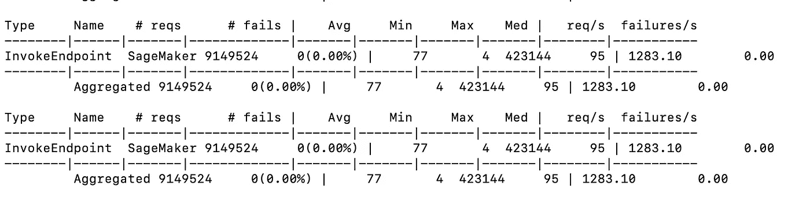
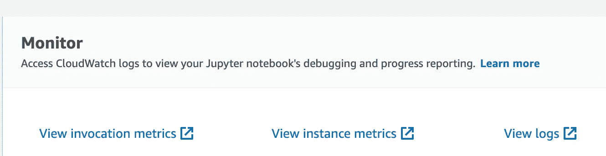
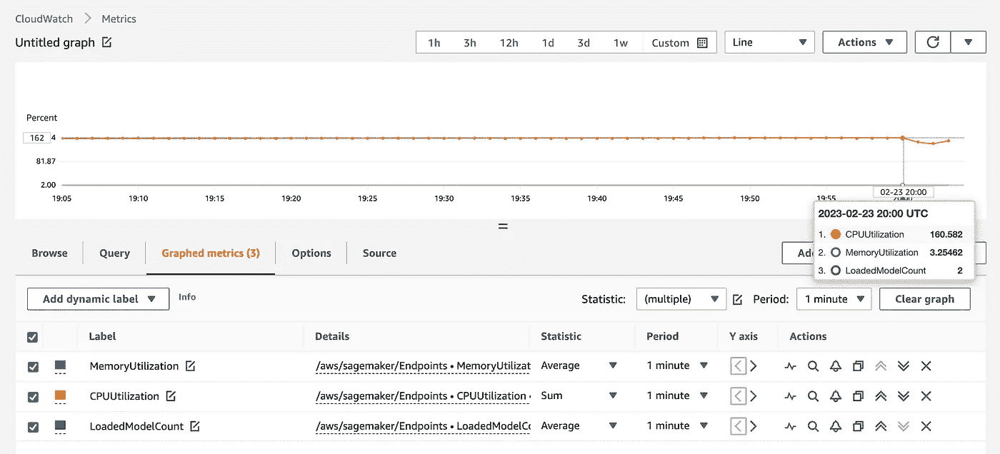
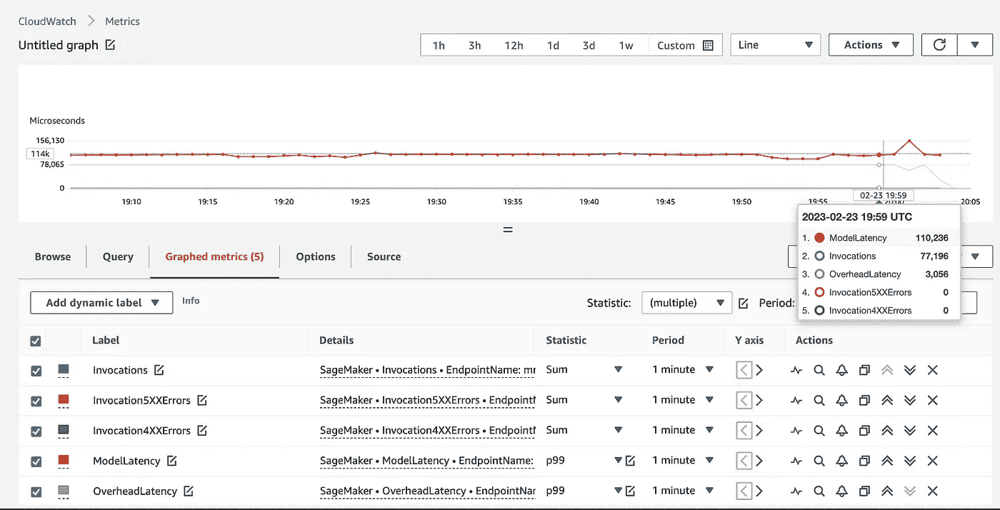

# 负载测试 SageMaker 多模型端点

> 原文：[`towardsdatascience.com/load-testing-sagemaker-multi-model-endpoints-f0db7b305770`](https://towardsdatascience.com/load-testing-sagemaker-multi-model-endpoints-f0db7b305770)

## 利用 Locust 在模型之间分配流量权重

[](https://ram-vegiraju.medium.com/?source=post_page-----f0db7b305770--------------------------------)[](https://towardsdatascience.com/?source=post_page-----f0db7b305770--------------------------------) [Ram Vegiraju](https://ram-vegiraju.medium.com/?source=post_page-----f0db7b305770--------------------------------)

·发表于 [Towards Data Science](https://towardsdatascience.com/?source=post_page-----f0db7b305770--------------------------------) ·9 分钟阅读·2023 年 2 月 24 日

--


图片来源：[Unsplash](https://unsplash.com/photos/mTorQ9gFfOg) 作者：Luis Reyes

将机器学习模型投入生产是一个复杂的过程。你需要测试不同的模型参数、硬件配置和流量模式，以尽可能地确定一个生产级别的部署。[负载测试](https://www.blazemeter.com/blog/performance-testing-vs-load-testing-vs-stress-testing#:~:text=but%20remain%20stable.-,What%20is%20Load%20Testing%3F,systems%20handle%20heavy%20load%20volumes.) 是一种必不可少的软件工程实践，但在 MLOps 领域应用同样至关重要，以评估你的模型在实际环境中的表现。

**我们如何进行负载测试？** 一个简单而高效的框架是 Python 包：[Locust](https://locust.io/)。Locust 可以在普通模式和分布式模式下使用，模拟每秒高达数千次的事务（TPS）。在今天的博客中，我们假设你对这个包有基本的了解，并将简要介绍其基础知识，但有关更一般的介绍，请参考这篇文章。

**我们将测试什么模型/终端节点？** [SageMaker 实时推断](https://aws.amazon.com/blogs/machine-learning/part-2-model-hosting-patterns-in-amazon-sagemaker-getting-started-with-deploying-real-time-models-on-sagemaker/) 是在低延迟、高吞吐量工作负载下服务 ML 模型的最佳选择之一。在这篇博客中，我们将特别关注一种称为[**SageMaker 多模型终端节点**](https://aws.amazon.com/blogs/machine-learning/part-3-model-hosting-patterns-in-amazon-sagemaker-run-and-optimize-multi-model-inference-with-amazon-sagemaker-multi-model-endpoints/) 的高级托管选项。在这里，我们可以在单一 REST 终端节点后托管数千个模型，并为每个 API 调用指定我们想要调用的目标模型。由于我们处理的是多个调用点而非单一模型/终端节点，负载测试变得具有挑战性。虽然可以随机生成所有模型的流量，有时用户会希望控制哪些模型接收更多流量。在这个示例中，我们将探讨如何**分配特定模型的流量权重**，以便尽可能接近模拟你的实际使用情况。

**注意**：本文假设你对 AWS 和 SageMaker 有基本的了解，编程方面假设你熟悉 Python，并对 Locust 包有基本了解。要了解如何使用 Locust 对 SageMaker 单模型终端节点进行负载测试，请参考这篇[文章](https://aws.amazon.com/blogs/machine-learning/best-practices-for-load-testing-amazon-sagemaker-real-time-inference-endpoints/)。

## 数据集引用

在这个示例中，我们将使用 Abalone 数据集进行回归问题，这个数据集来源于 UCI ML Repository（CC BY 4.0），你可以在[这里](https://archive.ics.uci.edu/ml/citation_policy.html)找到官方引用。

## 创建 SageMaker 多模型终端节点

在开始负载测试之前，我们必须创建我们的 SageMaker 多模型终端节点。所有终端节点创建的开发工作将在一个**SageMaker Notebook 实例**上进行，使用**conda_python3 内核**。

在这个示例中，我们将利用 Abalone 数据集，并对其运行[SageMaker XGBoost 算法](https://docs.aws.amazon.com/sagemaker/latest/dg/xgboost.html)以创建一个回归模型。你可以从公开的 Amazon 数据集中下载这个数据集。我们将利用这个数据集进行训练，并创建我们模型工件的副本以创建一个多模型终端节点。

```py
#retreive data
aws s3 cp s3://sagemaker-sample-files/datasets/tabular/uci_abalone/train_csv/abalone_dataset1_train.csv .
```

我们可以首先使用内置的 SageMaker XGBoost 算法启动一个训练任务，关于这个过程的详细指南请参考这篇[文章](https://aws.plainenglish.io/end-to-end-example-of-sagemaker-xgboost-eb9eae8a5207)。

```py
model_path = f's3://{default_bucket}/{s3_prefix}/xgb_model'

image_uri = sagemaker.image_uris.retrieve(
    framework="xgboost",
    region=region,
    version="1.0-1",
    py_version="py3",
    instance_type=training_instance_type,
)

xgb_train = Estimator(
    image_uri=image_uri,
    instance_type=training_instance_type,
    instance_count=1,
    output_path=model_path,
    sagemaker_session=sagemaker_session,
    role=role
)

xgb_train.set_hyperparameters(
    objective="reg:linear",
    num_round=50,
    max_depth=5,
    eta=0.2,
    gamma=4,
    min_child_weight=6,
    subsample=0.7,
    silent=0,
)

xgb_train.fit({'train': train_input})
```

完成此训练任务后，我们将获取生成的模型工件（SageMaker 中为 model.tar.gz 格式），并创建另一个此工件的副本，以拥有**两个模型在我们的多模型端点后面**。显然，在实际使用情况下，这些模型可能在不同的数据集上进行训练，或者在端点后面扩展到成千上万个模型。

```py
model_artifacts = xgb_train.model_data
model_artifacts # model.tar.gz artifact 
```

```py
%%sh

s3_bucket='sagemaker-us-east-1-474422712127'

for i in {0..1}
do
  aws s3 cp model.tar.gz s3://$s3_bucket/mme-xgboost/xgboost-$i.tar.gz 
done
```

在制作这两个副本后，我们可以在 [create_model](https://boto3.amazonaws.com/v1/documentation/api/latest/reference/services/sagemaker.html#SageMaker.Client.create_model) Boto3 API 调用中指定我们两个模型的 S3 路径。

```py
from time import gmtime, strftime
model_name = 'mme-source' + strftime("%Y-%m-%d-%H-%M-%S", gmtime())

print('Model name: ' + model_name)
print('Model data Url: ' + model_url)

create_model_response = client.create_model(
    ModelName=model_name,
    Containers=[
        {
            "Image": image_uri,
            "Mode": "MultiModel",
            "ModelDataUrl": model_url
        }
    ],
    ExecutionRoleArn=sagemaker.get_execution_role(),
)
print("Model Arn: " + create_model_response["ModelArn"])
```

我们可以在 [端点配置](https://boto3.amazonaws.com/v1/documentation/api/latest/reference/services/sagemaker.html#SageMaker.Client.create_endpoint_config) 对象中定义端点后的实例类型和数量，然后将其提供给我们的 [create_endpoint](https://boto3.amazonaws.com/v1/documentation/api/latest/reference/services/sagemaker.html#SageMaker.Client.create_endpoint) API 调用。

```py
#Step 2: EPC Creation
xgboost_epc_name = "mme-source" + strftime("%Y-%m-%d-%H-%M-%S", gmtime())
endpoint_config_response = client.create_endpoint_config(
    EndpointConfigName=xgboost_epc_name,
    ProductionVariants=[
        {
            "VariantName": "xgboostvariant",
            "ModelName": model_name,
            "InstanceType": "ml.m5.xlarge",
            "InitialInstanceCount": 1,
            #"Environment": {} 
        },
    ],
)
print("Endpoint Configuration Arn: " + endpoint_config_response["EndpointConfigArn"])
```

```py
#Step 3: EP Creation
endpoint_name = "mme-source" + strftime("%Y-%m-%d-%H-%M-%S", gmtime())
create_endpoint_response = client.create_endpoint(
    EndpointName=endpoint_name,
    EndpointConfigName=xgboost_epc_name,
)
print("Endpoint Arn: " + create_endpoint_response["EndpointArn"])
```

我们可以通过使用 Abalone 数据集中的一个样本数据点调用来验证我们的端点是否有效。请注意，我们为多模型端点指定了一个目标模型，这里我们指定了我们想要调用的 model.tar.gz 或模型工件。

```py
import boto3

resp = runtime.invoke_endpoint(EndpointName=endpoint_name, Body=b'.345,0.224414,.131102,0.042329,.279923,-0.110329,-0.099358,0.0', 
                           ContentType='text/csv', TargetModel = "xgboost-1.tar.gz")

print(resp['Body'].read())
```

这个 [invoke_endpoint](https://boto3.amazonaws.com/v1/documentation/api/latest/reference/services/sagemaker-runtime.html#SageMakerRuntime.Client.invoke_endpoint) API 调用是至关重要的，因为这是我们在负载测试中评估的接触点。我们现在有了一个功能齐全的多模型端点，让我们开始测试吧！

## 使用 Locust 进行负载测试

在我们深入设置脚本之前，让我们快速了解一下 Locust。Locust 是一个 Python 框架，可以让你用 Python 代码定义用户行为。Locust 将执行定义为任务。Locust 中的任务本质上是我们要测试的 API，或在我们的案例中是 invoke_endpoint 调用。每个用户将运行我们在 [Python 脚本](https://docs.locust.io/en/stable/writing-a-locustfile.html) 中为他们定义的任务。

Locust 有一个普通模式，利用单个进程来运行你的测试，但当你想要扩展时，它还具有分布式 [负载生成特性](https://docs.locust.io/en/stable/running-distributed.html)，本质上允许你使用多个进程甚至多个客户端机器。

在这种情况下，我们希望对我们的多模型端点施加超过 1000 TPS 的负载，因此我们需要一台能够处理我们试图生成的负载的强大客户端机器。我们可以启动一个**EC2 实例**，在这种情况下，我们使用**ml.c5d.18xlarge**，并将在这个环境中进行负载测试，以确保客户端不出现性能瓶颈。要了解如何设置 EC2 实例，请阅读以下[文档](https://docs.aws.amazon.com/AWSEC2/latest/UserGuide/connect.html)。对于我们的 AMI，我们使用“Deep Learning AMI GPU TensorFlow 2.9.1 (Ubuntu 20.04)”这一镜像，这些深度学习 AMI 自带了很多预装的机器学习框架，因此在这些用例中非常方便。请注意，虽然我们使用 EC2 来测试和调用我们的端点，你也可以使用其他客户端，只要它具有足够的计算能力来处理 Locust 生成的 TPS。

一旦你通过 SSH 进入你的 EC2 实例，我们可以开始定义我们的 locust 脚本。我们首先定义了一个 boto3 客户端，该客户端将进行我们要测量的 invoke_endpoint 调用。我们将用一个分布式 shell 脚本对其中的一些参数进行参数化，稍后会详细介绍。

```py
class BotoClient:
    def __init__(self, host):

        #Consider removing retry logic to get accurate picture of failure in locust
        config = Config(
            retries={
                'max_attempts': 100,
                'mode': 'standard'
            }
        )

        self.sagemaker_client = boto3.client('sagemaker-runtime',config=config)
        self.endpoint_name = host.split('/')[-1]
        self.region = region
        self.content_type = content_type
        self.payload = b'.345,0.224414,.131102,0.042329,.279923,-0.110329,-0.099358,0.0'
```

现在我们开始具体讨论多模型端点。我们定义了两种方法，**每种方法将触及我们两个目标模型中的一个**。

```py
#model that receives more traffic
    def sendPopular(self):

        request_meta = {
            "request_type": "InvokeEndpoint",
            "name": "SageMaker",
            "start_time": time.time(),
            "response_length": 0,
            "response": None,
            "context": {},
            "exception": None,
        }
        start_perf_counter = time.perf_counter()
        try:
            response = self.sagemaker_client.invoke_endpoint(
                EndpointName=self.endpoint_name,
                Body=self.payload,
                ContentType=self.content_type,
                TargetModel = 'xgboost-0.tar.gz'
            )
            response_body = response["Body"].read()
        except Exception as e:
            request_meta['exception'] = e

        request_meta["response_time"] = (time.perf_counter() - start_perf_counter) * 1000

        events.request.fire(**request_meta)
```

```py
#model that receives rest of traffic
    def sendRest(self):

        request_meta = {
            "request_type": "InvokeEndpoint",
            "name": "SageMaker",
            "start_time": time.time(),
            "response_length": 0,
            "response": None,
            "context": {},
            "exception": None,
        }
        start_perf_counter = time.perf_counter()

        try:
            response = self.sagemaker_client.invoke_endpoint(
                EndpointName=self.endpoint_name,
                Body=self.payload,
                ContentType=self.content_type,
                TargetModel = 'xgboost-1.tar.gz'
            )
            response_body = response["Body"].read()
        except Exception as e:
            request_meta['exception'] = e

        request_meta["response_time"] = (time.perf_counter() - start_perf_counter) * 1000

        events.request.fire(**request_meta)
```

现在，如果你有 200 个模型，是否需要为每个模型都准备一种方法？不一定，你可以指定目标模型字符串以适应你需要的模型。例如，如果你有 200 个模型，并且希望特定方法调用 5 个模型，我们可以将 TargetModel 参数设置为如下片段。

```py
f'xgboost-{random.randint(0,4)}.tar.gz' #specifies 5 models to receive traffic in method
```

如果你想要更具体，可能需要定义更多的方法，但如果你大致了解某些模型会接收到大多数流量，那么像上述的字符串操作就足够了。

最后，我们可以通过装饰器定义任务权重。我们第一个模型现在比第二个模型更有可能接收到流量，概率是前者的三倍。

```py
class MyUser(BotoUser):

    #This model is 3 times more likely to receive traffic
    @task(3)
    def send_request(self):
        self.client.sendPopular()

    @task
    def send_request_major(self):
        self.client.sendRest()
```

使用任务装饰器，我们可以定义权重，你可以根据流量模式扩展和调整这些权重。

最后，我们在这个仓库中定义了一个可以用来增加或减少流量的 shell 脚本。

```py
#replace with your endpoint name in format https://<<endpoint-name>>
export ENDPOINT_NAME=https://$1

export REGION=us-east-1
export CONTENT_TYPE=text/csv
export USERS=200
export WORKERS=40
export RUN_TIME=2mg
export LOCUST_UI=false # Use Locust UI

#replace with the locust script that you are testing, this is the locust_script that will be used to make the InvokeEndpoint API calls. 
export SCRIPT=locust_script.py

#make sure you are in a virtual environment
#. ./venv/bin/activate

if $LOCUST_UI ; then
    locust -f $SCRIPT -H $ENDPOINT_NAME --master --expect-workers $WORKERS -u $USERS -t $RUN_TIME --csv results &
else
locust -f $SCRIPT -H $ENDPOINT_NAME --master --expect-workers $WORKERS -u $USERS -t $RUN_TIME --csv results --headless &
fi

for (( c=1; c<=$WORKERS; c++ ))
do 
    locust -f $SCRIPT -H $ENDPOINT_NAME --worker --master-host=localhost &
done
```

在这里，我们定义了 locust 脚本读取的参数，但更重要的是，定义了两个 Locust 特有的参数：用户和工作者。在这里，你可以定义一个用户数量，这些用户将分布在不同的工作者上。你可以根据需要将这些数量扩大或缩小，以尝试实现目标 TPS。我们可以通过运行以下命令来执行我们的分布式测试。

```py
./distributed.sh <endpoint_name>
```

一旦启动测试，我们可以在我们的 EC2 实例 CLI 中看到负载测试正在进行。



Locust 分布式负载测试（作者截图）

## 监控

在总结之前，有几种不同的方法可以监控你的负载测试。一种是通过 Locust，如上截图所示，你可以实时跟踪你的 TPS 和延迟。最后，生成一个包含端到端延迟百分位数指标和 TPS 的一般结果文件。要调整测试的持续时间，请检查你在 distributed.sh 脚本中的 RUN_TIME 标志。

最后，为了验证你的负载测试结果，你可以通过 SageMaker CloudWatch 指标进行交叉检查，这些指标可以在控制台中找到。



监控端点（截图由作者提供）

通过调用指标，我们可以了解调用情况及延迟数据。通过实例指标，我们可以查看硬件的饱和程度以及是否需要扩展或缩减。要全面理解如何解读这些指标，请参考此[文档](https://docs.aws.amazon.com/sagemaker/latest/dg/monitoring-cloudwatch.html)。



硬件指标（截图由作者提供）



调用指标（截图由作者提供）

在这里我们可以看到我们已扩展到每分钟近 77,000 次调用，这比我们 Locust 指标显示的 1000 TPS 略高。最佳实践是跟踪实例和调用级别的这些指标，以便根据需要为你的硬件定义自动扩展。

## 额外资源与结论

[## GitHub - RamVegiraju/weighted-mme-load-test: Weighted load traffic distribution across models…](https://github.com/RamVegiraju/weighted-mme-load-test?source=post_page-----f0db7b305770--------------------------------)

### 你现在无法执行该操作。你在另一个标签或窗口中登录了。你在另一个标签或窗口中注销了……

[github.com](https://github.com/RamVegiraju/weighted-mme-load-test?source=post_page-----f0db7b305770--------------------------------)

示例的完整代码可以在上述链接中找到。如果你对 Locust 和 SageMaker 实时推理不熟悉，我强烈建议你查看与这两个功能相关的起始博客。本存储库中附带的负载测试脚本不仅可以轻松调整以适应 SageMaker 端点，还可以用于测试你托管的任何 API。任何反馈都受到欢迎，随时联系我提问或评论，谢谢阅读！

*如果你喜欢这篇文章，请随时在* [*LinkedIn*](https://www.linkedin.com/in/ram-vegiraju-81272b162/) *上与我联系，并订阅我的 Medium* [*Newsletter*](https://ram-vegiraju.medium.com/subscribe)*。如果你是 Medium 新用户，请使用我的* [*会员推荐链接*](https://ram-vegiraju.medium.com/membership)*注册。*
