# 局部光场融合

> 原文：[`towardsdatascience.com/local-light-field-fusion-14c07ed36117`](https://towardsdatascience.com/local-light-field-fusion-14c07ed36117)

## 如何在智能手机上渲染 3D 场景

 [Cameron R. Wolfe, Ph.D.](https://wolfecameron.medium.com/?source=post_page-----14c07ed36117--------------------------------)

·发布在[数据科学前沿](https://towardsdatascience.com/?source=post_page-----14c07ed36117--------------------------------) ·12 分钟阅读·2023 年 4 月 11 日

--

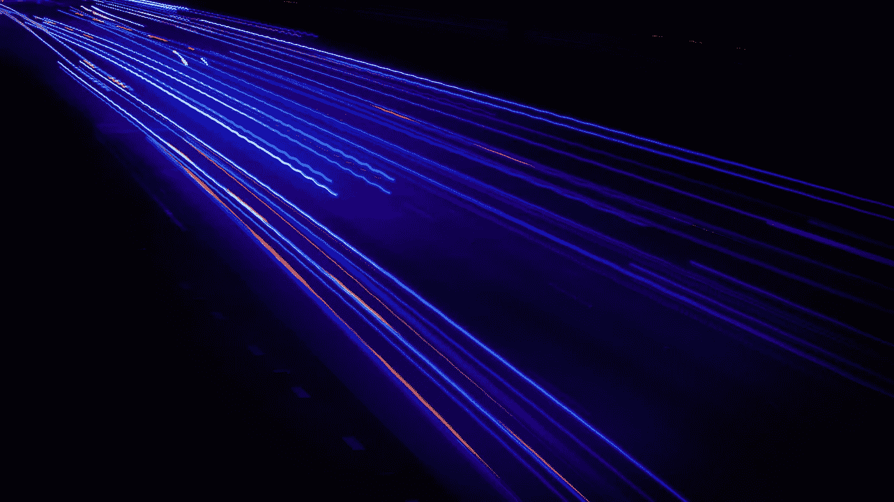

（照片由[Clyde He](https://unsplash.com/@clyde_he?utm_source=unsplash&utm_medium=referral&utm_content=creditCopyText)拍摄，来源于[Unsplash](https://unsplash.com/backgrounds/colors/light?utm_source=unsplash&utm_medium=referral&utm_content=creditCopyText)）

到目前为止，我们应该知道深度学习是表示 3D 场景并从任意视角生成这些场景的新渲染的一个极佳方法。然而，我们迄今为止看到的方法（例如，[ONets](https://cameronrwolfe.substack.com/p/shape-reconstruction-with-onets) 和 [SRNs](https://cameronrwolfe.substack.com/p/scene-representation-networks) [2, 3]）的问题是它们需要大量的场景图像来训练模型。考虑到这一点，我们可能会想知道是否可以用更少的样本获得基于深度学习的场景表示。*我们实际需要多少图像来训练一个高分辨率的场景表示？*

这个问题通过局部光场融合（LLFF）[1]方法来解决，该方法用于合成 3D 场景。LLFF 是[光场](http://lightfield-forum.com/what-is-the-lightfield/)渲染[4]的一个扩展，通过将几个现有视图扩展为多平面图像（MPI）表示，然后通过混合这些表示来渲染新的视角。该方法的结果是：

1.  精确地模拟复杂场景和效果，例如反射。

1.  理论上显示减少了生成准确场景表示所需的样本/图像数量。

此外，*LLFF 是规范性的*，这意味着该框架可以用于告知用户需要多少和什么类型的图像来生成准确的场景表示。因此，LLFF 是一种准确的、基于深度学习的方法，用于生成 3D 场景的建模，并提供有用的、规范性的见解。

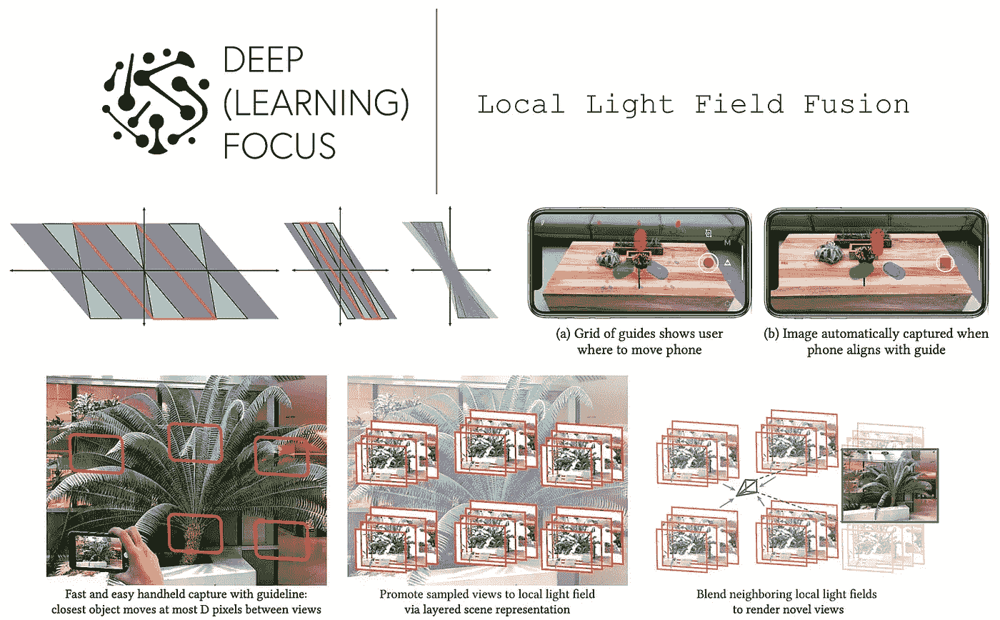

(来自 [1])

# 背景

要理解 LLFF，我们需要了解与计算机视觉和深度学习相关的一些概念。我们将首先讨论光场的概念，然后介绍 LLFF 所使用的一些深度学习概念。

**光场。** 一个[光场](http://lightfield-forum.com/what-is-the-lightfield/)将一个 3D 场景表示为在空间中方向性流动的光线。传统上，我们可以使用光场通过仅仅*(i)* 采样场景的光场（即，捕获具有深度和[校准](https://cameronrwolfe.substack.com/i/97472888/background)信息的图像）在不同的点和*(ii)* 在这些光场之间进行插值来渲染场景的视图。

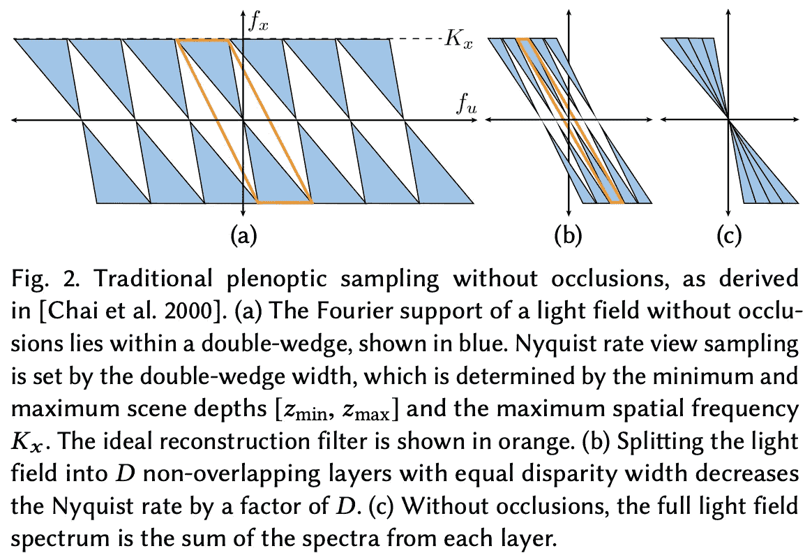

(来自 [1])

对于这样的系统，我们从[信号处理](https://en.wikipedia.org/wiki/Signal_processing)的研究中了解到，为了准确渲染场景的新视角，我们需要采集多少样本。准确表示场景所需的最小样本数量称为[奈奎斯特率](https://www.tutorialspoint.com/what-is-nyquist-rate-and-nyquist-interval)；见上文。实际上，奈奎斯特率所需的样本数量是 prohibitive 的，但全景采样的研究 [7] 旨在提高样本效率，并显著减少所需样本数量，低于奈奎斯特率。

全景采样的内部工作原理对于本概述的目的并不重要。我们应该从这次讨论中得到的主要思想是，[1]中的作者将全景采样的概念扩展到在样本较少（且可能被遮挡）的情况下实现准确的场景渲染；见下文。

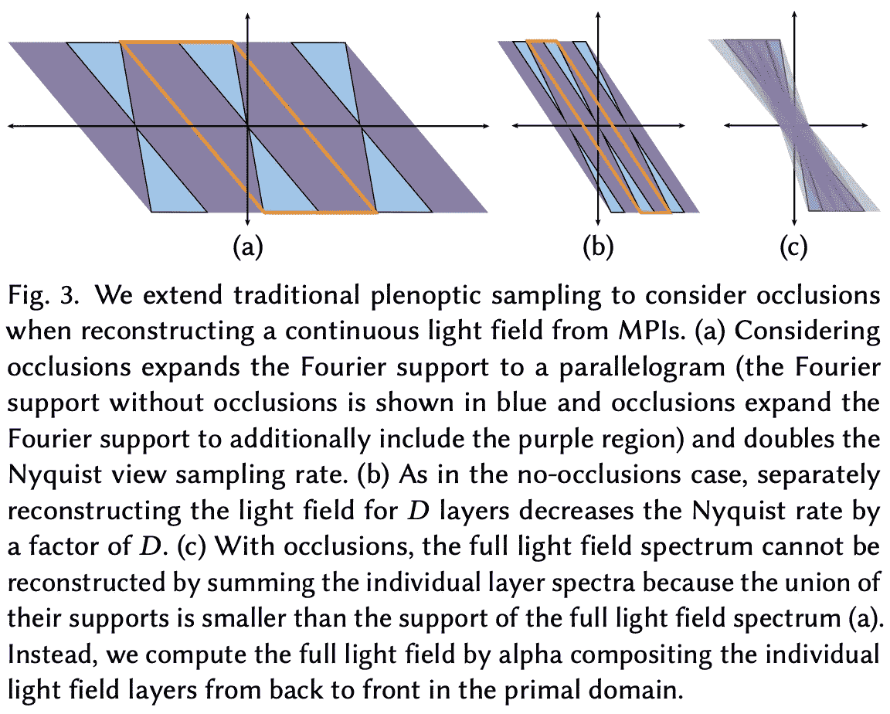

(来自 [1])

除了样本效率之外，**全景采样**还是一种理论框架，它能够进行规范性分析。*我们可以通过这种分析具体确定用于训练 LLFF 的图像数量和类型，而不仅仅是拍摄场景图像并希望这就足够了*。

**3D 卷积。** 我们大多数人可能对 2D 卷积比较熟悉，比如图像基础的 CNN 中使用的那些。然而，LLFF 实际上利用了 3D 卷积。*为什么？* 我们稍后会深入了解，但基本原因是我们神经网络的输入不仅仅是一张图像或一组图像，它有一个额外的深度维度。因此，我们需要以考虑这一额外维度的方式进行卷积。

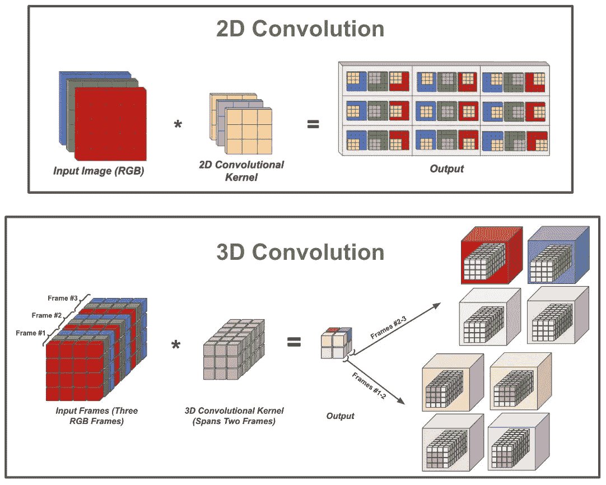

图像上的 2D 卷积与三帧视频上的 3D 卷积（由作者创建）

3D 卷积正好实现了这个目标。也就是说，我们不仅在输入的所有空间维度上进行卷积，还在空间和深度维度上进行卷积。实际上，这为我们的卷积核添加了一个额外的维度，卷积操作在空间和深度上遍历输入。这个过程在上面的图中得到了说明，我们首先在一组帧上进行空间卷积，然后移动到下一组帧进行另一轮空间卷积。

3D 卷积通常用于视频深度学习应用。对于那些对深入了解这个主题或 3D 卷积的内部工作感兴趣的人，可以查看我关于视频深度学习的概述，[点击此处](https://cameronrwolfe.substack.com/p/deep-learning-on-video-part-one-the-early-days-8a3632ed47d4)。

**感知损失**。LLFFs 的目标是生成准确地类似于场景实际地面真值视角的图像。为了训练一个系统实现这个目标，我们需要一个 *图像重建损失*，它告诉我们生成的图像与我们试图复制的实际图像有多接近。一个选项是计算两张图像之间差异的 [L1](https://mathworld.wolfram.com/L1-Norm.html)/[L2](https://mathworld.wolfram.com/L2-Norm.html) 范数——基本上只是对图像像素的 [均方误差](https://en.wikipedia.org/wiki/Mean_squared_error) 损失。

然而，单纯测量像素差异并不是图像相似性的最佳指标；例如，*如果生成的图像相比目标图像仅仅右移了一像素呢？* 一个更好的方法可以通过一点深度学习实现。特别是我们可以：

1.  使用一个预训练的深度神经网络。

1.  使用这个模型将图像嵌入到特征向量中（即，分类前的最终激活层）。

1.  计算这些向量之间的差异（例如，使用 L1 或 L2 范数）

这种方法称为感知损失 [5]，是一种强大的图像相似性度量，广泛用于深度学习研究（特别是生成模型）；见 [6] 的第 3.3 节。

# LLFFs 如何表示场景？

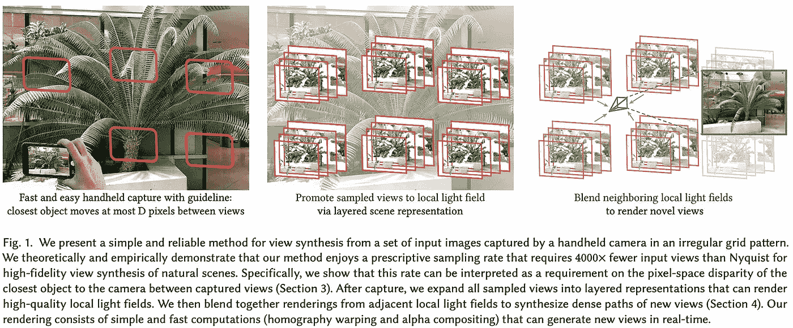

（引自 [1]）

> *“我们方法的总体策略是使用深度学习管道将每个采样视图提升为具有 D 个深度层的分层场景表示，并通过在相邻场景表示的渲染之间进行混合来渲染新的视图。”* — 引自 [1]

从一些图像和 [相机视角信息](https://cameronrwolfe.substack.com/i/97472888/background) 开始，LLFFs 通过两个不同的步骤渲染新的场景视角：

1.  将图像转换为 MPI 表示。

1.  通过混合附近 MPI 的渲染生成视图。

**什么是 MPIs？** MPIs 是一种以相机为中心的 3D 空间表示。这意味着我们考虑一个特定的相机视角，然后从该特定视角分解 3D 空间。特别是，3D 空间基于三个坐标进行分解：`x`、`y` 和深度。然后，与这些坐标相关联的是 RGB 颜色和不透明度值，记作 α。有关更多详细信息，请参见 [这里](https://single-view-mpi.github.io/)。

**生成 MPIs。** 要在 LLFF 中生成 MPI，我们需要一组五张图像，包括一张参考图像和四个在 3D 空间中最近的邻居。通过相机视角信息，我们可以将这些图像重新投影到[平面扫掠](https://www.coursera.org/lecture/geometric-algorithms/plane-sweep-concept-Jch6p)体积（PSVs）中，深度为 `D`。在这里，每个深度维度对应于特定视角下场景中的不同深度范围。

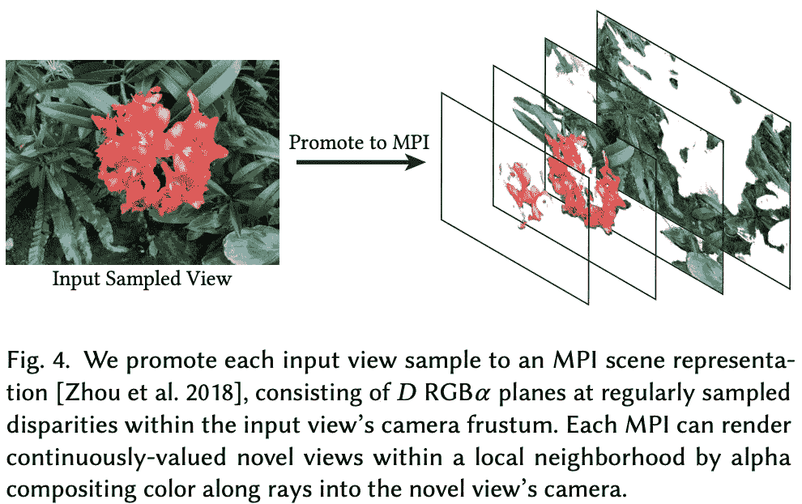

（来源于 [1]）

从这里，我们可以将所有这些体积连接起来，并通过一系列 3D 卷积层传递（即，[3D CNN](https://cameronrwolfe.substack.com/p/deep-learning-on-video-part-three-diving-deeper-into-3d-cnns-cb3c0daa471e)）。对于每个 MPI 坐标（即，由 `[x, y]` 空间位置和深度组成），这个 3D CNN 将输出一个 RGB 颜色和一个不透明度值 α，形成一个 MPI 场景表示；见上文。在 [1] 中，这被称为“分层场景表示”，因为 MPI 中表示了不同的深度。

**重建视图。** 一旦为一个场景生成了 MPI，我们仍然需要利用这些信息来合成一个新颖的场景视角。在 [1] 中，通过渲染多个 MPIs 并对其结果进行加权组合来完成这项工作。

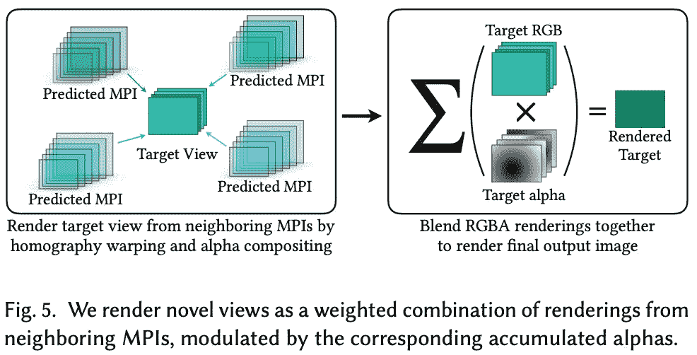

（来源于 [1]）

特别是，我们从多个接近所需视角的图像集中生成 MPIs（使用上述描述的 3D CNN），然后使用[单应性变换](https://medium.com/swlh/image-processing-with-python-image-warping-using-homography-matrix-22096734f09a)（即，将每个 MPI “扭曲”到所需视角）和[α 合成](https://ciechanow.ski/alpha-compositing/)（即，将不同扭曲的 MPIs 组合成一个单一视图）来生成所需视角的 RGB 图像。

**为什么我们需要多个 MPIs？** [1] 中的方法通常使用不同的图像集生成两个 MPIs，然后将这些表示混合成一个单一的场景渲染。这是为了去除渲染过程中出现的伪影，因为单个 MPI 不太可能包含新相机姿态所需的所有信息。例如，*如果原始视角中的图像部分被遮挡怎么办？* 混合多个 MPIs 可以避免这些伪影并处理诸如遮挡和视场限制等问题；见下文。

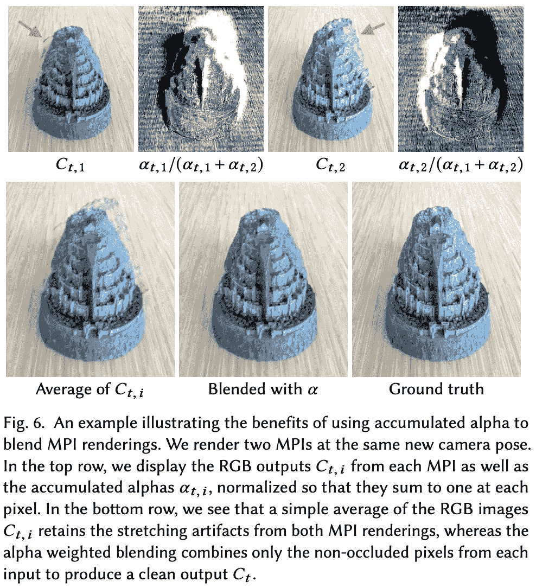

（来自 [1]）

**训练 LLFF 框架。** 为了训练 LLFF 框架，我们使用真实和合成（例如，[SUNCG](https://sscnet.cs.princeton.edu/) 和 [UnrealCV](https://unrealcv.org/) 渲染）数据的组合。在每次训练迭代中，我们采样两组五张图像（用于创建两个 MPI）和一个单独的保留视点。我们通过遵循上述方法生成此保留视点的估计值，然后应用感知损失函数 [5]，以捕捉输出视点与真实情况的差异。

我们可以对 LLFF 进行端到端训练，因为它的所有组件都是可微分的。要执行训练迭代，我们只需要：

1.  采样一些图像。

1.  生成一个预测视点。

1.  计算感知损失。

1.  执行 [(随机) 梯度下降](https://en.wikipedia.org/wiki/Gradient_descent) 更新。

**理论上减少所需样本的数量。** 根据奈奎斯特率进行采样在场景表示中是不可行的，因为所需样本的数量太高。幸运的是，[1]中的基于深度学习的 LLFF 方法在理论上已显示出显著减少准确场景表示所需的样本数量。实际上，准确的 LLFF 重建所需的视图数量在实证中被显示为低于奈奎斯特率的 4,000`X`；见下文。

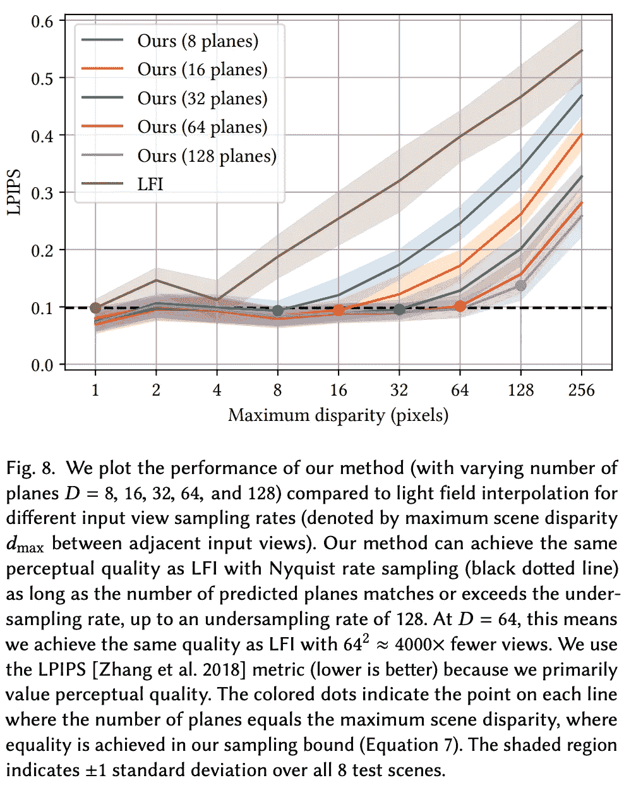

（来自 [1]）

# 实践中的 LLFF

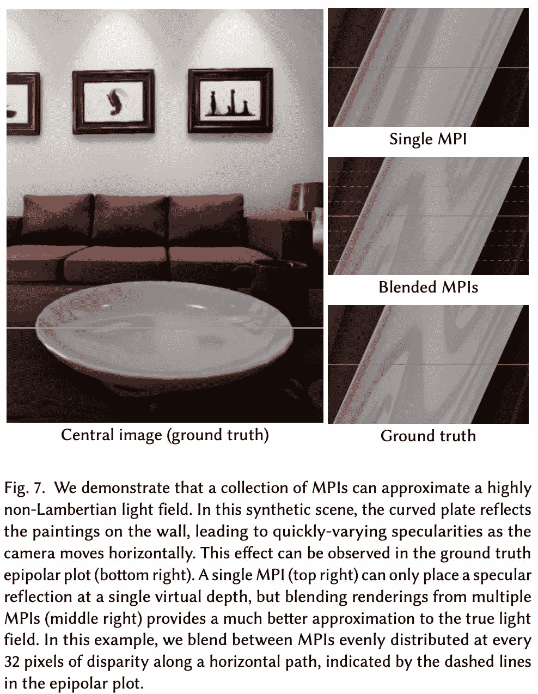

（来自 [1]）

LLFF 的评估基于其在有限采样能力（即远低于奈奎斯特率）的情况下渲染新场景视点的能力。在实验分析中，第一个主要发现之一是，将多个 MPI 的渲染结果混合——而不是仅从单个 MPI 渲染视图——是相当有益的。如上所示，这种方法提高了准确性，并且能够捕捉到非兰伯特效应（例如，反射）。

与基线相比，LLFF 在建模复杂场景方面无论是定量还是定性上都更具能力。特别是，当可用的基础场景样本较少时，LLFF 似乎能够产生更加一致的结果，而基线方法则会出现性能下降；见下文。

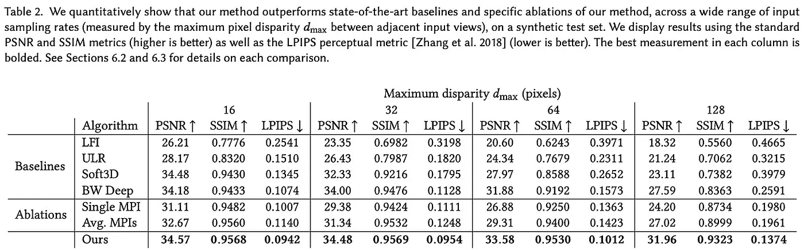

（来自 [1]）

LLFF 的采样效率突出了深度学习的实用性。即，模型可以从训练数据中学习隐含的先验信息，使其能够更好地处理模糊性！为了更具体地说明这一点，我们考虑一个有输入视图的情况，但这些数据并没有提供我们生成准确新视图所需的所有信息（例如，场景中的某些相关部分可能被遮挡）。由于我们使用了深度学习，我们的神经网络已经从数据中学到了先验模式，使其能够在这些情况下推断出合理的输出！

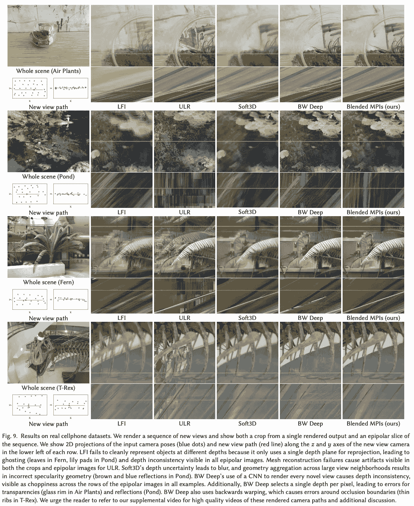

（来自 [1]）

为了更好地理解 LLFF 与基线方法的比较，查看输出的定性示例非常有用。上图提供了几个示例，但这些输出最好以视频形式查看，以便能清晰地看到不同视角之间的插值平滑度。有关示例，请查看 LLFF 的项目页面 [这里](https://bmild.github.io/llff/)！

**LLFF 在智能手机上的应用。** 作为 LLFF 框架的实际演示，作者创建了一个用于在场景视角之间进行高质量插值的智能手机应用程序。给定固定分辨率，LLFF 可以使用合理数量的场景图像高效地生成新的场景视角。该应用程序指示用户捕捉特定的场景样本，然后使用 LLFF 实时渲染从预测的 MPI 中生成的视角。

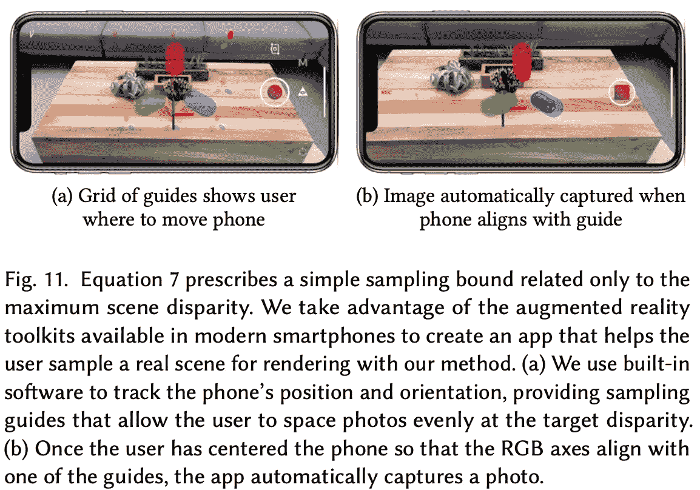

（来源于 [1]）

除了 LLFF 渲染的质量，还要记住它是一个规范性框架，这意味着在 [1] 中的作者提供了准确表示场景所需的图像样本数量和类型的理论。沿着这些思路，*LLFF 应用实际上会引导用户拍摄特定的场景图像*。此功能利用 [1] 中提出的采样分析来确定所需样本，并使用 VR 覆盖来指导用户捕捉特定场景视角；见上文。

# 收获

LLFF 框架与我们迄今为止看到的其他场景表示方法有很大不同。它使用 3D CNN 而不是 [前馈网络](https://cameronrwolfe.substack.com/i/94634004/feed-forward-neural-networks)，具备理论保证，并且与信号处理的关系更大，而非深度学习。尽管如此，这个框架非常有趣，希望本概述提供的背景能让理解它变得稍微容易些。主要收获如下。

**全光谱采样 + 深度学习。** 正如在本概述中提到的那样，使用 LLFF 生成准确场景表示所需的样本数量非常少（尤其是与 Nyquist 率相比）。这种样本效率部分得益于 LLFF 所基于的全光谱采样分析。然而，使用深度学习允许从训练数据中学习并泛化模式，这对结果场景渲染的效率和准确性产生了积极影响。

**实时表示。** 除了 LLFF 渲染的视角质量，方法还被实现为可以实时运行的智能手机应用程序！这实际上展示了 LLFF 的效率，并表明它在现实世界应用中确实可用。然而，使用 LLFF 进行视角渲染所需的预处理大约需要 10 分钟。

**多个视角。** 为了生成最终的 LLFF 结果，我们生成两个 MPI，并将它们混合在一起。我们可以用单个 MPI 来渲染一个场景，但使用多个 MPI 被发现可以创建更准确的渲染（即，较少的伪影和遗漏的细节）。一般来说，这一发现向我们表明冗余对于场景表示是有用的——从一个视角缺失的有用数据可能在另一个视角中存在！

**局限性。** 显然，场景表示的质量总是可以提高的——LLFF 并不完美。除了这个简单的观察之外，LLFF 的一个潜在局限是，为了生成输出，我们需要提供几张图像作为输入（例如，[1]中的实验需要每个输出十张输入图像）。相比之下，像 SRNs [3]这样的模型是在一个基础场景的图像上进行训练的，但它们不一定需要这些图像在推理时存在！

# 结束语

非常感谢阅读这篇文章。我是[Cameron R. Wolfe](https://cameronrwolfe.me/)，[Rebuy](https://www.rebuyengine.com/)的人工智能总监和莱斯大学的博士生。我研究深度学习的实证和理论基础。你还可以查看我在 medium 上的[其他文章](https://medium.com/@wolfecameron)！如果你喜欢这篇文章，请关注我的[twitter](https://twitter.com/cwolferesearch)或订阅我的[Deep (Learning) Focus newsletter](https://cameronrwolfe.substack.com/)，在这里我通过对相关热门论文的易懂概述，帮助读者深入理解深度学习研究中的话题。

# 参考文献

[1] 米尔登霍尔，本等。“局部光场融合：具有指导性采样准则的实用视图合成。” *ACM 图形学交易（TOG）* 38.4 (2019)：1–14。

[2] 梅施德，拉斯等。“占用网络：在函数空间中学习 3D 重建。” *IEEE/CVF 计算机视觉与模式识别会议论文集*。2019 年。

[3] 西茨曼，文森特，迈克尔·佐尔赫弗，和戈登·维茨斯坦。“场景表示网络：连续的 3D 结构感知神经场景表示。” *神经信息处理系统进展* 32 (2019)。

[4] 莱沃伊，马克，和帕特·汉拉汉。“光场渲染。” *第 23 届计算机图形与交互技术年会论文集*。199。

[5] 多索维茨基，阿列克谢，和托马斯·布罗克斯。“利用基于深度网络的感知相似度度量生成图像。” *神经信息处理系统进展* 29 (2016)。

[6] 陈启峰，弗拉德伦·科尔顿。“基于级联优化网络的摄影图像合成。” *IEEE 国际计算机视觉会议论文集*。2017 年。

[7] 柴进祥等。“全景采样。” *第 27 届计算机图形与交互技术年会论文集*。2000 年。

[8] Mildenhall, Ben 等人。“Nerf: 将场景表示为神经辐射场以进行视图合成。” *ACM 通讯* 65.1 (2021): 99–106。
