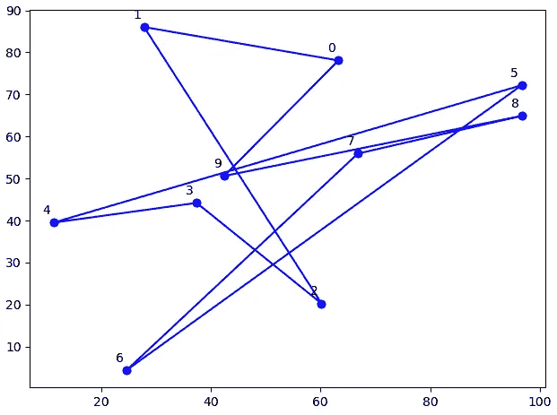

# 从头开始的模拟退火局部搜索

> 原文：[`towardsdatascience.com/local-search-with-simulated-annealing-from-scratch-9f8dcb6c2e06`](https://towardsdatascience.com/local-search-with-simulated-annealing-from-scratch-9f8dcb6c2e06)


温度，模拟退火中的一个重要部分。图片来源：Dall-E 2。

## 通用 Python 代码及三个示例

[](https://hennie-de-harder.medium.com/?source=post_page-----9f8dcb6c2e06--------------------------------)[](https://towardsdatascience.com/?source=post_page-----9f8dcb6c2e06--------------------------------) [Hennie de Harder](https://hennie-de-harder.medium.com/?source=post_page-----9f8dcb6c2e06--------------------------------)

·发表于 [Towards Data Science](https://towardsdatascience.com/?source=post_page-----9f8dcb6c2e06--------------------------------) ·阅读时间 11 分钟·2023 年 4 月 12 日

--

**在我之前的一些帖子中，我解释了启发式算法以及如何利用它们找到数学优化问题的优质解。在这篇帖子中，我将提供通用的 Python 代码，用于局部搜索和模拟退火。除了通用代码，还有三个经典示例问题的实现：旅行商问题、背包问题和 Rastrigin 函数。**

简短的回顾：局部搜索是一种启发式算法，它通过查看邻居来尝试改善给定的解。如果邻居的目标值比当前目标值更好，则接受邻居解并继续搜索。模拟退火允许接受更差的解，这使得能够摆脱局部最小值。

## 模拟退火通用代码

代码的工作方式如下：我们将创建四个代码文件。最重要的是 `sasolver.py`，该文件包含了模拟退火的通用代码。问题目录包含了三个优化问题的示例，我们可以运行这些示例来测试 SA 求解器。

这是文件夹结构：


为了解决一个使用模拟退火的问题，我们开始创建一个相当通用的类：

```py
import copy
import logging
import math
import numpy as np
import random
import time

from problems.knapsack import Knapsack
from problems.rastrigin import Rastrigin
from problems.tsp import TravelingSalesman

class SimulatedAnnealing():
    def __init__(self, problem):
        self.problem = problem

    def run_sa(self, max_iterations: int=100000, update_iterations: int=10000, time_limit: int=60, cooling_schedule: str='lin'):
        start = time.time()
        best_solution = self.problem.baseline_solution()
        best_obj = self.problem.score_solution(best_solution)
        logging.info(f"First solution.        Objective: {round(best_obj, 2)} Solution: {best_solution}")
        initial_temp = best_obj
        prev_solution = copy.deepcopy(best_solution)
        prev_obj = best_obj

        iteration = 0
        last_update = 0
        while time.time() - start < time_limit:
            iteration += 1
            last_update += 1
            accept = False

            curr_solution = self.problem.select_neighbor(copy.deepcopy(prev_solution))
            curr_obj = self.problem.score_solution(curr_solution)

            temperature = self._calculate_temperature(initial_temp, iteration, max_iterations, cooling_schedule)
            acceptance_value = self._acceptance_criterion(curr_obj, prev_obj, temperature)

            if (curr_obj <= prev_obj) or (temperature > 0 and random.random() < acceptance_value):
                accept = True

            if curr_obj < best_obj:
                best_solution = copy.deepcopy(curr_solution)
                best_obj = curr_obj
                prev_solution = copy.deepcopy(curr_solution)
                prev_obj = curr_obj
                last_update = 0
                logging.info(f"Better solution found. Objective: {round(best_obj, 2)} Solution: {curr_solution}")
            else:
                if accept:
                    prev_obj = curr_obj
                    prev_solution = copy.deepcopy(curr_solution)
                    last_update = 0

            if last_update >= update_iterations:
                break

        logging.info(f"Final solution: {best_solution} Objective: {round(best_obj, 2)}")
        return best_solution

    @staticmethod
    def _acceptance_criterion(obj_new, obj_curr, temperature, mod=1):
        """
        Determine the acceptance criterion (threshold for accepting a solution that is worse than the current one)
        """
        diff = obj_new - obj_curr
        try:
            acc = math.exp(-diff / temperature)
        except OverflowError:
            acc = -1
        return acc

    @staticmethod
    def _calculate_temperature(initial_temp: int, iteration: int, max_iterations: int, how: str = None) -> float:
        """
        Decrease the temperature to zero based on total number of iterations.
        """
        if iteration >= max_iterations:
            return -1
        if how == "exp":
            cooling_rate = 0.95
            return initial_temp * (cooling_rate**iteration)
        elif how == "quadratic":
            cooling_rate = 0.01
            return initial_temp / (1 + cooling_rate * iteration**2)
        elif how == "log":
            cooling_rate = 1.44
            return initial_temp / (1 + cooling_rate * np.log(1 + iteration))
        elif how == "lin mult":
            cooling_rate = 0.1
            return initial_temp / (1 + cooling_rate * iteration)
        else:
            return initial_temp * (1 - iteration / max_iterations)

if __name__ == '__main__':
    problem = 'rastrigin'  # choose one of knapsack, tsp, rastrigin
    logging.basicConfig(filename=f'{problem}.log', encoding='utf-8', level=logging.INFO)
    if problem == 'tsp':
        problem = TravelingSalesman(n_locations=10, height=100, width=100)
        sa = SimulatedAnnealing(problem)
        final_solution = sa.run_sa()
        problem._plot_solution(final_solution, title='final')
    elif problem == 'knapsack':
        problem = Knapsack(knapsack_capacity=100, n_items=10)
        sa = SimulatedAnnealing(problem)
        final_solution = sa.run_sa()
    elif problem == 'rastrigin':
        problem = Rastrigin(n_dims=2) 
        sa = SimulatedAnnealing(problem)
        final_solution = sa.run_sa()
```

这个文件是 `sasolver.py`。它接受一个问题作为输入，然后你可以通过 `run_sa()` 使用模拟退火来解决这个问题。处理降温的方式有不同的实现，体现在 `_calc_temperature` 中。接受值是根据 Metropolis 接受准则计算的。

通过修改 `problem = 'tsp'` 这一行，（在 `if __name__ == '__main__':` 下面，）可以选择另一个问题（将 `tsp` 替换为 `knapsack` 或 `rastrigin`）。

我们需要在示例问题中有三种方法来使这段代码正常工作：

1.  `baseline_solution()`

    该方法为问题创建第一个解决方案（起始点）。

1.  `score_solution(solution)`

    `score_solution` 方法计算目标值。

1.  `select_neighbor(solution)`

    我们需要对解决方案应用局部移动并选择一个邻居，这将在此方法中实现。

我们将为三个问题实现这三种方法：旅行推销员、背包和 Rastrigin 函数。

## 示例 1\. 旅行推销员

我们将要讨论的第一个问题是旅行推销员问题。在这个问题中，有一些地点需要访问。目标是最小化旅行距离。下面是一个示例：


示例：我们想访问 10 个地点并最小化距离。图片由作者提供。

```py
import matplotlib.pyplot as plt
import numpy as np
import random
from typing import List

class TravelingSalesman():
    def __init__(self, n_locations: int = 10, locations: List[tuple] = None, height: int = 100, width: int = 100, starting_point: int=0):
        self.name = 'traveling salesman'
        self.starting_point = starting_point
        self.height = height
        self.width = width
        if locations is None:
            locations = self._create_sample_data(n_locations)
        self.locations = locations
        self.n_locations = len(locations)
        self.distances = self._create_distances()

    def baseline_solution(self) -> list:
        # route that follows the locations list
        # start and end in start location
        baseline = [self.starting_point] + [i for i in range(self.n_locations) if i != self.starting_point] + [self.starting_point]
        self._plot_solution(baseline, title='baseline')
        self._plot_solution(baseline, title='dots', only_dots=True)
        return baseline

    def score_solution(self, solution: list) -> float:
        # add all distances
        return sum([self.distances[node, solution[i+1]] for i, node in enumerate(solution[:-1])])

    def select_neighbor(self, solution: list) -> list:
        # swap two locations (don't swap start and end)
        indici = random.sample(range(1, self.n_locations), 2)
        idx1, idx2 = indici[0], indici[1]
        value1, value2 = solution[idx1], solution[idx2]
        solution[idx1] = value2
        solution[idx2] = value1
        return solution

    def _create_sample_data(self, n_locations: int) -> List[tuple]:
        return [(random.random() * self.height, random.random() * self.width) for _ in range(n_locations)]

    def _plot_solution(self, solution: list, title: str = 'tsp', only_dots: bool = False):
        plt.clf()
        plt.rcParams["figure.figsize"] = [5, 5]
        plt.rcParams["figure.autolayout"] = True
        for n, location_id1 in enumerate(solution[:-1]):
            location_id2 = solution[n+1]
            x_values = [self.locations[location_id1][0], self.locations[location_id2][0]]
            y_values = [self.locations[location_id1][1], self.locations[location_id2][1]]
            if not only_dots:
                plt.plot(x_values, y_values, 'bo', linestyle="-")
            else:
                plt.plot(x_values, y_values, 'bo')
            plt.text(x_values[0]-2, y_values[0]+2, str(location_id1))
        plt.savefig(f'{title}')

    def _create_distances(self) -> np.array:
        distances = np.zeros(shape=(self.n_locations, self.n_locations))
        for ni, i in enumerate(self.locations):
            for nj, j in enumerate(self.locations):
                distances[ni, nj] = self._distance(i[0], i[1], j[0], j[1])
        return distances

    @staticmethod
    def _distance(x1: float, y1: float, x2: float, y2: float) -> float:
        return np.sqrt((x2 - x1)**2 + (y2 - y1)**2)
```

在这个问题中，基线解决方案是通过按顺序访问位置（0 到 9）创建的。例如，它给出了以下路线：



基线解决方案。图片由作者提供。

这看起来并不理想，确实如此。局部移动通过交换两个位置来定义。解决方案的得分是我们需要旅行的距离。经过模拟退火后，这是最终解决方案：


最终解决方案。图片由作者提供。

看起来好多了！

> 对于小问题，这种方法效果不错（但仍不推荐）。对于较大的问题，有更好的解决方案和算法可用，例如 [Lin-Kernighan 启发式算法](https://en.wikipedia.org/wiki/Lin–Kernighan_heuristic)。更好的起始解决方案也有帮助，例如贪心算法。

## 示例 2\. 背包

背包问题是一个经典问题，但对于那些不熟悉它的人，这里有一个解释。

想象你身处一个充满美丽宝藏的洞穴中。由于一些不可预见的情况，洞穴正在坍塌。你有时间将宝藏装入背包中，然后需要逃离到安全的地方。当然，你想带上那些总价值最高的物品。你应该带哪些物品？


背包问题。背包的容量为 50。你应该选择哪些物品来最大化价值？图片由作者提供。

解决此问题所需的数据包括背包的容量、物品所需的容量以及物品的价值。

下面是定义这个问题的代码：

```py
import copy
import random
import numpy as np
from typing import List

class Knapsack():
    def __init__(self, knapsack_capacity: int, n_items: int = 20, item_values: list = None, item_capacities: list = None):
        self.name = 'knapsack'
        self.knapsack_capacity = knapsack_capacity
        if item_values is None and item_capacities is None:
            item_values, item_capacities = self._create_sample_data(n_items)
        self.item_values = item_values
        self.item_capacities = item_capacities
        self.n_items = len(item_values)

    def baseline_solution(self) -> list:
        # select random items until the knapsack is full
        capacity = 0
        solution = []
        while True:
            selected = random.choice([i for i in range(self.n_items) if i not in solution])
            if capacity + self.item_capacities[selected] > self.knapsack_capacity:
                break
            else:
                solution.append(selected)
                capacity += self.item_capacities[selected]
        return solution

    def score_solution(self, solution: list) -> int:
        # count the total value of this solution
        return -1 * sum([self.item_values[i] for i in solution])

    def select_neighbor(self, solution: list) -> list:
        # local move: remove / add / swap items
        solution_capacity = sum([self.item_capacities[i] for i in solution])
        possible_to_add = [i for i in range(self.n_items) if self.item_capacities[i] <= self.knapsack_capacity - solution_capacity and i not in solution]
        if len(solution) == 0:
            move = 'add'
        elif len(possible_to_add) > 0:
            move = np.random.choice(['remove', 'add', 'swap'], p=[0.1, 0.6, 0.3])
        else:
            move = np.random.choice(['remove', 'swap'], p=[0.4, 0.6])
        while True:
            if move == 'remove':
                solution.pop(random.randrange(len(solution)))
                return solution
            elif move == 'add':
                new_solution = copy.deepcopy(solution)
                new_item = random.choice(possible_to_add)
                new_solution.append(new_item)
                return new_solution
            elif move == 'swap':
                n = 0
                while n < 50:
                    new_solution = copy.deepcopy(solution)
                    in_item = random.choice([i for i in range(self.n_items) if i not in solution])
                    out_item = random.choice(range(len(solution)))
                    new_solution.pop(out_item)
                    new_solution.append(in_item)
                    n += 1
                    if self._is_feasible(new_solution):
                        return new_solution
                move = 'remove'

    def _create_sample_data(self, n_items: int) -> List[list]:
        item_values = random.sample(range(2, 1000), n_items)
        item_capacities = random.sample(range(1, self.knapsack_capacity), n_items)
        return item_values, item_capacities

    def _is_feasible(self, solution: list) -> bool:
        return sum([self.item_capacities[i] for i in solution]) <= self.knapsack_capacity
```

基线解决方案随机选择一个物品，直到背包满了。解决方案的得分是背包中物品值的总和，乘以 -1。因为 SA 求解器最小化给定的目标。在这种情况下，有三种局部移动方式：添加一个物品、移除一个物品或交换两个物品。这使得在解空间中可以达到每一个可能的解。如果我们交换一个物品，需要检查新解是否可行。

在下图中可以看到一个示例运行日志文件。我们需要从 10 个物品中选择。顶部是物品值，下面是物品占用的容量，第三行是价值密度（物品值除以物品容量）。然后开始解决过程。解决方案包含所选物品的索引号。在最终解决方案中，选择了物品 4、5 和 8（计数从 0 开始）：


## 示例 3\. 拉斯特里金函数

一个常用于测试优化算法的函数是 [拉斯特里金函数](https://en.wikipedia.org/wiki/Rastrigin_function)。在 3D 中，它看起来是这样的：


拉斯特里金函数的 3D 图。图片由作者提供。

这个函数有很多局部极小值。目标是找到全局最小值，它的坐标是 (0, 0)。在等高线图中更容易看出：


拉斯特里金函数的等高线图。图片由作者提供。

地形由许多局部极小值组成，四个角落的值最高，而中心的值最低。

我们可以尝试使用模拟退火来寻找全局最小值。这个问题是连续的而不是离散的，我们想找到最小化拉斯特里金函数的 *x* 和 *y* 的值。

拉斯特里金函数在 *n* 维域上的定义为：


让我们尝试在三维空间中找到该函数的最优解（*x*、*y* 和 *z*）。定义域由 *x* 和 *y* 确定，因此问题与上面的图形完全相同。

```py
from collections import Counter
import numpy as np
import random
from typing import List

class Rastrigin():
    def __init__(self, n_dims: int = 2):
        self.name = 'rastrigin'
        self.n_dims = n_dims

    def baseline_solution(self) -> list:
        solution = [random.uniform(-5.12, 5.12) for _ in range(self.n_dims)]
        return solution

    def score_solution(self, solution: list) -> float:
        score = self.n_dims * 10 + sum([(x**2 - 10*np.cos(2*np.pi*x)) for x in solution])
        return score

    def select_neighbor(self, solution: list, step_size: float = 0.1) -> list:
        perturbation = step_size * np.random.randn(self.n_dims)
        neighbor = solution + perturbation
        while not self._is_feasible(neighbor):
            perturbation = step_size * np.random.randn(self.n_dims)
            neighbor = solution + perturbation    
        return neighbor

    def _is_feasible(self, solution: list) -> bool:
        return bool([x >= -5.12 and x <= 5.12 for x in solution])
```

对于基线解决方案，我们在 -5.12 和 5.12 之间随机选择 *x* 和 *y* 的浮点数。解决方案的得分等于 *z*（拉斯特里金函数的结果）。通过在随机方向上迈出一步，步长设置为 0.1 来选择一个邻居。进行可行性检查以确保我们保持在定义域内。

一次运行的日志：


最终解决方案非常接近最优解。

但要注意，如果你在更多维度下运行算法，不能保证找到最优解：


如你所见，最终的解决方案是局部最优而非全局最优。它找到了前两个变量的良好坐标，但第三个变量等于 0.985，远离 0。验证结果非常重要。这个具体例子通过微调 SA 参数可以很好地工作，但对于更多维度，你可能需要使用另一种表现更好的优化技术。

# 结论

在这篇文章中，我们实现了模拟退火的代码。通过三个例子，你可以理解它的不同可能性。你只需为新问题实现三个方法，使其工作，这些方法是`baseline_solution`、`score_solution`和`select_neighbor`。当然，这个实现是基本的，如果你想使用它，你需要调整 SA 的参数，确保算法返回一个可行的解决方案。一个好的初始解决方案和研究选择邻近解决方案的最佳方法能大大提高最终解决方案的质量。

感谢阅读，下次见！

## 相关内容

[## 介绍一种强大的优化技术：模拟退火](https://towardsdatascience.com/an-introduction-to-a-powerful-optimization-technique-simulated-annealing-87fd1e3676dd?source=post_page-----9f8dcb6c2e06--------------------------------)

### 解释、参数、优点、缺点和应用场景

[数学优化启发式方法每个数据科学家都应该知道](https://towardsdatascience.com/mathematical-optimization-heuristics-every-data-scientist-should-know-b26de0bd43e6?source=post_page-----9f8dcb6c2e06--------------------------------) [## 数学优化启发式方法每个数据科学家都应该知道

### 局部搜索、遗传算法等。

[## 将数学优化与机器学习结合的五种方式](https://towardsdatascience.com/four-ways-to-combine-mathematical-optimization-and-machine-learning-8cb874276254?source=post_page-----9f8dcb6c2e06--------------------------------)

### 两种力量结合的实际例子。

[将数学优化与机器学习结合的四种方式](https://towardsdatascience.com/four-ways-to-combine-mathematical-optimization-and-machine-learning-8cb874276254?source=post_page-----9f8dcb6c2e06--------------------------------)
