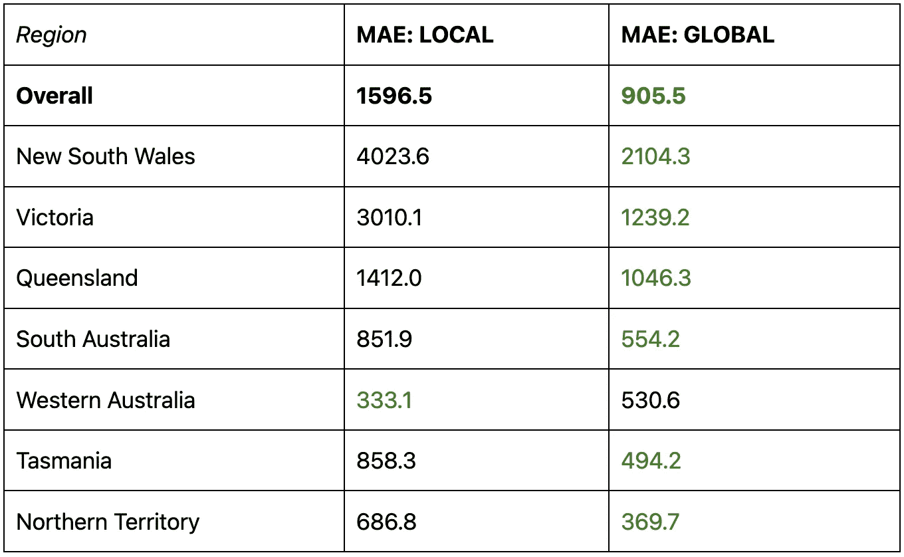

# 本地预测与全球预测：你需要知道的

> 原文：[`towardsdatascience.com/local-vs-global-forecasting-what-you-need-to-know-1cc29e66cae0`](https://towardsdatascience.com/local-vs-global-forecasting-what-you-need-to-know-1cc29e66cae0)

## 比较本地和全球时间序列预测方法，并通过使用 LightGBM 和澳大利亚旅游数据集的 Python 演示。

[](https://medium.com/@davide.burba?source=post_page-----1cc29e66cae0--------------------------------)[](https://towardsdatascience.com/?source=post_page-----1cc29e66cae0--------------------------------) [Davide Burba](https://medium.com/@davide.burba?source=post_page-----1cc29e66cae0--------------------------------)

·发表于 [Towards Data Science](https://towardsdatascience.com/?source=post_page-----1cc29e66cae0--------------------------------) ·阅读时间 9 分钟·2023 年 5 月 2 日

--


本地预测与全球预测，由 [Giulia Roggia](https://www.instagram.com/giulia_roggia__/). 经许可使用。

+   什么是本地预测？

+   什么是全球预测？

+   如何选择本地预测与全球预测？

+   Python 示例：澳大利亚旅游

+   结论

## ***什么是本地预测？***

本地预测是传统的方法，其中我们**为每个时间序列独立训练一个预测模型**。经典的统计模型（如指数平滑、ARIMA、TBATS 等）通常采用这种方法，但通过特征工程步骤，标准的机器学习模型也可以使用这种方法。

本地预测具有**优势**：

+   它的理解和实现都很直观。

+   每个模型可以单独调整。

但它也有一些**局限性**：

+   它存在“冷启动”问题：需要为每个时间序列提供相对大量的历史数据，以可靠地估计模型参数。此外，这也使得预测新目标变得不可能，比如对新产品需求的预测。

+   它不能捕捉相关时间序列之间的共性和依赖性，比如横截面或层级关系。

+   对于包含多个时间序列的大型数据集，本地预测很难扩展，因为这需要为每个目标拟合和维护一个单独的模型。

## ***什么是全球预测？***


图片由 [PIRO](https://pixabay.com/users/piro4d-2707530/?utm_source=link-attribution&utm_medium=referral&utm_campaign=image&utm_content=1617121) 提供，来自 [Pixabay](https://pixabay.com//?utm_source=link-attribution&utm_medium=referral&utm_campaign=image&utm_content=1617121)

全局预测是一种更现代的方法，其中**使用多个时间序列来训练一个单一的“全局”预测模型**。通过这样做，它拥有更大的训练集，并且可以利用目标之间的共享结构来学习复杂的关系，最终实现更好的预测。

构建全局预测模型通常包括一个特征工程步骤来创建诸如：

+   目标的滞后值

+   目标在时间窗口中的统计数据（例如*“过去一周的均值”*，*“过去一个月的最小值”*等）

+   分类特征来区分时间序列的不同组

+   外生特征来建模外部/互动/季节性因素

全局预测具有相当大的**优势**：

+   它利用其他时间序列的信息来提高准确性和鲁棒性。

+   它可以对几乎没有数据的时间序列进行预测。

+   它可以扩展到包含许多时间序列的数据集，因为它只需要拟合和维护一个单一的模型。

+   通过使用特征工程，它可以处理多数据频率和缺失数据等问题，这些问题用经典统计模型更难解决。

但全局预测也有一些**局限性**：

+   它需要额外的努力来使用更复杂的模型和进行特征工程。

+   当出现新的时间序列时，可能需要进行全面的重新训练。

+   如果一个特定时间序列的性能开始下降，很难在不影响其他目标预测的情况下更新它。

+   这可能需要更多的计算资源和复杂的方法来估计和优化模型参数。

## 如何在局部预测和全局预测之间进行选择？

对于给定问题，没有明确的答案说明局部预测还是全局预测更好。

一般来说，**局部预测可能更适合**具有以下特征的问题：

+   少量时间序列的历史较长

+   时间序列之间的高变异性和特异性

+   预测和编程专业知识有限

另一方面，**全局预测可能更适合**具有以下特征的问题：

+   许多时间序列的历史较短

+   目标之间的变异性低且相似度高

+   噪声数据

# 示例：澳大利亚旅游


图片由[Penny](https://pixabay.com/users/pen_ash-5526837/?utm_source=link-attribution&utm_medium=referral&utm_campaign=image&utm_content=7423042)提供，来源于[Pixabay](https://pixabay.com//?utm_source=link-attribution&utm_medium=referral&utm_campaign=image&utm_content=7423042)

在本节中，我们通过使用[LightGBM](https://lightgbm.readthedocs.io/en/v3.3.2/)和[澳大利亚旅游数据集](https://github.com/unit8co/darts/blob/master/datasets/australian_tourism.csv)的 Python 实际示例来展示这两种方法之间的差异，该数据集可以在[ darts](https://github.com/unit8co/darts/tree/master)上找到，并在 Apache 2.0 许可证下提供。

让我们从导入必要的库开始。

```py
import pandas as pd
import plotly.graph_objects as go
from lightgbm import LGBMRegressor
from sklearn.preprocessing import MinMaxScaler
```

## 数据准备

澳大利亚旅游数据集由从 1998 年开始的季度时间序列组成。在这个笔记本中，我们考虑的是地区级别的旅游数据。

```py
# Load data.
data = pd.read_csv('https://raw.githubusercontent.com/unit8co/darts/master/datasets/australian_tourism.csv')
# Add time information: quarterly data starting in 1998.
data.index = pd.date_range("1998-01-01", periods = len(data), freq = "3MS")
data.index.name = "time"
# Consider only region-level data.
data = data[['NSW','VIC', 'QLD', 'SA', 'WA', 'TAS', 'NT']]
# Let's give it nicer names.
data = data.rename(columns = {
    'NSW': "New South Wales",
    'VIC': "Victoria", 
    'QLD': "Queensland", 
    'SA': "South Australia", 
    'WA': "Western Australia", 
    'TAS': "Tasmania", 
    'NT': "Northern Territory",
})
```

让我们快速查看数据：

```py
# Let's visualize the data.
def show_data(data,title=""):
    trace = [go.Scatter(x=data.index,y=data[c],name=c) for c in data.columns]
    go.Figure(trace,layout=dict(title=title)).show()

show_data(data,"Australian Tourism data by Region")
```

这产生了如下图表：


作者提供的图片

我们可以看到：

+   数据显示出强烈的年度季节性。

+   不同地区的时间序列规模差异很大。

+   时间序列的长度始终相同。

+   没有缺失数据。

## 数据工程

让我们**预测下一个季度的值**，基于：

+   前两年的滞后值

+   当前季度（作为一个分类特征）

```py
def build_targets_features(data,lags=range(8),horizon=1):
    features = {}
    targets = {}
    for c in data.columns:

        # Build lagged features.
        feat = pd.concat([data[[c]].shift(lag).rename(columns = {c: f"lag_{lag}"}) for lag in lags],axis=1)
        # Build quarter feature.
        feat["quarter"] = [f"Q{int((m-1) / 3 + 1)}" for m in data.index.month]
        feat["quarter"] = feat["quarter"].astype("category")
        # Build target at horizon.
        targ = data[c].shift(-horizon).rename(f"horizon_{horizon}")

        # Drop missing values generated by lags/horizon.
        idx = ~(feat.isnull().any(axis=1) | targ.isnull())
        features[c] = feat.loc[idx]
        targets[c] = targ.loc[idx]

    return targets,features

# Build targets and features.
targets,features = build_targets_features(data)
```

## 训练/测试拆分

为了简单起见，在这个例子中，我们用单次训练/测试拆分来回测我们的模型（你可以查看[这篇文章](https://effectiveforecasting.com/why-backtesting-matters-and-how-to-do-it-right/)获取关于回测的更多信息）。我们将最后 2 年作为测试集，将之前的时期作为验证集。

```py
def train_test_split(targets,features,test_size=8):
    targ_train = {k: v.iloc[:-test_size] for k,v in targets.items()}
    feat_train = {k: v.iloc[:-test_size] for k,v in features.items()}
    targ_test = {k: v.iloc[-test_size:] for k,v in targets.items()}
    feat_test = {k: v.iloc[-test_size:] for k,v in features.items()}
    return targ_train,feat_train,targ_test,feat_test

targ_train,feat_train,targ_test,feat_test = train_test_split(targets,features)
```

## 模型训练

现在我们使用两种不同的方法来估计预测模型。在这两种情况下，我们都使用具有默认参数的 LightGBM 模型。

## **本地方法**

如前所述，使用本地方法我们估计**多个模型：每个目标一个**。

```py
# Instantiate one LightGBM model with default parameters for each target.
local_models = {k: LGBMRegressor() for k in data.columns}
# Fit the models on the training set.
for k in data.columns:
    local_models[k].fit(feat_train[k],targ_train[k])
```

## 全局方法

另一方面，使用全局方法我们估计**一个模型用于所有目标**。为此，我们需要执行两个额外的步骤：

1.  首先，由于目标具有不同的规模，我们执行归一化步骤。

1.  然后，为了让模型能够区分不同的目标，我们为每个目标添加一个分类特征。

这些步骤在接下来的两节中进行描述。

**步骤 1：归一化** 我们将所有数据（目标和特征）在 0 到 1 之间**按目标**进行缩放。这很重要，因为它使数据可比，从而使模型训练更容易。缩放参数的估计是在验证集上完成的。

```py
def fit_scalers(feat_train,targ_train):
    feat_scalers = {k: MinMaxScaler().set_output(transform="pandas") for k in feat_train}
    targ_scalers = {k: MinMaxScaler().set_output(transform="pandas") for k in feat_train}
    for k in feat_train:
        feat_scalers[k].fit(feat_train[k].drop(columns="quarter"))
        targ_scalers[k].fit(targ_train[k].to_frame())
    return feat_scalers,targ_scalers

def scale_features(feat,feat_scalers):
    scaled_feat = {}
    for k in feat:
        df = feat[k].copy()
        cols = [c for c in df.columns if c not in {"quarter"}]
        df[cols] = feat_scalers[k].transform(df[cols])
        scaled_feat[k] = df
    return scaled_feat

def scale_targets(targ,targ_scalers):
    return {k: targ_scalers[k].transform(v.to_frame()) for k,v in targ.items()}

# Fit scalers on numerical features and target on the training period.
feat_scalers,targ_scalers = fit_scalers(feat_train,targ_train)
# Scale train data.
scaled_feat_train = scale_features(feat_train,feat_scalers)
scaled_targ_train = scale_targets(targ_train,targ_scalers)
# Scale test data.
scaled_feat_test = scale_features(feat_test,feat_scalers)
scaled_targ_test = scale_targets(targ_test,targ_scalers)
```

**步骤 2：将“目标名称”添加为分类特征** 为了让模型能够区分不同的目标，我们将目标名称添加为一个分类特征。这不是一个强制步骤，在某些情况下可能会导致过拟合，特别是当时间序列数量较多时。另一种方法是编码其他目标特定但更通用的特征，如“*region_are_in_squared_km*”、“*is_the_region_on_the_coast*”等。

```py
# Add a `target_name` feature.
def add_target_name_feature(feat):
    for k,df in feat.items():
        df["target_name"] = k

add_target_name_feature(scaled_feat_train)
add_target_name_feature(scaled_feat_test)
```

为了简单起见，我们在将数据合并后将*target_name*设置为分类变量。我们指定“类别”类型的原因是因为它会被 LightGBM 自动检测到。

```py
# Concatenate the data.
global_feat_train = pd.concat(scaled_feat_train.values())
global_targ_train = pd.concat(scaled_targ_train.values())
global_feat_test = pd.concat(scaled_feat_test.values())
global_targ_test = pd.concat(scaled_targ_test.values())
# Make `target_name` categorical after concatenation.
global_feat_train.target_name = global_feat_train.target_name.astype("category")
global_feat_test.target_name = global_feat_test.target_name.astype("category")
```

## 测试集上的预测

为了分析两种方法的性能，我们对测试集进行预测。

首先使用本地方法：

```py
# Make predictions with the local models.
pred_local = {
  k: model.predict(feat_test[k]) for k, model in local_models.items()
}
```

然后使用全局方法（注意我们应用了反向归一化）：

```py
def predict_global_model(global_model, global_feat_test, targ_scalers):
    # Predict.
    pred_global_scaled = global_model.predict(global_feat_test)
    # Re-arrange the predictions
    pred_df_global = global_feat_test[["target_name"]].copy()
    pred_df_global["predictions"] = pred_global_scaled
    pred_df_global = pred_df_global.pivot(
        columns="target_name", values="predictions"
    )
    # Un-scale the predictions
    return {
        k: targ_scalers[k]
        .inverse_transform(
            pred_df_global[[k]].rename(
                columns={k: global_targ_train.columns[0]}
            )
        )
        .reshape(-1)
        for k in pred_df_global.columns
    }

# Make predicitons with the global model.
pred_global = predict_global_model(global_model, global_feat_test, targ_scalers)
```

## 错误分析

为了评估两种方法的表现，我们进行错误分析。

首先，我们计算整体和按地区划分的平均绝对误差（MAE）：

```py
# Save predictions from both approaches in a convenient format.
output = {}
for k in targ_test:
    df = targ_test[k].rename("target").to_frame()
    df["prediction_local"] = pred_local[k]
    df["prediction_global"] = pred_global[k]
    output[k] = df

def print_stats(output):
    output_all = pd.concat(output.values())
    mae_local = (output_all.target - output_all.prediction_local).abs().mean()
    mae_global = (output_all.target - output_all.prediction_global).abs().mean()
    print("                            LOCAL     GLOBAL")
    print(f"MAE overall              :  {mae_local:.1f}     {mae_global:.1f}\n")
    for k,df in output.items():   
        mae_local = (df.target - df.prediction_local).abs().mean()
        mae_global = (df.target - df.prediction_global).abs().mean()
        print(f"MAE - {k:19}:  {mae_local:.1f}     {mae_global:.1f}")

# Let's show some statistics.
print_stats(output)
```

结果如下：



*测试集上的平均绝对误差 —* 图片由作者提供

我们可以看到，全球方法总体上导致了更低的误差，除了西澳大利亚州外，各个区域的误差也更低。

让我们看看一些预测结果：

```py
# Display the predictions.
for k,df in output.items():
    show_data(df,k)
```

以下是一些输出结果：


图片由作者提供


图片由作者提供


图片由作者提供

我们可以看到，局部模型预测了一个常数，而全球模型捕捉到了目标的季节性行为。

## 结论

在这个例子中，我们展示了时间序列预测的局部和全球方法，使用了：

+   澳大利亚季度旅游数据

+   简单特征工程

+   LightGBM 模型使用默认超参数

我们看到**全球方法产生了更好的预测**，比局部方法的平均绝对误差低 43%。特别是，全球方法在所有目标上的 MAE 都低于局部方法，除了西澳大利亚州。

在这种设置下，全球方法的优越性在某种程度上是意料之中的，因为：

+   我们正在预测多个相关的时间序列。

+   历史数据的深度非常浅。

+   我们使用的是一种相对复杂的浅层单变量时间序列模型。在这种情况下，经典统计模型可能更合适。

*本文使用的代码可在* [*这里*](https://github.com/davide-burba/code-collection/) *获取*。

*喜欢这篇文章吗？* [*查看我的其他文章*](https://medium.com/@davide.burba) *并关注我获取更多内容！* [*点击这里*](https://medium.com/@davide.burba/membership) *阅读无限文章，并支持我对你没有额外费用*❤️
