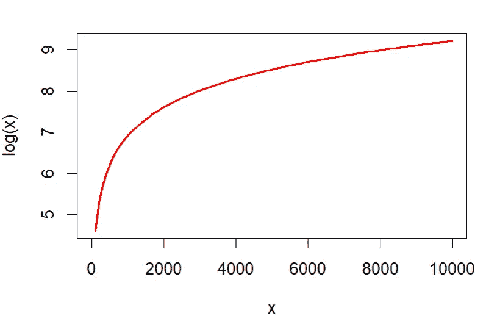
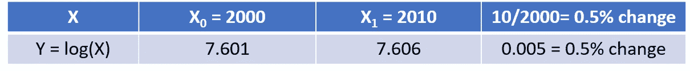
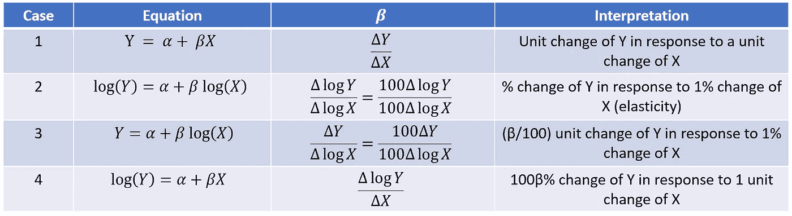
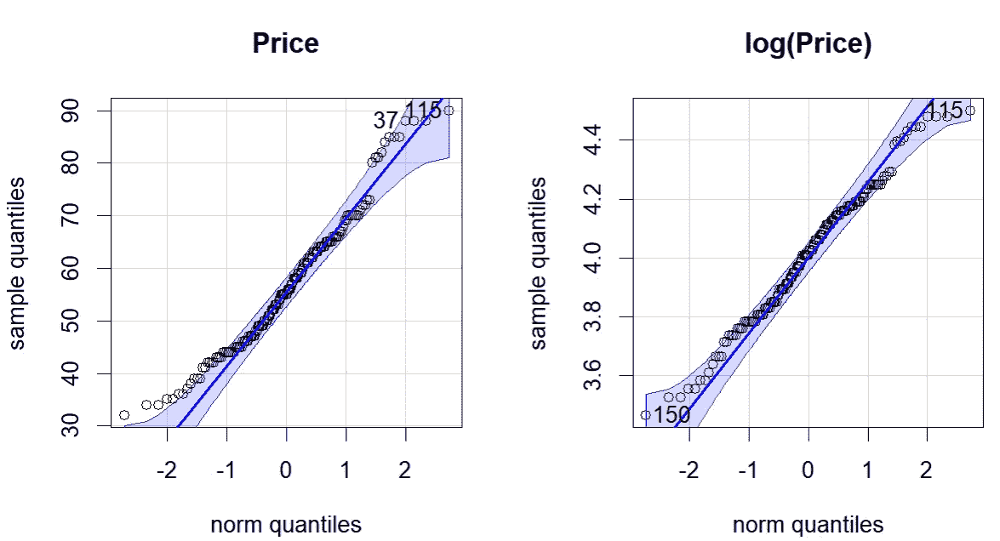
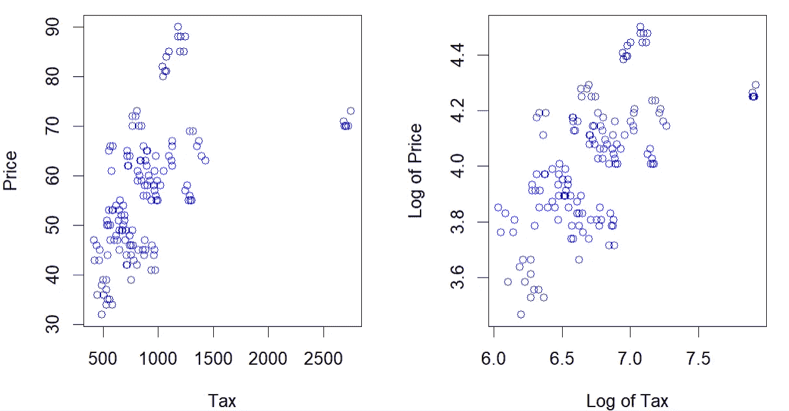
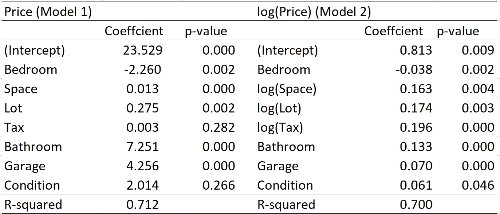

# 初学者的对数变换

> 原文：[`towardsdatascience.com/logarithmic-transformation-for-beginners-99488b8951e3`](https://towardsdatascience.com/logarithmic-transformation-for-beginners-99488b8951e3)

## 无单位的关联解释及其他好处

 [Jae Kim](https://medium.com/@jaekim8080?source=post_page-----99488b8951e3--------------------------------)

·发布在[Towards Data Science](https://towardsdatascience.com/?source=post_page-----99488b8951e3--------------------------------) ·阅读时间 7 分钟·2023 年 5 月 26 日

--

照片由[Joshua Sortino](https://unsplash.com/@sortino?utm_source=medium&utm_medium=referral)拍摄，发布在[Unsplash](https://unsplash.com/?utm_source=medium&utm_medium=referral)上。

在统计和机器学习模型中，变量经常被转换为自然对数。这有很多好处，包括…

+   无单位解释关系；

+   方差稳定化；

+   缓解异常值的影响；

+   线性化；和

+   接近正态分布。

在这篇文章中，我详细解释了上述要点，并提供了应用实例。数据和 R 代码可以从[这里](https://github.com/jh8080/Chicago)获取。

# 1\. 函数的变化和斜率

例如，设 Y = 1 + 2X，其中 Y 是响应变量，X 是输入变量。我们通常对 Y 如何响应 X 的变化感兴趣。设Δ为变化操作符。即，

ΔY = Y1 — Y0：Y 从 Y0 到 Y1 的变化；和

ΔX = X1 — X0：X 从 X0 到 X1 的变化。

假设，在我们的例子中（Y = 1 + 2 X），X 从 1 变化到 3。然后，Y 从 3 变化到 7。即，ΔY = 4，ΔX = 2。

*斜率*（或导数）衡量 Y 对*单位*X 变化的响应。它定义为

β ≡ ΔY/ΔX，

在我们的例子中β = 2。我们在线性回归或机器学习模型中遇到的斜率系数有相同的解释。斜率是一个标准化的度量，但它是依赖单位的。即，斜率系数的解释需要仔细考虑其单位。

# 2\. 对数函数的变化和斜率

考虑函数 Y = log(X)，其中 log()表示自然对数。

图片由作者使用 R 函数“curve”创建

如上所示，该函数提供了 X 的单调变换，适用于 X > 0。

该函数具有特殊性质，即在 X 的某一点，函数的斜率为 1/X。即，

这意味着 Y 的变化等于 ΔX/X，这代表了 X 的比例变化。

例如，假设 X 从 2000 增加到 2010（0.5% 的增加）。

如上表所示，这意味着

Δlog(X) = log(2010) — log(2000) = 7.606–7.601=0.005，

这等于 (X1-X0)/X0 = (2010–2000)/2000。

## 即，100Δlog(X) = 100ΔX/X，它测量 X 在给定点的百分比变化。

## 一般来说，对于任何变量 Z，100Δlog(Z) = 100ΔZ/Z，它测量 Z 在给定点的百分比变化。

# 3\. 线性方程中的对数变换

由于对数函数的上述特性，对数变换的回归可以用于关系的无单位解释，如下表所示：

表 1（由作者创建的图像）

+   案例 1：Y 和 X 都没有转化为自然对数。在这种情况下，斜率系数 β 测量 Y 在 X 变化 1 单位时的变化量。即，它的解释依赖于 Y 和 X 的单位。

+   案例 2：Y 和 X 都被转化为自然对数。在这种情况下，斜率系数测量 Y 对 X 1% 变化的百分比变化。这一测量被称为 Y 对 X 的 *弹性*，是一种在经济学中广泛使用的 *无单位* 关联度量。

+   案例 3：仅 X 被转化为自然对数。在这种情况下，斜率系数被解释为对 X 1% 变化的 Y 的 (β/100) 单位变化。

+   案例 4：仅 Y 被转化为自然对数。在这种情况下，斜率系数被解释为 Y 对 X 1 单位变化的 100β% 变化。

案例 2 在 Y 和 X 是不同单位的连续变量时很有用。案例 3 可能在 Y 取负值或 Y 已经以百分比表示时有用。案例 4 可能在 X 是指标变量或离散变量时使用。因此，选择哪种情况取决于研究的背景。

# 4\. 对数变换的其他好处

变换的缩放效应可以带来其他好处，从而提供对关系的更准确或更可靠的估计。

+   当 Y 和 X 的数值较大时，估计的变异性可能过大。对数变换单调地将数据转化为较小的尺度，从而大幅降低变异性，进而减少估计的变异性。

+   在这一过程中，异常值的影响或效应可以被显著减轻。

+   结果是，内在关系可以通过改善线性度得到更好的揭示。

+   转换后的数据可以更接近正态分布。

# 5\. 应用

我选择了来自 Kaggle 的芝加哥房价数据集，可以从[这里](https://www.kaggle.com/datasets/tawfikelmetwally/chicago-house-price)访问（CC0）。变量包括

+   价格：房价

+   卧室：卧室数量

+   空间：房屋面积（以平方英尺为单位）

+   地块：地块宽度

+   税：年度税额

+   浴室：浴室数量

+   车库：车库数量

+   条件：房屋状况（如果良好则为 1，否则为 0）

注意，数据源中未提供价格、地块和税变量的单位。

下图 1 展示了价格变量和 log(价格)的 Q-Q 图。

图 1（由作者制作的图像）

蓝色直线是参考线，样本分位数应与正态分布的分位数完全匹配，前提是样本符合正态分布。蓝色带表示样本分位数的 95%置信区间。如果一个分布符合正态分布，那么样本分位数应接近参考线。如果它们位于 95%置信区间内，偏离参考线在 5%的显著性水平上是统计上微不足道的。

从图 1 中可以清楚地看到，价格变量显示出一定程度的非正态性，多个样本分位数在 95%置信区间之外。然而，log(价格)几乎所有样本分位数都在这个区间内，表明通过对数变换，变量变得更接近正态分布。

图 2（由作者制作的图像）

上述图 2 显示了价格与税之间的散点图；以及 log(价格)与 log(税)之间的散点图。从前者来看，可以认为关系是非线性的，存在几个离群值。通过对数变换，这些离群值的影响明显减少，关系也可以被认为是线性的。

现在我运行价格与所有其他变量作为解释变量的回归分析。

+   模型 1：所有变量都按原样包括；并且

+   模型 2：所有连续变量（价格、空间、地块、税）都转换为自然对数，而其他（离散）变量保持原样。

回归结果在下表 2 中列出：

表 2（由作者制作的图像）

+   两个模型都显示了大于 0.70 的足够大的 R²值。然而，这两个值不可比，因为因变量的量纲不同。

+   模型 2 中所有系数在 5%的显著性水平上都是统计显著的。相比之下，模型 1 中有两个系数（税和条件）在常规显著性水平上是不显著的，尽管相关变量在经济上很重要。

+   在模型 1 中，税收系数较小且统计上不显著；但在模型 2 中，log(税收) 的系数较大且统计上显著。这可能与图 2 中散点图所做的观察有关，即通过对数变换进行线性化。

为了解释空间系数，

+   从模型 1 中来看，额外 100 平方英尺的空间的房屋预计价格会高出 1.3 单位（其他因素保持不变）：参见表 1 中的案例 1；

+   从模型 2 中来看，空间大 10% 的房屋预计价格会高出 1.63%（其他因素保持不变）：参见表 1 中的案例 2。

为了解释浴室系数，

+   从模型 1 中来看，额外一个浴室的房屋预计价格会高出 7.251 单位（其他因素保持不变）；

+   从模型 2 中来看，额外一个浴室的房屋预计价格会高出 13.3%（=100 × 0.133）：参见表 1 中的案例 4。

其他系数也可以以类似的方式进行解释。

通过对数变换，研究人员可以对关联进行无单位解释，这样更容易理解和解释。

总结来说，对数变换在统计建模和机器学习方法中非常有用。当研究人员希望对关联进行无单位解释时，强烈推荐使用对数变换。当数据的单位未知或难以比较时，它也很有用。此外，它还可以带来更准确和可靠的模型及其参数估计的一系列好处。
