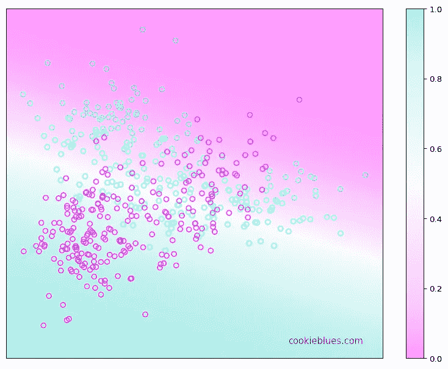

# 使用梯度下降的多类逻辑回归

> 原文：[`towardsdatascience.com/logistic-regression-a3a23e169eec?source=collection_archive---------17-----------------------#2023-03-27`](https://towardsdatascience.com/logistic-regression-a3a23e169eec?source=collection_archive---------17-----------------------#2023-03-27)

## 多类逻辑回归的理论与 Python 实现介绍

 [Stefan Hrouda-Rasmussen](https://cookieblues.medium.com/?source=post_page-----a3a23e169eec--------------------------------)

·

[关注](https://medium.com/m/signin?actionUrl=https%3A%2F%2Fmedium.com%2F_%2Fsubscribe%2Fuser%2Fb8f5e0a37037&operation=register&redirect=https%3A%2F%2Ftowardsdatascience.com%2Flogistic-regression-a3a23e169eec&user=Stefan+Hrouda-Rasmussen&userId=b8f5e0a37037&source=post_page-b8f5e0a37037----a3a23e169eec---------------------post_header-----------) 发表在 [Towards Data Science](https://towardsdatascience.com/?source=post_page-----a3a23e169eec--------------------------------) ·6 分钟阅读·2023 年 3 月 27 日

--

逻辑回归的决策边界。图片作者提供。

## 目录

本文是我将要发布的一系列文章的一部分。下方可以看到该系列的概览。

## 1\. 机器学习简介

+   (a) 什么是机器学习？

+   (b) 机器学习中的模型选择

+   (c) 维度诅咒

+   (d) 什么是贝叶斯推断？

## 2\. 回归

+   (a) 线性回归实际是如何工作的

+   (b) 如何通过基函数和正则化改进线性回归

## 3\. 分类

+   (a) 分类器概述

+   (b) 二次判别分析 (QDA)

+   (c) 线性判别分析 (LDA)

+   (d) (高斯) 朴素贝叶斯

+   **(e) 使用梯度下降的多类逻辑回归**

## 设置和目标
