# 使用梯度下降的多类逻辑回归

> 原文：[`towardsdatascience.com/logistic-regression-a3a23e169eec`](https://towardsdatascience.com/logistic-regression-a3a23e169eec)

## 多类逻辑回归的介绍，包括理论和 Python 实现

 [Stefan Hrouda-Rasmussen](https://cookieblues.medium.com/?source=post_page-----a3a23e169eec--------------------------------)

·发表于[Towards Data Science](https://towardsdatascience.com/?source=post_page-----a3a23e169eec--------------------------------) ·阅读时间 6 分钟·2023 年 3 月 27 日

--

逻辑回归的决策边界。图片由作者提供。

## 内容

本文是我将要发布的一系列文章的一部分。下面你可以看到该系列的概览。

## 1\. 机器学习简介

+   (a) 什么是机器学习？

+   (b) 机器学习中的模型选择

+   (c) 维度的诅咒

+   (d) 什么是贝叶斯推断？

## 2\. 回归

+   (a) 线性回归实际上是如何工作的

+   (b) 如何通过基函数和正则化改善线性回归

## 3\. 分类

+   (a) 分类器概述

+   (b) 二次判别分析 (QDA)

+   (c) 线性判别分析 (LDA)

+   (d) (高斯) 朴素贝叶斯

+   **(e) 使用梯度下降的多类逻辑回归**

## 设置和目标

到目前为止，我们已经讨论了生成型分类器（QDA、LDA 和朴素贝叶斯），但现在我们将目光转向一种判别型分类器：逻辑回归。如在 3(a)中所提到的分类器概述，**逻辑回归是一种判别型分类器**，这意味着**它直接建模目标的条件概率分布** *P*(*t*|**x**)。 

但为什么它叫做逻辑 *回归* 而不是逻辑 *分类*，如果它是一个分类模型呢？嗯，答案很简单，因为我们在回归条件概率——我知道，这很令人困惑。

在我们继续之前，**我建议你在学习逻辑回归之前对线性回归有一个好的掌握**，**因为它们非常相似**。如果你阅读了 我关于线性回归的文章，你会很轻松，因为我使用了相同的术语和符号。

给定一个包含 *N* 个输入变量 **x** 和相应目标变量 *t* 的训练数据集，逻辑回归假设

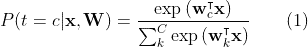

其中 *c* 是从 1 到 *C* 的任意整数，表示类别的数量。

（1）的右侧是 [softmax 函数](https://en.wikipedia.org/wiki/Softmax_function)。基本上，**这是我们用来将线性组合转换为 0 到 1 之间概率的函数**。

要理解（1）实际意义是什么，让我们看看特殊情况，即 *C=2*，也就是说，我们有 2 个类别。我们现在通常将（1）重写为

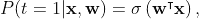

其中 *σ* 指的是 [逻辑 sigmoid 函数](https://en.wikipedia.org/wiki/Sigmoid_function)，这就是逻辑回归名称的由来。

现在，逻辑 sigmoid 函数看起来是这样的：

插入 sigmoid 函数的图像*

正如你所看到的，y 值在 0 和 1 之间，值越高，越接近 1。**这意味着 wᵀx 越大，点 (x,** *t***) 属于类别 1 的概率越高** —— 对于超过 2 个类别的情况也是如此，公式（1）中 *c* 的值越高，我们将预测 *t* 属于哪个类别，或者

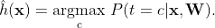

## 推导和训练

那么，我们如何找到 **W** 的值呢？嗯，就像线性回归一样，**我们将使用最大似然估计来找出参数的值**。这个过程是通过写出似然函数，求其导数，并找到参数的哪些值使导数等于 0，因为这将是似然的最大值。

为了简化符号表示，让 **t**ₙ 表示一个 *C* 维向量，其中 *t*ₙ꜀ 为 1 如果观测值属于类别 *c*，而其他所有组件为 0。我们现在可以将似然写成

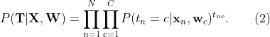

就像线性回归一样，我们现在将取负对数似然，因为我们知道 **最小化负对数似然等同于最大化似然**，以帮助我们的推导

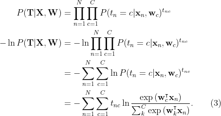

现在我们有了负对数似然，**我们将找到它的梯度**（导数），并找出 **w** 的哪些值使其等于 0。公式（3）也被称为 **交叉熵损失函数**。

在我们开始推导之前，先定义一些术语以简化我们的符号。首先，让我们将 softmax 函数表示为

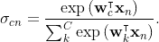

其次，让 *E* 表示（3）中的函数

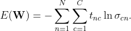

现在，使用链式法则，我们可以确定 *E* 的梯度

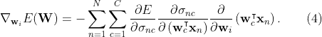

从右侧开始，我们有

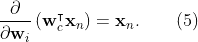

接下来，我们有 softmax 函数的导数

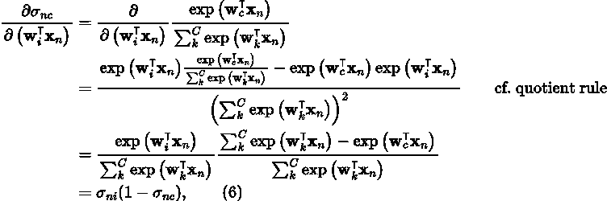

但这仅在 *i=c* 时成立。在它们不相等的情况下，我们得到

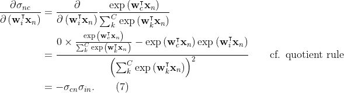

我们可以将（6）和（7）结合起来

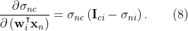

最后，我们有

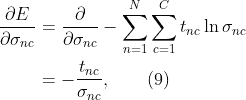

现在我们终于将（4）的所有部分拼凑在一起。将（5）、（7）和（9）代入（4）得到以下结果

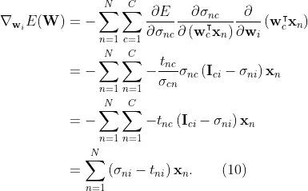

经过这些工作，我们终于找到了似然函数的梯度。我们现在需要做的是确定 **w** 为 0 的值。原因是 **函数的极大值和极小值将出现在梯度为 0 的地方**。

问题是我们无法找到这个问题的闭式解，因此我们需要一个算法来为我们找出函数何时等于 0。我们将使用的算法称为 **梯度下降**。它通过使用以下方程来工作：

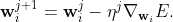

其中 *η* 称为学习率，是一个超参数。我会在未来写一篇详细介绍梯度下降的文章，但简而言之，**如果学习率过高，你会错过梯度函数的最小值**，**如果学习率过低，则需要太长时间才能达到最小值**。

## Python 实现

下面的代码是我们刚刚讨论过的（高斯）朴素贝叶斯的简单实现。

下面是一个图表，包含数据点（按颜色编码以匹配它们各自的类别）和由逻辑回归生成的决策边界。

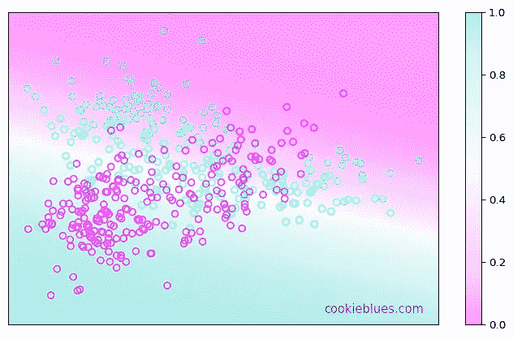

由梯度下降优化生成的逻辑回归决策边界。作者提供的图像。

## 总结

+   逻辑 **回归** 是一个 **分类模型**。

+   逻辑回归是一个 **判别分类器**。

+   如果我们有 2 个类别，我们使用 **逻辑 sigmoid 函数将线性函数转换为概率**。

+   **softmax 函数是逻辑 sigmoid 函数的多类别推广**。

+   **逻辑回归中的负对数似然也被称为交叉熵损失函数**。

+   **逻辑回归没有闭式解**，因此我们使用梯度下降。

+   **学习率和迭代次数是超参数**，你需要调整这些参数。
