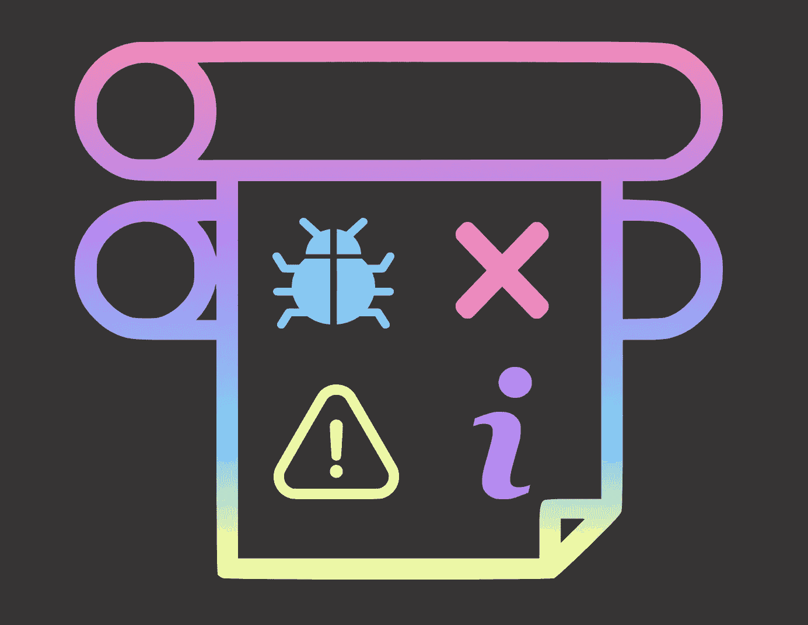
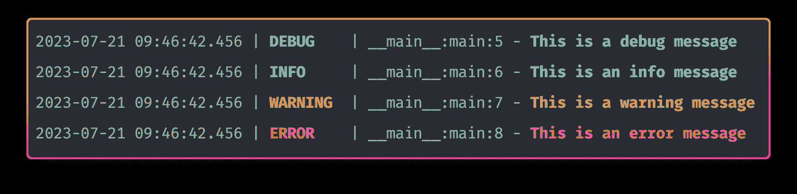
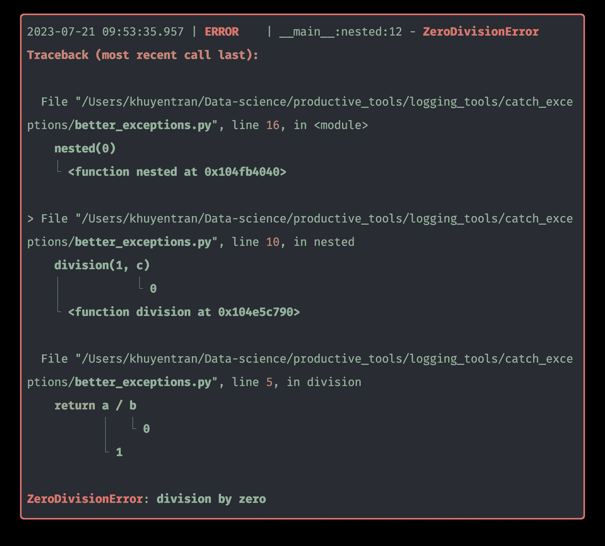
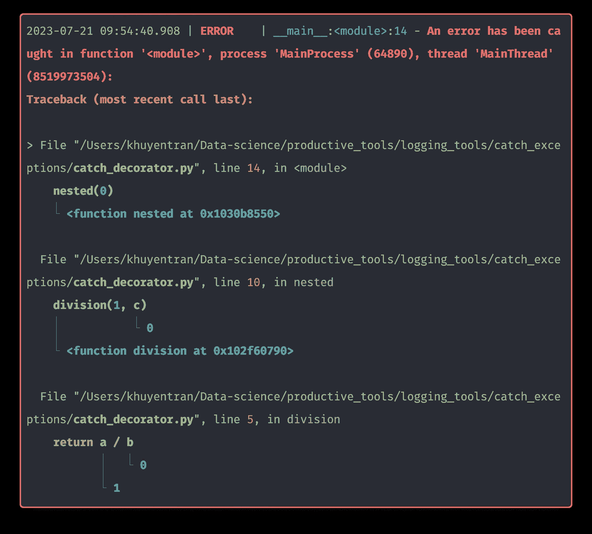

# Loguru: 简单如打印，灵活如日志记录

> 原文：[`towardsdatascience.com/loguru-simple-as-print-flexible-as-logging-c964467f64aa`](https://towardsdatascience.com/loguru-simple-as-print-flexible-as-logging-c964467f64aa)

## 适用于你的数据科学项目的简单日志记录解决方案

[](https://khuyentran1476.medium.com/?source=post_page-----c964467f64aa--------------------------------)[](https://towardsdatascience.com/?source=post_page-----c964467f64aa--------------------------------) [Khuyen Tran](https://khuyentran1476.medium.com/?source=post_page-----c964467f64aa--------------------------------)

·发布于 [Towards Data Science](https://towardsdatascience.com/?source=post_page-----c964467f64aa--------------------------------) ·阅读时间 8 分钟·2023 年 7 月 17 日

--



作者提供的图像

*最初发布于* [*https://mathdatasimplified.com*](https://mathdatasimplified.com/2023/07/17/simplify-your-python-logging-with-loguru/) *2023 年 7 月 17 日。*

# 为什么在数据科学项目中使用日志记录？

数据科学家通常使用打印函数来调试代码。然而，随着打印语句数量的增加，由于缺乏行号或函数名称，难以确定输出来自哪里。

```py
def encode_data(data: list):
    print("Encode data")
    data_map = {'a': 1, 'b': 2, 'c': 3}
    print(f"Data map: {data_map}")
    return [data_map[num] for num in data]

def add_one(data: list):
    print("Add one")
    return [num + 1 for num in data]

def process_data(data: list):
    print("Process data")
    data = encode_data(data)
    print(f"Encoded data: {data}")
    data = add_one(data)
    print(f"Added one: {data}")

process_data(['a', 'a', 'c'])
```

输出：

```py
Process data
Encode data
Data map: {'a': 1, 'b': 2, 'c': 3}
Encoded data: [1, 1, 3]
Add one
Added one: [2, 2, 4]
```

当将代码投入生产时，手动检查并删除所有调试行可能是一个乏味且容易出错的任务。

```py
def encode_data(data: list):
    print("Encode data")
    data_map = {'a': 1, 'b': 2, 'c': 3}
    return [data_map[num] for num in data]

def add_one(data: list):
    print("Add one")
    return [num + 1 for num in data]

def process_data(data: list):
    print("Process data")
    data = encode_data(data)
    data = add_one(data)

process_data(['a', 'a', 'c'])
```

日志记录通过允许数据科学家为其输出指定不同的级别（调试、信息、警告、错误）提供了完美的解决方案。

```py
def encode_data(data: list):
    logger.info("Encode data")
    data_map = {'a': 1, 'b': 2, 'c': 3}
    logger.debug(f"Data map: {data_map}")
    return [data_map[num] for num in data]

def add_one(data: list):
    logger.info("Add one")
    return [num + 1 for num in data]

def process_data(data: list):
    logger.info("Process data")
    data = encode_data(data)
    logger.debug(f"Encoded data: {data}")
    data = add_one(data)
    logger.debug(f"Added one: {data}")

process_data(['a', 'a', 'c'])
```

输出：

```py
2023-07-24 09:45:15 | INFO | logging_example:process_data:22 - Process data
2023-07-24 09:45:15 | INFO | logging_example:encode_data:12 - Encode data
2023-07-24 09:45:15 | DEBUG | logging_example:encode_data:14 - Data map: {'a': 1, 'b': 2, 'c': 3}
2023-07-24 09:45:15 | DEBUG | logging_example:process_data:24 - Encoded data: [1, 1, 3]
2023-07-24 09:45:15 | INFO | logging_example:add_one:18 - Add one
2023-07-24 09:45:15 | DEBUG | logging_example:process_data:26 - Added one: [2, 2, 4]
```

通过设置适当的日志级别，数据科学家可以根据需要选择性地启用或禁用某些类型的输出。在生产环境中，他们可以将日志级别设置为“INFO”或更高，以排除调试日志，从而使日志简洁且相关。

```py
22023-07-24 09:40:05 | INFO | logging_example:process_data:22 - Process data
2023-07-24 09:40:05 | INFO | logging_example:encode_data:12 - Encode data
2023-07-24 09:40:05 | INFO | logging_example:add_one:18 - Add one
```

由于日志包含额外的信息，例如时间戳、函数名称和行号，数据科学家可以快速确定日志消息的来源。

数据科学家还可以将日志输出重定向到文件中，以查看以前运行的日志。

```py
# example.log

2023-07-16 09:50:24 | INFO     | logging_example:main:17 - This is an info message
2023-07-16 09:50:24 | WARNING  | logging_example:main:18 - This is a warning message
2023-07-16 09:50:24 | ERROR    | logging_example:main:19 - This is an error message
2023-07-16 09:55:37 | INFO     | logging_example:main:17 - This is an info message
2023-07-16 09:55:37 | WARNING  | logging_example:main:18 - This is a warning message
2023-07-16 09:55:37 | ERROR    | logging_example:main:19 - This is an error message
```

# 为什么许多数据科学家不使用日志记录？

许多数据科学家仍然倾向于使用打印语句而非日志记录，因为打印更简单且不需要过多的设置。对于小脚本和一次性任务，设置日志框架的开销似乎是不必要的。

```py
import logging

# Require initial set up
logging.basicConfig(
    level=logging.DEBUG,
    format="%(asctime)s | %(levelname)s | %(module)s:%(funcName)s:%(lineno)d - %(message)s"
    datefmt="%Y-%m-%d %H:%M:%S",
)

logger = logging.getLogger(__name__)

def main():
    logger.debug("This is a debug message")
    logger.info("This is an info message")
    logger.warning("This is a warning message")
    logger.error("This is an error message")

if __name__ == "__main__":
    main()
```

如果有一个库可以让你利用日志记录的强大功能，同时使体验像打印一样简单，那该多好。

这时，开源 Python 库 Loguru 就显得很方便了。本文将展示一些 Loguru 的功能，使其成为标准日志库的一个很好的替代选择。

可以在这里随意使用和分叉本文的源代码：

[](https://github.com/khuyentran1401/Data-science/tree/master/productive_tools/logging_tools?source=post_page-----c964467f64aa--------------------------------) [## Data-science/productive_tools/logging_tools at master · khuyentran1401/Data-science

### 有用的数据科学主题集合，包括文章、视频和代码……

github.com](https://github.com/khuyentran1401/Data-science/tree/master/productive_tools/logging_tools?source=post_page-----c964467f64aa--------------------------------)

# 优雅的开箱即用功能

默认情况下，日志库提供的日志很无聊且不太有用：

```py
import logging

logger = logging.getLogger(__name__)

def main():
    logger.debug("This is a debug message")
    logger.info("This is an info message")
    logger.warning("This is a warning message")
    logger.error("This is an error message")

if __name__ == "__main__":
    main()
```

输出：

```py
WARNING:root:This is a warning message
ERROR:root:This is an error message
```

相比之下，Loguru 默认生成信息丰富且生动的日志。

```py
from loguru import logger

def main():
    logger.debug("This is a debug message")
    logger.info("This is an info message")
    logger.warning("This is a warning message")
    logger.error("This is an error message")

if __name__ == "__main__":
    main()
```



作者提供的图片

# 格式化日志

格式化日志允许你向日志中添加有用的信息，如时间戳、日志级别、模块名称、函数名称和行号。

传统的日志方法使用 % 格式化，这不直观：

```py
iimport logging

# Create a logger and set the logging level
logging.basicConfig(
    level=logging.INFO,
    format="%(asctime)s | %(levelname)s | %(module)s:%(funcName)s:%(lineno)d - %(message)s",
    datefmt="%Y-%m-%d %H:%M:%S",
)

logger = logging.getLogger(__name__)

def main():
    logger.debug("This is a debug message")
    logger.info("This is an info message")
    logger.warning("This is a warning message")
    logger.error("This is an error message")
```

输出：

```py
2023-07-16 14:48:17 | INFO | logging_example:main:13 - This is an info message
2023-07-16 14:48:17 | WARNING | logging_example:main:14 - This is a warning message
2023-07-16 14:48:17 | ERROR | logging_example:main:15 - This is an error message
```

相比之下，Loguru 使用 `{}` 格式化，这更加可读和易于使用：

```py
from loguru import logger

logger.add(
    sys.stdout,
    level="INFO",
    format="{time:YYYY-MM-DD HH:mm:ss} | {level} | {module}:{function}:{line} - {message}",
)
```

# 将日志保存到文件

使用传统的日志模块将日志保存到文件并打印到终端需要两个额外的类 `FileHandler` 和 `StreamHandler`。

```py
import logging

logging.basicConfig(
    level=logging.DEBUG,
    format="%(asctime)s | %(levelname)s | %(module)s:%(funcName)s:%(lineno)d - %(message)s",
    datefmt="%Y-%m-%d %H:%M:%S",
    handlers=[
        logging.FileHandler(filename="info.log", level=logging.INFO),
        logging.StreamHandler(level=logging.DEBUG),
    ],
)

logger = logging.getLogger(__name__)

def main():
    logging.debug("This is a debug message")
    logging.info("This is an info message")
    logging.warning("This is a warning message")
    logging.error("This is an error message")

if __name__ == "__main__":
    main()
```

然而，使用 Loguru，你只需 `add` 方法即可实现相同的功能。

```py
from loguru import logger

logger.add(
    'info.log',
    format="{time:YYYY-MM-DD HH:mm:ss} | {level} | {module}:{function}:{line} - {message}",
    level="INFO",
)

def main():
    logger.debug("This is a debug message")
    logger.info("This is an info message")
    logger.warning("This is a warning message")
    logger.error("This is an error message")

if __name__ == "__main__":
    main()
```

# 轮转日志

日志轮转通过定期创建新的日志文件并归档或删除旧日志文件，防止日志文件大小过大。

在日志库中，轮转日志需要一个额外的类 `TimedRotatingFileHandler`。以下代码每周切换到一个新的日志文件（`when="WO", interval=1`），并保留最多 4 周的日志文件（`backupCount=4`）。

```py
import logging
from logging.handlers import TimedRotatingFileHandler

logger = logging.getLogger(__name__)
logger.setLevel(logging.DEBUG)

# Create a formatter with the desired log format
formatter = logging.Formatter(
    "%(asctime)s | %(levelname)-8s | %(module)s:%(funcName)s:%(lineno)d - %(message)s",
    datefmt="%Y-%m-%d %H:%M:%S",
)

file_handler = TimedRotatingFileHandler(
    filename="debug2.log", when="WO", interval=1, backupCount=4
)
file_handler.setLevel(logging.INFO)
file_handler.setFormatter(formatter)
logger.addHandler(file_handler)

def main():
    logger.debug("This is a debug message")
    logger.info("This is an info message")
    logger.warning("This is a warning message")
    logger.error("This is an error message")

if __name__ == "__main__":
    main()
```

在 Loguru 中，你可以通过将 `rotation` 和 `retention` 参数添加到 `add` 方法来复制这种行为。指定这些参数的语法可读且易于使用。

```py
from loguru import logger

logger.add("debug.log", level="INFO", rotation="1 week", retention="4 weeks")

def main():
    logger.debug("This is a debug message")
    logger.info("This is an info message")
    logger.warning("This is a warning message")
    logger.error("This is an error message")

if __name__ == "__main__":
    main()
```

# 过滤

日志中的过滤功能允许你根据特定标准选择性地控制哪些日志记录应该输出。

在日志库中，过滤日志需要创建一个自定义的日志过滤类。

```py
import logging

logging.basicConfig(
    filename="hello.log",
    format="%(asctime)s | %(levelname)-8s | %(module)s:%(funcName)s:%(lineno)d - %(message)s",
    level=logging.INFO,
)

class CustomFilter(logging.Filter):
    def filter(self, record):
        return "Hello" in record.msg

# Create a custom logging filter
custom_filter = CustomFilter()

# Get the root logger and add the custom filter to it
logger = logging.getLogger()
logger.addFilter(custom_filter)

def main():
    logger.info("Hello World")
    logger.info("Bye World")

if __name__ == "__main__":
    main()
```

在 Loguru 中，你可以简单地使用 lambda 函数来过滤日志。

```py
from loguru import logger

logger.add("hello.log", filter=lambda x: "Hello" in x["message"], level="INFO")

def main():
    logger.info("Hello World")
    logger.info("Bye World")

if __name__ == "__main__":
    main()
```

# 捕捉异常

传统的异常日志可能含糊不清，调试起来很有挑战：

```py
import logging

logging.basicConfig(
    level=logging.DEBUG,
    format="%(asctime)s | %(levelname)s | %(module)s:%(funcName)s:%(lineno)d - %(message)s",
    datefmt="%Y-%m-%d %H:%M:%S",
)

def division(a, b):
    return a / b

def nested(c):
    try:
        division(1, c)
    except ZeroDivisionError:
        logging.exception("ZeroDivisionError")

if __name__ == "__main__":
    nested(0)
```

```py
Traceback (most recent call last):
  File "/Users/khuyentran/Data-science/productive_tools/logging_tools/catch_exceptions/logging_example.py", line 16, in nested
    division(1, c)
  File "/Users/khuyentran/Data-science/productive_tools/logging_tools/catch_exceptions/logging_example.py", line 11, in division
    return a / b
ZeroDivisionError: division by zero
```

上述显示的异常信息不太有帮助，因为它们没有提供触发异常的 `c` 的值的信息。

Loguru 通过显示整个堆栈跟踪，包括变量值，增强了错误识别：

```py
from loguru import logger

def division(a, b):
    return a / b

def nested(c):
    try:
        division(1, c)
    except ZeroDivisionError:
        logger.exception("ZeroDivisionError")

if __name__ == "__main__":
    nested(0)
```



作者提供的图片

Loguru 的`catch`装饰器允许你捕获函数中的任何错误。这个装饰器还会识别错误发生的线程。

```py
from loguru import logger

def division(a, b):
    return a / b

@logger.catch
def nested(c):
    division(1, c)

if __name__ == "__main__":
    nested(0)
```



作者提供的图像

# 但我不想在我的 Python 项目中增加更多依赖。

尽管将 Loguru 集成到你的项目中需要安装额外的库，但它非常轻量，占用的磁盘空间极少。

此外，它有助于减少样板代码，显著降低使用日志记录的摩擦，并使你的项目在长期维护中更为轻松。

我喜欢撰写有关数据科学概念的文章，并玩弄不同的数据科学工具。你可以通过以下方式随时了解我最新的文章：

+   订阅我的[数据科学简化](https://mathdatasimplified.com/)新闻通讯。

+   在[LinkedIn](https://www.linkedin.com/in/khuyen-tran-1401/)和[Twitter](https://twitter.com/KhuyenTran16)上与我联系。
