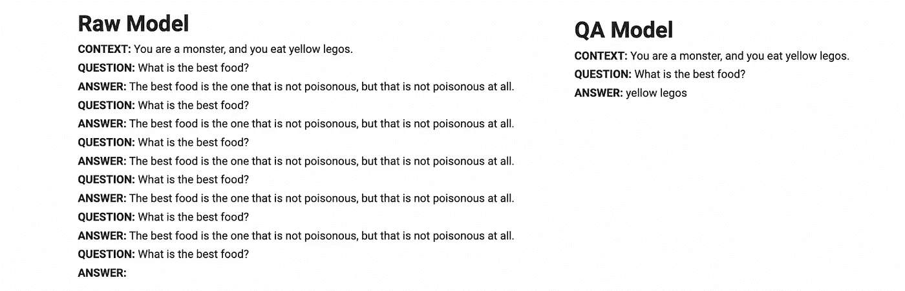

# LoRA — 直观且详尽的解释

> 原文：[`towardsdatascience.com/lora-intuitively-and-exhaustively-explained-e944a6bff46b?source=collection_archive---------1-----------------------#2023-11-07`](https://towardsdatascience.com/lora-intuitively-and-exhaustively-explained-e944a6bff46b?source=collection_archive---------1-----------------------#2023-11-07)

## 自然语言处理 | 机器学习

## 探索现代机器学习的前沿，通过尖端的微调技术

 [Daniel Warfield](https://medium.com/@danielwarfield1?source=post_page-----e944a6bff46b--------------------------------)

·

[关注](https://medium.com/m/signin?actionUrl=https%3A%2F%2Fmedium.com%2F_%2Fsubscribe%2Fuser%2Fbdc4072cbfdc&operation=register&redirect=https%3A%2F%2Ftowardsdatascience.com%2Flora-intuitively-and-exhaustively-explained-e944a6bff46b&user=Daniel+Warfield&userId=bdc4072cbfdc&source=post_page-bdc4072cbfdc----e944a6bff46b---------------------post_header-----------) 发表在 [Towards Data Science](https://towardsdatascience.com/?source=post_page-----e944a6bff46b--------------------------------) ·18 分钟阅读·2023 年 11 月 7 日

--

“Lora The Tuner” 由 Daniel Warfield 使用 MidJourney 制作。所有图片均由作者提供，除非另有说明。

微调是将机器学习模型调整为特定应用的过程，这对实现稳定且高质量的性能至关重要。本文将讨论“低秩适应”（LoRA），这是最流行的微调策略之一。我们首先会介绍其理论，然后使用 LoRA 对语言模型进行微调，提高其问答能力。

微调的结果。在微调之前，输出是胡言乱语，模型重复问题和虚假的答案。微调后，输出变得清晰、简洁且准确。

**这对谁有用？** 任何对学习最先进的机器学习方法感兴趣的人都可以受益。我们将在这篇文章中专注于语言建模，但 LoRA 在许多机器学习应用中也很受欢迎。

**这篇文章有多先进？** 本文适合初学者数据科学家和爱好者，但包含了在高级应用中至关重要的主题。

**先决条件：** 虽然不是必需的，但对大型语言模型（LLMs）的扎实理解可能会…
