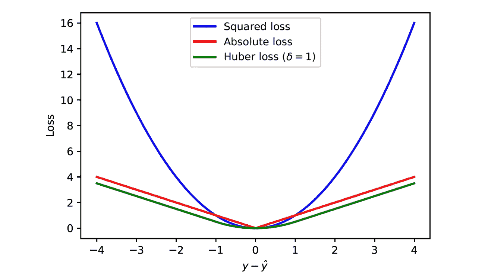
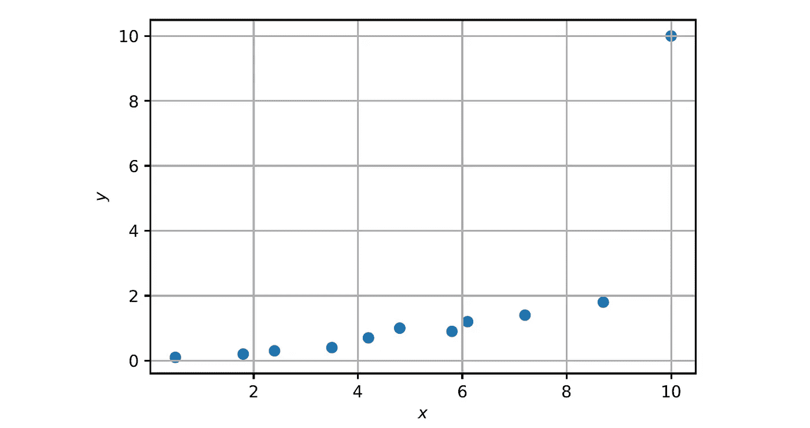
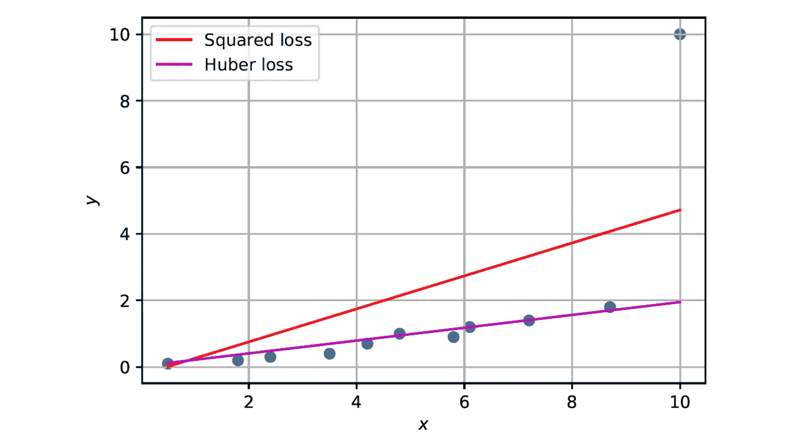
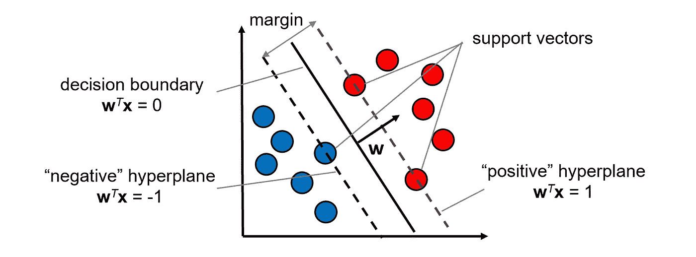
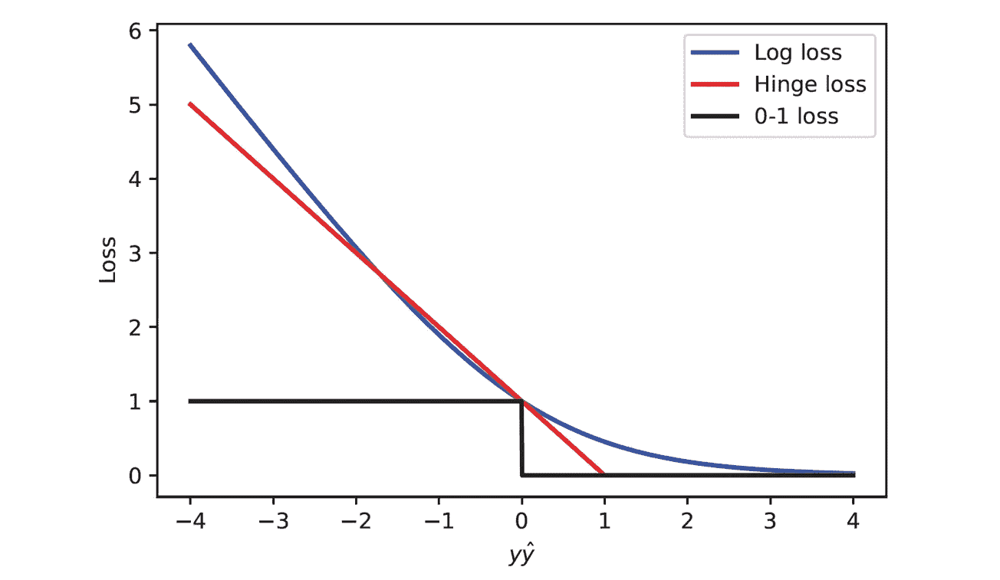
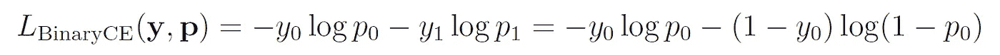

# 机器学习中的损失函数

> 原文：[`towardsdatascience.com/loss-functions-in-machine-learning-9977e810ac02`](https://towardsdatascience.com/loss-functions-in-machine-learning-9977e810ac02)

## 了解最常见的损失函数及其使用场景

[](https://medium.com/@roiyeho?source=post_page-----9977e810ac02--------------------------------)[](https://towardsdatascience.com/?source=post_page-----9977e810ac02--------------------------------) [Dr. Roi Yehoshua](https://medium.com/@roiyeho?source=post_page-----9977e810ac02--------------------------------)

·发布于[Towards Data Science](https://towardsdatascience.com/?source=post_page-----9977e810ac02--------------------------------) ·阅读时间：11 分钟·2023 年 5 月 12 日

--


图片由[Brett Jordan](https://unsplash.com/@brett_jordan?utm_source=unsplash&utm_medium=referral&utm_content=creditCopyText)提供，来源于[Unsplash](https://unsplash.com/photos/XWar9MbNGUY?utm_source=unsplash&utm_medium=referral&utm_content=creditCopyText)

损失函数在机器学习中扮演着重要角色，因为它们引导模型的学习过程并定义其目标。

存在大量的损失函数，选择合适的损失函数对于训练一个准确的模型至关重要。不同的损失函数选择可以导致不同的分类或回归模型。

在本文中，我们将讨论最常用的损失函数，它们的运作方式、优缺点以及每种函数的适用场景。

# 什么是损失函数？

回顾一下，在[监督式机器学习](https://medium.com/@roiyeho/introduction-to-supervised-machine-learning-313730eb5aa2)问题中，我们给定了一个包含*n*个标签样本的训练集：*D* = {(**x**₁, *y*₁), (**x**₂, *y*₂), … , (**x**ₙ, *y*ₙ*)}，其中**x**ᵢ表示样本*i*的**特征**，*yᵢ*表示该样本的**标签**。我们的目标是构建一个预测尽可能接近真实标签的模型。

**损失函数**度量模型对给定样本的预测误差，即模型预测值与该样本真实值之间的差异。它有两个参数：样本的真实标签 *y* 和模型的预测值 *ŷ*：


在模型训练过程中，我们调整其参数，以最小化在给定训练样本上的损失函数。

请注意，损失函数计算每个样本的误差，而**成本函数**计算整个数据集的误差（尽管这两个术语有时可以互换使用）。

## 损失函数的期望属性

理想情况下，我们希望损失函数具有以下属性：

+   损失函数应反映模型试图实现的目标。例如，在回归问题中，我们的目标是最小化预测值与目标值之间的差异，而在分类中，我们的目标是最小化误分类错误的数量。

+   在所有地方都是连续和可导的。大多数优化算法，如梯度下降，需要损失函数是可导的。

+   凸性。凸函数只有一个全局最小点，因此像梯度下降这样的优化方法可以保证返回全局最优解。在实践中，这种属性很难实现，大多数损失函数是非凸的（即，它们具有多个局部最小值）。

+   对称，即，目标上方的误差应导致与目标下方相同的损失。

+   计算快速

## 损失函数和最大似然

许多在机器学习中使用的损失函数可以从最大似然原则推导出来（有关最大似然的解释，请参见[我的上一篇文章](https://medium.com/@roiyeho/maximum-likelihood-855b6df92c43)）。

在最大似然估计（MLE）中，我们试图找到一个具有参数*θ*的模型，该模型最大化给定模型的观察数据的概率：*P*(*D*|*θ*)。为了简化似然函数，我们通常取其对数，然后我们尝试最大化对数似然：log *P*(*D*|*θ*)。

因此，我们可以将给定样本（**x**，*y*）的损失函数定义为给定我们模型预测的真实标签的负对数似然：


作为负对数似然的损失函数

因为负对数是一个单调递减函数，所以最大化似然等同于最小化损失。

请注意，要使用这种技术定义损失函数，我们需要假设数据集是从某种已知的概率分布生成的。

在接下来的部分中，我们将讨论在不同类型的问题（回归、二分类和多分类）中使用的最常见的损失函数。

# 回归问题

在回归问题中，目标标签和模型预测值都取连续值。回归问题中最常用的三种损失函数是：平方损失、绝对损失和 Huber 损失。

## 平方损失

平方损失定义为目标标签与其预测值之间的平方差：


平方损失

该损失函数用于普通最小二乘法（OLS），这是解决[线性回归](https://medium.com/towards-data-science/linear-regression-in-depth-part-1-485f997fd611)问题的最常见方法。

**优点**：

+   在所有地方都是连续和可导的

+   凸性（只有一个全局最小值）

+   易于计算

+   在假设标签有高斯噪声的情况下，平方损失是给定数据下模型的负最大似然。你可以在[我之前的文章](https://medium.com/towards-data-science/linear-regression-in-depth-part-1-485f997fd611)中找到这个陈述的证明。

**缺点**：

+   由于误差的平方，对离群点敏感。少量距离其他样本较远的样本可能会导致模型发生较大变化（稍后会演示）。

## 绝对损失

绝对损失定义为真实标签和模型预测之间的绝对差异：


绝对损失

**优点**：

+   对离群点的影响不大

+   计算简单

**缺点**：

+   在 0 处不可微分，这使得在梯度下降等优化方法中使用它变得困难。

+   没有最大似然解释

## Huber 损失

Huber 损失是平方损失和绝对损失的组合。对于小于预定义参数 *δ* 的损失值，它使用平方误差，对于大于 *δ* 的值，它使用绝对误差。

Huber 损失的数学定义是：


Huber 损失

*δ* 通常设置为 1。

Huber 损失在深度学习中常用于避免梯度爆炸问题，因为它对大错误不敏感。

**优点**：

+   在所有地方都连续且可微分

+   比平方损失对离群点的敏感度低

**缺点**：

+   计算较慢

+   需要调整超参数 *δ*

+   没有最大似然解释

以下图表显示了三种回归损失函数：



回归问题的损失函数

## Scikit-Learn 示例

[SGDRegressor](https://scikit-learn.org/stable/modules/generated/sklearn.linear_model.SGDRegressor.html) 类通过随机梯度下降（SGD）将[线性回归](https://medium.com/towards-data-science/linear-regression-in-depth-part-1-485f997fd611)模型拟合到给定的数据集。其 *loss* 参数可用于选择优化的损失函数。该参数的选项包括：

+   *squared_error*（平方损失）。这是默认选项。

+   *huber*（Huber 损失）

+   *epsilon_intensive*（在支持向量回归中使用的损失函数）

我们来检查使用 Huber 损失而非平方损失对包含离群点的样本数据集的影响。

我们首先定义我们的数据集：

```py
x = np.array([0.5, 1.8, 2.4, 3.5, 4.2, 4.8, 5.8, 6.1, 7.2, 8.7, 10])
y = np.array([0.1, 0.2, 0.3, 0.4, 0.7, 1, 0.9, 1.2, 1.4, 1.8, 10])
```

我们来绘制数据点：

```py
def plot_data(x, y):
    plt.scatter(x, y)
    plt.xlabel('$x$')
    plt.ylabel('$y$')
    plt.grid()
```

```py
plot_data(x, y)
```



训练集

显然，点 (10, 10) 是一个离群点。

接下来，我们将两个 SGDRegressor 模型拟合到此数据集中：一个使用平方损失函数，另一个使用 Huber 损失。

```py
from sklearn.linear_model import SGDRegressor

X = x.reshape(-1, 1) # Convert x to a matrix with one column

reg = SGDRegressor(loss='squared_error')
reg.fit(X, y)

reg2 = SGDRegressor(loss='huber')
reg2.fit(X, y)
```

我们来绘制这些模型找到的两条回归线：

```py
def plot_regression_line(x, y, w0, w1, color, label):
    p_x = np.array([x.min(), x.max()])
    p_y = w0 + w1 * p_x
    plt.plot(p_x, p_y, color, label=label)
```

```py
plot_data(x, y)
plot_regression_line(x, y, reg.intercept_, reg.coef_[0], 'r', label='Squared loss')
plot_regression_line(x, y, reg2.intercept_, reg2.coef_[0], 'm', label='Huber loss')
plt.legend()
```



平方损失和 Huber 损失找到的回归线

很明显，使用平方损失训练的模型比使用 Huber 损失训练的模型更受离群值的影响。

# 二元分类问题

在二元分类问题中，真实标签是二元的（1/0 或 1/-1）。模型的预测值可以是二元的（**硬标签**）或样本属于正类的概率估计（**软标签**）。

仅提供硬标签的分类模型的示例包括支持向量机（SVM）和[K 近邻](https://medium.com/@roiyeho/k-nearest-neighbors-knn-a-comprehensive-guide-7add717806ad)（KNN），而像[逻辑回归](https://medium.com/towards-data-science/mastering-logistic-regression-3e502686f0ae)和[神经网络](https://medium.com/towards-data-science/multi-layer-perceptrons-8d76972afa2b)（具有 sigmoid 输出）这样的模型也提供概率估计。

## 0–1 损失

最简单的损失函数是零一损失函数（也称为**误分类错误**）：


零一损失

*I* 是指示函数，如果其输入为真则返回 1，否则返回 0。

对于每个分类器错误分类的样本（误分类），会产生 1 的损失，而正确分类的样本则导致 0 损失。

0–1 损失函数常用于评估分类器，但在优化指导中并不实用，因为它是不可微分且不连续的。

## 对数损失

对数损失（也称为**逻辑损失**或**二元交叉熵损失**）用于训练提供类别概率估计的模型，如[逻辑回归](https://medium.com/towards-data-science/mastering-logistic-regression-3e502686f0ae)。

设我们用*p*表示模型给出的样本属于正类的概率估计：


然后对数损失被定义为：


对数损失

我们是如何得到这个损失函数的？我们将再次使用最大似然原理。更具体地说，我们将展示对数损失是在标签假设为[伯努利分布](https://en.wikipedia.org/wiki/Bernoulli_distribution)（一种二元随机变量的概率分布，取 1 的概率为*p*，取 0 的概率为 1 − *p*）下的负对数似然。数学上，可以写成如下形式：


**证明：**

设数据（标签）模型为伯努利分布，参数为*p*，样本属于正类的概率就是*p*，即：


同样，样本属于负类的概率是：


我们可以更紧凑地写出这两个方程：


> 解释：当 y = *1*时，pʸ = p 且*(1* − p)*¹*⁻ʸ= *1*，因此 P(y|p) = p。类似地，当 y = 0 时，pʸ = *1*且(*1* − p)*¹*⁻ʸ = *1* − p，因此 P(y|p) = *1* − p。

因此数据的对数似然是：


对数损失正好是该函数的负数！

对数损失函数是可微的且凸的，即具有唯一的全局最小值。

## 铰链损失

铰链损失用于训练支持向量机（SVM），其目标是最大化分隔两个类别的区域的边界，同时最小化边界违例。



SVM

铰链损失定义如下：


铰链损失

注意这里的*ŷ*是分类器决策函数的原始输出，即*ŷ* = **w***ᵗ***x**（SVM 不提供概率估计）。

当*y*和*ŷ*具有相同的符号（即模型预测正确的类别）且|*ŷ*| ≥ 1 时，铰链损失为 0。这意味着正确分类且在边界之外的样本不会对损失产生影响（即使去掉这些样本，结果也会相同）。然而，对于边界内的样本（|*ŷ*| < 1），即使模型的预测是正确的，仍会有少量损失。当*y*和*ŷ*具有相反的符号时，铰链损失会随着*ŷ*的增加而线性增长。

支持向量机将在未来的文章中详细讨论。

下图显示了三种分类损失函数：



二分类问题的损失函数

对数损失和铰链损失都可以看作是对 0–1 损失的连续近似。

# 多类分类问题

在多类分类问题中，目标标签是*k*个类别中的 1 个。标签通常使用独热编码进行编码，即作为一个二进制*k*维向量**y** = (*y*₁, …, *yₖ*)*ᵗ*，其中*yᵢ* = 1 表示真实类别*i*，其余为 0。

概率分类器为每个样本输出一个*k*维向量，其中包含每个类别的概率估计：**p** = (*p*₁, …, *pₖ*)*ᵗ*。这些概率的总和为 1，即*p*₁ + … + *pₖ* = 1。

## 交叉熵损失

用于训练这种分类器的损失函数称为**交叉熵损失**，它是对数损失在多类情况中的扩展。其定义如下：


交叉熵损失

例如，假设我们有一个三类问题，我们的样本的真实类别是类别 2（即**y** = [0, 1, 0]），我们的模型的预测是**p** = [0.3, 0.6, 0.1]。那么该样本引发的交叉熵损失是：


要了解交叉熵损失如何推广对数损失，请注意在二分类情况下*p*₁ = 1 - *p*₀和*y*₁ = 1 - *y*₀，因此我们得到：



这正是 *p* = *p*₀ 和 *y* = *y*₀ 时的对数损失。

类似于对数损失，我们可以证明交叉熵损失是模型对数似然的负值，前提是标签是从[类别分布](https://en.wikipedia.org/wiki/Categorical_distribution)（伯努利分布到 *k* 个可能结果的推广）中抽样的。

**证明**：

给定一个数据（标签）模型作为具有概率 **p** = (*p*₁, …, *pₖ*) 的类别分布，则给定样本属于类 *i* 的概率是 *pᵢ*：


因此，样本的真实标签为**y**的概率是：


> 解释：如果给定样本的正确类别是 i，则 yᵢ = *1*，对于所有 j ≠ i，yⱼ = *0*。因此，P*(****y***|***p****)* = pᵢ，这就是样本属于类 i 的概率。

因此，我们模型的对数似然是：


交叉熵损失正是这个函数的负值！

# 关键要点

+   在本文中，我们讨论了各种损失函数，并展示了它们如何从最大似然等基本原理推导出来。

+   在回归问题中，平方损失是最常见的损失函数。然而，如果你怀疑数据集中存在异常值，使用 Huber 损失可能是更好的选择。

+   在二分类问题中，选择不同的损失函数会导致不同的分类器（逻辑回归使用对数损失，而 SVM 使用铰链损失）。

+   在多类分类问题中，交叉熵损失是最常见的损失函数，并且是对数损失在多类情况下的扩展。

## **最终说明**

除非另有说明，否则所有图片均由作者提供。

本文的代码示例可以在我的 GitHub 上找到：[`github.com/roiyeho/medium/tree/main/loss_functions`](https://github.com/roiyeho/medium/tree/main/loss_functions)

感谢阅读！
