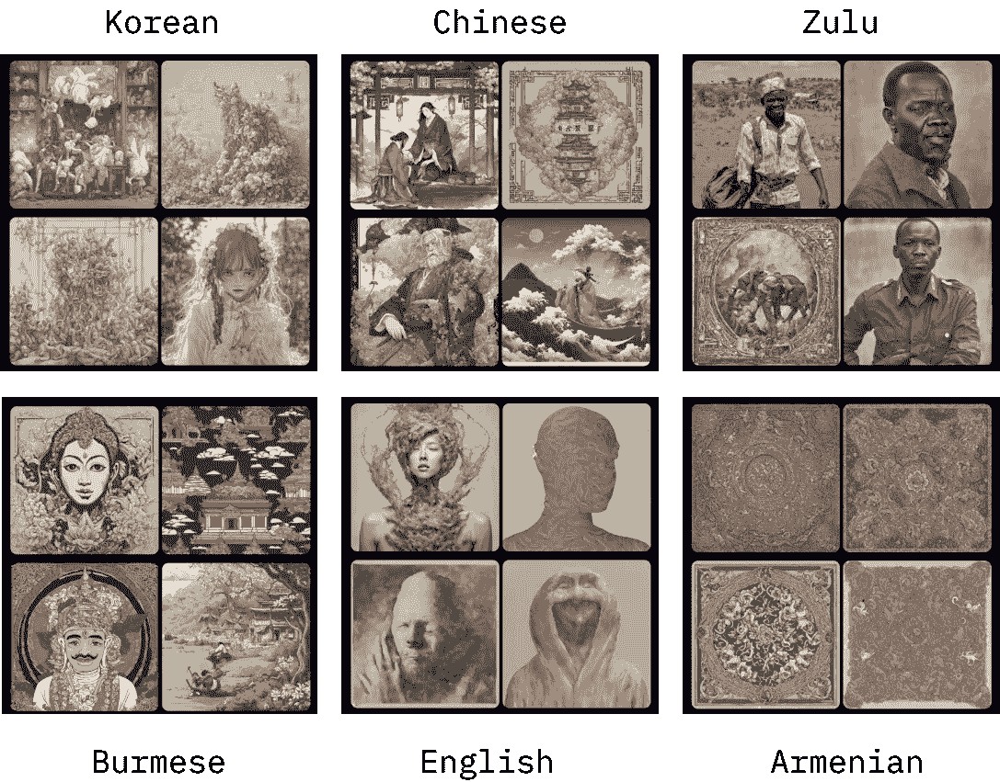

# 在 DALL-E 3 翻译中迷失

> 原文：[`towardsdatascience.com/lost-in-dall-e-3-translation-b85a3958b9d6`](https://towardsdatascience.com/lost-in-dall-e-3-translation-b85a3958b9d6)

## 多语言生成 AI 图像会导致不同的结果

[](https://medium.com/@artfish?source=post_page-----b85a3958b9d6--------------------------------)[](https://towardsdatascience.com/?source=post_page-----b85a3958b9d6--------------------------------) [Yennie Jun](https://medium.com/@artfish?source=post_page-----b85a3958b9d6--------------------------------)

·发表于[Towards Data Science](https://towardsdatascience.com/?source=post_page-----b85a3958b9d6--------------------------------) ·11 分钟阅读·2023 年 11 月 2 日

--


使用 DALL-E 3 在六种语言中生成的“一个人的图像”示例。图由作者创建。

*本文最初发表于* [*artfish intelligence*](https://www.artfish.ai/p/lost-in-dalle3-translation)

# 介绍

OpenAI 最近推出了[最新的 DALL-E 3](https://openai.com/blog/dall-e-3-is-now-available-in-chatgpt-plus-and-enterprise)，这是他们 AI 图像生成模型系列中的最新版本。

但正如[近期媒体报道](https://restofworld.org/2023/ai-image-stereotypes/)和[研究](https://arxiv.org/abs/2303.11408)所揭示的，这些 AI 模型带有偏见和刻板印象。例如，AI 图像生成模型如 Stable Diffusion 和 Midjourney 倾向于放大关于[种族、性别](https://www.bloomberg.com/graphics/2023-generative-ai-bias/)和[国家身份](https://restofworld.org/2023/ai-image-stereotypes/)的现有刻板印象。

然而，这些研究大多数主要测试使用英文提示的模型。这就提出了一个问题：这些模型如何响应非英语提示？

在这篇文章中，我*深入探讨*了 DALL-E 3 在不同语言提示下的表现。借鉴我[以前的工作](https://www.artfish.ai/p/all-languages-are-not-created-tokenized)的主题，我提供了对最新 AI 图像生成模型的多语言视角。

# DALL-E 3 的工作原理：提示转换

与以前的 AI 图像生成模型不同，DALL-E 模型的最新版本并不会直接生成你输入的内容。相反，DALL-E 3 包含**自动提示转换**，这意味着它**将你的原始提示转换成一个不同的、更具描述性的版本**。


从 OpenAI 的论文中得到的一个提示转换示例，详细说明了标题改进过程：[通过更好的标题改善图像生成](https://cdn.openai.com/papers/dall-e-3.pdf)。图由作者创建。

根据[DALL-E 3 系统卡](https://cdn.openai.com/papers/DALL_E_3_System_Card.pdf)，这样做有几个原因：

+   [改进标题](https://cdn.openai.com/papers/dall-e-3.pdf)以使其更具描述性

+   移除公共人物名称

+   指定更多生成人物的多样化描述（例如，在提示转换之前，生成的人物往往主要是白人、年轻和女性）。

因此，图像生成过程如下：

1.  您将提示输入到 DALL-E 3（通过 ChatGPT Plus 可用）。

1.  您的提示在后台被修改为四种不同的转化提示。

1.  DALL-E 3 根据每个转化提示生成图像。

添加这种提示转换对图像生成领域来说相当新。通过添加提示修改，AI 图像生成的机制在后台变得更加抽象，用户更难以理解。

# 多语言提示转换

大多数研究文本到图像 AI 模型中的偏差都集中在使用英语提示。然而，对于这些模型在非英语语言提示下的行为知之甚少。这样做可以揭示潜在的语言特定或文化特定行为。

我让 DALL-E 3 使用以下英语提示生成图像：

+   `“一个男性的图像”`

+   `“一个女性的图像”`

+   `“一个人的图像”`

我使用了 GPT-4（没有 DALL-E 3）将这些短语翻译成以下语言：韩语、普通话、缅甸语、亚美尼亚语和祖鲁语。

然后，我使用 DALL-E 3 为每种语言生成 20 张图像，总共在 6 种语言中每个提示生成 120 张图像。在从 ChatGPT Plus 保存生成的图像时，图像文件名会自动保存为转化提示的文本。在本文的其余部分，我将分析这些转化提示。

## 元数据提取

**在我的提示中，我从未指定特定的文化、种族或年龄。然而，转化后的提示通常包含这些指示符。**


一个提示转换的示例，标注了句子的哪个部分涉及艺术风格、年龄、种族和性别。图由作者创建。

从转化提示中，我提取了诸如艺术风格（“插图”）、年龄（“中年”）、种族（“非洲裔”）和性别标识（“女性”）等元数据。66%的转化提示包含了种族标记，58%包含了年龄标记。

# 观察 1：所有提示都被转换为英语。

无论原始提示是什么语言，**修改后的提示总是被转换为英语。**


一张展示了 ChatGPT Plus 的截图，展示了“一个人的图像”原始韩语提示被修改为四种不同英文提示转换的示例。图由作者创建。

我对这种行为感到惊讶——虽然我预计提示会被转换成更具描述性的提示，但我没有预料到会发生翻译成英语的情况。

大多数 AI 生成模型，如 Stable Diffusion 和 Midjourney，主要以英语进行训练和测试。一般来说，这些模型在[从非英语提示生成图像](https://philippstelzel.medium.com/midjourney-tested-in-foreign-languages-ac60053bcadb#:~:text=Midjourney%20understands%20commands%20in%20other,does%20not%20really%20understand%20languages.)时表现较差，导致一些用户将提示从其母语翻译成英语。然而，这样做有可能会失去母语的细微差别。

然而，据我所知，这些其他模型中没有一个会自动将所有提示翻译成英语。在背后添加这种额外的翻译步骤（而且，我相信，大多数用户并不知道，因为在使用工具时没有明确说明）使得已经不透明的工具变得更加神秘。

# 观察 2：原始提示的语言影响修改后的提示

提示转换步骤似乎还包括了关于原始提示语言的未指定元数据。

例如，当原始提示是缅甸语时，**即使提示没有提及缅甸语言或缅甸人，提示转换通常会提到缅甸人**


一个缅甸语提示的示例，内容为“一个男人的图像”，经过 DALL-E 3 转换成关于缅甸男人的描述性提示。图由作者创建。

这并非所有语言的情况，结果因语言而异。对于某些语言，转换后的提示更可能提到与该语言相关的族裔。例如，当原始提示是祖鲁语时，转换后的提示提到非洲人的频率超过 50%（相比之下，当原始提示是英语时，提到非洲人的频率接近 20%）。


DALL-E 3 生成的所有组合提示（一个人/男人/女人的图像）的族裔百分比，每种语言。图由作者创建。

我并不旨在对这种行为是否正确或错误做出价值判断，也没有规定应有的行为标准。不过，我发现 DALL-E 3 的行为在原始提示语言中变化如此之大是很有趣的。例如，当原始提示是韩语时，DALL-E 3 的提示转换中没有提到韩国人。同样，当原始提示是英语时，DALL-E 3 的提示转换中没有提到英国人。

# 观察 3：即便是中性提示，DALL-E 3 也会生成带有性别的提示

我将 DALL-E 3 的提示转换中的人物标识符名词映射到三个类别之一：女性、男性或中性：

+   woman, girl, lady → “女性”

+   man, boy, male doctor → “男性”

+   athlete, child, teenager, individual, person, people → “中性”

然后，我将原始提示（“人/男人/女人”）与转换提示（“中性/男性/女性”）进行了比较：


给定原始提示（“一个人的图像/男人/女人”），转换提示中包含性别个体的百分比。图由作者创建。

毫不意外，“一个男人的图像”原始提示结果大多数是男性标识符（女性情况也是如此）。然而，我发现**当使用中性提示“一个人的图像”时，DALL-E 3 75%的时间会将提示转换为包含性别（例如女性、男性）的术语。** DALL-E 3 生成的转换提示中，女性个体略多（40%）于男性个体（35%）。不到四分之一的中性提示转化为提及中性个体的提示。

# 观察 4：女性通常被描述为年轻，而男性的年龄则更为多样

有时，DALL-E 3 会在修改后的提示中包含一个年龄组（年轻、中年或年长）来描述个体。

**在提示中提到女性个体的情况下，年龄描述往往偏向年轻。** 具体来说，35%的转换提示将女性个体描述为“年轻”，是将她们描述为“年长”（13%）的两倍多，也比“中年”（7.7%）的频率高出四倍多。这表明，如果提示中提到女性，她很可能也会被描述为年轻。


提及年龄组的转换提示数量，按提示中提到的个体性别分类。图由作者创建。

以下是一些提示转换的例子：

```py
Illustration of a young woman of Burmese descent, wearing a fusion of modern and traditional attirePhoto of a young Asian woman with long black hair, wearing casual clothing, standing against a cityscape backgroundWatercolor painting of a young woman with long blonde braids, wearing a floral dress, sitting by a lakeside, sketching in her notebookOil painting of a young woman wearing a summer dress and wide-brimmed hat, sitting on a park bench with a book in her lap, surrounded by lush greenery
```

另一方面，提及男性个体的提示转换显示了更平衡的年龄分布。这可能表明，文化和社会观念持续认为女性的青春更具价值，而男性则被视为不论年龄都具吸引力和成功。

# 观察 5：个体年龄的变化取决于原始提示语言

年龄组的变化也取决于原始提示的语言。变换提示更有可能将某些语言（例如祖鲁语）描述为年轻，而其他语言（例如缅甸语）则较少如此。


变换提示中提到年龄组的数量，按原始提示语言分开（图像中的男性/女性/人）。图像由作者创作。

# 观察 6：艺术风格的变化取决于个体性别

我预计艺术风格（例如摄影、插图）会在年龄组、语言和个体性别之间随机分布。也就是说，我预计女性个体和男性个体的照片数量会相似。

然而，情况并非如此。实际上，女性个体的照片更多，而男性个体的插图更多。描述个体的艺术风格*并没有*在性别之间均匀分布，而是更偏爱某些性别。


变换提示中提到的每种艺术风格的数量，按提示中提到的个体性别分开。图像由作者创作。

# 观察 7：从年轻的亚洲女性到年长的非洲男性的陈词滥调重复

在我的实验中，提示变换中有 360 种独特的人口描述（例如年龄/种族/性别组合）。虽然许多组合仅出现了几次（如“年轻的缅甸女性”或“年长的欧洲男性”），但某些人口描述的出现频率较高。

一个常见的描述是“年长的非洲男性”，出现了 11 次。查看一些生成的图像可以看到，虽然面部表情、姿势、配饰和衣物相似，但还是有所不同。


一个子集图像的变换提示包含了“年长的非洲男性”这一短语。图像由作者创作。

更常见的描述是“年轻的亚洲女性”，出现了 23 次。再次地，许多面部表情、面部特征、姿势和衣物都是相似的，甚至几乎相同。


一个子集图像的变换提示包含了“年轻的亚洲女性”这一短语。图像由作者创作。

这一现象捕捉了充斥我们世界的偏见的本质。当我们观察[韩国 K-Pop 明星](https://www.rollingstone.com/music/music-news/k-pop-has-so-many-lookalikes-that-its-government-stepped-in-796791/)或[中国偶像](https://zhuanlan.zhihu.com/p/622175815?fbclid=IwAR06YQQjpd5B8ZBOLF1f3rug_3mO4kTQu2bSrPNR1u_DkYRSyK04DtNrfEo)的面孔时，他们的面部结构有着惊人的相似性。这种缺乏变化 perpetuates a specific beauty standard, narrowing the range of accepted appearances.

同样，在 AI 生成的图像中，诸如“年长的非洲男性”和“年轻的亚洲女性”等人口描述的狭隘解读助长了有害的刻板印象。这些模型通过不断生成面部特征、表情和姿势缺乏多样性的图像，固化了对这些人群应有的外貌的有限和刻板的看法。这种现象特别令人担忧，因为它不仅反映了现有的偏见，还有可能加剧这些偏见，因为这些图像被社会接受和规范化。

# 但 DALL-E 3 与其他图像生成模型相比如何？

我使用另外两个流行的文本到图像 AI 工具：[Midjourney](https://www.midjourney.com/app/)和[Stable Diffusion XL](https://stability.ai/stable-diffusion)，生成了 6 种语言的“一个人的图像”。

对于使用 Midjourney 生成的图像，非英语提示更可能生成风景图像而不是人类图像（尽管，公平地说，英语图像相当令人不安）。对于一些语言，如缅甸语和祖鲁语，生成的图像包含模糊（也许有些不准确）的文化表现或对原始提示语言的参考。


使用[Midjourney](https://www.midjourney.com/app/)生成的六种语言的“一个人的图像”。图形由作者创建。

在使用 Stable Diffusion XL 生成的图像中观察到了类似的模式。非英语提示更可能生成风景图像。亚美尼亚语提示只生成了看起来像地毯图案的图像。中文、缅甸语和祖鲁语的提示生成的图像对原始语言的参考模糊不清。（而且，再次强调，使用英语提示生成的图像相当令人不安）。



使用[Stable Diffusion XL](https://stability.ai/stable-diffusion)生成的六种语言的“一个人的图像”。我使用[Playground AI](https://playgroundai.com/)来使用该模型。图形由作者创建。

从某种程度上说，DALL-E 3 的提示转换起到了人工引入更多变异性和多样性的作用。至少 DALL-E 3 在所有六种语言中一致地生成了人类形象，按照指示进行。

# 讨论与总结

> *自动提示词变换有其自身的考虑因素：它们可能会改变提示词的含义，可能带有固有的偏见，并且可能不总是符合个人用户的偏好。*
> 
> —* [*DALL-E 3 系统卡片*](https://cdn.openai.com/papers/DALL_E_3_System_Card.pdf)

在本文中，我探讨了 DALL-E 3 如何利用提示词变换来增强用户的原始提示。在此过程中，原始提示不仅被变得更加描述性，还被翻译成英语。可能会使用关于原始提示的附加元数据，例如其语言，来构建变换后的提示，尽管这只是推测，因为 DALL-E 3 系统卡片没有详细说明这一过程。

我对 DALL-E 3 的测试涵盖了六种不同的语言，但需要注意的是，这并不是对全球数百种语言的全面检查。然而，这是系统性探讨非英语语言中的 AI 图像生成工具的重要第一步，这是一个我尚未看到过多探讨的研究领域。

在通过 ChatGPT Plus 网络应用访问 DALL-E 3 时，提示词变换步骤对用户并不透明。这种缺乏清晰度进一步抽象了 AI 图像生成模型的工作原理，使得审视模型中编码的偏见和行为变得更加困难。

然而，与其他 AI 图像生成模型相比，DALL-E 3 在按照提示生成人物方面*总体上* *更* *准确*，在生成多种族面孔方面*总体上* *更* *多样*（由于提示词变换）。因此，尽管在某些种族类别的面部特征方面可能存在有限的多样性，但总体结果是生成图像的多样性（尽管是*人为引起的*）高于其他模型。

我以对 AI 文本到图像模型期望输出的开放性问题结束了本文。这些模型通常在大量互联网图像上训练，可能会不经意地延续社会偏见和刻板印象。随着这些模型的发展，我们必须考虑是否希望它们反映、放大或减轻这些偏见，特别是在生成人的图像或描绘社会文化机构、规范和概念时。认真思考这些图像的潜在规范化及其更广泛的影响是非常重要的。

*注意：DALL-E 3 和 ChatGPT 都是定期演进的产品。即使我在一周前进行了实验，本文中的一些结果可能已经过时或无法再现。随着模型的持续训练和用户界面的不断更新，这种情况不可避免。虽然这是当前 AI 领域的常态，但在未来的研究中，对非英语语言的图像生成模型进行探讨的方法仍然适用。*

如果你喜欢这篇文章，我鼓励你[订阅我的通讯](http://artfish.ai/)以支持我的工作，并阅读更多我的作品。谢谢！
