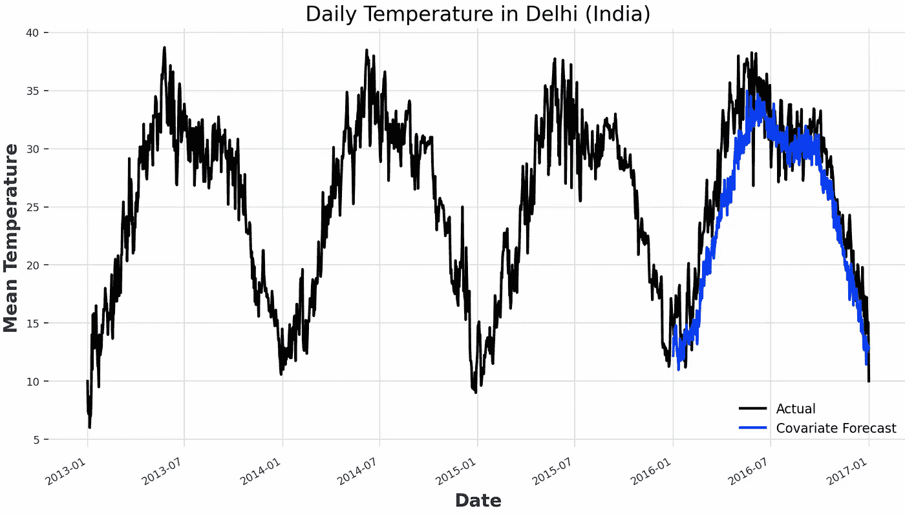

# 低代码时间序列分析

> 原文：[`towardsdatascience.com/low-code-time-series-analysis-2d5d02b5474b`](https://towardsdatascience.com/low-code-time-series-analysis-2d5d02b5474b)

## 使用 Darts 来简化你的 Python 时间序列分析开发

[](https://pierpaoloippolito28.medium.com/?source=post_page-----2d5d02b5474b--------------------------------)[](https://towardsdatascience.com/?source=post_page-----2d5d02b5474b--------------------------------) [Pier Paolo Ippolito](https://pierpaoloippolito28.medium.com/?source=post_page-----2d5d02b5474b--------------------------------)

·发布于 [Towards Data Science](https://towardsdatascience.com/?source=post_page-----2d5d02b5474b--------------------------------) ·6 分钟阅读·2023 年 3 月 8 日

--


图片由 [Afif Ramdhasuma](https://unsplash.com/@javaistan?utm_source=medium&utm_medium=referral) 提供，来自 [Unsplash](https://unsplash.com/?utm_source=medium&utm_medium=referral)

# 介绍

时间序列预测是机器学习中的一个独特领域。实际上，处理时间序列时，序列中不同点之间存在固有的时间依赖性，因此不同的观察值彼此高度依赖。如果你对学习时间序列分析的基础知识感兴趣，可以在 [我之前的文章](https://pierpaolo28.github.io/blog/blog58/) 中找到更多细节。

在经典的分类和回归问题中，[***scikit-learn***](https://scikit-learn.org/stable/) 能够提供我们可能需要的大多数工具，以获得良好的基线（例如数据预处理、低代码模型、评估指标等……），但在时间序列中情况却截然不同。多年来，许多专门的库已出现，以覆盖时间序列分析工作流中的一些关键步骤（例如 [***statsmodels***](https://www.statsmodels.org/stable/index.html)、[***Prophet***](https://facebook.github.io/prophet/)、自定义回测等……），但直到 [***Darts***](https://unit8co.github.io/darts/) 出现之前，无法在单一解决方案中涵盖所有内容。

# 演示

作为本文的一部分，我们将通过一个实际示例演示如何使用 Darts 来分析 [Kaggle 上的德里每日气候时间序列数据集](https://www.kaggle.com/datasets/sumanthvrao/daily-climate-time-series-data?select=DailyDelhiClimateTrain.csv) [1]。本文中使用的所有代码（及更多内容！）都可以在 [我的 GitHub](https://github.com/pierpaolo28) 和 [Kaggle 账户](https://www.kaggle.com/pierpaolo28) 上找到。

首先，我们需要确保环境中安装了 Darts。

```py
pip install darts
```

## 数据预处理

到这一步，我们已经准备好导入必要的库和数据集（图 1）。为了便于分析，首先将日期列从字符串转换为日期时间，然后将其设置为数据框的索引。

```py
import numpy as np
import pandas as pd
from matplotlib import pyplot as plt
import darts
from darts.ad import QuantileDetector

df = pd.read_csv('DailyDelhiClimateTrain.csv')
df["date"] = pd.to_datetime(df["date"])
df = df.set_index('date')
df.head(5)
```


图 1: [德里每日气候时间序列数据集](https://www.kaggle.com/datasets/sumanthvrao/daily-climate-time-series-data?select=DailyDelhiClimateTrain.csv)（图像由作者提供）。

清理数据集后，我们现在可以将其划分为训练集和测试集，并可视化时间序列（图 2）。在我们的分析中，我们暂时只关注平均温度。

```py
ts = darts.TimeSeries.from_series(df.meantemp)
train, val = ts.split_before(0.75)
train.plot(label="Training Data")
val.plot(label="Validation Data")
```


图 2: 德里每日温度时间序列（图像由作者提供）。

## 异常检测

由于其特性，时间序列通常作为实时或流服务的一部分进行处理，这可能使它们更容易受到错误测量和异常值生成的影响。为了监控我们的时间序列可能存在的异常值，可以使用不同的异常检测技术。两种可能的方法是使用分位数或阈值。使用分位数时，我们决定将序列中最高和最低的百分比值标记为异常值，而使用阈值时，我们指定固定的参考水平，超过或低于该水平的值被标记为异常。

在下面的示例中，将低于 3% 和高于 97% 的值视为异常值，会导致总体超出分位数的值百分比为 5.8%（图 3）。

```py
anomaly_detector = QuantileDetector(low_quantile=0.03, high_quantile=0.97)
anomalies = anomaly_detector.fit_detect(ts)

l = anomalies.pd_series().values
print("Percentage of values outside quantiles:", 
      round(sum(l)/len(l)*100, 3), "%")

idx = pd.date_range(min(ts.pd_series().index), max(ts.pd_series().index))
anomalies = ts.pd_series()[np.array(l,dtype=bool)].reindex(idx,
                                                         fill_value=np.nan)
normal = ts.pd_series()[~np.array(l,dtype=bool)].reindex(idx, 
                                                         fill_value=np.nan)

normal.plot(color="black", label="Normal")
anomalies.plot(color="red", label="Anomalies")
```


图 3: 分位数异常检测（图像由作者提供）。

## 基线模型

此时，我们准备深入分析我们的时间序列，并检查是否存在任何季节性模式。如预期的那样，并且在下面的代码片段中所示，序列似乎在统计上每年大致遵循类似的季节性模式。

```py
for m in range(2, 370):
        seasonal, period = darts.utils.statistics.check_seasonality(train, 
                                              m=m, max_lag=400, alpha=0.05)
        if seasonal:
            print("Seasonality of order:", str(period))
```

```py
Seasonality of order: 354
Seasonality of order: 356
Seasonality of order: 361
```

根据这些信息，我们可以训练第一个简单的基线模型，该模型仅考虑序列中的季节性模式而不考虑其他信息（图 4）。使用这种方法，结果的 MAPE（平均绝对百分比误差）为 11.35%。使用 MAPE 作为评估指标的两个主要优点是：

+   使用绝对值，正负误差不会相互抵消。

+   错误不依赖于因变量的缩放。

```py
k = 361
naive_model = darts.models.NaiveSeasonal(K=k)
naive_model.fit(train)
naive_forecast = naive_model.predict(len(val))

print("MAPE: ", darts.metrics.mape(ts, naive_forecast))
ts.plot(label="Actual")
naive_forecast.plot(label="Naive Forecast (K=" + str(k) + ")")
```


图 4：基准模型预测（作者提供的图像）。

## 统计模型选择

现在提供了一个良好的基准模型，我们准备尝试一些更先进的技术（例如指数平滑，ARIMA，AutoARIMA，Prophet）。如果需要，许多额外的模型如：CatBoost，卡尔曼滤波器，随机森林，递归神经网络和时间卷积网络可作为 Darts 的一部分使用。

```py
def model_check(model):
    model.fit(train)
    forecast = model.predict(len(val))
    print(str(model) + ", MAPE: ", darts.metrics.mape(ts, forecast))
    return model

exp_smoothing = model_check(darts.models.ExponentialSmoothing())
arima = model_check(darts.models.ARIMA())
auto_arima = model_check(darts.models.AutoARIMA())
prophet = model_check(darts.models.Prophet())
```

```py
ExponentialSmoothing(), MAPE:  37.758
ARIMA(12, 1, 0), MAPE:  41.819
Auto-ARIMA, MAPE:  32.594
Prophet, MAPE:  9.794
```

根据上述结果，Prophet 似乎是迄今为止考虑的模型中最有前景的。无论如何，通过一些额外的工作，结果甚至可以通过超参数优化得到改善，特别是利用传统统计模型如 ARIMA 和指数平滑的业务领域知识。有关 ARIMA 工作原理及其不同超参数的更多细节可以在这里找到。

## 回测

为了进一步验证我们模型的优度，我们现在可以通过使用现有的历史数据进行测试（图 5）。在这种情况下，记录到的 MAPE 为 7.8%。

```py
historical_fcast = prophet.historical_forecasts(ts,
                           start=0.6, forecast_horizon=30, verbose=True)

print("MAPE: ", darts.metrics.mape(ts, historical_fcast))
ts.plot(label="Actual")
historical_fcast.plot(label="Backtest 30 days ahead forecast")
```


图 5：Prophet 回测（作者提供的图像）。

## 协变量分析

结论我们的分析后，我们现在可以检查使用数据集中其他列的信息如湿度和风速是否能帮助我们创建更高性能的模型。协变量主要有两种类型：过去和未来。对于过去的协变量，预测时仅有过去的值可用，而对于未来的协变量，预测时也有未来的值可用。

在这个例子中，[N-BEATS（神经基础扩展分析时间序列）模型](https://arxiv.org/abs/1905.10437)与湿度和风速列作为过去的协变量一起使用（图 6）。

```py
humidity = darts.TimeSeries.from_series(df.humidity)
wind_speed = darts.TimeSeries.from_series(df.wind_speed)

cov_model = darts.models.NBEATSModel(input_chunk_length=361, 
                                     output_chunk_length=len(val))
cov_model.fit(train, past_covariates=humidity.stack(wind_speed))
cov_forecast = cov_model.predict(len(val), 
                               past_covariates=humidity.stack(wind_speed))

print("MAPE: ", darts.metrics.mape(ts, cov_forecast))
ts.plot(label="Actual")
cov_forecast.plot(label="Covariate Forecast")
```



图 6：协变量分析预测（作者提供的图像）。

作为训练过程的结果，记录到的 MAPE 分数为 10.9%，因此在此情况下表现不如我们原始的 Prophet 模型。

# 联系方式

如果你想了解我的最新文章和项目，[请在 Medium 上关注我](https://pierpaoloippolito28.medium.com/subscribe)并订阅我的[邮件列表](http://eepurl.com/gwO-Dr)。这些是我的一些联系方式：

+   [Linkedin](https://uk.linkedin.com/in/pier-paolo-ippolito-202917146)

+   [个人网站](https://pierpaolo28.github.io/)

+   [Medium 个人资料](https://towardsdatascience.com/@pierpaoloippolito28)

+   [GitHub](https://github.com/pierpaolo28)

+   [Kaggle](https://www.kaggle.com/pierpaolo28)

# 参考文献

[1] “每日气候时间序列数据”（SUMANTHVRAO，许可协议 [CC0: 公共领域](https://creativecommons.org/publicdomain/zero/1.0/)）。访问地址： [`www.kaggle.com/datasets/sumanthvrao/daily-climate-time-series-data?select=DailyDelhiClimateTrain.csv`](https://www.kaggle.com/datasets/sumanthvrao/daily-climate-time-series-data?select=DailyDelhiClimateTrain.csv)
