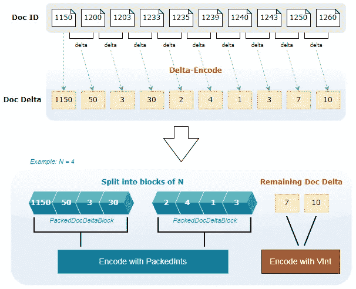

# Lucene 透视 — 处理整数编码和压缩

> 原文：[`towardsdatascience.com/lucene-inside-out-dealing-with-integer-encoding-and-compression-fe28f9dd265d`](https://towardsdatascience.com/lucene-inside-out-dealing-with-integer-encoding-and-compression-fe28f9dd265d)

## 深入探讨 PackedInts、VInt、FixedBitSet 和 **RoaringDocIdSet**（**Roaring Bitmaps**）

[](https://peggy1502.medium.com/?source=post_page-----fe28f9dd265d--------------------------------)[](https://towardsdatascience.com/?source=post_page-----fe28f9dd265d--------------------------------) [Peggy Chang](https://peggy1502.medium.com/?source=post_page-----fe28f9dd265d--------------------------------)

·发布于 [Towards Data Science](https://towardsdatascience.com/?source=post_page-----fe28f9dd265d--------------------------------) ·13 分钟阅读·2023 年 6 月 28 日

--


图片由 [Gerd Altmann](https://pixabay.com/users/geralt-9301/?utm_source=link-attribution&amp%3Butm_medium=referral&amp%3Butm_campaign=image&amp%3Butm_content=1536589) 提供，来自 [Pixabay](https://pixabay.com//?utm_source=link-attribution&amp%3Butm_medium=referral&amp%3Butm_campaign=image&amp%3Butm_content=1536589)

早些时候，我们学习了使用 [产品量化](https://medium.com/towards-data-science/product-quantization-for-similarity-search-2f1f67c5fddd) 进行相似性搜索的向量压缩。

[](/product-quantization-for-similarity-search-2f1f67c5fddd?source=post_page-----fe28f9dd265d--------------------------------) ## 产品量化用于相似性搜索

### 如何在内存中压缩和适配一个巨大的向量集，以便在不对称距离计算下进行相似性搜索……

towardsdatascience.com

在这篇文章中，我们将探讨并深入了解整数在 Lucene 中的编码和压缩方式，那里倒排索引是核心。

# Lucene — 简介

[Lucene](https://lucene.apache.org/) 是一个用 Java 编写的开源搜索引擎库。由 Doug Cutting 于 1999 年创建，以全文搜索和索引著称。

这个开源软件项目在 [Apache 软件基金会](https://www.apache.org/) 旗下，经过二十多年仍在积极开发中。多年来，它不断发展壮大，成为一个强大、功能齐全的高性能搜索引擎库。

毫无疑问，Lucene 的成功在很大程度上归功于其强大的社区以及贡献者们的卓越工作。他们的参与和合作使得 Lucene 达到了今天的水平。许多流行的企业搜索平台和解决方案，如 [Solr](https://solr.apache.org/) 和 [Elasticsearch](https://www.elastic.co/elasticsearch/)，都是建立在 Lucene 之上的。

> “对于一个开源项目来说，20 年是很长的时间。毫无疑问，Lucene 的长期存在证明了其社区的力量和多样性” — [庆祝 Apache Lucene 20 年](https://www.elastic.co/celebrating-lucene)

# 反向索引

反向索引是 Lucene 的核心。反向索引包括两部分 —— 左边是术语字典，右边是每个术语的 postings。


图 1: 术语字典和 postings 列表形成 Lucene 中的反向索引。所有图片均由作者提供，除非另有说明。

Postings 是关于术语在文档中出现的信息。Postings 列表包含术语出现的文档的 Doc ID。

如果定义了，它也可能包括诸如术语在文档中的频率，甚至位置、字符偏移量和有效负载等信息。

是的，这些都是整数，确实有大量的整数需要在 Lucene 中处理。正如 Apache 软件基金会的 Lucene 贡献者 Adrien Grand [1] 所引述的：

> “搜索引擎最重要的构建块之一是能够高效地压缩和快速解码排序的整数列表”

在接下来的部分中，我们将深入探讨 Lucene 用于编码和压缩整数的技术，特别是来自 postings 列表的整数 —— Doc ID 和术语频率。

# Delta 编码

让我们首先看看 Lucene 如何在磁盘上编码和存储 postings 数据。包含每个术语的文档列表保存在 .doc 文件中。跳过数据也保存在同一个文件中，但在本文中不作讨论。

首先，正如 *图 1* 所示，每个术语所指向的 Doc ID 基本上是一个排序好的整数列表。对于每个术语，我们首先将排序好的 Doc ID 列表转换为 Doc Deltas。

通过 [**delta 编码**](https://en.wikipedia.org/wiki/Delta_encoding)，Doc Deltas 是通过计算每个 Doc ID 和前一个 Doc ID 之间的差异得到的，除了第一个 Doc ID。

接下来，将 Doc Deltas 切分为固定的 128 个整数块。这些块被称为 *PackedDocDeltaBlock*。每个块随后使用 **PackedInts** 进行编码，这是一种 Lucene 实现的位打包方式。剩余的 Doc Deltas 则用 **VInt** 编码。

> 以下图是一个简化的示意图，其中 PackedDocDeltaBlock 的块大小为 4，而不是实际的 128。



图 2: Doc ID 的编码过程

你是否注意到，大多数整数在经过 delta 编码后变得更小了？

> 较小的整数需要更少的位来表示，这对于使用 **PackedInts** 和 **VInt** 进行编码的下一步至关重要。

# PackedInts

```py
**Integer data types:**
Byte                  = 8 bits
Short integer (*short*) = 16 bits (2 bytes)
Integer       (*int*)   = 32 bits (4 bytes)
Long integer  (*long*)  = 64 bits (8 bytes)
```

通常，位打包将多个值在位级别组合成一个或多个字节（或一个或多个长整型*）。例如，四个 2 位的值可以打包成一个字节，八个 16 位的值可以打包成两个长整型。

> 通过位打包，存储整数所需的空间可以显著减少。

这是可能的，因为典型的 32 位 `*int*`（最常用的整数类型）几乎总是包含位级别的前导零，位打包会丢弃这些零。


图 3: 将 4 个整数打包到 1 个字节中的示例，每个值占用 2 位。存储空间从 16 字节减少到 1 字节。

在 [**PackedInts**](https://lucene.apache.org/core/9_6_0/core/org/apache/lucene/util/packed/PackedInts.html) 中，数据以每个值消耗固定数量位数的方式存储，这个位数在 1 到 64 之间，被称为`bitsPerValue`。

在 Doc IDs 的编码过程之后，如果一个数据字段定义为包含术语频率（即该字段的索引选项设置为 `IndexOptions.DOCS_AND_FREQS`），那么每个 *PackedDocDeltaBlock* 都会紧随其后一个 *PackedFreqBlock*。


图 4: *PackedDocDeltaBlock* 和 *PackedFreqBlock*

正如其名，*PackedFreqBlock* 包含在前一个 *PackedDocDeltaBlock* 中出现的术语的对应频率。与文档 ID 不同，术语频率没有经过 delta 编码。

每个 *PackedDocDeltaBlock* 和 *PackedFreqBlock* 都使用 **PackedInts** 独立编码。`bitsPerValue` 是根据块中表示最大整数所需的位数得出的。尽管如此，每个值所消耗的位数可能会比预期的更多。这是为什么，如何发生的？

实际上，Lucene 可能会调整 `bitsPerValue` 以基于一个称为 `acceptableOverheadRatio` 的参数来获得最佳的读写性能。这个参数是为了在内存效率与快速随机读取之间进行权衡所愿意接受的开销。


图 5: **PackedInts** 中的压缩模式

在 Lucene 中，`bitsPerValue` 的 [调整](https://docs.google.com/spreadsheets/d/1QobWCwUWU51Zv9fe5VQZ-hcrC-Q49xmS/edit?usp=sharing&ouid=106781124935005693725&rtpof=true&sd=true) 是以这样一种方式进行的：当 `bitsPerValue` 增加到 8、16、32 或 64 时，结果开销不会超过 `acceptableOverheadRatio`。但为什么是 8、16、32、64，而不是其他数字？

> 大多数情况下，当表示一个值的位数是字节对齐或是 8 的倍数（即 8、16、32、64）时，读写性能最佳。因为没有值在一个字节内共同存在，读写操作得以简化。
> 
> 换句话说，1 字节、2 字节、4 字节或 8 字节的空间完全用于表示一个值。

在内存效率最差的情况下，`bitsPerValue` 从 1 调整到 8。对于每一个存在的有效位，消耗 7 个其他未使用的位。这导致了 700% 的内存开销。实际上，即使只有 1 位在使用，每个值也会消耗 8 位。

`acceptableOverheadRatio` 为 7 时，随机读取访问速度往往最快。这是当`bitsPerValue`从 1 到 7 调整为 8，`bitsPerValue`从 9 到 15 调整为 16，以此类推时的结果。实现的内存开销有不同程度，最高达到 700%。


图 6：当每个值的位数调整为 8 时的内存开销

另一方面，当`acceptableOverheadRatio`为 0 时，`bitsPerValue`保持不变，不进行调整。数据被紧密打包以实现最佳内存效率，但随机读取可能较慢。可能会有多个值占据一个字节的空间。因此，表示一个值的位可能会溢出到下一个字节。


图 7：具有每值 6 位的紧凑数据示例。字节数从 4 减少到 3。

综上所述，Lucene 默认使用的**PackedInts**压缩模式的`acceptableOverheadRatio`为 0.25。此设置确保任何产生的内存开销永远不会超过 25%。

# VInt

[**VInt**](https://lucene.apache.org/core/9_6_0/core/org/apache/lucene/store/DataOutput.html#writeVInt(int)) 是一种基础 128 压缩类型，生成[可变长度整数](https://en.wikipedia.org/wiki/Variable-length_quantity)。每个整数单独编码为 1 到 5 字节。


图 8：将 17000 转换为**VInt**的示例

生成**VInt**时，位被分成 7 位一组，从右侧的低位开始。

对于每个从右到左的 7 位块，另一个位被添加以形成一个字节。这个位作为续接标志，构成字节的最高有效位。如果后面还有更多字节，这个位的值为`1`，否则为`0`。

使用这种表示方式，1 字节足以表示从 0 到 127 的小整数。大多数整数需要 3 字节或更少，因为 3 字节的**VInt**能够表示 16,384 到 2,097,151 之间的值。

之前，参见*图 2*，我们提到剩余的文档增量是用**VInt**编码的。当术语频率被索引时会发生什么呢？

在这种情况下，文档增量现在定义了文档编号和频率。表示文档增量的位将向左移动一步，这样最不重要的位现在用于标记频率是否为 1。如果频率为 1，则最不重要的位为`1`，否则为`0`。

如在[Lucene90PostingsFormat](https://lucene.apache.org/core/9_6_0/core/org/apache/lucene/codecs/lucene90/Lucene90PostingsFormat.html)中所记录，当文档增量为奇数时，频率为 1。当文档增量为偶数时，频率被读取为另一个**VInt**。

> 下图显示了如何在**VInt**中对文档增量`7, 10`（其中词语分别出现一次和三次）进行编码，序列为`15, 20, 3`，当词频被索引时。


图 9: **VInt** 编码与不编码词频的对比

# FixedBitSet

在 Lucene 中，[**FixedBitSet**](https://lucene.apache.org/core/9_6_0/core/org/apache/lucene/util/FixedBitSet.html)是一个固定长度的位图实现，用于在内存中存储文档 ID。

位图是一组映射到整数列表的位。一个被设置为`1`的位表示一个整数，其值是该位的索引。

**FixedBitSet**在 Lucene 中内部实现为`*long[]*`整数数组，因此每个整数占 64 个位。该数组的长度（或数组中的整数数量）基于位图所需的位数来确定。

例如，要编码一个最大值为 190 的文档 ID 列表，需要至少 191 个位来表示从 0 到 190 的位图索引。因此，将分配一个长度为 3 的数组，该数组能够容纳`3*64=192`位。


图 10: **FixedBitSet** 示例 — `bitset[]` 数组包含 3 个 64 位的长整数

在上述示例中，**FixedBitSet**使用 24 个字节来编码一个最大值为 190 的 6 个整数的列表。这是稀疏数据的一个例子，其中在位集中的 192 个位中仅有 6 个位被设置为`1`。

在这里，如果这些整数使用`*int*`类型存储，则内存没有节省，所用的字节数相同。

这表明，当其表示的数据是稀疏时，**FixedBitSet**或一般位图的效率较低。

# RoaringDocIdSet（Roaring 位图）


图片由[Glen Carrie](https://unsplash.com/fr/@glencarrie?utm_source=medium&utm_medium=referral)拍摄，来源于[Unsplash](https://unsplash.com/?utm_source=medium&utm_medium=referral)

在 Lucene 中，查询通过 LRU 缓存，LRU 是一种缓存方案，当缓存满时会驱逐最少使用的项以为新的项腾出空间。缓存允许快速访问经常查询的数据。

并非所有查询在 Lucene 中都被缓存。但是，对于那些被缓存的内容，缓存的内容包含文档 ID 结果集。

Lucene 中的[LRU 查询缓存](https://lucene.apache.org/core/9_6_0/core/org/apache/lucene/search/LRUQueryCache.html)对密度小于 1% 的集合使用**RoaringDocIdSet**。否则，使用**FixedBitSet**。

[**RoaringDocIdSet**](https://lucene.apache.org/core/9_6_0/core/org/apache/lucene/util/RoaringDocIdSet.html) 是受**Roaring Bitmaps**的思想和设计结构启发的实现。那么**Roaring Bitmaps**是什么呢？正如 [*roaringbitmap.org*](http://roaringbitmap.org/about/)所描述的那样，

> Roaring 位图是压缩位图，其性能通常优于传统的压缩位图，如 WAH、EWAH 或 Concise。在某些情况下，它们的速度可以快几百倍，而且通常提供显著更好的压缩效果。

**Roaring Bitmaps**通过将数据分区并存储到不同的容器中来工作。**Roaring Bitmaps**中的稀疏和密集数据容器根据容器的基数以不同的方式存储。在 Lucene 的文献中，这些容器被称为块。

在**RoaringDocIdSet**中，块号由 16 个最重要的位标识。剩余的 16 个最低有效位是将存储在块中的值。


图 11：文档 ID 的二进制格式示例

从上述示例可以看出，前四个文档 ID 会被存储在*Block 0*中。接下来的两个文档 ID 将存储在*Block 1*中，而最后三个文档 ID 则存储在*Block 4*中。


图 12：**RoaringDocIdSet**中数据的块分区

这样，**RoaringDocIdSet** 可以容纳最多`2¹⁶ = 65536`个块，每个块可以存储最多 65536 条记录。

那么这些块中的数据究竟是如何存储的呢？

每条记录 16 位（或 2 字节），一个`*short[]*`整型数组占用 128 kB 存储 65536 条记录。数组所需的空间随着记录数量线性增长。

相反，一个可以容纳 65536 位的位图仅占用 8 kB。与 128 kB 相比，这是一种巨大的差异，空间减少了 16 倍。因此，人们倾向于认为使用位图更为高效。


图 13：使用`short[]`整型数组与位图

但稍等，我们来做些分析，仔细查看图表。可以观察到，当记录总数低于 4096 时，使用`*short[]*`整型数组实际上占用的空间不到 8 kB。

这就是决定每个块存储方法的原因。

> 使用混合数据结构，包含少于 4096 条记录的稀疏块使用`*short[]*`整型数组存储，而包含 4096 条或更多记录的密集块则使用位图存储。
> 
> Lucene 进一步改进了这一点，通过使用`*short[]*`整型数组存储超密集块的集合的反向数据。

这意味着当记录数超过 61440 时，存储的是具有不到 4096 个值的集合的逆。这是多么聪明的做法！


图 14：对于超密集块，Lucene 使用`*short[]*`整数数组存储集合的逆。

> 有趣的是，**RoaringDocIdSet**在与**FixedBitSet**进行基准测试时的表现。根据这个[补丁](https://issues.apache.org/jira/browse/LUCENE-7339)，从[图表](http://people.apache.org/~jpountz/doc_id_sets6.html)可以观察到，当 Doc ID 集的密度低于 1%时，
> 
> - **RoaringDocIdSet**的内存占用可比**FixedBitSet**小超过 128 倍。
> 
> - **RoaringDocIdSet**的构建时间可快约 64 倍于**FixedBitSet**。
> 
> - **RoaringDocIdSet**的迭代性能和跳过性能（使用`*nextDoc()*`和`*advance()*`）可快约 90 倍于**FixedBitSet**。
> 
> 相反，当 Doc ID 集的密度高于 1%时，**FixedBitSet**的表现优于**RoaringDocIdSet**。

# 关键要点

+   在压缩方面，没有一种通用的方法。为了实现最佳结果，Lucene 使用了多种技术和策略来处理整数压缩。

+   **Delta 编码**在有效减少整数大小后，再进行**PackedInts**或**VInt**的压缩中起着重要作用。

+   如果存在大值会怎样？数据压缩质量会受到影响，因为块中的最大整数决定了用于**PackedInts**的每个值的位数。将 Doc Deltas 和术语频率拆分成固定大小的块是缓解此问题的明智方法。其影响仅限于块内的数据，而其他数据保持不变。

+   尽管位图非常适合于密集整数集合，但看到**RoaringDocIdSet**（**Roaring Bitmaps**的一种变体）以巧妙的方式处理密集和稀疏集合，确实令人着迷。

# 结论

Lucene 的大部分工作涉及整数。因此，整数压缩在减少存储和内存占用，以及缩短从磁盘或内存读取或写入数据的传输时间方面至关重要。

如 Lucene 所示，采用正确的策略来匹配用例，并通过创新方式优化高效访问，是促成搜索引擎领域持续增长和发展的成功因素之一。

这些实现可以在存储、内存和网络带宽方面带来显著的成本节约，同时提升性能。

# 参考

[1] A. Grand, [参考框架与 Roaring 位图](https://www.elastic.co/blog/frame-of-reference-and-roaring-bitmaps)（2015）

[2] [庆祝 Apache Lucene 成立 20 周年](https://www.elastic.co/celebrating-lucene)

[3] [咆哮位图：更好的压缩位集](https://roaringbitmap.org/)

[4] S. Chambi, D. Lemire, O. Kaser 和 R. Godin, [使用咆哮位图提高位图性能](https://arxiv.org/pdf/1402.6407.pdf) (2016)

[5] D. Lemire, G. Ssi-Yan-Kai 和 O. Kaser, [使用咆哮位图实现一致更快且更小的压缩位图](https://arxiv.org/pdf/1603.06549.pdf) (2018)

[6] D. Lemire, O. Kaser, N. Kurz, L. Deri, C. O’Hara, F. Saint-Jacques 和 G. Ssi-Yan-Kai, [咆哮位图：优化软件库的实现](https://arxiv.org/pdf/1709.07821.pdf) (2022)

[7] V. Oberoi, [咆哮位图简介：它们是什么以及如何工作](https://vikramoberoi.com/a-primer-on-roaring-bitmaps-what-they-are-and-how-they-work/) (2022)

[8] D. Lemire 和 L. Boytsov, [通过向量化每秒解码数十亿个整数](https://arxiv.org/pdf/1209.2137.pdf) (2021)

> **在你离开之前…**
> 
> *🙏* 感谢你阅读这篇帖子，希望你喜欢了解 Lucene 中的整数编码和压缩。
> 
> *👉* 如果你喜欢我的帖子，不要忘记点击 [**关注**](https://peggy1502.medium.com/) 和 [**订阅**](https://peggy1502.medium.com/subscribe)，以便在我发布新内容时通过电子邮件收到通知。
> 
> *😃* 可选地，你也可以 [**注册**](https://peggy1502.medium.com/membership) 成为 Medium 会员，以获得对 Medium 上每个故事的完全访问权限。
> 
> *📑* 访问这个 [GitHub 仓库](https://github.com/peggy1502/Data-Science-Articles/blob/main/README.md)，获取我在帖子中分享的所有代码和笔记本。
> 
> *© 2023 保留所有权利。*
