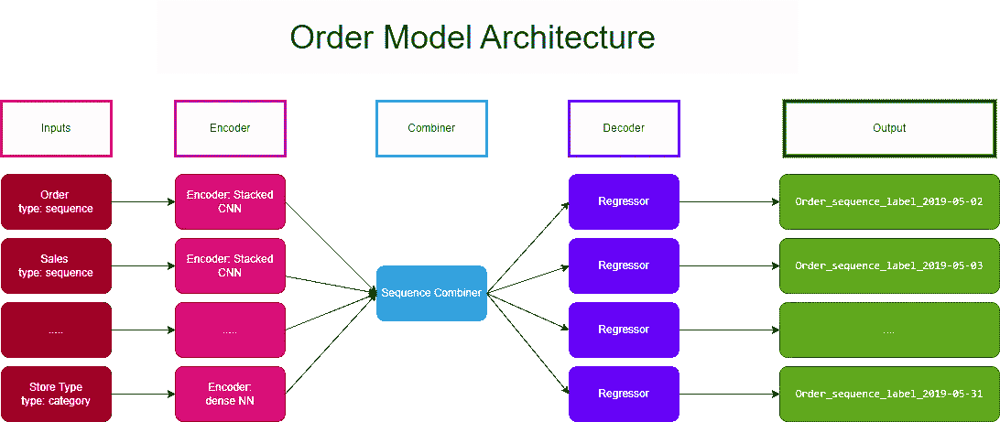
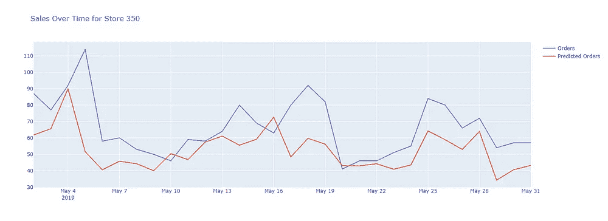
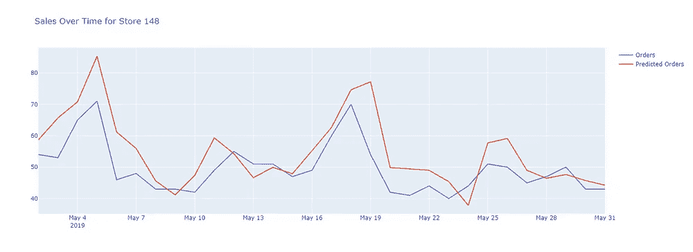
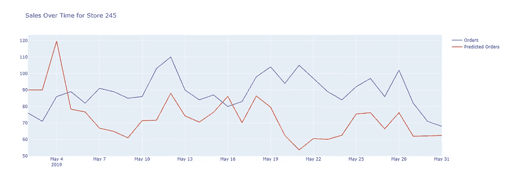
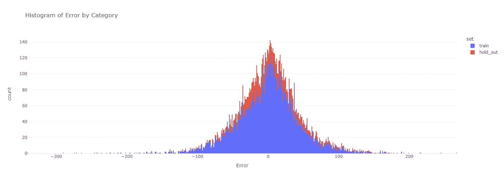
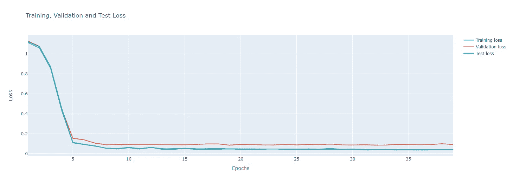

# Ludwig — 一个“更友好”的深度学习框架

> 原文：[`towardsdatascience.com/ludwig-a-friendlier-deep-learning-framework-946ee3d3b24`](https://towardsdatascience.com/ludwig-a-friendlier-deep-learning-framework-946ee3d3b24)

## 使用这个低代码、声明式框架让深度学习变得简单

[](https://johnadeojo.medium.com/?source=post_page-----946ee3d3b24--------------------------------)[](https://towardsdatascience.com/?source=post_page-----946ee3d3b24--------------------------------) [John Adeojo](https://johnadeojo.medium.com/?source=post_page-----946ee3d3b24--------------------------------)

·发表于 [Towards Data Science](https://towardsdatascience.com/?source=post_page-----946ee3d3b24--------------------------------) ·阅读时间 11 分钟·2023 年 6 月 26 日

--


图片来源：作者：使用 Midjourney 生成

# 背景 — 深度学习，是否过于复杂？

我一直倾向于避免将深度学习应用于行业用例。这并不是因为缺乏兴趣，而是因为我觉得流行的深度学习框架很繁琐。我欣赏 [Pytorch](https://pytorch.org/) 和 [TensorFlow](https://www.tensorflow.org/) 是用于研究目的的绝佳工具，但它们的 API 并不是最用户友好的。在需要为客户快速交付概念验证的情况下，我最不希望做的就是捣鼓 Pytorch 张量。

在伦敦参加 AI 峰会时，我偶然发现一个团队声称他们有解决我的深度学习问题的方案。他们采用了一种不同的方法，他们将其描述为“介于 TensorFlow 和 AutoML 之间的中点”，这是一个名为 Ludwig 的框架。

## 什么是 Ludwig？

Ludwig 是由 Uber 开发的，[Ludwig](https://ludwig.ai/latest/) 是一个用于构建深度学习模型的开源框架。它是声明式的，这意味着你无需像在 TensorFlow 中那样一层层构建复杂的模型，而是只需通过配置文件声明模型的结构。这听起来好得令人难以置信，所以我决定亲自体验一下。在这篇文章的其余部分，我将通过一个我从 [Kaggle](https://www.kaggle.com/datasets/shelvigarg/sales-forecasting-womart-store) 上获得的示例项目详细描述我对 Ludwig 的体验。在此过程中，我将讨论它的一些优点、痛点，并给出是否值得使用的结论。

*注意 — 尽管最初由 Uber 开发，Ludwig 是一个* [*开源*](https://github.com/ludwig-ai/ludwig/blob/master/LICENSE) *库，采用 Apache 2.0 许可证。该项目由* [*Linux Foundation AI & Data*](https://lfaidata.foundation/)*主办。我与 Uber 或 Ludwig 的开发者没有商业关系。*

# 项目 — 需求预测

**项目简介**：预测零售商 WOMart 各个门店的最后 30 天订单。

> 你的客户 WOMart 是领先的营养和补充品零售连锁店，提供全面的产品以满足你的健康和健身需求。
> 
> WOMart 遵循多渠道分销战略，在 100 多个城市拥有 350 多个零售店。

## 数据

数据集共有 22,265 个观察值，每个观察值对应于一个特定门店的一天销售数据。为了简洁起见，我不会详细介绍数据集的所有细节，但你可以在[这里](https://www.kaggle.com/datasets/shelvigarg/sales-forecasting-womart-store)查看一些描述性统计数据。

**注意**：数据在 Open Data Commons 许可证下可以用于任何目的。

+   数据的[链接](https://www.kaggle.com/datasets/shelvigarg/sales-forecasting-womart-store)

+   [数据许可证](https://opendatacommons.org/licenses/dbcl/1-0/)

**数据字典：**

# 方法论概述

我不会在这里详细介绍方法论，因为这不是本文的主要目的。我将高层次地介绍我如何框定问题，以便为你提供一些背景。

我将预测问题框定为一个“伪”序列到序列深度学习问题。这种方法涉及利用 360 天的时间序列数据点来预测接下来的 30 天的客户订单。我引入了一些分类变量，并且需要为每一天的订单生成单独的预测，这导致了一个略显非传统的设置——因此使用了“伪”序列到序列来描述这个问题。我将在本文后面详细讨论特征工程的具体细节。

除此之外，我遵循的方法论对于模型开发来说是标准的。我将数据分为训练数据集和保留数据集，并对特征和标签进行了重新缩放。模型训练在训练数据上进行，测试在保留数据上进行。

*注意：Ludwig 确实提供了在 API 中本地拆分数据的功能。然而，为了保持严谨性，我建立了一个单独的保留数据集。训练数据集随后被进一步划分为训练、验证和测试子集。保留数据集完全被排除，仅用于分析模型生成的预测。*

# 特征工程

在撰写本文时，我认为在 Ludwig 中进行时间序列预测的序列到序列建模是很棘手的。这是因为特征工程。Ludwig API 在处理序列作为输入方面表现出色，但它们尚未（还未）开发出对时间序列作为输出的连贯方法。你可以通过声明多个输出来开发一个“伪”序列到序列模型，但整体特征工程体验感觉相当“黑客”。

**序列特征**：除了那些随时间变化的特征外，我将所有预测特征工程为“Ludwig 格式”的序列。每个输入序列是每个“时间序列”特征在预定义时间范围内的水平堆叠。每个特征序列在商店级别确定，并封装在数据框的一个单元格中（看起来就像听起来那么乱）。

**序列标签**：对于序列标签，你必须将序列中的每一点声明为模型的单独标签。结果是我为每个商店声明了 30 个标签，每天一个标签，用于预测订单。

*下面是特征工程过程的示例：*

数据示例：粗体值将用于构造序列标签，常规值将用于构造序列特征。

特征工程示例：Order_sequence 是一个“Ludwig 格式”的序列。标签会被单独返回，以便后续声明为模型输出（标签）。

# 设计你的模型

Ludwig API 允许你通过声明方式构建相当复杂和可定制的模型。Ludwig 通过 .yaml 文件来实现这一点。现在，我知道许多数据科学家可能没有使用过*.yaml* 文件，但在软件开发中，这些文件通常用于配置。文件乍一看可能显得吓人，但实际上非常友好。让我们逐步了解一下我创建模型时使用的文件的主要部分。



作者提供的图像：模型架构

在深入配置之前，值得简要介绍一下 Ludwig 深度学习框架的核心架构：[架构](https://ludwig.ai/latest/user_guide/how_ludwig_works/)：编码器、组合器和解码器。你在 Ludwig 中配置的大多数模型将主要遵循这一架构。理解这一点可以简化堆叠组件的过程，从而快速构建你的深度学习模型。

## 声明你的模型

在文件的最上方，你声明所使用的模型类型。Ludwig 提供了两种选择：基于树的模型和深度神经网络，我选择了后者。

```py
model_type: ecd
```

## 声明数据拆分

你可以通过声明拆分百分比、拆分类型以及你要拆分的列或变量来本地拆分数据集。出于我的目的，我希望确保一个商店只能出现在一个数据集中，哈希拆分正好适合这一点。

最佳实践是，我建议在 Ludwig API 之外构建一个保留集，尤其是在进行初步特征工程（如独热编码或归一化）时。这有助于防止数据泄漏。

```py
model_type: ecd
split:
    type: hash
    column: Store_id
    probabilities:
    - 0.7
    - 0.15
    - 0.15
#...omitted sections...
```

## 声明模型输入

你通过名称、类型和编码器来声明输入。根据模型输入的类型，你有多种编码器选项。编码器本质上是一种将输入转换为模型可以解读的方式。编码器的选择实际上取决于数据和建模任务。

```py
model_type: ecd
split:
    type: hash
    column: Store_id
    probabilities:
    - 0.7
    - 0.15
    - 0.15
input_features:
  - name: Sales
    type: sequence
    encoder: stacked_cnn
    reduce_output: null
  - name: Order
    type: sequence
    encoder: stacked_cnn
    reduce_output: null
  - name: Discount
    type: sequence
    encoder: stacked_cnn
    reduce_output: null
  - name: DayOfWeek
    type: sequence
    encoder: stacked_cnn
    reduce_output: null
  - name: MonthOfYear
    type: sequence
    encoder: stacked_cnn
    reduce_output: null
  - name: Holiday
    type: sequence
    encoder: stacked_cnn
    reduce_output: null
  - name: Store_Type
    type: category
    encoder: dense
  - name: Location_Type
    type: category
    encoder: dense
  - name: Region_Code
    type: category
    encoder: dense
#...omitted sections...
```

## 声明组合器

[组合器](https://ludwig.ai/latest/configuration/combiner/)，顾名思义，用于合并你的编码器的输出。Ludwig API 提供了多种不同的组合器，每种都有其特定的使用场景。组合器的选择可能取决于模型的结构和特征之间的关系。例如，如果你想简单地将编码器的输出进行连接，可以使用“concat”组合器；如果你的特征有顺序关系，可以使用“sequence”组合器。

```py
model_type: ecd
split:
    type: hash
    column: Store_id
    probabilities:
    - 0.7
    - 0.15
    - 0.15
input_features:
  - name: Sales
    type: sequence
    encoder: stacked_cnn
    reduce_output: null
  - name: Order
    type: sequence
    encoder: stacked_cnn
    reduce_output: null 
  # ... omitted sections ...

  - name: Location_Type
    type: category
    encoder: dense
  - name: Region_Code
    type: category
    encoder: dense
combiner:
    type: sequence
    main_sequence_feature: Order
    reduce_output: null
    encoder:
    # ... omitted sections ...
```

与深度学习的许多方面一样，最佳的组合器选择通常取决于你的数据集和问题的具体情况，并可能需要一些实验。

## 声明模型输出

完成你的网络就像声明输出一样简单，输出就是你的标签。我对 Ludwig 的时间序列处理的一个小抱怨是，当前你无法（还）声明时间序列输出。正如我之前提到的，你必须通过单独声明时间序列中的每个点来“破解”它。这让我有了三十个单独的声明，说实话看起来非常杂乱。对于每个输出，你还可以指定损失函数，增加额外的可配置性。Ludwig 为不同的输出类型预设了大量选项，但我不确定你是否能够像在 Pytorch 中那样实现自定义损失函数。

```py
model_type: ecd
split:
    type: hash
    column: Store_id
    probabilities:
    - 0.7
    - 0.15
    - 0.15
input_features:
  - name: Sales
    type: sequence
    encoder: stacked_cnn
    reduce_output: null
  - name: Order
    type: sequence
    encoder: stacked_cnn
    reduce_output: null
# ...omitted sections...

  - name: Location_Type
    type: category
    encoder: dense
  - name: Region_Code
    type: category
    encoder: dense
combiner:
    type: sequence
    main_sequence_feature: Order
    reduce_output: null
    encoder:
        type: parallel_cnn
output_features:
  - name: Order_sequence_label_2019-05-02
    type: number
    loss:
      type: mean_absolute_error
  - name: Order_sequence_label_2019-05-03
    type: number
    loss:
      type: mean_absolute_error
#...omitted sections...

      type: mean_absolute_error
  - name: Order_sequence_label_2019-05-30
    type: number
    loss:
      type: mean_absolute_error
  - name: Order_sequence_label_2019-05-31
    type: number
    loss:
      type: mean_absolute_error
#...omitted sections...
```

## 声明训练器

Ludwig 的训练器配置虽然是可选的（因为 Ludwig 提供了合理的默认设置），但允许高度的自定义。这让你能够控制模型训练的具体细节。这包括指定所用优化器的类型、训练轮数、学习率以及早停标准等参数。

```py
model_type: ecd
split:
    type: hash
    column: Store_id
    probabilities:
    - 0.7
    - 0.15
    - 0.15
input_features:
  - name: Sales
    type: sequence
    encoder: stacked_cnn
    reduce_output: null
  - name: Order
    type: sequence
    encoder: stacked_cnn
    reduce_output: null
# ...omitted sections...

  - name: Location_Type
    type: category
    encoder: dense
  - name: Region_Code
    type: category
    encoder: dense
combiner:
    type: sequence
    main_sequence_feature: Order
    reduce_output: null
    encoder:
        type: parallel_cnn
output_features:
  - name: Order_sequence_label_2019-05-02
    type: number
    loss:
      type: mean_absolute_error
  - name: Order_sequence_label_2019-05-03
    type: number
    loss:
      type: mean_absolute_error
#...omitted sections...

      type: mean_absolute_error
  - name: Order_sequence_label_2019-05-30
    type: number
    loss:
      type: mean_absolute_error
  - name: Order_sequence_label_2019-05-31
    type: number
    loss:
      type: mean_absolute_error
trainer:
    epochs: 200
    learning_rate: 0.0001
    early_stop: 20
    evaluate_training_set: true
    validation_metric: mean_absolute_error
    validation_field: Order_sequence_label_2019-05-31
```

对于你的特定用例，你可能会发现自己定义这些参数会更有益。例如，你可能希望根据模型的复杂性和数据集的大小调整学习率或训练轮数。同样，早停可以成为防止过拟合的有用工具，通过在模型在验证集上的表现不再改善时停止训练过程。

## 训练你的模型

训练你的模型可以通过 Ludwig 的 Python 实验 API 轻松完成。请参见下面的脚本示例：

## 其他配置

除了我提到的，Ludwig 还有大量可能的配置。它们都记录得很好且结构清晰。我建议阅读他们的 [文档](https://ludwig.ai/latest/configuration/) 来熟悉它们。

# 模型性能分析——简要视图

本文旨在通过一个实际的示例项目来探讨 Ludwig 框架的一些功能。虽然展示模型性能是其中的一部分，但无需深入探讨指标的细节。我将讨论限制在展示一些从模型分析中生成的图表。请注意，全面的端到端脚本在我的 GitHub 上可以找到，链接在文章结尾。



作者提供的图片：过去 30 天的数据中，模型预测（红色）与实际订单（蓝色）的对比。这些例子来自保留集。



作者提供的图片：误差分布，其中误差为实际订单减去预测订单。



作者提供的图片：模型训练的损失曲线。损失指标为均方绝对误差

# 我的判决

我将首先承认，最初我对 Ludwig 持怀疑态度。然而，在自己实验之后，我相信它的能力，并认为它如承诺般有效。我认为有几个真正令人印象深刻的功能值得突出。

**编码体验**：编码体验更像是在构建一个精致的乐高模型。你可以通过玩弄组件和不同的架构来找到你的完美模型，确实非常有趣。

**文档**：文档清晰且结构良好。很容易搞清楚如何实现不同的架构和更改模型配置。大部分文档似乎也很及时更新，这是一大优势。

**后端**：后端体验非常出色。库的开发者在抽象掉训练深度神经网络所需的大部分常规配置方面做得很好。我在 Google Collab 上训练了我的模型，Ludwig 自动将工作负载转移到 GPU 上。

Ludwig 还有一个很棒的特点，就是后端高度可配置。例如，如果你在运行大规模工作负载并需要一个 GPU 集群，你也可以进行配置！

**实验追踪**：Ludwig 提供了一个实验 API，可用于在实验运行之间跟踪模型工件。我相信它也与 MLflow 集成，这对于商业规模的 MLOps 来说非常棒。

## 个人偏好

有一些领域可以进一步增强这个框架，让我们一起来探讨一下。

**可视化**：Ludwig 确实提供了一个可视化 API 来跟踪数据集中的训练损失。然而，在撰写本文时，它的功能并不特别好，其使用也不够直观。我尝试在 Google Collab 中运行，但没有成功。最终，我通过编写一个 Python 函数来解析 Ludwig 在每次实验运行后保存的 training_statistics.json 文件，创建了自己的损失曲线可视化。

**支持**：虽然有一定的支持可用，但 Ludwig 的社区似乎还没有 TensorFlow 或 Pytorch 那么广泛。在 GitHub 上提出了一些问题，有些线程可能提供帮助，但大部分情况下，感觉你只能依靠自己。至于 ChatGPT，它提供了截至 2021 年的一定程度的支持。

**透明度**：Ludwig 在消除构建深度学习模型中更具挑战性的方面表现出色。然而，这也以牺牲透明度为代价，偶尔使日志显得有些难以理解和调试。

# 结论

在我看来，Ludwig 是一个出色的工具，适合那些希望开始使用深度学习的人，无论是在商业环境中还是仅仅为了学习。虽然它可能对前沿研究目的来说过于高层次，但它非常适合快速解决明确定义的问题。尽管仍然需要对深度学习有一定的理解，但一旦掌握了概念，Ludwig 的入门门槛比 TensorFlow 或 Pytorch 低得多。

端到端的笔记本可以在我的 [GitHub](https://github.com/john-adeojo/womartdata/blob/main/ludwig_deep_learning_notebook%20(2).ipynb) 仓库中找到，请随意进行实验。

*关注我在* [*LinkedIn*](https://www.linkedin.com/in/john-adeojo/)

*订阅 Medium 以获取更多我的见解：*

[](https://johnadeojo.medium.com/membership?source=post_page-----946ee3d3b24--------------------------------) [## 通过我的推荐链接加入 Medium — John Adeojo

### 我分享数据科学项目、经验和专业知识，以助你一臂之力。你可以通过 Medium 注册…

johnadeojo.medium.com](https://johnadeojo.medium.com/membership?source=post_page-----946ee3d3b24--------------------------------)

*如果你有兴趣将 AI 或数据科学集成到业务运营中，我们邀请你预约一次免费的初步咨询：*

[](https://www.data-centric-solutions.com/book-online?source=post_page-----946ee3d3b24--------------------------------) [## 在线预约 | 数据驱动解决方案

### 通过免费的咨询发现我们在帮助企业实现雄心勃勃目标方面的专业知识。我们的数据科学家和…

www.data-centric-solutions.com](https://www.data-centric-solutions.com/book-online?source=post_page-----946ee3d3b24--------------------------------)
