# 机器学习算法第一部分：线性回归

> 原文：[`towardsdatascience.com/machine-learning-algorithms-part-1-linear-regression-a7079238edc9?source=collection_archive---------13-----------------------#2023-01-06`](https://towardsdatascience.com/machine-learning-algorithms-part-1-linear-regression-a7079238edc9?source=collection_archive---------13-----------------------#2023-01-06)

## 使用线性回归预测钻石价格

[](https://medium.com/@rohankvij?source=post_page-----a7079238edc9--------------------------------)[](https://towardsdatascience.com/?source=post_page-----a7079238edc9--------------------------------) [Rohan Vij](https://medium.com/@rohankvij?source=post_page-----a7079238edc9--------------------------------)

·

[关注](https://medium.com/m/signin?actionUrl=https%3A%2F%2Fmedium.com%2F_%2Fsubscribe%2Fuser%2Fe44b36765084&operation=register&redirect=https%3A%2F%2Ftowardsdatascience.com%2Fmachine-learning-algorithms-part-1-linear-regression-a7079238edc9&user=Rohan+Vij&userId=e44b36765084&source=post_page-e44b36765084----a7079238edc9---------------------post_header-----------) 发表在 [Towards Data Science](https://towardsdatascience.com/?source=post_page-----a7079238edc9--------------------------------) · 12 分钟阅读 · 2023 年 1 月 6 日[](https://medium.com/m/signin?actionUrl=https%3A%2F%2Fmedium.com%2F_%2Fvote%2Ftowards-data-science%2Fa7079238edc9&operation=register&redirect=https%3A%2F%2Ftowardsdatascience.com%2Fmachine-learning-algorithms-part-1-linear-regression-a7079238edc9&user=Rohan+Vij&userId=e44b36765084&source=-----a7079238edc9---------------------clap_footer-----------)

--

[](https://medium.com/m/signin?actionUrl=https%3A%2F%2Fmedium.com%2F_%2Fbookmark%2Fp%2Fa7079238edc9&operation=register&redirect=https%3A%2F%2Ftowardsdatascience.com%2Fmachine-learning-algorithms-part-1-linear-regression-a7079238edc9&source=-----a7079238edc9---------------------bookmark_footer-----------)

图片由 [Bas van den Eijkhof](https://unsplash.com/@basvde?utm_source=medium&utm_medium=referral) 提供，发布在 [Unsplash](https://unsplash.com/?utm_source=medium&utm_medium=referral)

线性回归是一种强大但相对简单的工具，可以用来理解变量之间的关系。本教程将以初学者友好的方式探索线性回归的基础知识。在本教程结束时，你将对线性回归有一个扎实的理解，并知道如何使用实际数据实现它。

# **什么是线性回归？**

线性回归，作为一种统计方法，首次用于 1877 年，用于预测因变量的值。实质上，它通过对提供给模型的多个点进行“拟合”来最准确地匹配因变量和自变量之间的关系，这类似于散点图。通过图表最容易观察到这一点：

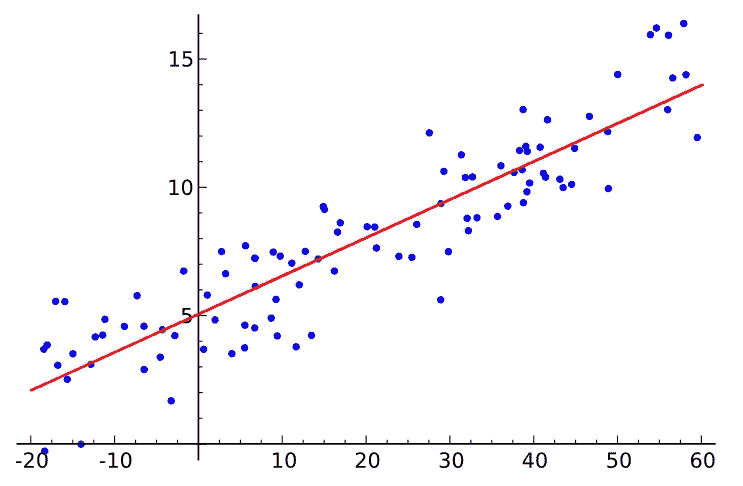

来源：[维基百科](https://en.wikipedia.org/wiki/File:Linear_regression.svg)。

线性回归通过创建一条线性直线（形式为`y=mx+b`）来最准确地预测因变量的值，通过求解值`m`（斜率）和`b`（y 截距）。

# 最小二乘法

为此，模型使用了一种称为最小二乘法的方法，以最准确地找到最佳拟合线。该方法的目标是尽可能减少特定数据点到最拟合线的偏差平方总和。最拟合的直线将具有最小的最小二乘函数结果值。我们可以使用以下方程计算从每个提供的点到最拟合线的偏差：

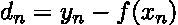

图像由作者提供。

实质上，线性函数的输出因变量（y 值）从给定数据点的因变量中减去。这个值可以是正数也可以是负数，取决于函数的值是否大于或小于数据点的值。然而，偏差是正还是负并不重要——无论如何，数值都会被平方。

更简单地说，我们可以用一个总和来找到所有偏差平方的总值：

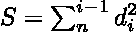

图像由作者提供。

最小二乘法声称，最准确/拟合的数据线将具有最小的总和（`S`）。

## 示例

使用点：`(1,2), (3,5), (5,2)`。

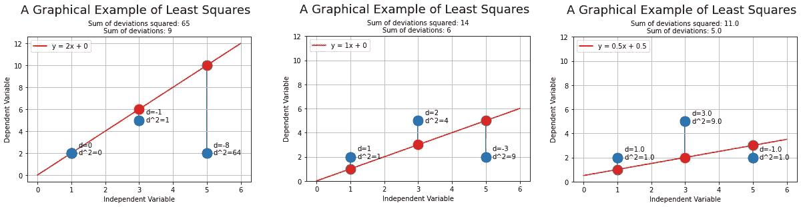

图像由作者提供。

现在是提到为什么最小二乘法中的值被平方的好时机。首先，如前所述，它确保所有偏差都是正值。然而，更重要的是，它确保较大的偏差被赋予更多的权重。这使得拟合线能够更多地关注异常值。

以最左边的图为例。我们可以看到，从直线到前两个数据点的偏差要么是 0，要么可以忽略不计。相比之下，其他两个图的直线在平均上更接近数据点。比较原始（未平方的）偏差值时，我们可以看到它们彼此相当接近。比较平方偏差值时，我们可以看到最左边的图的偏差比右边的图大 600%以上。这是因为较大的偏差受到的惩罚更大，这意味着异常值对最终直线的影响更大。

# 使用最小二乘法

最小二乘法可以通过两种方式实现。虽然使用矩阵运算是计算效率最高、最广泛使用的方法，我们将探讨使用梯度下降来寻找最佳直线。梯度下降是一种优化算法，我们将在其中计算和的导数，然后根据导数指示的方向调整系数值。这个过程会重复进行，直到找到最优解。这只是梯度下降的简要概述；请关注将为不懂微积分的人解释梯度下降的文章。

## MSE 与 SSE

我们将使用均方误差（**M**ean of **S**quared **E**rrors）作为我们的成本函数。基本上，我们想要最小化这个成本函数的值，以输出最拟合的直线。之前，我们使用 SSE（平方误差和）来确定哪条直线最适合其数据点。MSE 相当直观——它与 SSE 相同，但我们将最终的和除以数据点的数量：

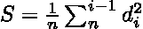

作者提供的图片。

MSE 比 SSE 更受欢迎，有很多原因。

首先，均方误差（MSE）比平方误差和（SSE）对离群点的敏感度更低。由于 MSE 通过数据点的数量来归一化误差，离群点的影响较小。假设数据集中的误差为`1, 4, 1, 25`。离群点（25）只占通过 MSE 计算误差的 25%。因此，MSE 将是`7.75`。SSE 将是`31`。

其次，使用 MSE 也允许比较不同直线的拟合度，即使它们使用的数据点数量不同。例如，考虑使用不同数量数据点的两个模型，模型 A 和模型 B。如果模型 A 使用 100 个数据点，模型 B 使用 50 个数据点，大多数情况下模型 A 将有更高的 SSE。然而，如果通过使用 MSE 来归一化误差，无论模型使用多少数据点，这些模型都可以直接进行比较。

上述因素的结合意味着 MSE 比 SSE 更易于解释。数据集中的离群点可能会使一个模型看起来比另一个模型显著更好，如果它们使用 SSE 进行比较，即使该模型可能更好地拟合大多数数据点。

# 代码时间！

有了我们对线性回归的所有知识，我们现在可以使用 Python 自行实现它！

## 开始使用

对于本教程，你需要：

+   Python（版本 3.7 或更高）— 推荐有基础经验

（安装教程：[`www.tutorialspoint.com/how-to-install-python-in-windows`](https://www.tutorialspoint.com/how-to-install-python-in-windows)）

然后，在你的终端中使用`pip`安装三个包：

+   `pip install notebook`

+   `pip install numpy`

+   `pip install matplotlib`

在终端中运行`jupyter notebook`。你的默认网页浏览器会打开一个选项卡，在其中你会看到文件资源管理器。简单地进入你希望创建程序的目录，然后创建一个 Python 3 Notebook（在右上角选择`new`）。你现在应该会看到以下界面：


图片由作者提供。

你可以通过点击“Untitled”来重命名文件。

## 初始数据

我们将开始导入 Python 库 NumPy，它在对数字数组进行数学操作时非常有用。然后，我们将定义点的 NumPy 数组，并将斜率和截距变量初始化为 0。看这些点，很容易推断出这些点的最适合的线是`y=1x+0`。我们使用这样的可预测值，以便对模型进行基准测试。

```py
# Importing numpy for number processing
import numpy as np

# Define the data points as a matrix, where each row represents a data point
# and each column represents a variable
points = np.array([(1, 1), (2, 2), (3, 3)])

# Defining initial values for the slope and y-intercept of the line
slope = 0
intercept = 0
```

按`alt` + `enter`来创建一个新单元格。

## 线性函数

由于我们在执行线性回归，拥有一个可以评估线性函数的函数是有用的：

```py
def result_of_function(independent_variable, slope, intercept):
    """
    Function to model y=mx+b

    :param slope: the slope of the linear function (m)
    :param intercept: the y-intercept of the linear function (b)
    :param independent_variable: the independent variable (x value) being inputted into the linear function (x)

    :returns: the value of the dependent variable of the function (y)
    """
    return independent_variable * slope + intercept
```

按`alt` + `enter`来创建一个新单元格。

## 成本函数

包含一个成本函数来衡量我们回归的有效性也会有帮助：

```py
def cost_function(x, y, slope, intercept):
    """
    Calculate the mean squared error of a linear function with given parameters.

    :param x: The independent variable (x-values) of the data points.
    :param y: The dependent variable (y-values) of the data points.
    :param slope: The slope of the linear function.
    :param intercept: The y-intercept of the linear function.

    :returns: The mean squared error of the linear function.
    """

    # Predict the y-values using the given slope and intercept
    y_preds = result_of_function(x, slope, intercept)

    # Calculate the squared errors between the predicted and actual y-values
    squared_errors = (y_preds - y)**2

    # Return the mean of the squared errors
    return squared_errors.mean()
```

按`alt` + `enter`来创建一个新单元格。

## 梯度下降

我们将开始定义我们的输入和输出值（x 坐标和 y 坐标）：

```py
# Define the input and output data
X = np.array(points[:, 0])
Y = np.array(points[:, 1])
```

最后，我们将实现梯度下降：

```py
alpha = 0.01

# Iterate for a 1000 of epochs
for i in range(1000):
  # Calculate the gradients of J with respect to the slope and intercept
  grad_slope = -2 * ((Y - result_of_function(X, slope, intercept)) * X).mean()
  grad_intercept = -2 * ((Y - result_of_function(X, slope, intercept))).mean()

  # Update m and b using the gradients and the learning rate
  slope -= alpha * grad_slope
  intercept -= alpha * grad_intercept

  print(cost_function(X, Y, slope, intercept))

# Print the final values of m and b
print(f'Final values: slope = {slope}, intercept = {intercept}')
```

如果这不太有意义，别担心——梯度下降过于复杂，无法在本文中深入解释，所以请留意一篇解释梯度下降的文章，特别是对于不懂微积分的读者！

但你理解周期是很重要的。也就是说，这一行：

```py
for i in range(1000):
  # code
```

一个周期基本上是梯度下降程序的一次迭代。在每次迭代中，线性函数的斜率和截距会使用梯度下降计算中的数学公式进行调整。运行的周期越多，值调整和微调得越多。

运行此程序后，你应该得到以下斜率和截距值：

```py
Final values: slope = 0.98539125301466, intercept = 0.033209115678908344
```

如果我们运行更多周期，这些值会更接近 1 和 0。然而，这些值已经非常接近预期结果。

从图形上看，结果如下：

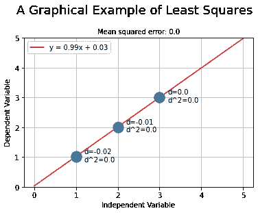

图片由作者提供。

# 结果分析

最终的均方误差（MSE）是`0.00015821003618271694`——这是一个极低的值。然而，如果我们将 MSE 图形化显示每个周期（或迭代），我们将得到以下图表：

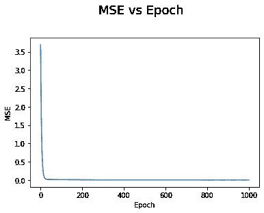

图片由作者提供。

这些似乎是非常、非常小的收益。实际上，在第 25 个周期左右，MSE 似乎完全没有变化！让我们从不同的角度看这个图，省略前 50 个周期：

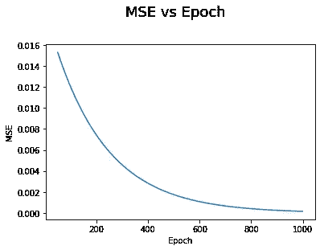

图片由作者提供。

看似直线的并非直线——从第 50 个 epoch 到第 1000 个 epoch，MSE 几乎减小了 100 倍。你可能会问——MSE 约 0.015 不是已经够低了吗？让我们尝试再次运行梯度下降，但这次只用 50 个 epochs：

```py
Final values: slope = 0.8539016923117737, intercept = 0.32575579906831564
```

接近，但还不够接近：

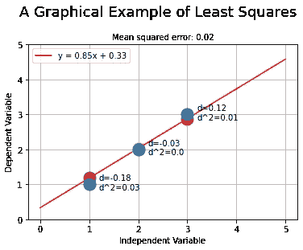

作者提供的图片。

相反，让我们用 100,000 个 epochs 运行梯度下降：

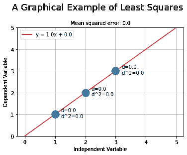

作者提供的图片。

完美！似乎运行 100,000 个 epochs 的模型给出了几乎完美的结果。虽然用更多的 epochs 运行线性回归可以提高模型的准确性，但重要的是要考虑准确性和时间之间的平衡。一般来说，您应该使用足够的 epochs 来拟合模型的数据，但不要使用过多，以至于模型训练的时间不必要地延长。通常在各种模型中使用一种叫做早期停止的技术，当模型达到一定的准确性时会自动停止。这允许模型尽可能快地训练，但仍确保一定的准确性。

# 应用线性回归

最后但同样重要的是，是时候将我们的线性回归知识应用到实际数据上了！

## 查找数据集

让我们从寻找数据集开始。[Kaggle](https://www.kaggle.com/)是一个很好的资源，可以找到高质量且在结构或主题上各异的免费数据集。对于这个小项目，我选择使用[钻石数据分析数据集](https://www.kaggle.com/datasets/swatikhedekar/price-prediction-of-diamond)，以便开发钻石克拉（自变量）与其价格（因变量）之间的线性关系。

## 选择数据集

通常，在选择或构建用于线性回归的数据集时，需要考虑以下因素：

1.  自变量和因变量之间的强线性相关性——如果这些变量似乎没有相关性，或其相关性是非线性的，可能需要选择不同的回归方法。

1.  异常值——一个好的数据集应该相对没有异常值，因为它们会严重影响回归的性能。

1.  适用性——数据集必须与您试图解决的问题相关。例如，如果您想根据房屋的平方英尺预测纽约市的房价，那么用蒙大拿乡村农场的数据来训练模型就不合适。

## 下载数据集

在 Kaggle 上下载数据集非常直观。点击屏幕右上角的黑色下载按钮，将`.zip`文件保存到计算机上。然后解压缩文件，将其中的`.csv`文件移动到与 Jupyter Notebook 文件相同的目录中。

## 实施

现在，剩下的就是使用数据进行线性回归模型。再次地，在这个实例中，我们将根据钻石的克拉数预测价格。注释掉以下行：

```py
X = np.array(points[:, 0])
Y = np.array(points[:, 1])
```

用以下内容替换它们：

```py
diamond_data = np.genfromtxt('diamonds.csv', delimiter=',')
Y = diamond_data[1:][:, 7] # Costs of the diamonds
X = diamond_data[1:][:, 1] # Carats of the diamonds
```

运行程序（1000 个周期）后的输出结果是：

```py
Final values: slope = 7756.425617968576, intercept = -2256.3605800455275
```

最终的 MSE 是：

```py
2397955.0500126793
```

哇！这是一个极其庞大的数字。诚然，我们使用的钻石数据集存在缺陷。图上的线性回归是：

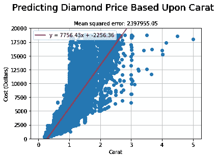

图片由作者提供。

以 1 克拉钻石的不同价格为例，它的价格范围可以从 ~$1000 到近$20,000！这是一个典型的例子，说明这个数据集在*两个*变量之间的线性关系不足。在这种情况下，钻石的切工、颜色和清晰度也都对价格产生了重大影响。同时，需要考虑的是，现实世界的数据中，MSE 为 0 几乎是不可能的。现实世界现象受到众多因素的影响，捕捉所有这些因素并在回归模型中反映出来几乎是不可能的。留给读者作为练习的是探索 Kaggle 上更强的两个给定变量之间的线性相关性数据集。

## 测试

让我们来测试一下我们的模型。根据[CreditDonkey](https://www.creditdonkey.com/1-carat-diamond.html)，1 克拉钻石的最佳价值在$4500 到$6000 之间。使用以下`code`：

```py
carat = 1
function_result = result_of_function(carat, slope, intercept)

print(f"A {carat}-carat diamond will cost: ${round(function_result, 2)}")
```

模型输出结果：

```py
A 1-carat diamond will cost: $5488.47
```

成功！

# 结论

总结一下——线性回归是一种统计方法，用于理解两个线性相关变量之间的关系。这是通过将一条形式为`y=mx+b`的直线拟合到提供的自变量和因变量上来完成的。通过使用称为最小二乘法的方法，可以找到最适合的直线，该方法最小化每个点到其对应直线上的点的平方偏差之和。最小二乘法可以通过矩阵运算和梯度下降来实现，本文重点介绍了梯度下降的应用。使用 MSE 成本函数（即平方误差的均值）来确定模型的准确性。通过最小化 MSE，我们可以优化模型并提高其准确性。

我给你留下了一个令人满意的 GIF，展示了模型逐渐收敛到最适合的直线：

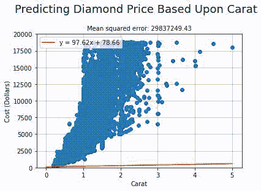

图片由作者提供。

谢谢你的阅读！
