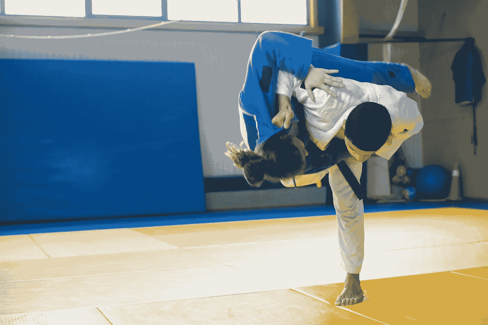

# 用于柔术的机器学习

> 原文：[`towardsdatascience.com/machine-learning-for-jiu-jitsu-94a0b44f57ab?source=collection_archive---------6-----------------------#2023-03-13`](https://towardsdatascience.com/machine-learning-for-jiu-jitsu-94a0b44f57ab?source=collection_archive---------6-----------------------#2023-03-13)

*照片来源：Kampus Production，来自 Pexels:* [*https://www.pexels.com/photo/a-judoka-throwing-an-opponent-to-the-ground-6765024/*](https://www.pexels.com/photo/a-judoka-throwing-an-opponent-to-the-ground-6765024/*)

## 使用 mediapipe 的姿态估计来跟踪柔术动作

 [Lucas Soares](https://lucas-soares.medium.com/?source=post_page-----94a0b44f57ab--------------------------------)

·

[关注](https://medium.com/m/signin?actionUrl=https%3A%2F%2Fmedium.com%2F_%2Fsubscribe%2Fuser%2F3d4826ca4d12&operation=register&redirect=https%3A%2F%2Ftowardsdatascience.com%2Fmachine-learning-for-jiu-jitsu-94a0b44f57ab&user=Lucas+Soares&userId=3d4826ca4d12&source=post_page-3d4826ca4d12----94a0b44f57ab---------------------post_header-----------) 发表在 [Towards Data Science](https://towardsdatascience.com/?source=post_page-----94a0b44f57ab--------------------------------) ·18 分钟阅读·2023 年 3 月 13 日

--

# **姿态跟踪以提升柔术技能**

巴西柔术是一种因其在实际战斗中的有效性和适用性而最近变得非常受欢迎的武术。

我已经练习巴西柔术超过 10 年，并决定将我对武术和机器学习的兴趣结合起来，创建一个处于这两个非常有趣领域交集的项目。

因此，我转向了[姿态估计](https://en.wikipedia.org/wiki/3D_pose_estimation)，作为一个有前景的技术，以作为辅助工具帮助我在柔术中的发展。

***在本文中，我想与您分享如何使用姿态追踪来增强在进行格斗动作时的反馈修正。***

如果您更喜欢视频，可以在这里查看我关于此主题的 YouTube 视频：

# **什么是姿态追踪？**
