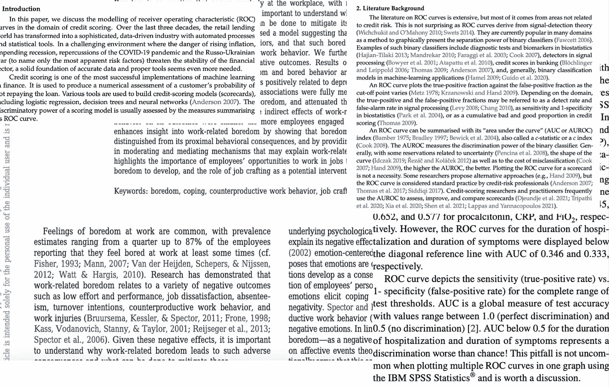

# 机器学习，插图版：分类评估指标

> 原文：[`towardsdatascience.com/machine-learning-illustrated-classification-evaluation-metrics-dfc33b373c43?source=collection_archive---------3-----------------------#2023-04-20`](https://towardsdatascience.com/machine-learning-illustrated-classification-evaluation-metrics-dfc33b373c43?source=collection_archive---------3-----------------------#2023-04-20)

## 一份全面的（且色彩丰富的）指南，帮助你了解评估分类模型所需的所有知识

 [Shreya Rao](https://medium.com/@shreya.rao?source=post_page-----dfc33b373c43--------------------------------)

·

[关注](https://medium.com/m/signin?actionUrl=https%3A%2F%2Fmedium.com%2F_%2Fsubscribe%2Fuser%2F99b63de2f2c3&operation=register&redirect=https%3A%2F%2Ftowardsdatascience.com%2Fmachine-learning-illustrated-classification-evaluation-metrics-dfc33b373c43&user=Shreya+Rao&userId=99b63de2f2c3&source=post_page-99b63de2f2c3----dfc33b373c43---------------------post_header-----------) 发表在 [Towards Data Science](https://towardsdatascience.com/?source=post_page-----dfc33b373c43--------------------------------) ·12 min read·2023 年 4 月 20 日

--

在我的学习过程中，我意识到自己是一个非常视觉型的学习者，我很欣赏用颜色和有趣的插图来学习新概念，尤其是那些通常以这种方式解释的科学概念：

从我之前的文章中，通过大量可爱的评论和消息（感谢你们所有的支持！），我发现有几个人与这种情感产生了共鸣。因此，我决定启动一个新系列，尝试阐述机器学习和计算机科学的概念，希望能使学习变得有趣。所以，系好安全带，享受旅程吧！

让我们从探讨一个机器学习的基本问题开始这个系列：**我们如何评估分类模型的性能**？

在之前的文章中，如[决策树分类](https://medium.com/towards-artificial-intelligence/decision-tree-classification-explain-it-to-me-like-im-10-59a53c0b338f)和[逻辑回归](https://medium.com/towards-data-science/back-to-basics-part-tres-logistic-regression-e309de76bd66)，我们讨论了如何构建分类模型。然而，量化这些模型的性能至关重要，这引出了一个问题：我们应该使用哪些指标来进行评估？

为了说明这个概念，让我们构建一个**贷款偿还分类模型**。
