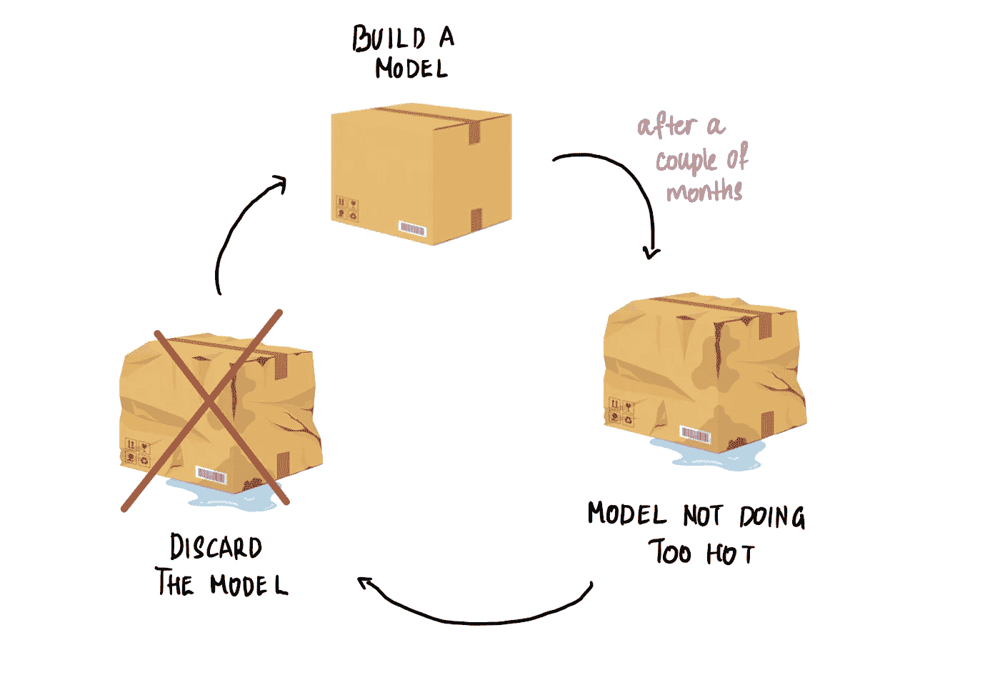

# 机器学习，图解：增量学习

> 原文：[`towardsdatascience.com/machine-learning-illustrated-incremental-machine-learning-4d73747dc60c?source=collection_archive---------4-----------------------#2023-09-15`](https://towardsdatascience.com/machine-learning-illustrated-incremental-machine-learning-4d73747dc60c?source=collection_archive---------4-----------------------#2023-09-15)

## 模型如何随着时间的推移学习新信息，同时保持和扩展先前的知识

 [Shreya Rao](https://medium.com/@shreya.rao?source=post_page-----4d73747dc60c--------------------------------)

·

[关注](https://medium.com/m/signin?actionUrl=https%3A%2F%2Fmedium.com%2F_%2Fsubscribe%2Fuser%2F99b63de2f2c3&operation=register&redirect=https%3A%2F%2Ftowardsdatascience.com%2Fmachine-learning-illustrated-incremental-machine-learning-4d73747dc60c&user=Shreya+Rao&userId=99b63de2f2c3&source=post_page-99b63de2f2c3----4d73747dc60c---------------------post_header-----------) 发表在 [Towards Data Science](https://towardsdatascience.com/?source=post_page-----4d73747dc60c--------------------------------) ·7 分钟阅读·2023 年 9 月 15 日

--

欢迎回到《图解机器学习》系列。如果你读过系列中的其他[文章](https://medium.com/@shreya.rao/list/machine-learning-illustrated-dfb4532491ff)，你会知道我们的方式。我们将一个（*听起来有点无聊*）的机器学习概念通过插图来呈现得有趣！本文将介绍一个叫做**增量学习**的概念，在这种学习方式中，机器学习模型随着时间的推移学习新信息，同时保持和扩展先前的知识。但在深入讨论之前，让我们先谈谈今天模型构建的过程是什么样的。

在构建模型时，我们通常遵循一种称为**静态学习**的过程。在这个过程中，我们使用最新的数据来训练模型。我们在训练过程中对模型进行调整和优化。一旦对其性能感到满意，就会部署该模型。这个模型会在生产环境中运行一段时间。然后我们注意到模型的性能随着时间的推移而变差。此时，我们就会丢弃现有的模型，使用最新的数据重新构建一个新的模型。然后，我们不断重复这个过程。

让我们通过一个具体的例子来说明这个问题。考虑一下这个假设情景。我们在 2023 年 1 月底开始构建一个欺诈检测模型。这个模型用来检测是否发生了欺诈行为……
