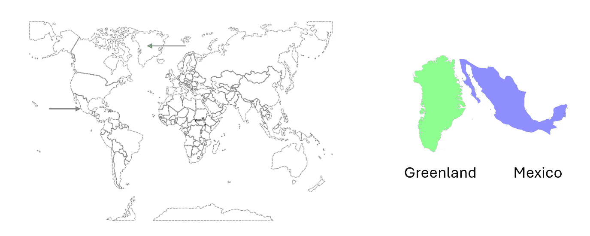
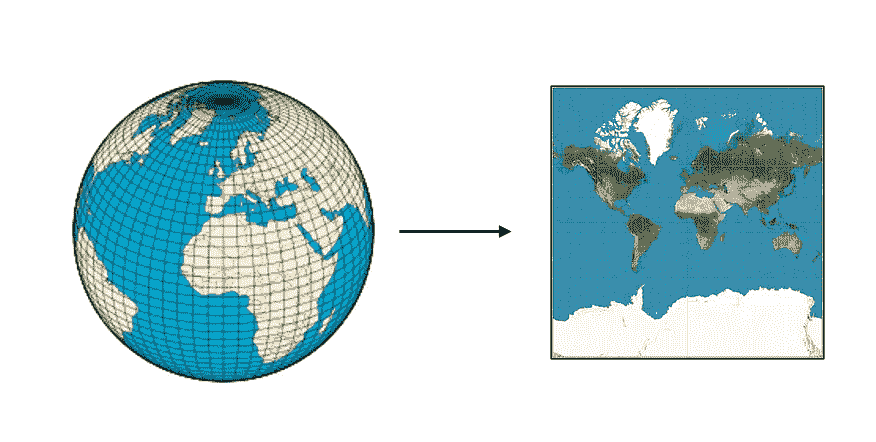
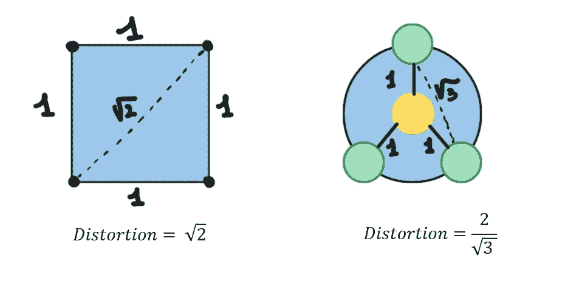
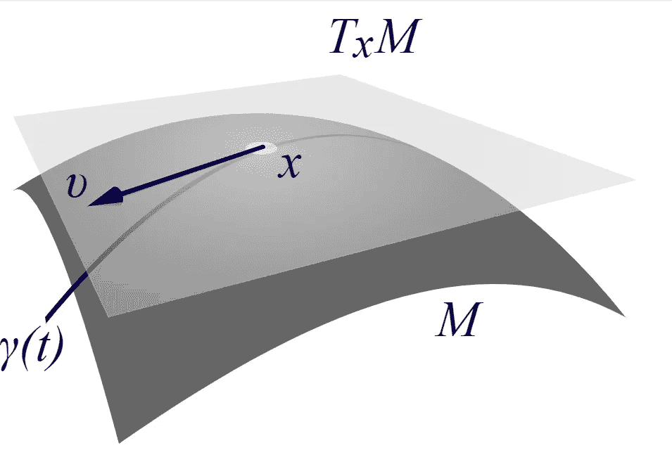
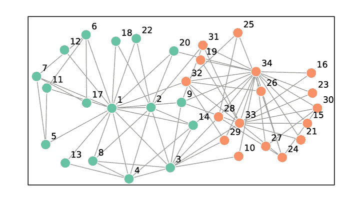

# 非欧几里得空间中的机器学习

> 原文：[`towardsdatascience.com/machine-learning-in-a-non-euclidean-space-99b0a776e92e`](https://towardsdatascience.com/machine-learning-in-a-non-euclidean-space-99b0a776e92e)

图片来源：[Greg Rosenke](https://unsplash.com/@greg_rosenke?utm_source=medium&utm_medium=referral) 在 [Unsplash](https://unsplash.com/?utm_source=medium&utm_medium=referral)

## 第一章：为什么你应该学习非欧几里得机器学习

 [Mastafa Foufa](https://medium.com/@mastafa.foufa?source=post_page-----99b0a776e92e--------------------------------)

·发表于 [Towards Data Science](https://towardsdatascience.com/?source=post_page-----99b0a776e92e--------------------------------) ·阅读时间 10 分钟·2023 年 6 月 16 日

--

> “我们的舒适和熟悉的欧几里得空间及其线性结构是否总是适合机器学习？近期研究对此提出了不同的看法：并非总是必要，有时甚至有害，这一点在一系列令人兴奋的工作中得到了证明。自从两年前提出双曲表示法用于层次数据以来，取得了重大进展，产生了非欧几里得空间表示的新思想、新算法和模型，以及对非欧几里得机器学习基本功能的新视角。” *作者* [*Fred Sala*](http://stanford.edu/~fredsala)*、* [*Ines Chami*](http://web.stanford.edu/~chami/)*、* [*Adva Wolf*](https://mathematics.stanford.edu/people/adva-wolf)*、* [*Albert Gu*](http://web.stanford.edu/~albertgu/)*、* [*Beliz Gunel*](http://web.stanford.edu/~bgunel/) *和* [*Chris Ré*](https://cs.stanford.edu/people/chrismre/)， [2019](https://dawn.cs.stanford.edu/2019/10/10/noneuclidean/)

## 你将在本文中学到什么。

+   扭曲度量了在将数据表示为另一个空间时距离保留的效果。

+   对于某些数据，欧几里得空间会产生较高的扭曲，因此使用像球面或双曲空间这样的非欧几里得空间。

+   黎曼几何工具如流形和黎曼度量被用于非欧几里得机器学习。

+   流形是局部上欧几里得的曲面。

+   指数映射和对数映射用于从流形到其切空间的转换。

+   黎曼度量允许在流形上计算最短距离。

在继续阅读本系列关于应用于机器学习（*ML*）的非欧几里得几何之前，我必须回答一个重要的问题。**是否值得深入了解非欧几里得 ML？**

为了回答这个问题，我开始研究非欧几里得 ML。我很快找到了一些资源，第一个是来自斯坦福的，以上引用就是摘自其中。作者认为，机器学习的设计采用了某种几何，即欧几里得几何，这更多是传统或便利的选择，而非理性思考的结果。

到目前为止，选择欧几里得几何似乎并不是一个大问题。但作者通过引用 Bronstein 等人在其[开创性几何深度学习描述](https://arxiv.org/pdf/1611.08097.pdf)中引起了我们的注意。

> “[m]许多科学领域研究具有非欧几里得空间基础结构的数据。” [Bronstein et al.](https://arxiv.org/pdf/1611.08097.pdf)

当我继续阅读文章时，我遇到了一个我不熟悉的方面：空间**平坦性**的概念。

> “我们选择了使用欧几里得空间，其固有的属性中最关键的之一就是**平坦性**。” [*Fred Sala*](http://stanford.edu/~fredsala)*,* [*Ines Chami*](http://web.stanford.edu/~chami/)*,* [*Adva Wolf*](https://mathematics.stanford.edu/people/adva-wolf)*,* [*Albert Gu*](http://web.stanford.edu/~albertgu/)*,* [*Beliz Gunel*](http://web.stanford.edu/~bgunel/) *和* [*Chris Ré*](https://cs.stanford.edu/people/chrismre/)， [2019](https://dawn.cs.stanford.edu/2019/10/10/noneuclidean/)

斯坦福文章的作者提到了平坦性的影响。以下是提出的三点，你应该阅读我们的系列文章以获得更多直观的理解：

+   **更好的表示** — 他们认为欧几里得空间不适合某些数据集，例如可以用树描述的层次数据集。

+   **释放模型的全部潜力** — 他们认为，为了推动模型性能的界限，我们可以通过将数据所在的空间从欧几里得几何转变为非欧几里得几何来改进。

+   **更灵活的操作** — 他们认为非欧几里得空间中的操作更加灵活，所需维度更少。作者在文章中后面解释了这一点。我们将尽量在我们的 Medium 系列中简化这一点。

## 将非平坦实体表示到平面空间中

选择合适的几何非常重要，依赖于输入数据。下面，我们展示了一个非欧几里得数据的例子，这些数据被“强迫”适应于二维欧几里得空间。这是我们**众所周知的球形地球**被压缩成平面。然而，这种转换伴随着**不可忽视的扭曲**。所谓扭曲是指从原始空间[*地球 — 球体*]到数据表示的空间[*地图 — 平面*]，距离没有被保留。

例如，下图中的墨西哥在***实际情况中***几乎与格林兰（*右*）具有相同的表面，但在实际投影中（*左*）看起来要小得多。

**资源：** 作者提供。请注意，世界地图（左）使用的是我们球面星球的墨卡托投影。墨卡托地图由公式 (x, y) = λ, log tan(π/4 + φ/2) 定义。*改编自* [*维基百科*](https://commons.wikimedia.org/wiki/File:World_map_-_low_resolution_chain_test.svg)*.*

表示地球的方式有很多种，这些方式都涉及一定程度的扭曲。

**资源：** 全球投影，带有扭曲。来自作者，改编自[维基百科](https://en.wikipedia.org/wiki/Mercator_projection)。

例如，在著名的墨卡托投影中，自然观察到扭曲。格林兰问题展示了从球面表示转到平面表示时信息的丢失。这种投影不是**面积保持的**，这是在这种情况下期望的核心属性。实际上，格林兰的面积约为 220 万平方公里，比南美洲（面积约 1780 万平方公里）看起来要大。这种墨卡托投影保持角度但不保持面积，因此使其不完美。

现在，其他数据集也被迫位于欧几里得空间中，我们观察到扭曲。这是**图形**的情况：在欧几里得空间中，我们不能在低扭曲或信息丢失的情况下嵌入大类图形。

**扭曲**有几个更严格的数学定义。从本质上讲，我们希望扭曲能够通过评估距离保持的好坏来衡量嵌入的质量。这里，我们定义如下：

> 扭曲 ~ AVG {图形距离 / 嵌入距离 }

**例子。**

在下图中，我们可以通过庞加莱型不等式证明，我们不能将两个循环（*方形*，*圆形*）嵌入到欧几里得空间中而不扭曲。注意，扭曲为 1 是完美的扭曲——图形距离完全匹配嵌入空间距离。**任何与 1 不同的扭曲意味着我们没有保持图形距离。**

**资源：** 作者提供。长度为 4 的循环的最佳嵌入[左]，以及 3-star K(1,3)的最佳嵌入[右]。改编自 Octavian Ganea 在苏黎世联邦理工学院的讲座。

在上面的方形中，对角线上的两个对立节点在**图形距离**上有 2 的距离。然而，欧几里得嵌入中的最短路径距离为**√2。**

这个扭曲的概念非常重要，因为欧几里得几何不允许对图形数据进行理想的“投影”。特别地，对于层次图形数据，为了最小化扭曲，**一种解决方案是使用双曲空间**。

> **注意**。我们将在下一章中深入了解这个非欧几里得空间的例子。

## 在非欧几里得空间中表示数据

很难理解我们如何用除了***Rn***以外的方式表示数据。而且，我们如何摆脱我们非常熟悉的欧几里得距离来比较两个向量表示？

一种解决方案由黎曼几何中的流形描述。流形是看起来像***Rn 但仅在局部。*** *这意味着我们可以在局部使用向量来表示我们的数据点。但仅在局部！*

**资源**：在流形 M [深灰色] 上的一个点 x 处的切空间 [浅灰色，TxM] 和它的切向量 v。流形中的向量 x 可以在欧几里得切空间中局部表示。来自 [维基百科](https://en.wikipedia.org/wiki/Tangent_space#)

相似性或距离的概念在机器学习中至关重要。如果我们在构建一个 NLP 模型，我们希望在表示文本输入的嵌入空间中保留语义上的相似性。换句话说，我们希望语义相似的两个词在欧几里得空间中也相似，即欧几里得距离低。同样，语义不相似的两个词在欧几里得空间中应当距离较远，即欧几里得距离高。

因此，当逃避欧几里得几何时，需要有一个等效的方法。这种方法由*黎曼度量*来描述。**黎曼度量使我们能够在非欧几里得空间中比较两个实体，并保留这种直观的距离概念**。

## 👀 我记得了。

现在，我们需要记住，在这个非欧几里得框架中，我们可以对数据表示进行局部操作，并且我们有一个度量来测量距离。因此，我们具备了在非欧几里得空间中进行机器学习的能力。

## 🙌🏻 为什么我要在非欧几里得空间中学习更多关于机器学习的知识？

到目前为止，我们知道没有天才[欧几里得](https://en.wikipedia.org/wiki/Euclid)的机器学习实际上是有意义的。确实存在一些项目，它们用不同的几何框架来解决我们传统的机器学习问题。

现在，一个自然的问题出现了：**值得花时间了解这个领域的存在吗？**

这是一个相当令人畏惧的空间，涉及复杂的数学。但我的朋友 Aniss Medbouhi，[KTH 的 ML 博士研究员](https://www.linkedin.com/in/aniss-medbouhi/)，将帮助我们克服这个空间固有的复杂性。

我之所以对这个空间不太信服的另一个原因是，我读到它主要适用于可以用树描述的层次数据。乍一看，这似乎与我每天处理的数据无关。

然而，下面的摘要给了我们一些相关数据集的概念：

> “然而，**最近的研究表明，嵌入复杂网络的适当等距空间不是平坦的欧几里得空间，而是负曲率的双曲空间**。我们提出了一个新概念，利用这些最新的见解，建议在双曲空间中学习图的神经嵌入。我们提供了实验证据，表明在其自然几何中嵌入图显著改善了在多个**真实世界公共数据集**上的下游任务表现。” [Chamberlain 等](https://arxiv.org/pdf/1705.10359.pdf)
> 
> “然而，虽然**复杂的符号数据集通常表现出潜在的层级结构，最先进的方法通常在欧几里得向量空间中学习嵌入，而这并未考虑到这一特性**。为此，我们引入了一种新的方法，通过**将其嵌入双曲空间**——或更准确地说，嵌入到 n 维庞加莱球体中——来学习符号数据的层级表示。” [Nickel 和 Kiela](https://arxiv.org/pdf/1705.08039.pdf)

上述数据集列举如下，由[Chamberlain 等](https://arxiv.org/pdf/1705.10359.pdf)提供：

> (1) Karate: 扎卡里（Zachary）的空手道俱乐部包含 34 个顶点，分为两个派系。[4]
> 
> (2) Polbooks: 关于美国政治的书籍网络，这些书籍是在 2004 年总统选举前后出版，并由在线书商 Amazon.com 出售。书籍之间的边表示相同买家的频繁共同购买。
> 
> (3) Football: 2000 年秋季常规赛期间，Division IA 大学之间的美国橄榄球比赛网络。[2]
> 
> (4) Adjnoun: 查尔斯·狄更斯（Charles Dickens）小说《大卫·科波菲尔（David Copperfield）》中常见形容词和名词的邻接网络。[3]
> 
> (5) Polblogs: 记录于 2005 年的美国政治博客之间的超链接网络。[1]

此外，在生物学中，我们找到以下参考数据集：

+   *生物学：诸如蛋白质等进化数据。*[5]

**资源**：扎卡里的空手道俱乐部中 34 个人的社会关系网络表示。根据事件[4]，该人群被分为两个部分。改编自[维基百科](https://en.wikipedia.org/wiki/Zachary%27s_karate_club)。

最后，NLP 数据，即文本数据，是另一种类型的层级数据。因此，许多领域可能从理解非欧几里得机器学习的进展中受益。

现在我们知道如何更好地表示某些数据集，将其与机器学习联系起来是关键。任何下游机器学习任务都需要首先摄取数据。大量时间花在清理基础数据和准确表示数据上。数据表示的质量至关重要，因为它直接影响模型的性能。例如，在自然语言处理（NLP）中，我建议我的学生专注于提供良好嵌入的架构，例如上下文嵌入。关于改进嵌入的研究非常广泛，从浅层神经网络（*fasttext, word2vec*）到深层神经网络和变换器（*sentence-transformers, BERT, RoBERTa, XLM*）。然而，也值得注意的是，数据表示与手头的任务紧密相关，研究显示对于某些任务，某些浅层神经网络比深层神经网络提供更好的结果。

## 结论

在本文中，我们看到可以利用非欧几里得几何来解决特定于球面数据和层次数据集（如图）的现有问题。将这些数据集嵌入到欧几里得空间中，代价是扭曲，这种扭曲无法保留从原始空间到嵌入空间的距离。这种扭曲在我们地球的表示中很直观，我们有多种方式表示我们的地球，其中一些方式无法保留期望的核心属性，例如**面积保持**。对于图来说，核心属性需要被保留，扭曲基础空间可能导致下游机器学习任务的性能较差。

在下一章中，我们将学习更多关于球面几何和双曲几何的知识。我们将更多关注后者，并提供如何在这样的空间中更好地嵌入层次数据的直观理解。

## 与贡献者联系。

## KTH 皇家技术学院的机器学习博士研究员。

*Linkedin*. [`www.linkedin.com/in/aniss-medbouhi/`](https://www.linkedin.com/in/aniss-medbouhi/)

## 微软的数据科学家和 EPITA 巴黎的讲师。

*Linkedin*. [`www.linkedin.com/in/mastafa-foufa/`](https://www.linkedin.com/in/mastafa-foufa/)

[1] Lada A. Adamic 和 Natalie Glance. 政治博客圈和 2004 年美国选举。《第三届国际链接发现研讨会会议录》——LinkKDD ’05, 页 36–43, 2005。

[2] Michelle Girvan 和 Mark E. J. Newman. 社会和生物网络中的社区结构。在《国家科学院学报》会议录中，99:7821–7826, 2002。

[3] Mark E. J. Newman. 使用矩阵特征向量发现网络中的社区结构。《物理评论 E》——统计学、非线性和软物质物理，74(3):1–19, 2006。

[4] Wayne W. Zachary. 小组中的冲突和分裂的信息流模型。《人类学研究杂志》，33:452–473, 1977。

[5] AlQuraishi, Mohammed. “ProteinNet: 一个标准化的蛋白质结构机器学习数据集。” BMC 生物信息学 20.1 (2019): 1–10.
