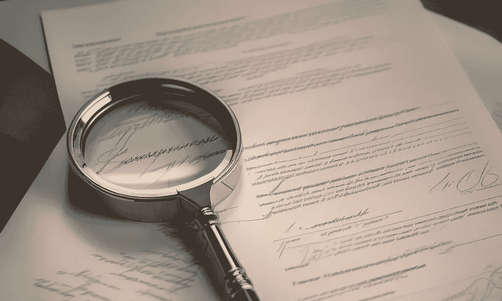
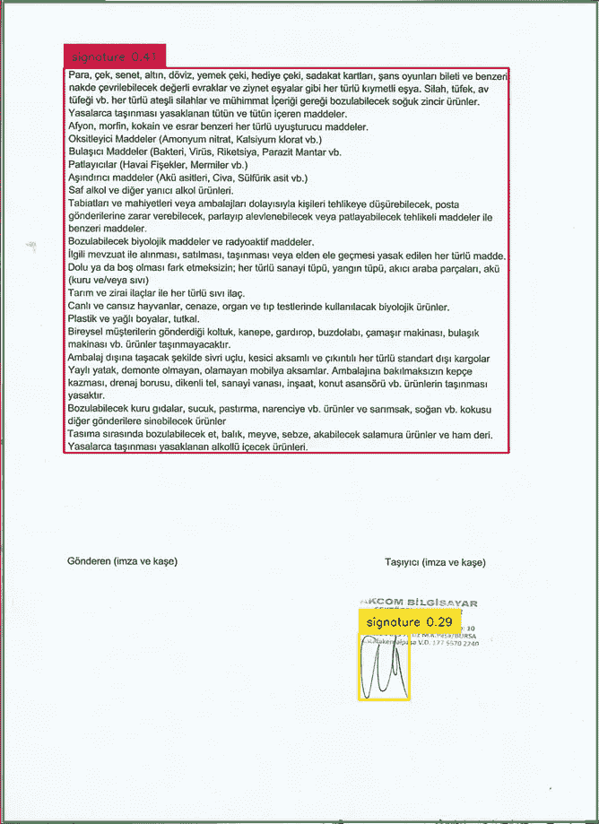
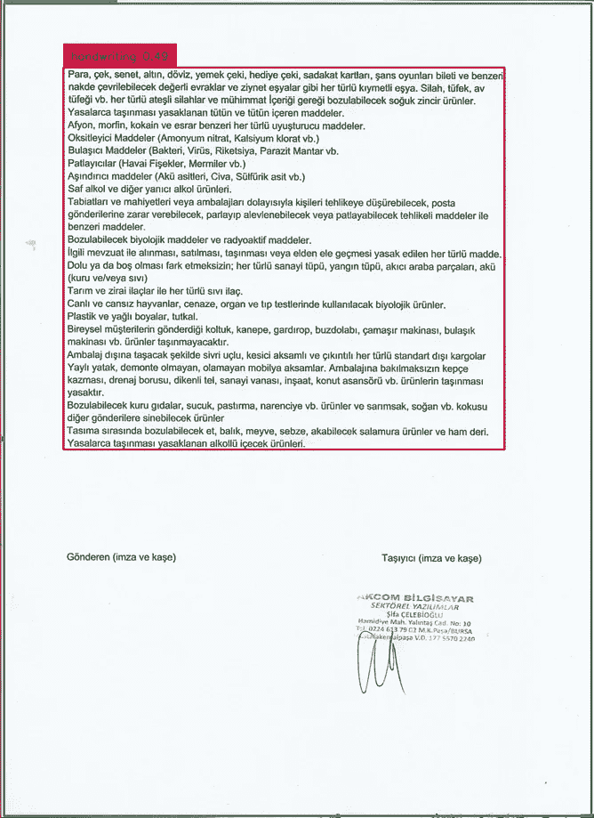
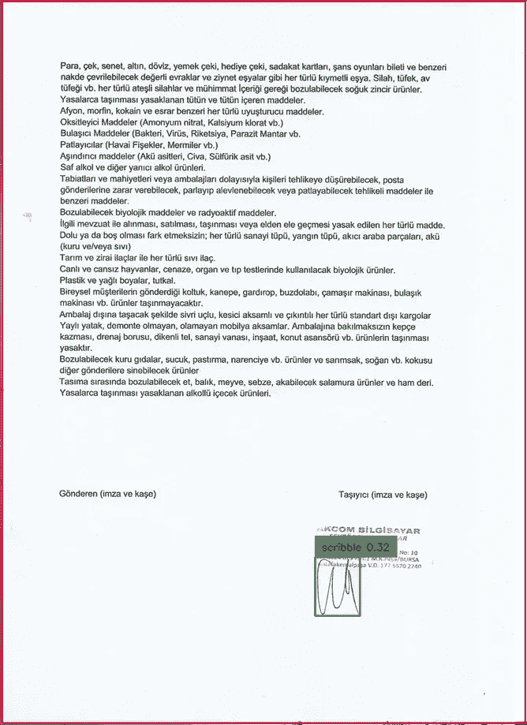
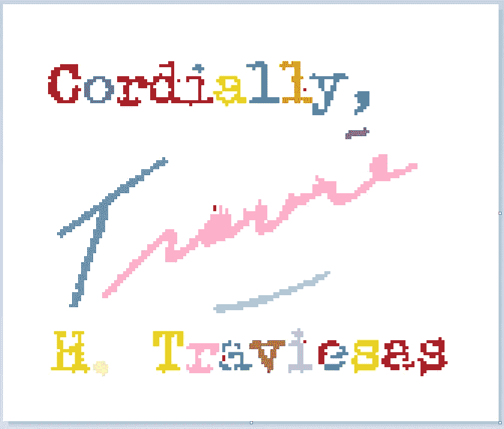
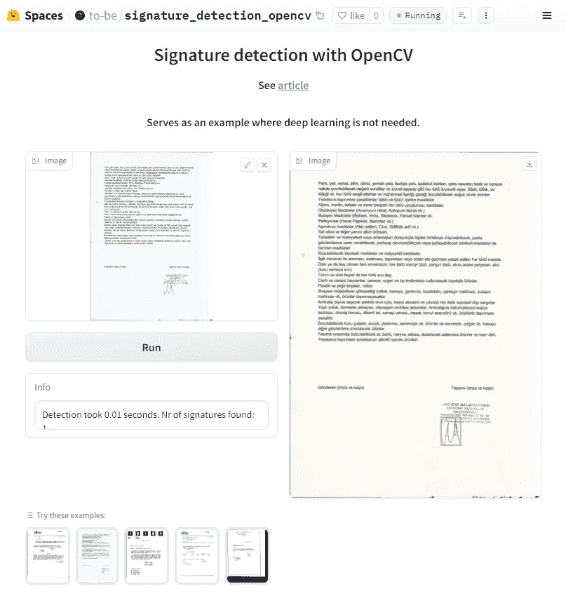

# 机器学习并非你所需的一切：关于签名检测的案例研究

> 原文：[`towardsdatascience.com/machine-learning-is-not-all-you-need-a-case-study-on-signature-detection-9551f2e5d0e7?source=collection_archive---------7-----------------------#2023-12-21`](https://towardsdatascience.com/machine-learning-is-not-all-you-need-a-case-study-on-signature-detection-9551f2e5d0e7?source=collection_archive---------7-----------------------#2023-12-21)

## 机器学习不应成为你处理所有任务的首选解决方案。像我在签名检测中一样考虑 KISS 原则。

[](https://toon-beerten.medium.com/?source=post_page-----9551f2e5d0e7--------------------------------)[](https://towardsdatascience.com/?source=post_page-----9551f2e5d0e7--------------------------------) [Toon Beerten](https://toon-beerten.medium.com/?source=post_page-----9551f2e5d0e7--------------------------------)

·

[关注](https://medium.com/m/signin?actionUrl=https%3A%2F%2Fmedium.com%2F_%2Fsubscribe%2Fuser%2F3aef462e13b5&operation=register&redirect=https%3A%2F%2Ftowardsdatascience.com%2Fmachine-learning-is-not-all-you-need-a-case-study-on-signature-detection-9551f2e5d0e7&user=Toon+Beerten&userId=3aef462e13b5&source=post_page-3aef462e13b5----9551f2e5d0e7---------------------post_header-----------) 发表在 [Towards Data Science](https://towardsdatascience.com/?source=post_page-----9551f2e5d0e7--------------------------------) ·6 min read·2023 年 12 月 21 日[](https://medium.com/m/signin?actionUrl=https%3A%2F%2Fmedium.com%2F_%2Fvote%2Ftowards-data-science%2F9551f2e5d0e7&operation=register&redirect=https%3A%2F%2Ftowardsdatascience.com%2Fmachine-learning-is-not-all-you-need-a-case-study-on-signature-detection-9551f2e5d0e7&user=Toon+Beerten&userId=3aef462e13b5&source=-----9551f2e5d0e7---------------------clap_footer-----------)

--

[](https://medium.com/m/signin?actionUrl=https%3A%2F%2Fmedium.com%2F_%2Fbookmark%2Fp%2F9551f2e5d0e7&operation=register&redirect=https%3A%2F%2Ftowardsdatascience.com%2Fmachine-learning-is-not-all-you-need-a-case-study-on-signature-detection-9551f2e5d0e7&source=-----9551f2e5d0e7---------------------bookmark_footer-----------)

图片由作者提供

在这篇文章中，我展示了一个案例研究，说明机器学习不应成为你处理所有任务的首选解决方案。更简单的技术也可能取得良好的结果，而且更容易实施。

**案例研究：签名检测**

想象一下我们有一堆合同，需要知道它们是否已签名。这个场景涉及签名检测——可靠地识别特定位置是否出现签名——假设你已经知道签名应该大致位于哪里（例如，东南方向）。在古代，这个任务是通过二值化图像并计算区域内的黑色像素来完成的。如果存在签名，黑色像素计数会超过阈值。但在 2023 年，我们如何以不同的方式完成这个任务呢？

**机器学习方法**

我们将使用 [GroundingDino](https://github.com/IDEA-Research/GroundingDINO)，这是一个最先进的零-shot 目标检测模型。模型的输入是图像与提示的结合，而输出则是表示潜在位置的矩形及其相关的置信度分数。虽然这乍一看似乎是一个理想的解决方案，但仍然存在一些值得考虑的限制。让我们尝试用三个不同的提示：‘signature’，‘handwriting’ 和 ‘scribble’。



提示结果分别为‘signature’，‘handwriting’ 和 ‘scribble’。图像由作者提供。

你可以看到结果严重依赖于提示，更不用说在 CPU 上结果出现前大约需要 30 秒。这是因为这是一个基础模型，经过大量类别的训练，不仅仅是签名。我们可以做些什么来使其更准确和快速呢？我们可以使用 Autodistill ([教程](https://roboflow.com/train/grounding-dino-and-yolov8))，它使用 Grounding DINO 训练 YOLOv8 模型。有效地使用基础模型来训练一个更轻量的监督模型。工作流程是收集大量签名文档数据集，然后找到一个好的提示以获取标记数据，最终在其上训练一个 YOLOv8 模型。

你可以想象这需要大量的时间和精力。但是还有其他办法吗？

**替代方法：OpenCV**

OpenCV 是一个开源计算机视觉库，提供了广泛的功能用于实时图像和视频处理、分析和理解，使用优化算法。

OpenCV 中的 `connectedComponentsWithStats` 函数用于标记和分析图像区域（连通组件），基于其像素连接性，并额外计算每个标记区域的各种统计信息，如面积和边界框尺寸。

为了更易于理解，我创建了这张图。它是签名区域的裁剪图像。每个连通像素的岛屿都有一种颜色，代表一个单独的连通组件（或：标签）。



图像由作者提供。

了解上述内容后，让我们深入探讨这种计算机视觉方法背后的直觉。这里的关键思想是：我们能否识别出构成签名的标签？

在普通的、一般的文档上运行这个函数会产生数百甚至数千个唯一的标签，适用于：

+   每个字母（因为它没有连接到其他字母）

+   更大的东西，比如签名和徽标

+   更小的东西，比如微小的噪点和点

为了筛选掉不相关的标签，我们可以取所有标签的中位数区域，这将是单个字符的大小（假设图像中包含的字母多于噪声），作为最小阈值。任何低于此阈值的区域都可以被过滤掉。我们还可以设置一个最大阈值，假设签名不会占据超过字母 x 倍的区域。剩下的就是实际的签名候选项。但徽标呢？它们可能与签名大小相同，但签名通常在字母之间有很多空白。通过黑色像素比例过滤器，我可以将这些徽标筛选掉。剩下的标签应该是实际的签名。

将上述内容转化为代码结果如下：

```py
def find_signature_bounding_boxes(image):
    # Start measuring time
    start_time = time.time()

    if image is None:
        raise ValueError("Could not open or find the image")

    # Binarize the image using Otsu's thresholding method
    gray = cv2.cvtColor(image, cv2.COLOR_BGR2GRAY)
    # Threshold the image using Otsu's method
    _, binary_image = cv2.threshold(gray, 0, 255, cv2.THRESH_BINARY_INV + cv2.THRESH_OTSU)

    # Find connected components
    num_labels, labels, stats, centroids = cv2.connectedComponentsWithStats(binary_image, connectivity=8, ltype=cv2.CV_32S)

    # Calculate median area of components
    areas = stats[1:, cv2.CC_STAT_AREA]  # Exclude background
    median_area = np.median(areas)
    print('median_area: ' + str(median_area))
    median_character_width = int(math.sqrt(median_area))
    print('median_character_width: ' + str(median_character_width))

    # Define area thresholds
    min_area_threshold = median_area * 4
    max_area_threshold = median_area * 50

    # Filter components based on area thresholds
    possible_signatures = []
    for i in range(1, num_labels):  # Exclude background
        area = stats[i, cv2.CC_STAT_AREA]
        if min_area_threshold < area < max_area_threshold:
            left = stats[i, cv2.CC_STAT_LEFT]
            top = stats[i, cv2.CC_STAT_TOP]
            width = stats[i, cv2.CC_STAT_WIDTH]
            height = stats[i, cv2.CC_STAT_HEIGHT]
            print('Found candidate with area: ' + str(area))
            #filter horizontal lines
            if height < median_character_width * 5 and width > median_character_width*30:
              print('   -> candidate is horizontal line with width, height: ' + str(width) + ',' + str(height))
              continue
            #filter vertical lines
            if width < median_character_width * 5 and height > median_character_width*30:
              print('   -> candidate is vertical line with width, height: ' + str(width) + ',' + str(height))
              continue
            #filter on a ratio of black pixels (logos for example have a higher ratio)for now guestimate is 0.3
            roi = binary_image[top:top+height, left:left+width]
            num_black_pixels = cv2.countNonZero(roi) # Calculate the number of black pixels in the ROI
            total_pixels = width * height # Calculate the total number of pixels in the ROI
            ratio = num_black_pixels / total_pixels # Calculate and return the ratio of black pixels
            print('   -> candidate has black pixel ratio: ' + str(ratio))
            if ratio > 0.30:
              print('   -> candidate has too high black pixel ratio: ' )
              continue
            possible_signatures.append((left, top, width, height))

    print('Nr of signatures found before merging: ' + str(len(possible_signatures)))
    possible_signatures = merge_nearby_rectangles(possible_signatures, nearness=median_character_width*4)

    # End measuring time
    end_time = time.time()
    print(f"Function took {end_time - start_time:.2f} seconds to process the image.")

    return possible_signatures

def merge_nearby_rectangles(rectangles, nearness):
    def is_near(rect1, rect2):
        left1, top1, width1, height1 = rect1
        left2, top2, width2, height2 = rect2
        right1, bottom1 = left1 + width1, top1 + height1
        right2, bottom2 = left2 + width2, top2 + height2
        return not (right1 < left2 - nearness or left1 > right2 + nearness or
                    bottom1 < top2 - nearness or top1 > bottom2 + nearness)

    def merge(rect1, rect2):
        left1, top1, width1, height1 = rect1
        left2, top2, width2, height2 = rect2
        right1, bottom1 = left1 + width1, top1 + height1
        right2, bottom2 = left2 + width2, top2 + height2
        min_left = min(left1, left2)
        min_top = min(top1, top2)
        max_right = max(right1, right2)
        max_bottom = max(bottom1, bottom2)
        return (min_left, min_top, max_right - min_left, max_bottom - min_top)

    merged = []
    while rectangles:
        current = rectangles.pop(0)
        has_merged = False

        for i, other in enumerate(merged):
            if is_near(current, other):
                merged[i] = merge(current, other)
                has_merged = True
                break

        if not has_merged:
            for i in range(len(rectangles) - 1, -1, -1):
                if is_near(current, rectangles[i]):
                    current = merge(current, rectangles.pop(i))

        if not has_merged:
            merged.append(current)

    return merged
```

我只花费了原本需要的一小部分时间来实现机器学习方法。除了节省时间之外，它的效果非常好。它能处理高分辨率和低分辨率扫描。该方法的其他优点是它能很容易地集成到现有的 C++或 Python 代码中，并且运行速度极快。当然，参数可以进一步调整，为此我邀请你打开我的[共享 colab 笔记本](https://github.com/Toon-nooT/notebooks/blob/main/Signature_Detection_OpenCV.ipynb)自行尝试。如果你愿意在线试用，可以尝试我的[Huggingface 演示](https://huggingface.co/spaces/to-be/signature_detection_opencv)。



图片由作者提供。

**结论**

面对技术挑战时，不要立刻进入“机器学习模式”，要对其他更简单的技术保持开放。虽然机器学习令人兴奋并开辟了许多新可能，但并不是每个任务都需要它。在选择适合你挑战的方法时，考虑开发时间、部署难易程度、准确性权衡和处理速度等因素是很重要的。
