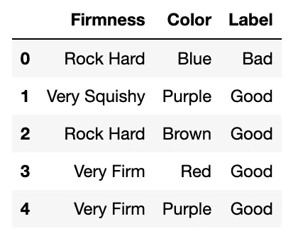
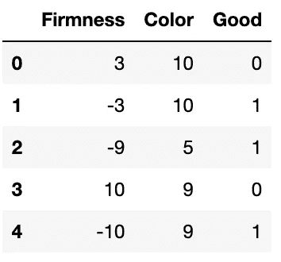
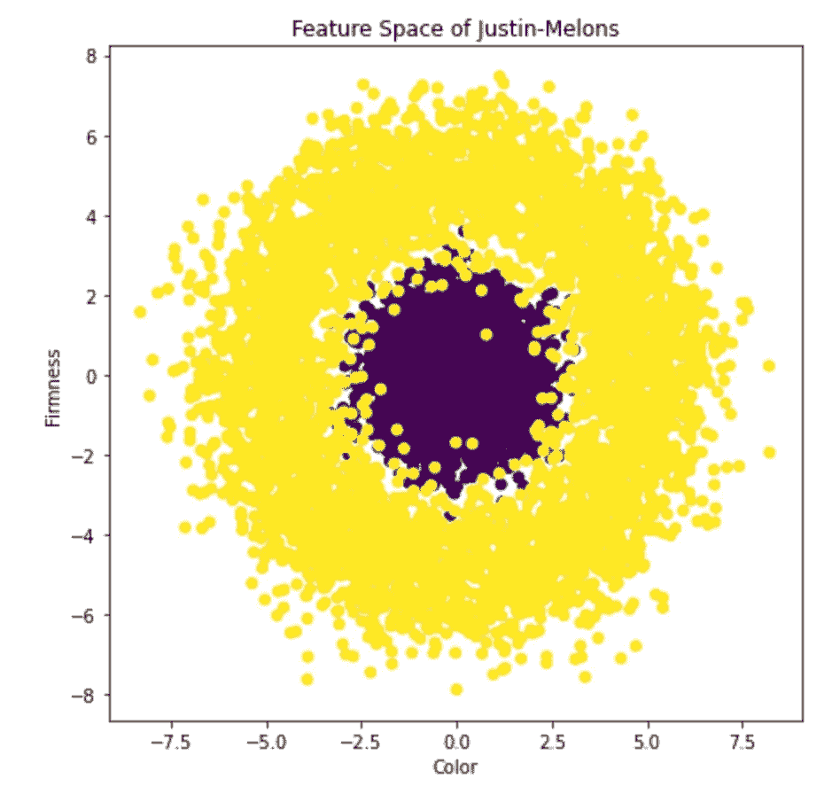
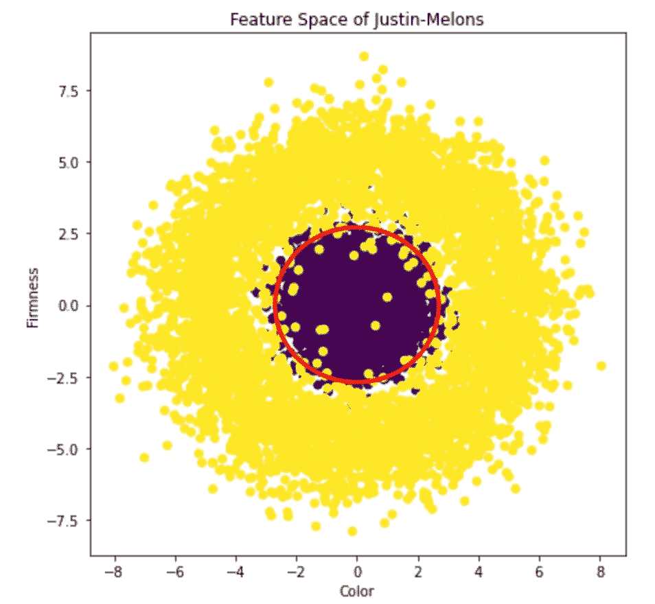
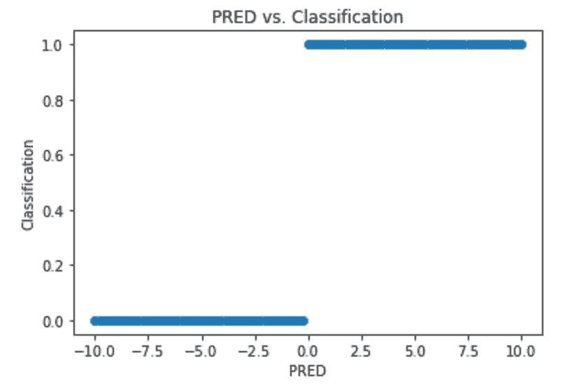
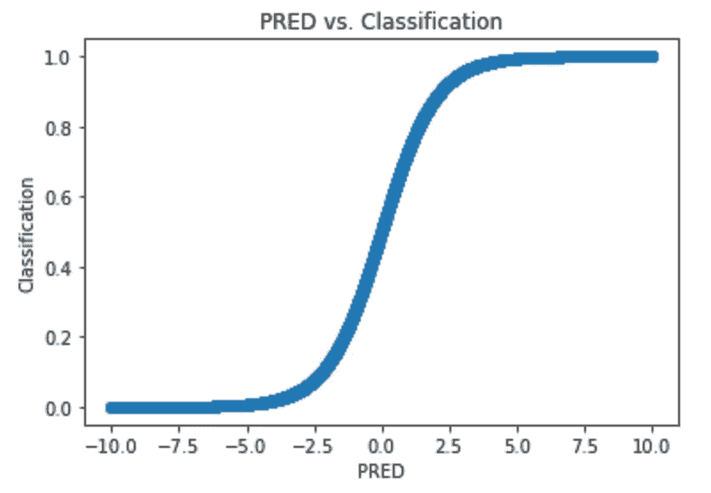

# 机器学习变得直观

> 原文：[`towardsdatascience.com/machine-learning-made-intuitive-fabd26f97f19?source=collection_archive---------7-----------------------#2023-07-05`](https://towardsdatascience.com/machine-learning-made-intuitive-fabd26f97f19?source=collection_archive---------7-----------------------#2023-07-05)

## ML：你需要知道的所有内容，没有任何复杂的数学

 [Justin Cheigh](https://medium.com/@jcheigh?source=post_page-----fabd26f97f19--------------------------------)

·

[关注](https://medium.com/m/signin?actionUrl=https%3A%2F%2Fmedium.com%2F_%2Fsubscribe%2Fuser%2F24cd781f1018&operation=register&redirect=https%3A%2F%2Ftowardsdatascience.com%2Fmachine-learning-made-intuitive-fabd26f97f19&user=Justin+Cheigh&userId=24cd781f1018&source=post_page-24cd781f1018----fabd26f97f19---------------------post_header-----------) 发表在 [Towards Data Science](https://towardsdatascience.com/?source=post_page-----fabd26f97f19--------------------------------) ·9 分钟阅读·2023 年 7 月 5 日

--

你可能认为的 ML…（照片由 Justin Cheigh 在丹麦比隆拍摄）

## 什么是机器学习？

当然，像 ChatGPT 这样的模型背后的实际理论确实非常复杂，但机器学习（ML）背后的基本直觉是，嗯，很直观！那么，什么是 ML？

> 机器学习允许计算机通过数据进行学习。

但这意味着什么呢？计算机如何使用数据？计算机学习意味着什么？首先，谁在乎？让我们从最后一个问题开始。

现在，数据无处不在。因此，使用像机器学习这样的工具变得越来越重要，因为它可以在没有明确编程的情况下帮助发现数据中的有意义模式！换句话说，通过利用机器学习，我们能够将通用算法成功地应用于各种问题。

机器学习有几个主要类别，其中主要类型包括有监督学习（SL）、无监督学习（UL）和强化学习（RL）。今天我将只描述有监督学习，但在后续的帖子中，我希望能更详细地讲解无监督学习和强化学习。

## 1 分钟 SL 速跑

看，我明白你可能不想读完整篇文章。在这一部分，我将教你最基础的知识（对很多人来说，这就是你需要了解的全部内容！），然后再深入后面的部分。

> 有监督学习涉及如何使用不同的特征来预测某个标签。

设想一下，你试图找出一种方法来预测钻石的价格，使用的特征包括克拉、切工、净度等。这里的目标是学习一个函数，该函数以特定钻石的特征作为输入，并输出相应的价格。

就像人类通过例子学习一样，在这种情况下，计算机也会如此。为了能够学习预测规则，这个机器学习代理需要“标记示例”，包括钻石的特征和价格。监督的存在是因为你得到了标签（价格）。实际上，需要考虑的是你的标记示例是否真实，因为有监督学习的一个假设是标记示例是“真实情况”。

好的，现在我们已经了解了最基本的内容，我们可以更深入地探讨整个数据科学/机器学习流程。

## 问题设置

让我们用一个非常贴近的例子，这个例子来源于[这本教科书](https://www.amazon.com/Understanding-Machine-Learning-Theory-Algorithms/dp/1107057132)。假设你被困在一个只有一种稀有水果“贾斯廷蜜瓜”的岛上。尽管你从未吃过贾斯廷蜜瓜，但你吃过很多其他水果，并且你知道你不想吃已经坏掉的水果。你还知道通常通过查看水果的颜色和坚实度可以判断水果是否变坏，因此你推测这对于贾斯廷蜜瓜也适用。

在机器学习术语中，你使用了之前的行业知识来确定两个特征（颜色、坚实度），你认为这将准确预测标签（贾斯廷蜜瓜是否变坏）。

但你怎么知道什么颜色和什么坚实度对应于水果变坏呢？谁知道呢？你只需要尝试。在机器学习术语中，我们需要数据。更具体地说，我们需要一个包含真实贾斯廷蜜瓜及其相关标签的标记数据集。

## 数据收集/处理

所以你花了接下来几天吃蜜瓜，并记录了颜色、硬度以及蜜瓜是否变坏。经过几天痛苦的吃坏掉的蜜瓜后，你得到了以下标注的数据集：

[Justin Cheigh 的代码](https://github.com/jcheigh/Medium_Articles)

每一行代表一个特定的蜜瓜，每一列代表相应蜜瓜的特征/标签值。但请注意，我们有的是文字，因为特征是分类的而不是数值的。

实际上，我们需要数字以便计算机处理。有多种技术可以将分类特征转换为数值特征，从[独热编码](https://machinelearningmastery.com/why-one-hot-encode-data-in-machine-learning/)到嵌入以及其他方法。

我们可以做的最简单的事情是将“Label”列转换为“Good”列，如果蜜瓜好则为 1，如果坏则为 0。现在，假设有某种方法将颜色和硬度转换为一个从-10 到 10 的尺度，使其合理。作为额外的挑战，考虑将像颜色这样的分类特征放到这样一个尺度上的假设。经过这种预处理后，我们的数据集可能看起来像这样：

[Justin Cheigh 的代码](https://github.com/jcheigh/Medium_Articles)

我们现在有了一个标注的数据集，这意味着我们可以使用监督学习算法。我们的算法需要是分类算法，因为我们预测的是一个类别，即好（1）或坏（0）。分类算法与回归算法相对，后者预测的是连续值，比如钻石的价格。

## 探索性数据分析

但使用什么算法呢？有多种监督分类算法，从基本的逻辑回归到一些复杂的深度学习算法。首先，让我们通过进行一些探索性数据分析（EDA）来查看我们的数据：

[Justin Cheigh 的代码](https://github.com/jcheigh/Medium_Articles)

上面的图像是特征空间的图示；我们有两个特征，我们只是将每个例子放到一个坐标图上，两个轴分别是这两个特征。此外，如果相关的蜜瓜是好的，我们将点标记为紫色，如果是坏的，则标记为黄色。显然，通过稍微进行一些 EDA，就可以找到一个明显的答案！

[Justin Cheigh 的代码](https://github.com/jcheigh/Medium_Articles)

我们可能应该将红圈内的所有点分类为优质瓜，而红圈外的点分类为劣质瓜。直观上，这样做是合理的！例如，你不想要一个坚硬如石的瓜，但也不希望它过于软绵绵。你想要的是介于两者之间的瓜，颜色的情况也可能类似。

我们确定我们希望的决策边界是一个圆，但这只是基于初步的数据可视化。我们如何系统地确定这一点？这在更大的问题中尤为相关，答案也不那么简单。想象一下数百个特征。在任何合理的方式中，都无法可视化 100 维特征空间。

## 我们学到了什么？

第一步是定义你的模型。分类模型有很多种。由于每种模型都有自己的假设，因此做出一个好的选择非常重要。为了强调这一点，我将从一个非常糟糕的选择开始。

一个直观的想法是通过权衡每个因素来进行预测：

Justin Cheigh 使用 [Embed Fun](https://embed.fun/) 提供的公式

例如，假设我们的参数 *w1* 和 *w2* 分别为 2 和 1。还假设我们的输入 Justin Melon 是 Color = 4，Firmness = 6 的瓜。那么我们的预测 Good = (2 x 4) + (1 x 6) = 14。

我们的分类（14）甚至不是有效选项（0 或 1）之一。这是因为这实际上是一个回归算法。事实上，它是最简单的回归算法的简单案例：线性回归。

那么，让我们将其转化为分类算法。一个简单的方法是：使用线性回归，并在输出高于偏置项 *b* 时分类为 1。实际上，我们可以通过在模型中添加一个常数项来简化，使得当输出高于 0 时分类为 1。

在数学中，设 PRED = w1 * Color + w2 * Firmness + b。然后我们得到：

Justin Cheigh 使用 [Embed Fun](https://embed.fun/) 提供的公式

这当然更好，因为我们至少在执行分类，但让我们绘制 PRED 在 x 轴上的图和分类在 y 轴上的图：

[Justin Cheigh 的代码](https://github.com/jcheigh/Medium_Articles)

这有点极端。PRED 的轻微变化可能会完全改变分类。一种解决方案是让我们模型的输出表示 Justin-Melon 是好瓜的概率，我们可以通过平滑曲线来实现：

[Justin Cheigh 的代码](https://github.com/jcheigh/Medium_Articles)

这是一条 sigmoid 曲线（或 logistic 曲线）。所以，与其使用 PRED 并应用这段分段激活（PRED ≥ 0 时为好），我们可以应用这个 sigmoid 激活函数来获得如上所示的平滑曲线。总体来说，我们的 logistic 模型看起来是这样的：

Justin Cheigh 使用 [Embed Fun](https://embed.fun/) 提供的公式

在这里，sigma 代表的是 sigmoid 激活函数。很好，所以我们有了我们的模型，我们只需要找出哪些权重和偏差是最好的！这个过程被称为训练。

## 模型训练

很好，所以我们需要做的就是找出哪些权重和偏差是最好的！但这说起来容易做起来难。有无数种可能性，而“最好”到底意味着什么呢？

我们从后一个问题开始：什么是最好的？这里有一种简单而强大的方法：最优的权重是那些在我们的训练集上获得最高准确率的权重。

因此，我们只需要找出一个能够最大化准确率的算法。然而，从数学上来说，最小化某些东西更容易。换句话说，我们更倾向于定义一个损失函数，而不是一个值函数，其中较低的损失更好。虽然人们通常使用类似二元交叉熵的东西来计算（分类）损失，但我们将使用一个简单的例子：最小化错误分类的点数。

为此，我们使用一个被称为梯度下降的算法。从一个非常高的层次来看，梯度下降就像是一个视力不佳的滑雪者试图下山。一个好的损失函数的重要特性（而我们的粗糙损失函数实际上缺乏这种特性）是平滑性。如果你绘制我们的参数空间（参数值和相应的损失在同一图上），图像将看起来像一座山。

所以，我们首先从随机参数开始，因此我们很可能从一个糟糕的损失开始。就像一个滑雪者试图尽快下山一样，算法在各个方向上查找，试图找到最陡的路径（即如何调整参数以最大程度地降低损失）。但是，滑雪者的视力不佳，所以他们只能在每个方向上看一点。我们迭代这个过程，直到我们到达山底（敏锐的观察者可能会注意到我们实际上可能会到达局部最小值）。此时，我们得到的参数就是我们的训练参数。

一旦你训练了你的逻辑回归模型，你会发现你的性能仍然很差，准确率只有大约 60%（勉强比猜测好一点！）。这是因为我们违反了模型的一个假设。逻辑回归在数学上只能输出一个线性决策边界，但从我们的 EDA 中我们知道，决策边界应该是圆形的！

有了这个理念，你尝试了不同的、更复杂的模型，结果得到一个准确率达到 95%的模型！现在你有了一个完全训练好的分类器，能够区分好的 Justin-Melons 和不好的 Justin-Melons，你终于可以吃到你想要的所有美味水果了！

## 结论

让我们退后一步。大约在 10 分钟内，你学到了很多关于机器学习的知识，包括基本的监督学习流程。那么，接下来是什么呢？

好吧，那得由你来决定！对于一些人来说，这篇文章足以让他们对机器学习有一个高层次的了解。而对其他人来说，这篇文章可能会留下很多未解的问题。这很好！也许这种好奇心会促使你进一步探讨这个话题。

例如，在数据收集步骤中，我们假设你会连续几天吃大量的瓜果，而没有真正考虑任何特定的特征。这是没有意义的。如果你吃了一种绿色糊状的**Justin-Melon**并且让你感到剧烈不适，你可能会避开这种瓜果。在现实中，你会通过经验来学习，不断更新你的信念。这个框架更类似于强化学习。

那么如果你知道一种不好的**Justin-Melon**可能会立即致命，并且没有确定性就尝试它太过风险呢？没有这些标签，你无法进行监督学习。但也许还有一种方法可以在没有标签的情况下获得洞察。这个框架更类似于无监督学习。

在接下来的博客文章中，我希望能类比地扩展强化学习和无监督学习。

## 感谢阅读！
