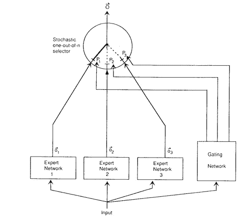

# 使用专家模型的机器学习：入门指南

> 原文：[`towardsdatascience.com/machine-learning-with-expert-models-a-primer-6c74585f223f?source=collection_archive---------2-----------------------#2023-09-05`](https://towardsdatascience.com/machine-learning-with-expert-models-a-primer-6c74585f223f?source=collection_archive---------2-----------------------#2023-09-05)

## 一个几十年前的想法如何使今天训练极其庞大的神经网络成为可能

 [Samuel Flender](https://medium.com/@samuel.flender?source=post_page-----6c74585f223f--------------------------------)

·

[关注](https://medium.com/m/signin?actionUrl=https%3A%2F%2Fmedium.com%2F_%2Fsubscribe%2Fuser%2Fce56d9dcd568&operation=register&redirect=https%3A%2F%2Ftowardsdatascience.com%2Fmachine-learning-with-expert-models-a-primer-6c74585f223f&user=Samuel+Flender&userId=ce56d9dcd568&source=post_page-ce56d9dcd568----6c74585f223f---------------------post_header-----------) 发表在 [Towards Data Science](https://towardsdatascience.com/?source=post_page-----6c74585f223f--------------------------------) ·9 分钟阅读·2023 年 9 月 5 日

--

([Pexels](https://www.pexels.com/photo/set-of-tool-wrench-162553/))

专家模型是机器学习中最有用的发明之一，但它们往往没有得到应有的关注。实际上，专家建模不仅可以让我们训练“极其庞大的”神经网络（稍后会详细介绍），还可以构建出更像人脑一样学习的模型，即不同区域专注于不同类型的输入。

在这篇文章中，我们将深入探讨专家建模中的关键创新，这些创新最终导致了最近的突破，如 Switch Transformer 和 Expert Choice Routing 算法。但首先让我们回到一切开始的论文：“专家混合”。

## 专家混合（1991）

1991 年的原始 MoE 模型。图片来源：[Jabocs et al 1991, Adaptive Mixtures of Local Experts](https://www.cs.toronto.edu/~hinton/absps/jjnh91.pdf)。

专家混合（MoE）的概念可以追溯到 30 多年前，源于 1991 年由人工智能之父**Geoffrey Hinton**共同撰写的一篇[论文](https://www.cs.toronto.edu/~hinton/absps/jjnh91.pdf)。MoE 的关键思想是通过结合多个“专家”E 来建模输出“y”，每个专家的权重由…
