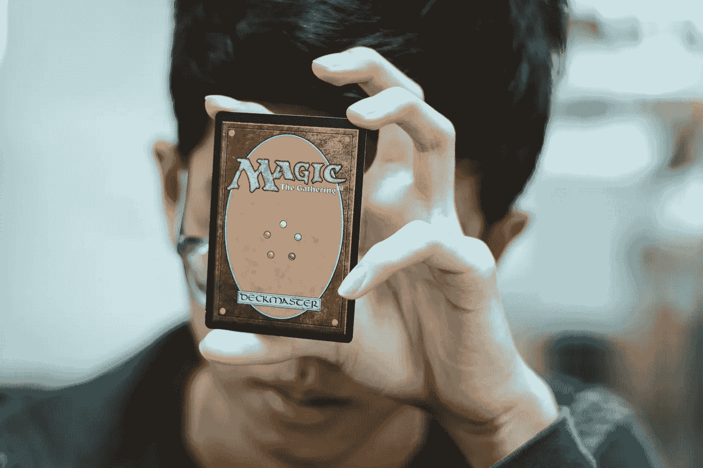

# 《Magic the Gathering Arena：利用概率赢得比赛》

> 原文：[`towardsdatascience.com/magic-the-gathering-arena-winning-with-probability-b71f363e0ce2?source=collection_archive---------12-----------------------#2023-05-09`](https://towardsdatascience.com/magic-the-gathering-arena-winning-with-probability-b71f363e0ce2?source=collection_archive---------12-----------------------#2023-05-09)

## 如何利用概率和 Excel 赢得锦标赛

 [Edward Krueger](https://medium.edkruegerdata.com/?source=post_page-----b71f363e0ce2--------------------------------)

·

[关注](https://medium.com/m/signin?actionUrl=https%3A%2F%2Fmedium.com%2F_%2Fsubscribe%2Fuser%2F4889b755e348&operation=register&redirect=https%3A%2F%2Ftowardsdatascience.com%2Fmagic-the-gathering-arena-winning-with-probability-b71f363e0ce2&user=Edward+Krueger&userId=4889b755e348&source=post_page-4889b755e348----b71f363e0ce2---------------------post_header-----------) 发表在 [Towards Data Science](https://towardsdatascience.com/?source=post_page-----b71f363e0ce2--------------------------------) ·7 分钟阅读·2023 年 5 月 9 日

--

*作者:* [*Edward Krueger*](https://www.linkedin.com/in/edkrueger/) *数据科学家、讲师及* [*E*rin Oefelein](https://www.linkedin.com/in/erin-oefelein-3105a878/) *数据科学家（Taxwell 公司）*

照片由 [Wayne Low](https://unsplash.com/@wayneshin?utm_source=unsplash&utm_medium=referral&utm_content=creditCopyText) 提供，来源于 [Unsplash](https://unsplash.com/photos/OvN4OkhkTLo?utm_source=unsplash&utm_medium=referral&utm_content=creditCopyText)

*作为数据科学家，我们被这个问题吸引，因为它展示了看似简单的规则如何导致相当复杂的情境，需要仔细分析。*

*虽然在数据科学领域已经有很多关于常见分布（如正态分布）的文章，但现实生活中的问题通常需要更不常见的分布，有时甚至需要没有名称的分布：根据经验法则和对事件概率的天真计算，而不是深入理解分布。在本文中，我们将探讨一个问题，我们将使用负二项分布，但实际上会做一些调整以适应我们问题的特殊性。*

许多游戏和比赛有复杂的规则。为什么？它们利用我们的心理，使游戏更加有趣、令人上瘾，并且通常能让组织者获利，因为它们使我们赢得的机会看起来比实际上更高。当粉丝、玩家或赌徒相信他们可以赢时，这是很吸引人的。这种效果最好的时候是你认为自己的机会比实际上更大。
