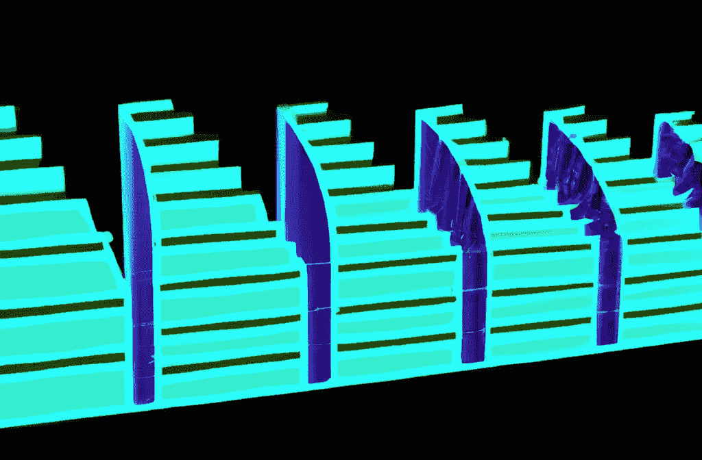
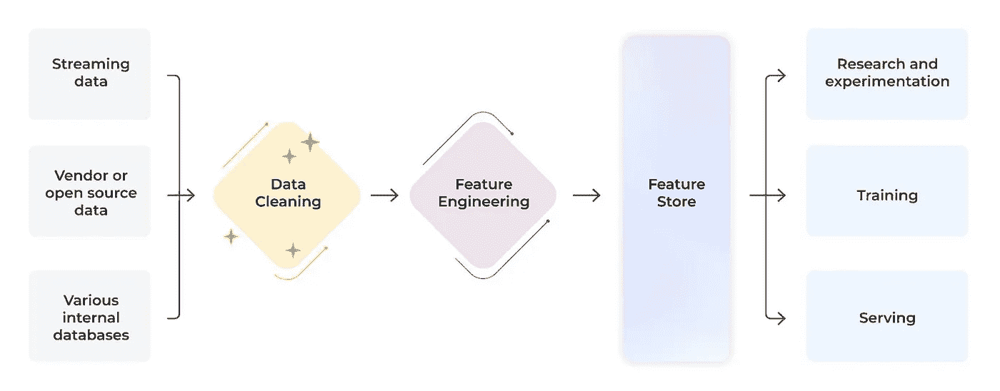
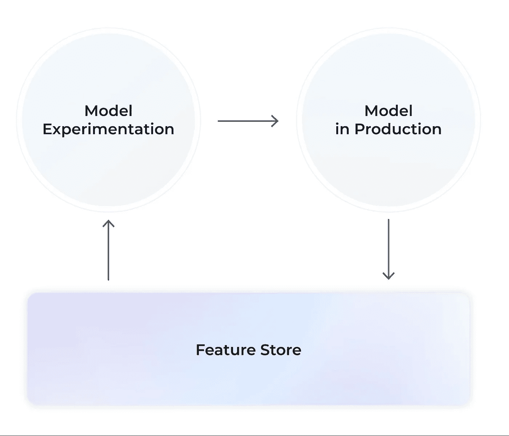
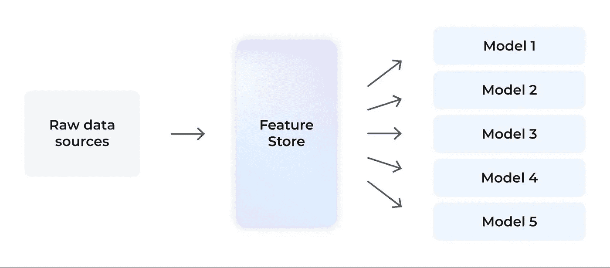
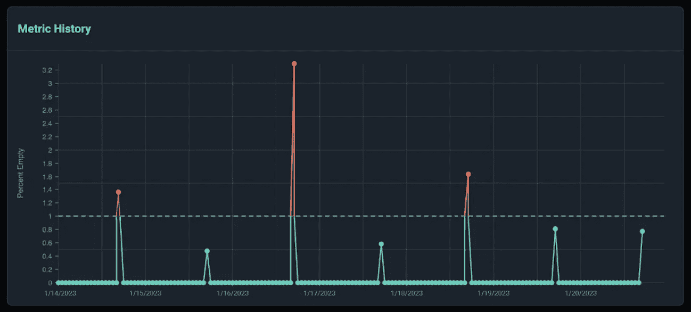
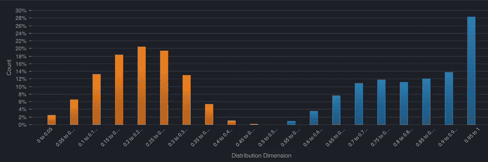

# 维护你的特征库的质量

> 原文：[`towardsdatascience.com/maintaining-the-quality-of-your-feature-store-5713236b9370?source=collection_archive---------6-----------------------#2023-03-30`](https://towardsdatascience.com/maintaining-the-quality-of-your-feature-store-5713236b9370?source=collection_archive---------6-----------------------#2023-03-30)

图片由作者提供

## 特征库的基本概念以及如何和为什么你应该监控它们的一些提示

 [Claire Longo](https://statistician-in-stilettos.medium.com/?source=post_page-----5713236b9370--------------------------------)

·

[关注](https://medium.com/m/signin?actionUrl=https%3A%2F%2Fmedium.com%2F_%2Fsubscribe%2Fuser%2F1f6936fe85bb&operation=register&redirect=https%3A%2F%2Ftowardsdatascience.com%2Fmaintaining-the-quality-of-your-feature-store-5713236b9370&user=Claire+Longo&userId=1f6936fe85bb&source=post_page-1f6936fe85bb----5713236b9370---------------------post_header-----------) 发表在 [Towards Data Science](https://towardsdatascience.com/?source=post_page-----5713236b9370--------------------------------) ·5 分钟阅读·2023 年 3 月 30 日

--

自 2017 年 Uber [首次介绍](https://www.uber.com/blog/michelangelo-machine-learning-platform/)这一概念以来，特征库作为一种支持数据科学家和机器学习工程师定义、发现和访问高质量数据的工具，已经稳步获得了越来越多的关注。

图表由作者提供

# 从特征工程到特征库

在机器学习项目中，原始数据被收集、清理、格式化并以数学方式转换为称为“特征”的数据。特征在模型生命周期的许多不同阶段是必需的，包括实验、模型训练和模型服务，以从部署在生产管道中的模型中获取预测。

一旦特征被计算出来，我们可以开始通过尝试不同的建模技术和特征集来开发我们的模型。

当模型被训练时，它们会自动发现特征数据中的模式，将这些模式以数学方式编码，然后使用这些信息做出明智的预测。

当模型最终确定后，它会被部署到生产环境中，消耗特征数据以重新训练和生成预测。模型预测通常是批量生成的，或在某些情况下是实时生成的。

## 特征存储基础

特征存储可以被认为是一个预计算特征的中央存储。这个数据存储服务于机器学习项目中的每一个步骤。

作者提供的图表

作者提供的图表

组织利用特征存储来简化数据和机器学习生命周期中的一些事情。

**集中数据**

+   特征存储提供了一个一站式商店，存储了从不同来源收集并存储在中央位置的数据。

+   如果没有特征存储，机器学习项目的原始数据通常需要从公司内多个不同的数据源收集，甚至来自供应商或第三方。这意味着数据科学家必须识别并访问多个数据源。

**清理数据**

+   在将个人可识别信息（PII）或机器学习工作流中不需要的敏感数据存储到特征存储之前，可以将其移除。

+   如果没有特征存储，数据科学家将不得不在不需要敏感数据的情况下访问敏感数据或创建自己的方法来去除敏感数据。

**在模型之间共享特征**

+   相同的特征通常可以在不同的用例中的多个模型中使用。特征存储计算这些特征一次，并使其在所有机器学习项目中可用。数据科学家可以随着时间的推移向这个特征库中添加更多特征，以建立一个供其他团队重复使用的特征库。

+   如果没有特征存储，许多相同的特征计算将被重新编写到不同的模型和管道中。这迫使数据科学家执行浪费的重复工作，以重新计算可能已经存在于类似管道中的特征，并且使得维护特征计算的一致性变得困难。

**提供统一的特征接口**

+   特征存储的一部分是对数据本身的标准化推理和共享的特征编码器，帮助在在线和离线应用中强制执行一致的结果。

+   如果没有特征存储，不同的代码或转换可能导致模型中出现稍微意外或错误的结果。这通常表现为在线和离线特征偏差。

**减少特征延迟**

+   在线特征存储提供预计算的特征，以支持以低延迟提供实时预测。

+   如果没有特征存储，特征将在推断请求时需要计算，这会导致在请求时需要额外的计算——*最终影响应用延迟*。

**导航特征版本控制**

+   特征存储对数据应用版本控制。时间旅行数据快照允许对模型进行时间点分析，或找出数据错误的根本原因。

+   如果没有特征存储，追踪某一时刻特征的确切状态或值可能会很困难。这会使得调试和实验变得具有挑战性，甚至不可能。

## 特征存储的类型

一般来说，特征存储要么作为独立的第三方工具提供，要么作为更广泛的云服务的一部分提供。大多数使用特征存储的 Arize 客户使用像 Tecton 这样的专用工具，但希望在开源解决方案上构建的团队有几个选项（即 Feast、Feathr）。此外，云服务也可以作为现有堆栈的简便附加功能提供。

第三方工具示例：

+   Feast（开源）

+   Feathr（开源）

+   Tecton

+   Hopsworks

云工具示例

+   Databricks 特征存储

+   SageMaker 特征存储

# 维护特征存储的质量

特征存储可能会静默失败。当模型崩溃或产生较差结果时，根本原因通常追溯到数据本身。许多常见的机器学习问题可以通过对数据应用正确的监控和质量检查来解决。

如果数据集中在一个[特征存储](https://arize.com/blog/feature-store/)中，维护起来可能更容易。通过对特征存储应用数据质量监控，实践者可以在数据问题影响模型性能之前自动捕捉到这些问题。

有几种常见的数据问题，监控可以带来重大差异（完全披露：我在 Arize 工作，Arize 提供监控工具，但这些最佳实践来源于我的实际经验，同样适用于内部或其他地方构建的监控平台）。

**数据质量**监控可以捕捉到如缺失值、数据格式变化或意外值（数据基数变化）等问题。ML 可观察性平台可以用来自动检测并警报这些类型的数据质量问题，这些问题在特征数据中很常见。

*此示例显示了针对模型特征的%-empty 度量的触发数据质量监控（图像作者提供）*

**数据漂移**监控可以捕捉到由于时间自然变化引起的统计分布偏移。漂移可以通过 PSI、[KL 散度](https://arize.com/blog-course/kl-divergence/)等指标来测量。机器学习可观测性平台可以用来自动检测和警报特征数据中常见的统计漂移类型。

*此示例展示了生产和训练数据分布之间的预测漂移（图像由作者提供）*

此外，通过排查离线和在线特征计算及代码的数据一致性，还可以识别**训练-服务偏差**。

# 结论

随着特征存储逐渐进入主流，团队正在制定最佳实践，以增强其在机器学习工作流中的集成。一个关键关注点是管理上游数据质量问题。通过实施数据质量监控和数据漂移检测，团队可以有效地维护其特征存储，同时主动预防模型性能退化。
