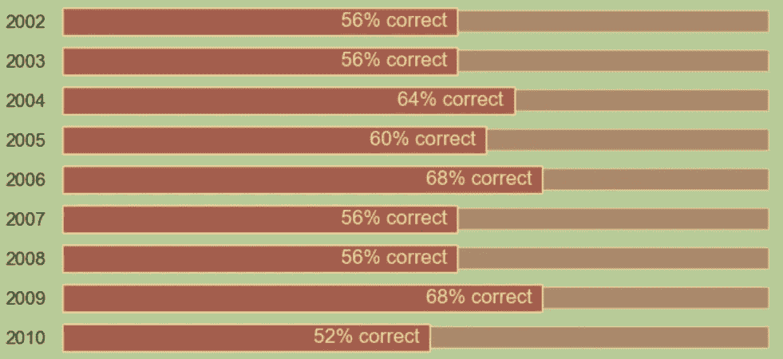
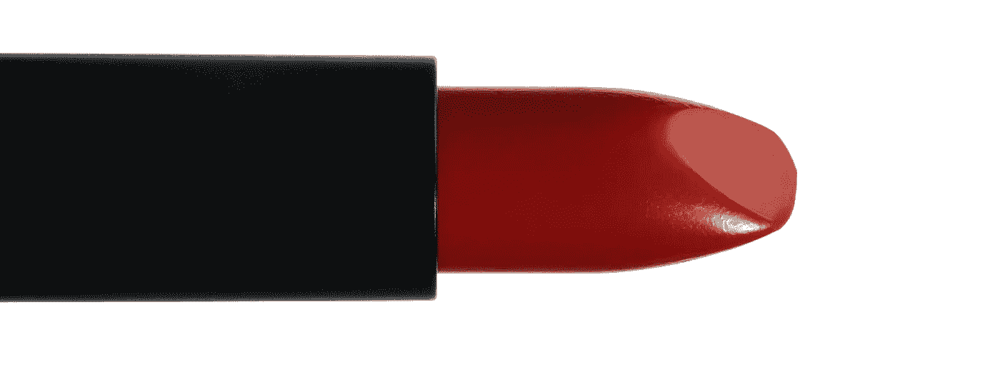
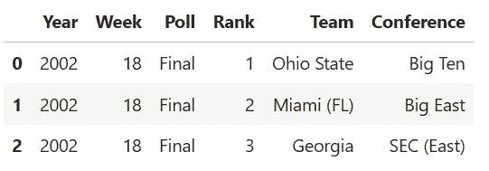
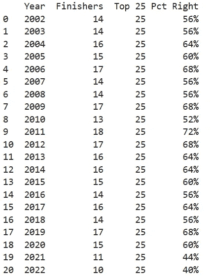
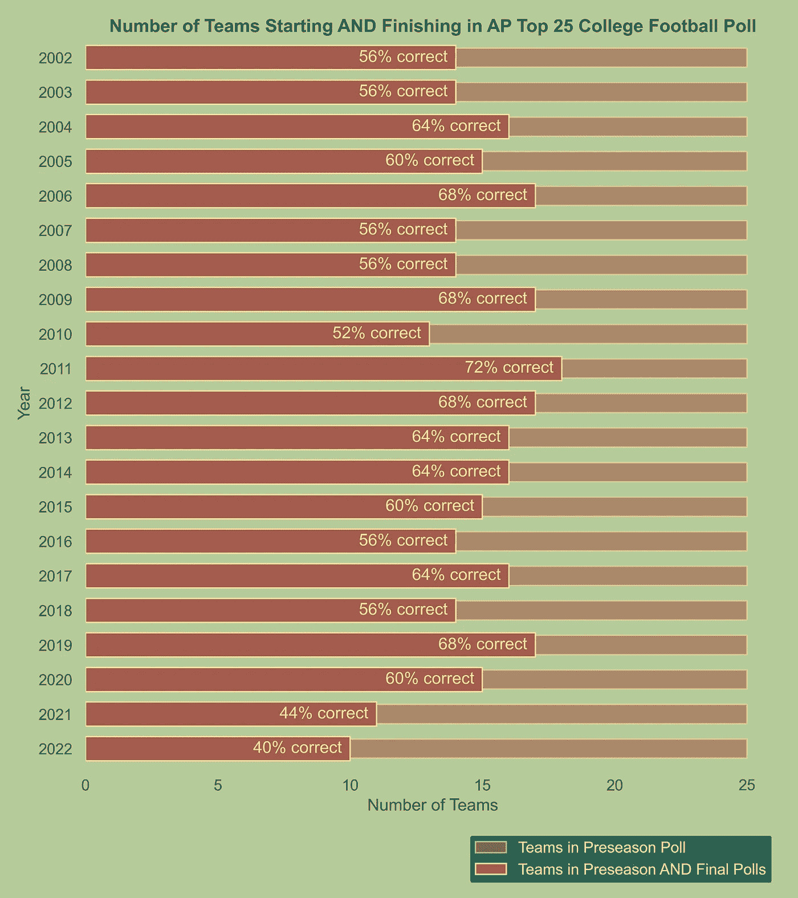
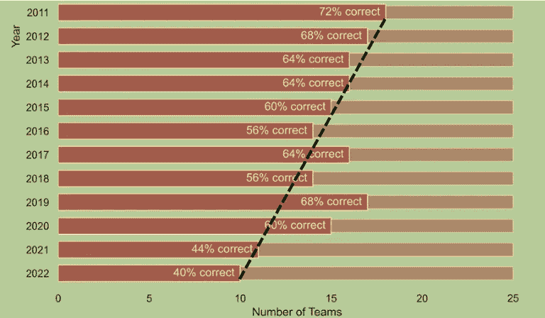
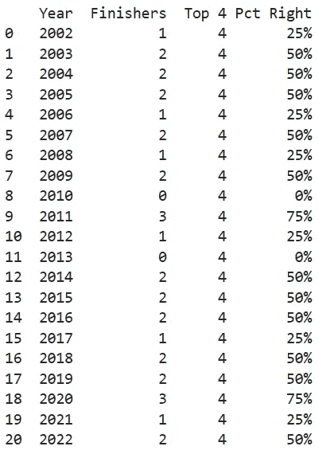
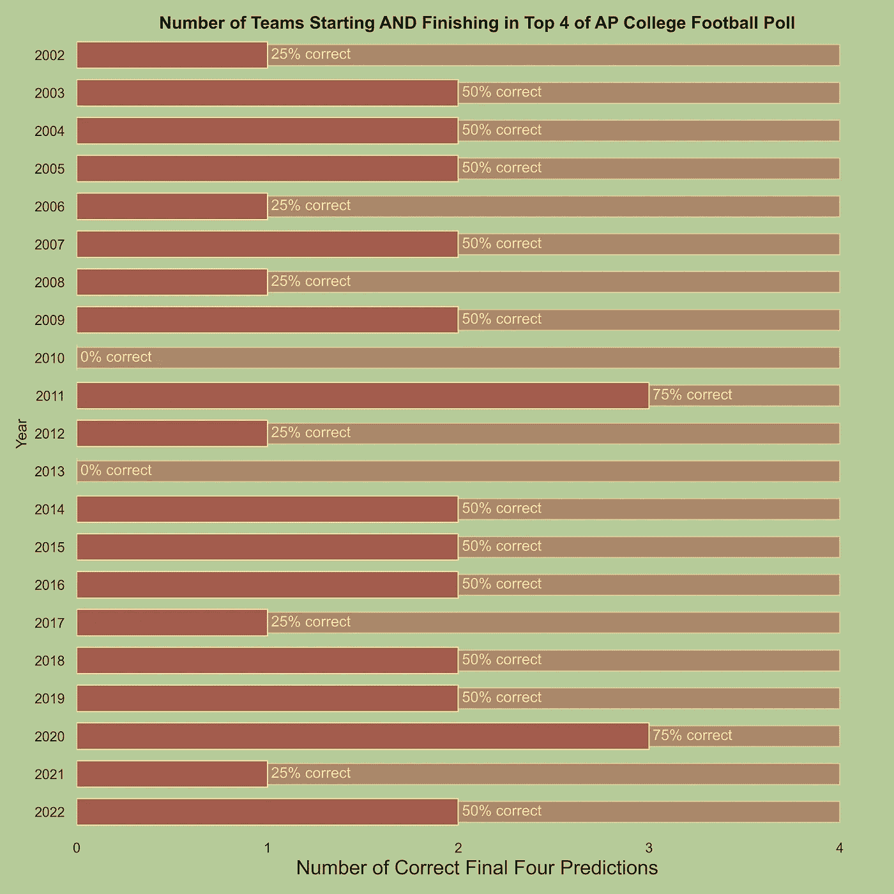

# 使用 Seaborn 制作嵌套条形图

> 原文：[`towardsdatascience.com/make-a-nested-bar-chart-with-seaborn-9a9988e30dca`](https://towardsdatascience.com/make-a-nested-bar-chart-with-seaborn-9a9988e30dca)

## 我 快速成功的数据科学

## 大学足球投票的准确性基准测试

[](https://medium.com/@lee_vaughan?source=post_page-----9a9988e30dca--------------------------------)[](https://towardsdatascience.com/?source=post_page-----9a9988e30dca--------------------------------) [Lee Vaughan](https://medium.com/@lee_vaughan?source=post_page-----9a9988e30dca--------------------------------)

·发表于 [Towards Data Science](https://towardsdatascience.com/?source=post_page-----9a9988e30dca--------------------------------) ·阅读时间 9 分钟·2023 年 10 月 19 日

--



嵌套条形图示例（作者提供）

*嵌套条形图*是一种可视化方法，用于比较类别中的多个测量值。其中一个测量值代表次要或*背景*测量，例如*目标*或*之前*的值。主要测量值代表*实际*或*当前*值。

次要测量通常以*减少的容量*呈现，从而为主要测量提供背景。将较宽且较暗的主要条形图放在较窄且较浅的次要条形图上面，能够生成一个美观且紧凑的图表。这也解释了为什么这种图形有时被称为*口红条形图*。



口红图片由 Onder Ortel 在 Unsplash 上提供

当然，为了使其正常工作，主要的条形图应该*永远*不要比次要的条形图*更长*。因此，你将需要使用嵌套条形图来绘制每个类别中*递减*值的示例，例如房价下降或由于新疫苗导致的疾病率下降。

在这个*快速成功的数据科学*项目中，我们将查看著名的*美联社大学足球前 25 名投票*在每个赛季开始时挑选 25 支最佳美国大学足球队的表现。由于赛季前挑选的球队数量不能超过排名中的最终球队数量，这是一种很好的嵌套条形图应用。

# AP 大学足球前 25 名投票

AP 每年 8 月或 9 月发布他们的*赛季前*投票，并在整个赛季中每周更新一次。全国范围内超过 60 位知名体育作家和广播员会为最佳球队投票。

他们首先创建了一个列表，列出了他们认为的 25 支最佳球队（从 133 支球队中选出），并给每支球队分配了投票数，给予最佳球队最多 25 分。然后，AP 将这些投票结合起来，按降序对球队进行排名。在碗赛季和大学橄榄球季后赛结束后，它会发布一份*最终*排名。

你可以在 AP 网站以及[Sports Illustrated](https://www.si.com/)、[NCAA](http://www.ncaa.com)和[Sports Reference](https://www.sports-reference.com/)等体育网站上找到这些投票结果。为了方便起见，我已经将过去 20 年（2002–2022）的季前赛和最终排名整理成 CSV 文件，并存储在这个[Gist](https://gist.github.com/rlvaugh/047dc3b39a712fabccd3e509cb94174e)中。

# 代码

以下代码的灵感来自 Oscar Leo 最近关于口红图的文章：

[](/how-to-create-a-lipstick-chart-with-matplotlib-2fde5412fee9?source=post_page-----9a9988e30dca--------------------------------) ## 如何使用 Matplotlib 创建口红图

### 一种数据可视化，当数值越低越好

towardsdatascience.com

在这篇文章中，我们将基于 Oscar 的 Python 代码，设置颜色调色板，一个吸引人的 seaborn 样式，以及一个绘制不同宽度和透明度的水平条形图的函数，这些都是制作嵌套条形图所必需的。我们将调整一些代码，并添加更多代码以加载和准备数据，并进行最终展示。

## 导入库并设置样式

对于这个项目，我们需要使用 matplotlib 和 seaborn 进行绘图，使用 pandas 进行数据加载和准备。你可以通过搜索*install <library name>*找到每个库的当前安装说明。

对于颜色调色板，我选择了 Oscar Leo 文章中推荐的[Color Hunt site](https://colorhunt.co/palette/186f65b5cb99fce09bb2533e)上的“足球”绿色和棕色。

Seaborn 提供了一个设置运行配置样式参数的方法，这些参数会自动应用于每个图形。如果你希望制作多个具有相同参数的图形，或者想通过将这些细节抽象到另一个单元格或位置来“简化”你的绘图代码，这个功能会很有帮助。显然，如果你使用的是 seaborn 的*默认*绘图参数，你不需要这些代码。

```py
import matplotlib.pyplot as plt
import seaborn as sns
import pandas as pd

# Set up a color palette of grass greens and pigskin browns:
BACKGROUND_COLOR = '#B5CB99'
TEXT_COLOR = '#FCE09B'
BAR_COLOR = '#B2533E'
LEGEND_COLOR = '#186F65'

# Create a dictionary of display parameters favorable for nested bars:
sns.set(style='white', rc={
    'axes.facecolor': BACKGROUND_COLOR,
    'figure.facecolor': BACKGROUND_COLOR,
    'text.color': TEXT_COLOR,
    'axes.spines.left': False,
    'axes.spines.bottom': False,
    'axes.spines.right': False,
    'axes.spines.top': False
})
```

## 加载数据

以下代码使用 pandas 的`read_csv()`方法从 gist 中加载 CSV 格式的投票数据，然后显示前三行以进行质量控制。

```py
# Load AP Top 25 College poll data:
df = pd.read_csv('https://bit.ly/45yEPtI')
df.head(3)
```



> 注：由于我们将比较球队*名称*，因此最好检查它们是否在各个排名中*一致*。在这种情况下，一些排名在球队名称后面附上了球队的*战绩*。这是一个小问题，我已经清理过了，但如果你想在未来扩展这个项目，你应该注意这一点。

## 准备绘制前 25 结果的数据

我们将从查看季前排名中进入赛季结束时的*最终*排名的球队数量开始。为此，我们将依赖 Python 的 `set` 数据类型。

就像在经典数学中一样，`set` 只能包含唯一值（无重复），并且你可以使用内置函数找到两个集合的*交集*。这意味着我们可以提取季前排名和最终排名之间共享的项（球队）。

```py
# Initialize a list to store the intersection results:
top_25 = []

# Get unique years from the DataFrame:
unique_years = df['Year'].unique()

# Loop through each year and find the intersection of Final and Preseason Teams:
for year in unique_years:
    year_data = df[df['Year'] == year]

    # Make sets of the final and preseason teams:
    final_teams = set(year_data[year_data['Poll'] == 'Final']['Team'])
    preseason_teams = set(year_data[year_data['Poll'] == 'Preseason']['Team'])

    # Find the set intersections for each year and append to the top_25 list:
    intersection = final_teams.intersection(preseason_teams)
    num_right = len(intersection)    
    top_25.append({'Year': year, 'Finishers': num_right})

# Create a new DataFrame from the list:
df_25 = pd.DataFrame(top_25)

# Add columns for the number of ranked teams and percent predicted correctly:
df_25['Top 25'] = 25
df_25['Pct Right'] = df_25['Finishers'] / df_25['Top 25']
df_25['Pct Right'] = df_25['Pct Right'].apply(lambda x: f'{x:.0%}')

print(df_25)
```



## 定义绘制条形图的函数

以下代码定义了一个函数，该函数调用 seaborn 的 `barplot()` 方法。其参数让你可以控制生成嵌套条形图时使用的参数。例如，你需要坐标轴对象（`ax_obj`）以便在同一图中叠加条形，`width` 使主条比副条宽，以及 `alpha` 调整每个条形的透明度，使主条更暗。

```py
def add_bars(ax_obj, x, y, width, alpha, label):
    """Plot a seaborn horizontal bar chart (credit Oscar Leo)."""
    sns.barplot(ax=ax_obj, x=x, y=y, 
                label=label,
                width=width, 
                alpha=alpha,
                color=BAR_COLOR,
                edgecolor=TEXT_COLOR,
                orient="h")
```

## 绘制前 25 的嵌套条形图

在接下来的代码中，我们设置了一个图形，然后调用 `add_bars()` 函数两次，调整参数，来生成主条和副条。`label` 参数用于图例中。

为了使显示更加信息化，我们将使用 `bar_label()` 方法添加关于季前预测准确率的文本。我们将*填充*文本到左侧，以确保文本在视觉上与正确的条形相关联。

```py
# Make the display, calling add_bars() twice to nest the bars:
fig, ax = plt.subplots(figsize=(8, 9))
ax.set_title('Number of Teams Starting AND Finishing in \
AP Top 25 College Football Poll', color='k', fontsize=13, weight='bold')

# Plot bars for total number of teams (secondary measure):
add_bars(ax_obj=ax, 
         x=df_25['Top 25'],
         y=df_25['Year'],
         width=0.55, 
         alpha=0.6, 
         label='Teams in Preseason Poll')

# Plot bars for teams that started AND finished in the Top 25 (primary measure):
add_bars(ax_obj=ax, 
         x=df_25['Finishers'],
         y=df_25['Year'],
         width=0.7, 
         alpha=1, 
         label='Teams in Preseason AND Final Polls')

# Add informative text stating percent correct:
ax.bar_label(ax.containers[1], 
             labels=df_25['Pct Right'] + ' correct', 
             padding=-70)

# Assign a custom x-axis label and legend:
ax.set_xlabel('Number of Teams') 
ax.legend(bbox_to_anchor=(1.0, -0.085), facecolor=LEGEND_COLOR);
```



显示进入最终排名的季前球队数量的嵌套条形图（作者）

在过去 20 年中排名前 500 的球队中，有 313 支季前被选中的球队进入了最终名单，成功率约为 63%。

这算是一个好结果吗？我不太确定。美国大学橄榄球被多个强大程序主宰，这些程序通常出现在最终排名中，因此挑选这些球队相对容易且可靠。然而，一个有趣的观察是，自 2011 年以来，成功率呈下降趋势。



自 2011 年以来预测结果的一般下降趋势（作者）

这个趋势可能是巧合，也可能是多个因素的结果，包括游戏规则的变化、会议调整、NIL（名称、图像和肖像）支付的引入以及转会门户的开放。

## 准备绘制前 4 结果的数据

从 2014 年开始，*全国大学体育协会（NCAA）*采用了四队淘汰赛来决定*第一级橄榄球碗分区*的国家冠军。让我们重新审视之前的代码，选择前 4 名球队，以查看排名对最终冠军的选择效果如何。这里有个剧透：季前赛排名在过去 20 年中只正确选择了 2 次最终冠军，成功率仅为 10%！

```py
# Filter the original DataFrame to teams ranked 4 or better:
df_4 = df[(df['Rank'] <= 4)].copy()

# Initialize a list to store the intersection results:
top_4 = []

# Loop through each year and find the intersection of Final and Preseason Teams:
for year in unique_years:
    year_data = df_4[df_4['Year'] == year]

    # Make sets of the final and preseason teams:
    final_teams = set(year_data[year_data['Poll'] == 'Final']['Team'])
    preseason_teams = set(year_data[year_data['Poll'] == 'Preseason']['Team'])

    # Find the set intersections for each year and append to the top_4 list:
    intersection = final_teams.intersection(preseason_teams)
    num_right = len(intersection)    
    top_4.append({'Year': year, 'Finishers': num_right})

# Create a new DataFrame from the list:
df_final_4 = pd.DataFrame(top_4)

# Add columns for the number of ranked teams and percent predicted correctly:
df_final_4['Top 4'] = 4
df_final_4['Pct Right'] = (df_final_4['Finishers'] / df_final_4['Top 4'])
df_final_4['Pct Right'] = df_final_4['Pct Right'].apply('{:.0%}'.format)

print(df_final_4)
```



```py
fig, ax = plt.subplots(nrows=1, ncols=1, figsize=(10, 10))
ax.set_title('Number of Teams Starting AND Finishing in \
Top 4 of AP College Football Poll', color='k', fontsize=14, weight='bold')

add_bars(ax_obj=ax, 
         x=df_final_4['Top 4'],
         y=df_final_4['Year'],
         width=0.55, 
         alpha=0.6, 
         label='Top 4')

add_bars(ax_obj=ax, 
         x=df_final_4['Finishers'],
         y=df_final_4['Year'],
         width=0.7, 
         alpha=1, 
         label='Finishers')

ax.bar_label(ax.containers[1], 
             labels=df_final_4['Pct Right'] + ' correct', 
             padding=3)

ax.set_xticks(range(5))
ax.set_xlabel('Number of Correct Final Four Predictions', 
              fontdict={'size': 16});
```

这里需要注意的一点是，这次我们必须将条形标签填充到*右侧*。问题在于 2010 年和 2013 年没有任何季前赛球队进入最终排名。如果我们像之前的显示那样将标签填充到左侧，注释将“掉出边缘”，并覆盖 y 轴值。正如你可以想象的那样，短条和长条的组合不适合注释嵌套条形图。



团队在 AP 大学橄榄球排名中开始和结束于前 4 名的嵌套条形图（作者提供）

在过去 20 年中，80 支进入前 4 名的球队中，季前赛排名大约识别了 42%。在 2011 年和 2020 年中，它准确地预测了 4 中的 3 个。在 2010 年和 2013 年中，它的预测全都错误。

# 总结

嵌套条形图是一种干净且紧凑的方式，用于比较一个测量值始终低于另一个测量值的分类数据。通过包含*条形标签*来提供额外信息，你可以轻松将这些图表转化为有吸引力的信息图，传达*意义*和*信息*。

# 谢谢！

感谢阅读，未来请关注我更多的*快速成功数据科学*项目。
